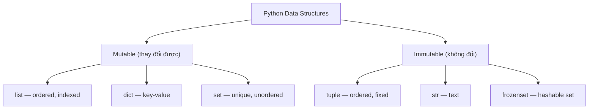

# 🐍 Python Cơ Bản — Từ Gốc Đến Vững

> **Mục tiêu**: Ôn lại toàn bộ Python cơ bản — syntax, data types, control flow, functions, OOP, file I/O, error handling.
> Đọc xong file này → chuyển sang `01_python_advanced.md` để lên level production.

---

## 1. Biến & Kiểu Dữ Liệu (Variables & Data Types)

### 1.1 Kiểu dữ liệu cơ bản

```python
# ── Numbers ──
x = 10           # int       — số nguyên
y = 3.14          # float     — số thực
z = 2 + 3j        # complex   — số phức

# ── String ──
name = "AI Engineer"         # str
multiline = """Dòng 1
Dòng 2"""                    # multi-line string

# ── Boolean ──
is_active = True   # bool: True / False

# ── None ──
result = None      # NoneType — "chưa có giá trị"

# ── Kiểm tra kiểu ──
print(type(x))        # <class 'int'>
print(isinstance(x, int))  # True
print(isinstance(x, (int, float)))  # True — check nhiều kiểu
```

### 1.2 Type Conversion (Ép kiểu)

```python
# Explicit conversion
int("42")       # 42        (str → int)
float("3.14")   # 3.14      (str → float)
str(100)        # "100"     (int → str)
bool(0)         # False     (0, "", [], None → False)
bool(1)         # True      (bất kỳ giá trị khác 0 → True)
list("abc")     # ['a', 'b', 'c']

# ⚠️ Pitfall:
int("3.14")     # ❌ ValueError! Phải float("3.14") trước → int()
int(float("3.14"))  # ✅ 3
```

### 1.3 String Operations

```python
s = "Hello, AI Engineering"

# Indexing & Slicing
s[0]         # 'H'        (index từ 0)
s[-1]        # 'g'        (index âm = từ cuối)
s[0:5]       # 'Hello'    (slice: start:stop, stop không bao gồm)
s[7:]        # 'AI Engineering'
s[::-1]      # 'gnireenignE IA ,olleH'  (reverse string)

# Methods quan trọng
s.lower()           # 'hello, ai engineering'
s.upper()           # 'HELLO, AI ENGINEERING'
s.strip()           # Xoá whitespace đầu/cuối
s.split(", ")       # ['Hello', 'AI Engineering']
", ".join(["a","b"])  # 'a, b'
s.replace("Hello", "Hi")  # 'Hi, AI Engineering'
s.startswith("Hello")     # True
s.find("AI")              # 7 (index), -1 nếu không tìm thấy
s.count("i")              # 2

# f-string (Python 3.6+) — LUÔN dùng cách này
name = "Phú"
score = 95.5
print(f"Xin chào {name}, điểm: {score:.1f}")  # "Xin chào Phú, điểm: 95.5"
print(f"{score:>10.2f}")   # "     95.50"  — padding + format

# Raw string (cho regex, path)
path = r"C:\Users\name\file.txt"  # r"..." — không escape \
```

---

## 2. Cấu Trúc Dữ Liệu (Data Structures)



### 2.1 List — Mảng động, có thứ tự, thay đổi được

```python
fruits = ["apple", "banana", "cherry"]

# Truy cập
fruits[0]        # "apple"
fruits[-1]       # "cherry"
fruits[1:3]      # ["banana", "cherry"]

# Thêm / Xoá
fruits.append("date")      # Thêm cuối → [..., "date"]
fruits.insert(1, "avocado") # Chèn vị trí 1
fruits.extend(["fig"])      # Nối list khác
fruits.remove("banana")     # Xoá theo giá trị (first occurrence)
fruits.pop()               # Xoá + trả về phần tử cuối
fruits.pop(0)              # Xoá + trả về phần tử index 0
del fruits[1]              # Xoá theo index

# Sắp xếp
nums = [3, 1, 4, 1, 5, 9]
nums.sort()                 # In-place sort [1, 1, 3, 4, 5, 9]
nums.sort(reverse=True)     # Giảm dần [9, 5, 4, 3, 1, 1]
sorted_nums = sorted(nums)  # Trả về list MỚI, không thay đổi gốc

# Tìm kiếm
3 in nums          # True
nums.index(5)      # Index đầu tiên của 5
nums.count(1)      # Đếm số lần xuất hiện

# List comprehension — CỰC KỲ QUAN TRỌNG
squares = [x**2 for x in range(10)]           # [0, 1, 4, 9, ..., 81]
evens = [x for x in range(20) if x % 2 == 0]  # [0, 2, 4, ..., 18]
upper = [s.upper() for s in ["hi", "bye"]]     # ["HI", "BYE"]

# Nested comprehension
matrix = [[1,2],[3,4],[5,6]]
flat = [x for row in matrix for x in row]  # [1, 2, 3, 4, 5, 6]
```

### 2.2 Tuple — Giống list nhưng KHÔNG thay đổi được (immutable)

```python
point = (3, 4)
rgb = (255, 128, 0)

# Truy cập (giống list)
point[0]    # 3
point[-1]   # 4

# KHÔNG thể thay đổi
# point[0] = 5  ❌ TypeError!

# Unpacking — rất mạnh
x, y = point          # x=3, y=4
a, *rest = (1,2,3,4)  # a=1, rest=[2,3,4]
_, b, _ = (10, 20, 30)  # b=20, _ = bỏ qua

# Dùng khi nào?
# → Return nhiều giá trị: return (x, y)
# → Dict keys: {(0,0): "origin"}
# → Immutable = an toàn, hashable
```

### 2.3 Dictionary — Key-Value, unordered (Python 3.7+: insertion order)

```python
person = {
    "name": "Phú",
    "age": 25,
    "skills": ["Python", "ML"],
}

# Truy cập
person["name"]           # "Phú"
person.get("email", "N/A")  # "N/A" — safe access (không lỗi nếu key không có)

# Thêm / Sửa / Xoá
person["email"] = "phu@ai.com"  # Thêm/sửa
del person["age"]                # Xoá
removed = person.pop("email")   # Xoá + trả về value

# Duyệt
for key in person:                     # Duyệt keys
    print(key, person[key])
for key, value in person.items():      # Duyệt key-value ← phổ biến nhất
    print(f"{key}: {value}")
for value in person.values():          # Duyệt values

# Dict comprehension
squares = {x: x**2 for x in range(6)}  # {0:0, 1:1, 2:4, 3:9, 4:16, 5:25}
filtered = {k: v for k, v in person.items() if isinstance(v, str)}

# Merge dicts (Python 3.9+)
a = {"x": 1}
b = {"y": 2}
merged = a | b       # {"x": 1, "y": 2}  ← Python 3.9+
merged = {**a, **b}  # {"x": 1, "y": 2}  ← tương thích Python 3.5+

# defaultdict — tự tạo default value
from collections import defaultdict
word_count = defaultdict(int)  # default = 0
for word in ["a", "b", "a", "c", "a"]:
    word_count[word] += 1
# {"a": 3, "b": 1, "c": 1}

# Counter — đếm tần suất
from collections import Counter
counts = Counter(["a", "b", "a", "c", "a"])
counts.most_common(2)  # [("a", 3), ("b", 1)]
```

### 2.4 Set — Tập hợp không trùng lặp, unordered

```python
colors = {"red", "green", "blue"}
more = {"blue", "yellow"}

# Operations
colors.add("purple")
colors.remove("red")     # ❌ KeyError nếu không có
colors.discard("red")    # ✅ Không lỗi nếu không có

# Set operations (rất hay cho AI)
colors | more    # Union: {"red", "green", "blue", "yellow"}
colors & more    # Intersection: {"blue"}
colors - more    # Difference: {"red", "green"}
colors ^ more    # Symmetric diff: {"red", "green", "yellow"}

# Use case AI: kiểm tra unique, dedup
unique_labels = set(predictions)
overlap = set(train_ids) & set(test_ids)  # Data leakage check!
```

---

## 3. Control Flow (Luồng điều khiển)

### 3.1 If / Elif / Else

```python
score = 85

if score >= 90:
    grade = "A"
elif score >= 80:
    grade = "B"
elif score >= 70:
    grade = "C"
else:
    grade = "F"

# Ternary (inline if)
status = "pass" if score >= 60 else "fail"

# Walrus operator := (Python 3.8+)
if (n := len(data)) > 100:
    print(f"Large dataset: {n} items")
```

### 3.2 Loops

```python
# ── For loop ──
for i in range(5):          # 0, 1, 2, 3, 4
    print(i)

for i in range(2, 10, 3):   # 2, 5, 8 (start, stop, step)
    print(i)

# Enumerate — index + value (LUÔN dùng thay vì range(len(...)))
fruits = ["apple", "banana", "cherry"]
for i, fruit in enumerate(fruits):
    print(f"{i}: {fruit}")        # 0: apple, 1: banana, ...

for i, fruit in enumerate(fruits, start=1):  # Bắt đầu từ 1
    print(f"{i}. {fruit}")

# Zip — duyệt song song nhiều list
names = ["Alice", "Bob"]
scores = [90, 85]
for name, score in zip(names, scores):
    print(f"{name}: {score}")

# ── While loop ──
count = 0
while count < 5:
    print(count)
    count += 1

# Break & Continue
for x in range(10):
    if x == 3: continue  # Bỏ qua x=3
    if x == 7: break     # Dừng khi x=7
    print(x)             # 0, 1, 2, 4, 5, 6

# For-else (hiếm nhưng hay)
for x in range(10):
    if x == 42:
        break
else:
    print("42 not found!")  # Chạy khi loop KHÔNG bị break
```

---

## 4. Functions (Hàm)

### 4.1 Cơ bản

```python
def greet(name: str, greeting: str = "Hello") -> str:
    """Hàm chào — có type hints và docstring."""
    return f"{greeting}, {name}!"

# Gọi
greet("Phú")                    # "Hello, Phú!"
greet("Phú", greeting="Hi")    # "Hi, Phú!"
```

### 4.2 *args và **kwargs

```python
def flexible(*args, **kwargs):
    """
    *args   = tuple các positional arguments
    **kwargs = dict các keyword arguments
    """
    print(f"args: {args}")       # (1, 2, 3)
    print(f"kwargs: {kwargs}")   # {"name": "Phú", "age": 25}

flexible(1, 2, 3, name="Phú", age=25)

# Real-world: wrapper function
def log_call(func):
    def wrapper(*args, **kwargs):
        print(f"Calling {func.__name__}")
        return func(*args, **kwargs)
    return wrapper
```

### 4.3 Lambda (Hàm ẩn danh)

```python
# Lambda = hàm 1 dòng, không cần def
square = lambda x: x ** 2
add = lambda a, b: a + b

# Thường dùng với sort, map, filter
students = [("Alice", 92), ("Bob", 85), ("Charlie", 90)]
students.sort(key=lambda s: s[1], reverse=True)
# [("Alice", 92), ("Charlie", 90), ("Bob", 85)]

# Map & Filter
nums = [1, 2, 3, 4, 5]
doubled = list(map(lambda x: x*2, nums))        # [2, 4, 6, 8, 10]
evens = list(filter(lambda x: x%2==0, nums))     # [2, 4]

# ⚠️ Nhưng list comprehension thường ĐỌC DỄ HƠN:
doubled = [x*2 for x in nums]          # ← nên dùng cách này
evens = [x for x in nums if x%2==0]    # ← dễ đọc hơn filter+lambda
```

### 4.4 Scope (Phạm vi biến)

```python
x = "global"

def outer():
    x = "outer"
    
    def inner():
        x = "inner"          # Tạo biến LOCAL
        print(x)             # "inner"
    
    inner()
    print(x)                 # "outer"

outer()
print(x)                     # "global"

# Muốn SỬA biến ngoài:
count = 0
def increment():
    global count   # Khai báo dùng biến global
    count += 1

def outer():
    value = 10
    def inner():
        nonlocal value  # Khai báo dùng biến enclosing scope
        value += 5
    inner()
    print(value)  # 15
```

---

## 5. OOP Cơ Bản (Lập trình hướng đối tượng)

### 5.1 Class & Object

```python
class Dog:
    """Lớp Dog — minh hoạ OOP cơ bản."""
    
    # Class variable (chia sẻ cho tất cả instances)
    species = "Canis familiaris"
    
    def __init__(self, name: str, age: int):
        """Constructor — gọi khi tạo object."""
        # Instance variables (mỗi object có riêng)
        self.name = name
        self.age = age
    
    def bark(self) -> str:
        """Instance method — cần self."""
        return f"{self.name} says Woof!"
    
    def __str__(self) -> str:
        """Hiển thị khi print(object)."""
        return f"Dog({self.name}, {self.age})"
    
    def __repr__(self) -> str:
        """Hiển thị khi debug, trong list."""
        return f"Dog(name='{self.name}', age={self.age})"

buddy = Dog("Buddy", 3)
print(buddy)           # Dog(Buddy, 3)
print(buddy.bark())    # "Buddy says Woof!"
print(buddy.species)   # "Canis familiaris"
```

### 5.2 Inheritance (Kế thừa)

```python
class Animal:
    def __init__(self, name: str):
        self.name = name
    
    def speak(self) -> str:
        raise NotImplementedError("Subclass must implement")

class Cat(Animal):
    def speak(self) -> str:
        return f"{self.name} says Meow!"

class Dog(Animal):
    def speak(self) -> str:
        return f"{self.name} says Woof!"

# Polymorphism — cùng method, khác hành vi
animals = [Cat("Mimi"), Dog("Rex")]
for animal in animals:
    print(animal.speak())
    # "Mimi says Meow!"
    # "Rex says Woof!"

# isinstance & issubclass
print(isinstance(animals[0], Animal))  # True
print(issubclass(Cat, Animal))         # True
```

### 5.3 Properties (Getter/Setter)

```python
class Temperature:
    def __init__(self, celsius: float):
        self._celsius = celsius   # Convention: _ = private
    
    @property
    def celsius(self) -> float:
        """Getter — truy cập như attribute."""
        return self._celsius
    
    @celsius.setter
    def celsius(self, value: float):
        """Setter — validate khi gán."""
        if value < -273.15:
            raise ValueError("Below absolute zero!")
        self._celsius = value
    
    @property
    def fahrenheit(self) -> float:
        """Computed property — tính tự động."""
        return self._celsius * 9/5 + 32

temp = Temperature(25)
print(temp.celsius)      # 25       (gọi getter)
print(temp.fahrenheit)   # 77.0     (computed)
temp.celsius = 100       # OK       (gọi setter)
# temp.celsius = -300    # ❌ ValueError!
```

### 5.4 Dunder Methods (Magic Methods)

```python
class Vector:
    """Minh hoạ magic methods — tạo custom behavior."""
    
    def __init__(self, x: float, y: float):
        self.x = x
        self.y = y
    
    # Arithmetic
    def __add__(self, other):         # v1 + v2
        return Vector(self.x + other.x, self.y + other.y)
    
    def __mul__(self, scalar):        # v * 3
        return Vector(self.x * scalar, self.y * scalar)
    
    # Comparison
    def __eq__(self, other):          # v1 == v2
        return self.x == other.x and self.y == other.y
    
    def __lt__(self, other):          # v1 < v2
        return abs(self) < abs(other)
    
    # Built-in functions
    def __abs__(self):                # abs(v) — magnitude
        return (self.x**2 + self.y**2) ** 0.5
    
    def __len__(self):                # len(v)
        return 2  # 2D vector
    
    def __getitem__(self, index):     # v[0], v[1]
        return (self.x, self.y)[index]
    
    # String
    def __str__(self):
        return f"({self.x}, {self.y})"
    
    def __repr__(self):
        return f"Vector({self.x}, {self.y})"

v1 = Vector(3, 4)
v2 = Vector(1, 2)
print(v1 + v2)     # (4, 6)
print(v1 * 2)      # (6, 8)
print(abs(v1))     # 5.0
print(v1[0])       # 3
```

### 5.5 Dataclass (Python 3.7+ — Recommended!)

```python
from dataclasses import dataclass, field

@dataclass
class Student:
    """Dataclass = auto __init__, __repr__, __eq__, etc."""
    name: str
    age: int
    grades: list[float] = field(default_factory=list)
    
    @property
    def gpa(self) -> float:
        return sum(self.grades) / len(self.grades) if self.grades else 0

# Không cần viết __init__!
s = Student("Phú", 22, [9.0, 8.5, 9.5])
print(s)        # Student(name='Phú', age=22, grades=[9.0, 8.5, 9.5])
print(s.gpa)    # 9.0

# So sánh tự động
s2 = Student("Phú", 22, [9.0, 8.5, 9.5])
print(s == s2)  # True (auto __eq__)

# Frozen = immutable
@dataclass(frozen=True)
class Point:
    x: float
    y: float
# p = Point(1, 2); p.x = 3  ❌ FrozenInstanceError
```

---

## 6. Error Handling (Xử lý lỗi)

```python
# ── Try / Except / Finally ──
try:
    result = 10 / 0
except ZeroDivisionError as e:
    print(f"Lỗi chia 0: {e}")
except (TypeError, ValueError) as e:
    print(f"Lỗi kiểu/giá trị: {e}")
except Exception as e:
    print(f"Lỗi không xác định: {e}")
else:
    print("Không có lỗi!")  # Chạy nếu KHÔNG exception
finally:
    print("Luôn chạy!")     # Chạy dù có lỗi hay không (cleanup)

# ── Custom Exception ──
class ModelNotFoundError(Exception):
    """Custom error cho AI pipeline."""
    def __init__(self, model_name: str):
        self.model_name = model_name
        super().__init__(f"Model '{model_name}' not found in registry")

def load_model(name: str):
    models = {"resnet": "...", "bert": "..."}
    if name not in models:
        raise ModelNotFoundError(name)
    return models[name]

try:
    model = load_model("gpt5")
except ModelNotFoundError as e:
    print(e)       # "Model 'gpt5' not found in registry"
    print(e.model_name)  # "gpt5"

# ⚠️ Best practices:
# ✅ Catch cụ thể: except ValueError (không catch Exception chung)
# ✅ Log error: logging.error(f"Failed: {e}", exc_info=True)
# ❌ Không bare except: except:  (bắt cả KeyboardInterrupt!)
# ❌ Không silent: except: pass  (nuốt lỗi → debug nightmare)
```

---

## 7. File I/O

```python
# ── Đọc file text ──
with open("data.txt", "r", encoding="utf-8") as f:
    content = f.read()          # Đọc toàn bộ
    # hoặc:
    # lines = f.readlines()    # List các dòng
    # hoặc:
    # for line in f:           # Đọc từng dòng (memory-efficient!)
    #     process(line.strip())

# ── Ghi file ──
with open("output.txt", "w", encoding="utf-8") as f:
    f.write("Hello\n")
    f.write("World\n")

# Append (thêm vào cuối)
with open("log.txt", "a") as f:
    f.write("New log entry\n")

# ── JSON — format phổ biến nhất cho AI ──
import json

# Ghi JSON
data = {"model": "resnet50", "accuracy": 0.95, "params": 25e6}
with open("config.json", "w") as f:
    json.dump(data, f, indent=2)

# Đọc JSON
with open("config.json", "r") as f:
    config = json.load(f)
print(config["model"])  # "resnet50"

# ── CSV ──
import csv

# Đọc CSV
with open("data.csv", "r") as f:
    reader = csv.DictReader(f)  # Dùng header làm key
    for row in reader:
        print(row["name"], row["score"])

# Ghi CSV
with open("results.csv", "w", newline="") as f:
    writer = csv.DictWriter(f, fieldnames=["name", "score"])
    writer.writeheader()
    writer.writerow({"name": "Model_A", "score": 0.95})

# ── Path — modern file handling (dùng thay os.path) ──
from pathlib import Path

data_dir = Path("data")
data_dir.mkdir(parents=True, exist_ok=True)  # Tạo folder

file_path = data_dir / "results.json"  # Nối path bằng /
print(file_path.exists())       # True/False
print(file_path.suffix)         # ".json"
print(file_path.stem)           # "results"
print(file_path.parent)         # Path("data")

# Glob — tìm file
for f in Path(".").glob("**/*.py"):   # Tìm tất cả .py recursive
    print(f)
```

---

## 8. Modules & Imports

```python
# ── Import styles ──
import os                          # Import toàn bộ module
from pathlib import Path           # Import class/function cụ thể
from collections import Counter, defaultdict  # Import nhiều
import numpy as np                 # Alias (cực phổ biến)
from typing import Optional, Union # Type hints

# ── Tạo module của mình ──
# file: utils/helpers.py
def clean_text(text: str) -> str:
    return text.strip().lower()

# file: main.py
from utils.helpers import clean_text

# ── __init__.py — đánh dấu folder là package ──
# utils/__init__.py
from .helpers import clean_text    # Relative import
# Giờ có thể: from utils import clean_text

# ── if __name__ == "__main__" ──
# Chỉ chạy khi file được chạy trực tiếp, KHÔNG khi import
def main():
    print("Training...")

if __name__ == "__main__":
    main()
```

---

## 9. Thư viện cần thiết cho AI

```python
# ── NumPy — nền tảng tính toán ──
import numpy as np

arr = np.array([1, 2, 3, 4, 5])
print(arr.shape)       # (5,)
print(arr.dtype)       # int64
print(arr.mean())      # 3.0
print(arr * 2)         # [2, 4, 6, 8, 10] — vectorized (nhanh!)

matrix = np.array([[1,2],[3,4]])
print(matrix.shape)    # (2, 2)
print(matrix @ matrix) # Matrix multiplication
print(matrix.T)        # Transpose

# ── Pandas — xử lý data ──
import pandas as pd

df = pd.DataFrame({
    "name": ["Alice", "Bob", "Charlie"],
    "score": [90, 85, 92],
    "grade": ["A", "B", "A"],
})

df.head()                          # Xem 5 dòng đầu
df.describe()                      # Thống kê (mean, std, min, max)
df.info()                          # Kiểu dữ liệu, null count
df[df["score"] > 88]               # Filter
df.groupby("grade")["score"].mean()  # Group by
df.sort_values("score", ascending=False)  # Sort
df["score"].apply(lambda x: "Pass" if x >= 60 else "Fail")  # Apply

# ── Matplotlib — vẽ đồ thị ──
import matplotlib.pyplot as plt

plt.figure(figsize=(8, 5))
plt.plot([1,2,3,4], [1,4,9,16], 'b-o', label='Quadratic')
plt.xlabel('X')
plt.ylabel('Y')
plt.title('Simple Plot')
plt.legend()
plt.grid(True)
plt.savefig('plot.png', dpi=150, bbox_inches='tight')
plt.show()
```

---

## 10. Tổng hợp Pitfalls (Bẫy thường gặp)

```python
# ❌ Pitfall 1: Mutable default arguments
def add_item(item, lst=[]):   # ❌ lst chia sẻ giữa các lần gọi!
    lst.append(item)
    return lst

add_item(1)  # [1]
add_item(2)  # [1, 2] ← ???

# ✅ Fix:
def add_item(item, lst=None):
    if lst is None:
        lst = []
    lst.append(item)
    return lst

# ❌ Pitfall 2: is vs ==
a = [1, 2, 3]
b = [1, 2, 3]
a == b    # True  (giá trị bằng nhau)
a is b    # False (khác object trong memory)
# Dùng is chỉ cho: None, True, False
# x is None ✅     x == None ❌

# ❌ Pitfall 3: Shallow copy vs Deep copy
import copy
original = [[1, 2], [3, 4]]
shallow = original.copy()           # Shallow — nested list still shared
deep = copy.deepcopy(original)      # Deep — completely independent

shallow[0].append(999)
print(original)  # [[1, 2, 999], [3, 4]] ← bị thay đổi!
deep[0].append(888)
print(original)  # [[1, 2, 999], [3, 4]] ← không bị ảnh hưởng ✅

# ❌ Pitfall 4: Modifying list while iterating
nums = [1, 2, 3, 4, 5]
# ❌ for num in nums: if num % 2 == 0: nums.remove(num) — skip elements!
# ✅ Fix: tạo list mới
nums = [x for x in nums if x % 2 != 0]

# ❌ Pitfall 5: Float precision
0.1 + 0.2 == 0.3    # False! (0.30000000000000004)
# ✅ Fix:
import math
math.isclose(0.1 + 0.2, 0.3)  # True
```

---

## 🎯 Interview Tips — Python Basics

### Q1: "List vs Tuple vs Set?"
**A**: List: ordered, mutable, duplicates OK. Tuple: ordered, immutable, hashable (dict key). Set: unordered, mutable, NO duplicates. Thêm dict: key-value mapping. Chọn theo nhu cầu: mutable? ordered? unique?

### Q2: "Mutable default argument bug?"
**A**: `def f(lst=[])` — default list chia sẻ giữa mọi lần gọi. Fix: `def f(lst=None): lst = lst or []`. Classical Python interview trap.

### Q3: "is vs =="
**A**: `==` so sánh VALUE (gọi `__eq__`). `is` so sánh IDENTITY (cùng object trong memory). Dùng `is` chỉ cho None/True/False. `x is None` ✅.

### Q4: "List comprehension vs map/filter?"
**A**: List comprehension đọc dễ hơn: `[x*2 for x in nums]` > `list(map(lambda x: x*2, nums))`. Cả 2 equivalent về performance. Pythonic = comprehension.

### Q5: "'*args' và '**kwargs'?"
**A**: `*args` = tuple positional args. `**kwargs` = dict keyword args. Dùng khi muốn hàm flexible (wrapper, decorator). Order: `def f(a, b, *args, **kwargs)`.

### Q6: "Shallow vs Deep copy?"
**A**: Shallow: copy object ngoài, nested objects vẫn refer gốc. Deep: copy tất cả recursively. Dùng `copy.deepcopy()` khi có nested mutable objects. Trap: `list.copy()` và `dict.copy()` là SHALLOW.

### Q7: "@property dùng khi nào?"
**A**: (1) Validate khi gán attribute (setter). (2) Computed attribute (fahrenheit from celsius). (3) Read-only attribute (no setter). Encapsulation without changing API.

### Q8: "\_\_str\_\_ vs \_\_repr\_\_?"
**A**: `__str__`: user-friendly display (`print(obj)`). `__repr__`: developer debug (trong list, REPL). Rule: `__repr__` should be unambiguous, `__str__` should be readable. Nếu chỉ implement 1 → implement `__repr__`.

### Q9: "with statement là gì?"
**A**: Context manager — tự động cleanup (đóng file, release lock). `with open(...) as f:` — file TẤT NHIÊN sẽ được đóng, kể cả khi exception. Implement: `__enter__` + `__exit__` hoặc `@contextmanager`.

### Q10: "Tại sao dùng f-string?"
**A**: Readable, fast (compiled at parse-time), flexible formatting (`{x:.2f}`, `{x:>10}`). Thay thế `%` formatting và `.format()`. Python 3.6+, LUÔN dùng f-string.
