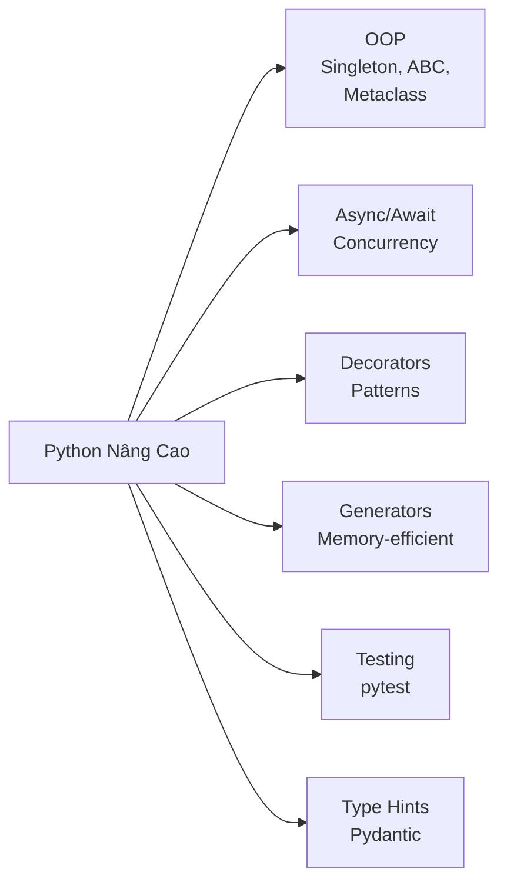

# 🐍 Python Nâng Cao cho AI Engineering

> **Mục tiêu**: Nắm vững Python ở level production — OOP, async, decorators, generators, testing, logging, type hints.
> Đây là nền tảng **bắt buộc** trước khi học bất kỳ framework AI nào.

---

## Python Advanced Topics Map



---

## 1. OOP Nâng Cao (Object-Oriented Programming)

### `__new__` vs `__init__`

```python
class Singleton:
    _instance = None
    
    def __new__(cls, *args, **kwargs):
        """Được gọi TRƯỚC __init__, kiểm soát việc TẠO instance."""
        if cls._instance is None:
            cls._instance = super().__new__(cls)
        return cls._instance
    
    def __init__(self, value):
        """Được gọi SAU __new__, khởi tạo attributes."""
        self.value = value

a = Singleton(1)
b = Singleton(2)
print(a is b)        # True — cùng 1 instance
print(a.value)       # 2 — __init__ gọi lại, ghi đè value
```

- `__new__`: Tạo object (allocate memory). Dùng cho Singleton, immutable types, metaclasses.
- `__init__`: Khởi tạo object đã tạo. Đây là constructor thông thường.

### `__slots__` — Memory Optimization

```python
class WithoutSlots:
    def __init__(self, x, y):
        self.x = x
        self.y = y

class WithSlots:
    __slots__ = ['x', 'y']  # Không dùng __dict__, tiết kiệm ~40% memory
    
    def __init__(self, x, y):
        self.x = x
        self.y = y

# WithSlots KHÔNG cho phép thêm attribute mới
obj = WithSlots(1, 2)
# obj.z = 3  # ❌ AttributeError
```

**Khi nào dùng**: Khi tạo hàng triệu objects (e.g., data points, tokens, embeddings).

### `__call__` — Callable Objects

```python
class Preprocessor:
    """Callable object — gọi instance như function.
    Pattern HAY DÙNG trong ML: model(input), transform(data)
    """
    def __init__(self, normalize: bool = True, resize: int = 224):
        self.normalize = normalize
        self.resize = resize
    
    def __call__(self, image):
        """Gọi instance như function: preprocessor(image)"""
        if self.resize:
            image = self._resize(image, self.resize)
        if self.normalize:
            image = image / 255.0
        return image
    
    def _resize(self, image, size):
        # resize logic
        return image

# Dùng như function — nhưng giữ state!
preprocess = Preprocessor(normalize=True, resize=512)
output = preprocess(raw_image)  # Gọi __call__

# PyTorch nn.Module dùng __call__ internally!
# model(x) → model.__call__(x) → model.forward(x)
```

### Method Resolution Order (MRO) & `super()`

```python
class A:
    def method(self):
        print("A")

class B(A):
    def method(self):
        print("B")
        super().method()  # Gọi theo MRO, không phải parent trực tiếp

class C(A):
    def method(self):
        print("C")
        super().method()

class D(B, C):  # Diamond inheritance
    def method(self):
        print("D")
        super().method()

D().method()  # D → B → C → A (C3 Linearization)
print(D.__mro__)  # Xem MRO chain
```

### Abstract Base Classes & Dataclasses

```python
from abc import ABC, abstractmethod
from dataclasses import dataclass, field

class BaseModel(ABC):
    @abstractmethod
    def predict(self, X):
        """Mọi subclass PHẢI implement method này."""
        pass
    
    @abstractmethod
    def evaluate(self, X, y) -> dict:
        """Return metrics dict."""
        pass
    
    def summary(self) -> str:
        """Non-abstract: shared implementation."""
        return f"{self.__class__.__name__} model"

@dataclass
class ModelConfig:
    """Thay thế __init__ boilerplate. Tự động tạo __repr__, __eq__."""
    name: str
    learning_rate: float = 0.001
    epochs: int = 10
    tags: list[str] = field(default_factory=list)
    
    def __post_init__(self):
        """Validation sau khi __init__ chạy."""
        if self.learning_rate <= 0:
            raise ValueError("Learning rate must be positive")

config = ModelConfig("transformer", learning_rate=0.0001)
print(config)  # ModelConfig(name='transformer', learning_rate=0.0001, epochs=10, tags=[])
```

---

## 2. Metaclasses & Descriptors

### Metaclass — "Class of a Class"

```python
# Metaclass controls HOW classes are created
# type is the default metaclass: type(name, bases, namespace)

class ModelRegistry(type):
    """Metaclass auto-registers all model subclasses."""
    _registry = {}
    
    def __new__(mcs, name, bases, namespace):
        cls = super().__new__(mcs, name, bases, namespace)
        if bases:  # Don't register base class itself
            mcs._registry[name] = cls
            print(f"  Registered: {name}")
        return cls

class BaseModel(metaclass=ModelRegistry):
    pass

class ResNet(BaseModel):       # Auto-registered!
    pass

class ViT(BaseModel):          # Auto-registered!
    pass

print(ModelRegistry._registry)
# {'ResNet': <class 'ResNet'>, 'ViT': <class 'ViT'>}

# Real-world: Django ORM, SQLAlchemy, Pydantic all use metaclasses
# ⚠️ Prefer __init_subclass__ (simpler) over metaclass when possible
```

### `__init_subclass__` — Simpler Alternative

```python
class Plugin:
    """Simpler than metaclass — hook when subclass is created."""
    _plugins = {}
    
    def __init_subclass__(cls, plugin_name: str = None, **kwargs):
        super().__init_subclass__(**kwargs)
        name = plugin_name or cls.__name__
        Plugin._plugins[name] = cls

class ImagePlugin(Plugin, plugin_name="image"):
    pass

class TextPlugin(Plugin, plugin_name="text"):
    pass

print(Plugin._plugins)  # {'image': ImagePlugin, 'text': TextPlugin}
```

### Descriptors — Behind `@property`

```python
class Validated:
    """Descriptor — controls attribute access on OTHER classes."""
    def __init__(self, min_val=None, max_val=None):
        self.min_val = min_val
        self.max_val = max_val
    
    def __set_name__(self, owner, name):
        self.name = name  # Attribute name on the owner class
    
    def __get__(self, obj, objtype=None):
        if obj is None:
            return self
        return obj.__dict__.get(self.name)
    
    def __set__(self, obj, value):
        if self.min_val is not None and value < self.min_val:
            raise ValueError(f"{self.name} must be >= {self.min_val}")
        if self.max_val is not None and value > self.max_val:
            raise ValueError(f"{self.name} must be <= {self.max_val}")
        obj.__dict__[self.name] = value

class TrainingConfig:
    learning_rate = Validated(min_val=0, max_val=1)
    epochs = Validated(min_val=1, max_val=1000)
    dropout = Validated(min_val=0, max_val=1)
    
    def __init__(self, lr, epochs, dropout):
        self.learning_rate = lr      # Triggers Validated.__set__
        self.epochs = epochs
        self.dropout = dropout

config = TrainingConfig(0.001, 100, 0.3)     # ✅ OK
# config = TrainingConfig(-0.1, 100, 0.3)    # ❌ ValueError

# How @property works internally:
# @property creates a descriptor with __get__, __set__, __delete__
```

---

## 3. Async / Await & Concurrency

### Khi nào dùng cái nào?

| Giải pháp | Best for | GIL? | Ví dụ |
|-----------|----------|------|-------|
| `asyncio` | I/O-bound (API calls, DB queries) | Bị ảnh hưởng | Web scraping, API server |
| `threading` | I/O-bound (simple) | Bị ảnh hưởng | File I/O, network |
| `multiprocessing` | CPU-bound | Bypass GIL | Model training, data processing |

### Asyncio Fundamentals

```python
import asyncio
import httpx

async def fetch_url(client: httpx.AsyncClient, url: str) -> str:
    """Coroutine — hàm async, chạy trong event loop."""
    response = await client.get(url)  # await = nhường quyền cho event loop
    return f"{url}: {response.status_code}"

async def main():
    urls = [
        "https://httpbin.org/delay/1",
        "https://httpbin.org/delay/1",
        "https://httpbin.org/delay/1",
    ]
    async with httpx.AsyncClient() as client:
        # asyncio.gather — chạy ĐỒNG THỜI, không phải tuần tự
        results = await asyncio.gather(
            *[fetch_url(client, url) for url in urls]
        )
    for r in results:
        print(r)
    # 3 requests × 1s delay = ~1s total (không phải 3s!)

asyncio.run(main())
```

### Async Patterns cho Production

```python
import asyncio
from asyncio import Semaphore

# ── Semaphore: limit concurrent requests ──
async def fetch_with_limit(sem: Semaphore, client, url):
    async with sem:  # Max N concurrent
        return await client.get(url)

async def main():
    sem = Semaphore(10)  # Max 10 concurrent requests
    async with httpx.AsyncClient() as client:
        tasks = [fetch_with_limit(sem, client, url) for url in urls]
        results = await asyncio.gather(*tasks)

# ── asyncio.TaskGroup (Python 3.11+) — structured concurrency ──
async def main():
    async with asyncio.TaskGroup() as tg:
        task1 = tg.create_task(fetch("url1"))
        task2 = tg.create_task(fetch("url2"))
    # Both completed OR both cancelled on error

# ── Timeout ──
async def with_timeout():
    try:
        result = await asyncio.wait_for(slow_operation(), timeout=5.0)
    except asyncio.TimeoutError:
        print("Operation timed out!")
```

### Gọi sync function trong async context

```python
import asyncio
import time

def blocking_computation(n: int) -> int:
    """Hàm blocking — KHÔNG được gọi trực tiếp trong async."""
    time.sleep(2)  # Simulate heavy work
    return n * n

async def main():
    loop = asyncio.get_event_loop()
    # run_in_executor: chạy blocking function trong thread pool
    result = await loop.run_in_executor(None, blocking_computation, 42)
    print(f"Result: {result}")

asyncio.run(main())
```

---

## 4. Decorators

### Function Decorator cơ bản

```python
import functools
import time

def timer(func):
    """Decorator đo thời gian chạy function."""
    @functools.wraps(func)  # Giữ nguyên __name__, __doc__ của func gốc
    def wrapper(*args, **kwargs):
        start = time.perf_counter()
        result = func(*args, **kwargs)
        elapsed = time.perf_counter() - start
        print(f"⏱️ {func.__name__} took {elapsed:.4f}s")
        return result
    return wrapper

@timer
def train_model(epochs: int):
    """Train a dummy model."""
    time.sleep(0.5)
    return {"loss": 0.01}

result = train_model(epochs=10)
print(train_model.__name__)  # "train_model" (nhờ functools.wraps)
```

### Decorator Factory (có tham số)

```python
import functools

def retry(max_attempts: int = 3, delay: float = 1.0, exceptions=(Exception,)):
    """Decorator factory — decorator nhận tham số."""
    def decorator(func):
        @functools.wraps(func)
        def wrapper(*args, **kwargs):
            for attempt in range(1, max_attempts + 1):
                try:
                    return func(*args, **kwargs)
                except exceptions as e:
                    print(f"  ⚠️ Attempt {attempt}/{max_attempts} failed: {e}")
                    if attempt == max_attempts:
                        raise
                    import time; time.sleep(delay * (2 ** (attempt - 1)))
        return wrapper
    return decorator

@retry(max_attempts=3, delay=0.5, exceptions=(ConnectionError, TimeoutError))
def call_api(url: str):
    import random
    if random.random() < 0.7:
        raise ConnectionError("API timeout")
    return {"status": "ok"}
```

### Class Decorator

```python
def singleton(cls):
    """Class decorator — make any class a singleton."""
    instances = {}
    
    @functools.wraps(cls)
    def get_instance(*args, **kwargs):
        if cls not in instances:
            instances[cls] = cls(*args, **kwargs)
        return instances[cls]
    
    return get_instance

@singleton
class DatabaseConnection:
    def __init__(self, url: str):
        self.url = url
        print(f"Connecting to {url}...")

db1 = DatabaseConnection("postgres://localhost/ml")
db2 = DatabaseConnection("postgres://other")  # Returns same instance!
print(db1 is db2)  # True
```

> **📝 Interview Tip**: Decorator factory cần **3 levels nesting**: factory → decorator → wrapper.
> `functools.wraps` là **bắt buộc** — nếu không, `__name__` và `__doc__` sẽ bị mất.

---

## 5. Generators

### yield vs yield from

```python
def read_chunks(file_path: str, chunk_size: int = 1024):
    """Generator — đọc file từng chunk, không load toàn bộ vào memory."""
    with open(file_path, 'r') as f:
        while True:
            chunk = f.read(chunk_size)
            if not chunk:
                break
            yield chunk  # Trả về từng chunk, pause tại đây

def read_multiple_files(file_paths: list[str]):
    """yield from — delegate cho sub-generator."""
    for path in file_paths:
        yield from read_chunks(path)  # Flatten nested generators

# Memory-efficient: chỉ giữ 1 chunk trong memory tại 1 thời điểm
```

### Generator Expression vs List Comprehension

```python
import sys

# List comprehension — tạo TOÀN BỘ list trong memory
squares_list = [x**2 for x in range(1_000_000)]
print(f"List: {sys.getsizeof(squares_list):,} bytes")  # ~8MB

# Generator expression — lazy evaluation, gần như 0 memory
squares_gen = (x**2 for x in range(1_000_000))
print(f"Generator: {sys.getsizeof(squares_gen):,} bytes")  # ~200 bytes

# ✅ Rule: Dùng generator khi:
# 1. Dataset lớn (millions of rows)
# 2. Chỉ cần iterate 1 lần
# 3. Có thể xử lý từng item
```

---

## 6. Testing (pytest)

### Basics

```python
# test_model.py
import pytest

def test_prediction_shape():
    """Test basic prediction output."""
    model = load_model("model.pth")
    predictions = model.predict(sample_input)
    assert predictions.shape == (1, 10), f"Expected (1,10), got {predictions.shape}"

def test_prediction_range():
    """Predictions should be probabilities [0, 1]."""
    probs = model.predict_proba(sample_input)
    assert probs.min() >= 0.0
    assert probs.max() <= 1.0
    assert abs(probs.sum() - 1.0) < 1e-6  # Sum to 1

# ── Parametrize: test multiple inputs ──
@pytest.mark.parametrize("input_size,expected_output", [
    ((1, 3, 224, 224), (1, 1000)),   # ImageNet
    ((4, 3, 224, 224), (4, 1000)),   # Batch of 4
])
def test_model_shapes(input_size, expected_output):
    x = torch.randn(*input_size)
    out = model(x)
    assert out.shape == expected_output
```

### Fixtures & Mocking

```python
import pytest
from unittest.mock import patch, MagicMock

# ── Fixture: shared setup ──
@pytest.fixture
def sample_data():
    """Create test data once, reuse in multiple tests."""
    return {
        "X_train": np.random.randn(100, 10),
        "y_train": np.random.randint(0, 2, 100),
        "X_test": np.random.randn(20, 10),
    }

@pytest.fixture
def trained_model(sample_data):
    """Fixture can depend on other fixtures."""
    model = RandomForestClassifier(n_estimators=10)
    model.fit(sample_data["X_train"], sample_data["y_train"])
    return model

def test_accuracy(trained_model, sample_data):
    """Uses fixtures automatically."""
    score = trained_model.score(sample_data["X_test"], sample_data["y_test"])
    assert score > 0.5  # Better than random

# ── Mock: fake external dependencies ──
@patch("my_module.openai.ChatCompletion.create")
def test_llm_call(mock_create):
    mock_create.return_value = MagicMock(
        choices=[MagicMock(message=MagicMock(content="Paris"))]
    )
    result = my_module.ask_llm("What is the capital of France?")
    assert result == "Paris"
    mock_create.assert_called_once()
```

### conftest.py — Shared Fixtures

```python
# conftest.py (auto-discovered by pytest)
import pytest

@pytest.fixture(scope="session")  # Run once for entire test session
def db_connection():
    conn = create_connection()
    yield conn
    conn.close()  # Cleanup after all tests

@pytest.fixture(scope="function")  # Run per test function (default)
def clean_table(db_connection):
    db_connection.execute("DELETE FROM predictions")
    yield
    db_connection.execute("DELETE FROM predictions")  # Cleanup
```

---

## 7. Error Handling Patterns

```python
# ── Custom Exceptions ──
class ModelError(Exception):
    """Base exception for model errors."""
    pass

class ModelNotFoundError(ModelError):
    """Model file not found."""
    def __init__(self, model_name: str):
        self.model_name = model_name
        super().__init__(f"Model '{model_name}' not found in registry")

class InferenceError(ModelError):
    """Error during inference."""
    pass

# ── Exception Chaining ──
try:
    data = load_data("input.csv")
except FileNotFoundError as e:
    raise ModelError("Cannot load input data") from e  # Chains exceptions
    # "The above exception was the direct cause of..."

# ── contextlib.suppress — Ignore specific exceptions ──
from contextlib import suppress

with suppress(FileNotFoundError):
    os.remove("temp_model.pth")  # Silently ignore if file doesn't exist

# ── Error handling in production API ──
from fastapi import FastAPI, HTTPException

@app.post("/predict")
async def predict(request: InferenceRequest):
    try:
        result = model.predict(request.data)
    except ModelNotFoundError:
        raise HTTPException(404, "Model not found")
    except InferenceError as e:
        raise HTTPException(500, f"Inference failed: {e}")
    except Exception:
        raise HTTPException(500, "Internal server error")  # Never expose internals!
```

---

## 8. Logging — Production Best Practices

```python
import logging
import json
from datetime import datetime

# ── Basic setup ──
logging.basicConfig(
    level=logging.INFO,
    format="%(asctime)s | %(levelname)-8s | %(name)s | %(message)s",
    datefmt="%Y-%m-%d %H:%M:%S",
)
logger = logging.getLogger("ml_pipeline")

# ── Structured logging (JSON) — for production ──
import structlog

structlog.configure(
    processors=[
        structlog.processors.TimeStamper(fmt="iso"),
        structlog.processors.JSONRenderer(),
    ]
)
log = structlog.get_logger()

log.info("model_loaded", model_name="resnet50", device="cuda", load_time_ms=234)
# Output: {"event": "model_loaded", "model_name": "resnet50", "device": "cuda", ...}

log.info("prediction_complete", 
    latency_ms=45.2, 
    input_shape=[1, 3, 224, 224],
    confidence=0.95,
)

# ── DON'Ts ──
# ❌ print("loading model...")           → no timestamp, no level, no structure
# ❌ logger.info(f"User data: {user}")   → may log PII!
# ❌ logger.debug(f"Full tensor: {x}")   → may log huge tensors!

# ── DOs ──
# ✅ logger.info("Model loaded", extra={"model": name, "device": device})
# ✅ logger.error("Prediction failed", exc_info=True)  → includes traceback
```

---

## 9. Type Hints

### Advanced Types

```python
from typing import Union, Optional, Callable, Protocol, Any, TypeVar, Generic
from collections.abc import Iterator

# Optional = Union[X, None]
def find_user(user_id: int) -> Optional[dict]:
    """Trả về user hoặc None."""
    ...

# Callable — type cho function parameters
def apply_transform(
    data: list[float],
    transform: Callable[[float], float]  # Nhận float, trả về float
) -> list[float]:
    return [transform(x) for x in data]

# Protocol — Structural Subtyping (duck typing có type checking)
class Predictable(Protocol):
    def predict(self, X: Any) -> Any: ...
    def score(self, X: Any, y: Any) -> float: ...

def evaluate_model(model: Predictable, X_test, y_test) -> float:
    """Chấp nhận BẤT KỲ object nào có predict() và score()."""
    return model.score(X_test, y_test)

# TypeVar & Generic — reusable typed containers
T = TypeVar("T")

class ModelResult(Generic[T]):
    def __init__(self, value: T, confidence: float):
        self.value = value
        self.confidence = confidence

result: ModelResult[str] = ModelResult("cat", 0.95)
```

### Runtime Type Checking với Pydantic

```python
from pydantic import BaseModel, Field, field_validator, model_validator

class InferenceRequest(BaseModel):
    """Pydantic model — validate data at RUNTIME."""
    text: str = Field(..., min_length=1, max_length=10000)
    temperature: float = Field(default=0.7, ge=0.0, le=2.0)
    max_tokens: int = Field(default=512, ge=1, le=4096)
    model: str = Field(default="gpt-4o")
    
    @field_validator('text')
    @classmethod
    def text_not_empty(cls, v: str) -> str:
        if not v.strip():
            raise ValueError("Text cannot be empty or whitespace")
        return v.strip()
    
    @model_validator(mode='after')
    def validate_model_tokens(self):
        """Cross-field validation."""
        if self.model == "gpt-4o-mini" and self.max_tokens > 2048:
            raise ValueError("gpt-4o-mini supports max 2048 tokens")
        return self

# ✅ Valid
req = InferenceRequest(text="Hello AI", temperature=0.5)

# ❌ Raises ValidationError
# InferenceRequest(text="", temperature=3.0)
```

---

## 10. Standard Library Gems

```python
from functools import lru_cache, partial, reduce
from itertools import chain, islice, batched, groupby
from collections import defaultdict, Counter, deque, OrderedDict
from contextlib import contextmanager
from pathlib import Path

# ── lru_cache — memoization tự động ──
@lru_cache(maxsize=128)
def expensive_embedding(text: str) -> list[float]:
    """Cache kết quả để tránh gọi API lặp lại."""
    ...

# ── partial — tạo function mới với preset arguments ──
train_small = partial(train_model, batch_size=8, epochs=5)

# ── Counter — đếm frequency ──
tokens = ["the", "cat", "sat", "the", "cat"]
freq = Counter(tokens)
print(freq.most_common(2))  # [('the', 2), ('cat', 2)]

# ── defaultdict — dict với default value ──
embeddings = defaultdict(list)
embeddings["doc_1"].append([0.1, 0.2, 0.3])

# ── deque — efficient append/pop both ends ──
buffer = deque(maxlen=100)  # Sliding window: auto-drop oldest when full
buffer.append("new message")

# ── batched (Python 3.12+) — chia list thành batches ──
data = list(range(10))
for batch in batched(data, 3):
    print(batch)  # (0,1,2), (3,4,5), (6,7,8), (9,)

# ── Path — modern file handling (thay os.path) ──
model_dir = Path("models") / "v2"
model_dir.mkdir(parents=True, exist_ok=True)
model_path = model_dir / "best_model.pth"
if model_path.exists():
    print(f"Model size: {model_path.stat().st_size / 1e6:.1f}MB")

# ── contextmanager — custom context manager ──
@contextmanager
def timer(name: str):
    import time
    start = time.perf_counter()
    yield
    elapsed = time.perf_counter() - start
    print(f"⏱️ {name}: {elapsed:.3f}s")

with timer("Training"):
    model.fit(X, y)
```

---

## 🎯 Interview Tips — Chi Tiết

### Q1: "`__new__` vs `__init__` khác nhau thế nào?"
**A**: `__new__` tạo instance (trước), `__init__` khởi tạo (sau). Dùng `__new__` cho Singleton, immutable types (str, tuple subclass). `__new__` nhận `cls`, trả về instance. `__init__` nhận `self`, không trả về gì.

### Q2: "Giải thích MRO trong Python."
**A**: C3 Linearization. Diamond: D→B→C→A. `super()` theo MRO chain, không phải parent trực tiếp. Check bằng `ClassName.__mro__`. Python 3 luôn dùng C3 — đảm bảo mỗi class chỉ được gọi 1 lần.

### Q3: "`asyncio` vs `threading` vs `multiprocessing`?"
**A**: async: I/O-bound, cooperative scheduling, 1 thread. threading: I/O-bound, preemptive, GIL giới hạn. multiprocessing: CPU-bound, bypass GIL, memory overhead. AI apps: async cho API calls, multiprocessing cho training/inference.

### Q4: "Viết decorator đo thời gian."
**A**: `functools.wraps` bắt buộc (giữ `__name__`, `__doc__`). 3 levels: simple decorator → decorator with args → class-based decorator. Dùng `time.perf_counter()` không dùng `time.time()`.

### Q5: "Generator vs list comprehension?"
**A**: Generator: lazy evaluation, ~0 memory, iterate 1 lần. List: eager, full memory, random access, reusable. Rule: dùng generator khi data lớn hoặc chỉ iterate 1 lần. `yield` biến function thành generator.

### Q6: "`Protocol` vs ABC?"
**A**: Protocol: structural subtyping (duck typing với type hints), no inheritance needed. ABC: nominal subtyping, requires explicit inheritance. Python 3.8+. Prefer Protocol cho loose coupling, ABC cho framework interfaces.

### Q7: "GIL là gì?"
**A**: Global Interpreter Lock — chỉ 1 thread chạy Python bytecode tại 1 thời điểm. Bypass: multiprocessing (separate processes), C extensions (numpy releases GIL), subinterpreters (Python 3.12+). GIL không ảnh hưởng I/O-bound code.

### Q8: "Metaclass dùng khi nào?"
**A**: Auto-register classes (plugin system), validate class creation, ORM magic (Django models). Flow: `type.__new__` → `type.__init__` → class object. Prefer `__init_subclass__` (simpler) khi có thể. Metaclass = overkill cho hầu hết use cases.

### Q9: "Descriptor hoạt động thế nào?"
**A**: Implement `__get__`, `__set__`, `__delete__`. Behind `@property`, `classmethod`, `staticmethod`. Data descriptor (có `__set__`) > instance `__dict__` > non-data descriptor. Dùng cho validation, lazy computing, caching.

### Q10: "pytest fixture scope?"
**A**: `function` (default, per test), `class`, `module`, `session` (once). `conftest.py` auto-shared across tests. `autouse=True` cho fixtures cần chạy mọi test. `yield` fixture cho setup/teardown pattern.
