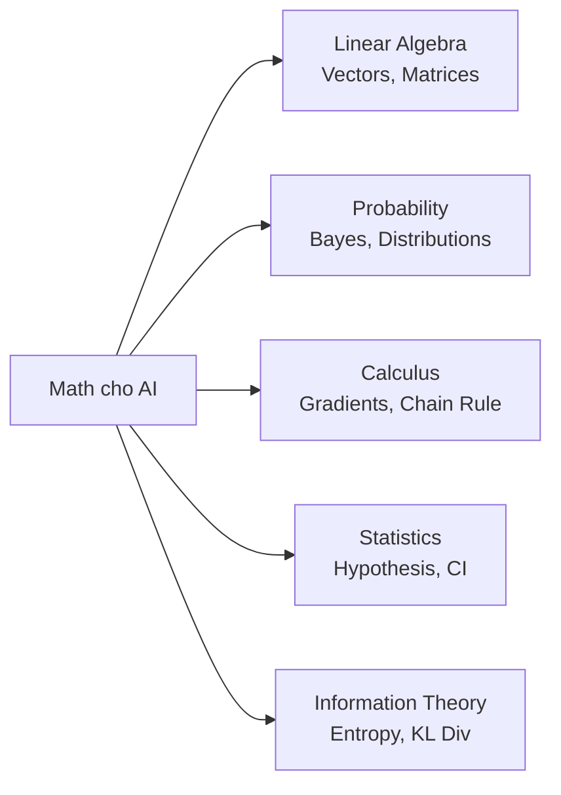

# 📐 Toán cho AI Engineering

> **Mục tiêu**: Nắm 5 nhánh toán cốt lõi — Linear Algebra, Probability, Calculus, Statistics, Information Theory.
> Không cần chứng minh định lý — cần **hiểu trực quan** và **biết áp dụng** vào ML/DL.

---

## Math for AI — Overview



---

## 1. Linear Algebra (Đại Số Tuyến Tính)

### 1.1 Vectors & Matrices — Building Blocks

```python
import numpy as np

# Vector = mảng 1D = 1 data point hoặc 1 embedding
v = np.array([1, 2, 3])

# Matrix = mảng 2D = dataset (rows=samples, cols=features)
X = np.array([[1, 2], [3, 4], [5, 6]])  # 3 samples, 2 features

# Tensor = mảng nD = images (batch, height, width, channels)
img_batch = np.zeros((32, 224, 224, 3))  # 32 images, 224x224, RGB
```

### 1.2 Dot Product — Đo Similarity

```python
# Dot product = Σ aᵢ × bᵢ
a = np.array([1, 0, 0])
b = np.array([0, 1, 0])
print(np.dot(a, b))  # 0 — vuông góc = không liên quan

c = np.array([1, 0, 0])
d = np.array([1, 0, 0])
print(np.dot(c, d))  # 1 — cùng hướng = rất liên quan
```

> **💡 Ứng dụng**: Trong NLP, mỗi từ/câu = 1 vector (embedding).
> Dot product đo "sự giống nhau" giữa 2 embeddings → **Basis của semantic search, RAG, recommendation**.
>
> Attention mechanism trong Transformer = dot product giữa Query và Key vectors.

### 1.3 Matrix Multiplication — Core của Neural Networks

```python
# Neural Network layer: output = input @ weights + bias
# MỌI computation trong NN đều là matrix multiplication!

X = np.array([[1, 2], [3, 4]])   # 2 samples, 2 features (input)
W = np.array([[0.5, 0.3, 0.8],   # 2×3 weight matrix (learnable)
              [0.1, 0.7, 0.2]])
b = np.array([0.1, 0.1, 0.1])    # bias

output = X @ W + b  # (2×2) @ (2×3) = (2×3)
print(output.shape)  # (2, 3) — 2 samples, 3 neurons

# Quy tắc: (m×n) @ (n×p) = (m×p)
# Số cột matrix trái = Số hàng matrix phải
```

### 1.4 Eigenvalues & Eigenvectors — Nền tảng PCA

```python
# Eigenvector: vector KHÔNG ĐỔI HƯỚNG khi nhân với matrix
# A × v = λ × v
# v = eigenvector, λ = eigenvalue

# Ý nghĩa: Eigenvectors = "hướng quan trọng nhất" của data
# Eigenvalues = "mức quan trọng" của mỗi hướng

# PCA dùng eigenvectors để tìm hướng variance lớn nhất
from sklearn.decomposition import PCA

data = np.random.randn(100, 5)  # 100 samples, 5 features
pca = PCA(n_components=2)
reduced = pca.fit_transform(data)  # 100 samples, 2 features

print(f"Variance explained: {pca.explained_variance_ratio_}")
# [0.35, 0.25] — 2 components giữ 60% thông tin
# → 60% information with only 40% dimensions!
```

### 1.5 Cosine Similarity — Đo Similarity Embeddings

```python
from numpy.linalg import norm

def cosine_similarity(a: np.ndarray, b: np.ndarray) -> float:
    """
    Đo góc giữa 2 vectors. Range: [-1, 1].
    1 = cùng hướng (giống nhau)
    0 = vuông góc (không liên quan)
    -1 = ngược hướng (trái nghĩa)
    """
    return np.dot(a, b) / (norm(a) * norm(b))

# So sánh embeddings
embed_cat = np.array([0.8, 0.2, 0.1])
embed_dog = np.array([0.7, 0.3, 0.1])
embed_car = np.array([0.1, 0.1, 0.9])

print(f"cat-dog: {cosine_similarity(embed_cat, embed_dog):.3f}")  # ~0.98 (gần)
print(f"cat-car: {cosine_similarity(embed_cat, embed_car):.3f}")  # ~0.35 (xa)
```

> **💡 Cosine vs Euclidean**:
> - **Cosine**: đo **direction** (góc), không quan tâm magnitude. Tốt cho embeddings (vì normalize rồi).
> - **Euclidean**: đo **distance** (khoảng cách). Bị ảnh hưởng bởi magnitude.
> - **Rule**: Dùng cosine cho text/embeddings. Euclidean cho spatial data (images, coordinates).

### 1.6 SVD (Singular Value Decomposition)

```python
# SVD: phân tích matrix thành 3 matrices
# A = U × Σ × V^T
# U: left singular vectors (patterns in rows/samples)
# Σ: singular values (importance of each pattern)
# V: right singular vectors (patterns in columns/features)

A = np.array([[1, 2, 3], [4, 5, 6], [7, 8, 9]])
U, S, Vt = np.linalg.svd(A)

print(f"Singular values: {S.round(3)}")
# S = [16.848, 1.068, 0.0] → pattern 1 chiếm dominant

# Ứng dụng SVD:
# 1. Dimensionality reduction (like PCA but more general)
# 2. Matrix completion (Netflix recommendation)
# 3. Noise reduction (keep only top-k singular values)
# 4. Pseudoinverse computation (solve linear systems)

# Low-rank approximation: giữ top-k singular values
k = 2
A_approx = U[:, :k] @ np.diag(S[:k]) @ Vt[:k, :]
error = np.linalg.norm(A - A_approx, 'fro')
print(f"Reconstruction error (rank-{k}): {error:.4f}")
```

---

## 2. Probability (Xác Suất)

### 2.1 Bayes Theorem — Backbone của ML

```
P(A|B) = P(B|A) × P(A) / P(B)

              Likelihood × Prior
Posterior = ─────────────────────
                  Evidence

Ví dụ thực tế — Spam filtering:
- P(spam | "free money") = ?
- Prior:      P(spam) = 0.3             (30% emails là spam)
- Likelihood: P("free money"|spam) = 0.8 (80% spam chứa "free money")
- Evidence:   P("free money") = 0.4     (40% tổng emails có "free money")
- Posterior:  P(spam|"free money") = 0.8 × 0.3 / 0.4 = 0.6 → 60% là spam!

Ứng dụng trong ML:
- Naive Bayes Classifier
- Bayesian Neural Networks
- MAP estimation = Bayes + Regularization
```

### 2.2 Common Distributions

```python
import numpy as np

# ── Normal (Gaussian) ──
# ML giả định features follow normal distribution
# Central Limit Theorem: mean of many samples → Normal
samples = np.random.normal(mean=0, scale=1, size=1000)
# 68% within ±1σ, 95% within ±2σ, 99.7% within ±3σ

# ── Bernoulli ──
# Binary outcome: spam/not spam, click/no click
coin_flips = np.random.binomial(n=1, p=0.7, size=1000)  # P(success)=0.7

# ── Uniform ──
# Equal probability: random search hyperparameters
uniform = np.random.uniform(low=0.001, high=0.1, size=100)  # Learning rates

# ── Softmax — Biến logits thành probabilities ──
def softmax(logits):
    """
    Input: raw scores (any range)
    Output: probabilities (0-1, sum=1)
    Trick: subtract max for numerical stability
    """
    exp = np.exp(logits - np.max(logits))  # Prevent overflow!
    return exp / exp.sum()

logits = np.array([2.0, 1.0, 0.1])
probs = softmax(logits)
print(f"Softmax: {probs.round(3)}")  # [0.659, 0.242, 0.099] — sum = 1.0
# Logit lớn nhất → probability lớn nhất, nhưng không phải 100%
```

### 2.3 MLE vs MAP

```
MLE (Maximum Likelihood Estimation):
  Tìm θ maximize P(data | θ)
  = "Parameters nào giải thích data tốt nhất?"
  → Dễ overfit (không có regularization)
  → Ví dụ: tung coin 3 lần, 3 heads → MLE: P(H) = 1.0 (unrealistic!)

MAP (Maximum A Posteriori):
  Tìm θ maximize P(θ | data) = P(data|θ) × P(θ)
  = MLE + Prior belief
  → P(θ) = prior = regularization!
  → L2 regularization = Gaussian prior on weights
  → L1 regularization = Laplace prior on weights
  → Ví dụ: prior P(H)=0.5 → kéo estimate về 0.5 → robust hơn
```

### 2.4 Conditional Probability & Independence

```python
# Joint Probability: P(A ∩ B) = P(A) × P(B|A)
# If independent:   P(A ∩ B) = P(A) × P(B)

# Naive Bayes "naive" vì giả định features INDEPENDENT:
# P(spam | word1, word2, word3) = P(word1|spam) × P(word2|spam) × P(word3|spam) × P(spam)
# Giả định sai nhưng works surprisingly well!

# Marginalization: P(A) = Σ P(A, B) for all B
# "Sum out" variables you don't care about
```

---

## 3. Calculus (Giải Tích)

### 3.1 Chain Rule — Backpropagation

```python
# Neural network = composition of functions
# Forward:  y = f(g(h(x)))
# Backward: dy/dx = dy/df × df/dg × dg/dh × dh/dx ← CHAIN RULE!

# Ví dụ cụ thể:
# Forward pass: y = sigmoid(w*x + b)
# Chain rule:   dy/dw = dy/dσ × dσ/dz × dz/dw

def sigmoid(z):
    return 1 / (1 + np.exp(-z))

def sigmoid_derivative(z):
    s = sigmoid(z)
    return s * (1 - s)  # σ'(z) = σ(z)(1 - σ(z)) — elegant!

# Manual gradient computation
x, w, b = 2.0, 0.5, 0.1
z = w * x + b                    # Linear: z = 1.1
a = sigmoid(z)                    # Activation: a ≈ 0.75
loss = (a - 1.0) ** 2            # MSE Loss

# Backprop: chain rule step by step
dloss_da = 2 * (a - 1.0)         # dLoss/da = -0.50
da_dz = sigmoid_derivative(z)     # da/dz = 0.19
dz_dw = x                         # dz/dw = 2.0

dloss_dw = dloss_da * da_dz * dz_dw  # Chain! = -0.19
print(f"Gradient dL/dw = {dloss_dw:.4f}")
# PyTorch autograd does this AUTOMATICALLY for millions of parameters!
```

### 3.2 Gradient Descent Variants

```
SGD:           w = w - lr × ∇L
               Simple. Cần tune LR carefully. Noisy gradients.

SGD+Momentum:  v = β×v + ∇L       (tích lũy velocity)
               w = w - lr × v
               Smooth hơn, vượt qua local minima. β=0.9 typical.

Adam:          m = β₁×m + (1-β₁)×∇L    (1st moment - mean)
               v = β₂×v + (1-β₂)×∇L²   (2nd moment - variance)
               w = w - lr × m̂/√(v̂+ε)
               Adaptive LR per parameter. Default choice.

AdamW:         Giống Adam nhưng weight decay DECOUPLED
               w = w × (1 - lr × λ) - lr × m̂/√(v̂+ε)
               ✅ RECOMMENDED cho Transformers, LLMs
```

| Optimizer | Best for | LR | Typical Settings |
|-----------|----------|-----|-----------------|
| **SGD** | Simple problems, convex | 0.01-0.1 | momentum=0.9 |
| **Adam** | Default, most problems | 1e-3 to 1e-4 | β1=0.9, β2=0.999 |
| **AdamW** | Transformers, LLMs | 1e-4 to 5e-5 | weight_decay=0.01 |
| **LAMB** | Large batch training | 1e-3 | For BERT-style pretraining |

### 3.3 Gradient Problems

```
Vanishing Gradient:
  Deep network → gradients shrink exponentially → early layers don't learn
  Cause: sigmoid/tanh saturation, deep networks without skip connections
  Fix: ReLU activation, Residual connections (ResNet), BatchNorm, LSTM gates

Exploding Gradient:
  Gradients grow exponentially → NaN loss, unstable training
  Cause: large weights, deep RNNs, bad LR
  Fix: Gradient clipping (torch.nn.utils.clip_grad_norm_), proper initialization
  
  # Gradient clipping — ESSENTIAL for transformer training
  torch.nn.utils.clip_grad_norm_(model.parameters(), max_norm=1.0)
```

### 3.4 Weight Initialization

```python
# Xavier/Glorot (2010): cho sigmoid/tanh
# W ~ N(0, 2/(fan_in + fan_out))
nn.init.xavier_uniform_(layer.weight)

# He/Kaiming (2015): cho ReLU
# W ~ N(0, 2/fan_in)
nn.init.kaiming_normal_(layer.weight, mode='fan_in', nonlinearity='relu')

# Tại sao quan trọng?
# Random too small → vanishing gradients
# Random too large → exploding gradients
# Proper init → variance preserved across layers → stable training
```

---

## 4. Statistics (Thống Kê)

### 4.1 Descriptive Statistics

```python
import numpy as np

data = np.array([10, 20, 20, 30, 40, 50, 100])

print(f"Mean:   {np.mean(data):.1f}")    # 38.6 (bị ảnh hưởng outlier 100)
print(f"Median: {np.median(data):.1f}")  # 30.0 (robust với outlier ✅)
print(f"Std:    {np.std(data):.1f}")     # 27.9 (spread/dispersion)
print(f"Mode:   20")                      # Giá trị xuất hiện nhiều nhất

# Khi nào dùng Mean vs Median?
# Mean:   symmetric distribution, no outliers
# Median: skewed data, outliers present (salary, house prices)
```

### 4.2 Hypothesis Testing & A/B Testing

```python
from scipy import stats

# A/B test: Model A vs Model B accuracy
# H0 (null): no difference
# H1 (alternative): Model B is better
model_a_scores = [0.85, 0.87, 0.83, 0.86, 0.88]
model_b_scores = [0.90, 0.89, 0.91, 0.88, 0.92]

t_stat, p_value = stats.ttest_ind(model_a_scores, model_b_scores)
print(f"t-statistic: {t_stat:.4f}")
print(f"p-value: {p_value:.4f}")

if p_value < 0.05:
    print("✅ Statistically significant — Model B is better")
else:
    print("❌ Not significant — cannot conclude B > A")

# ⚠️ p-value KHÔNG phải probability that H0 is true!
# p-value = probability of seeing data THIS extreme IF H0 is true
```

### 4.3 Correlation vs Causation

```python
# Correlation: X and Y move together
# Causation: X CAUSES Y to change
# "Ice cream sales" correlates with "drowning deaths" → NOT causation (both caused by summer)

# Pearson: linear correlation (-1 to 1)
pearson_r = np.corrcoef(x, y)[0, 1]

# Spearman: rank correlation (handles non-linear monotonic)
from scipy.stats import spearmanr
spearman_r, p_val = spearmanr(x, y)

# Khi nào dùng:
# Pearson: linear relationship, continuous data, no outliers
# Spearman: monotonic (not necessarily linear), ordinal data, robust to outliers
```

---

## 5. Information Theory

### 5.1 Entropy — Đo "sự bất định"

```python
def entropy(probs):
    """
    H(X) = -Σ p(x) × log₂(p(x))
    High entropy = uncertain, uniform distribution
    Low entropy = certain, peaked distribution
    """
    probs = np.array(probs)
    probs = probs[probs > 0]  # Avoid log(0)
    return -np.sum(probs * np.log2(probs))

# Fair coin: maximum uncertainty
print(f"Fair coin:    {entropy([0.5, 0.5]):.3f} bits")   # 1.0 bit

# Biased coin: less uncertain
print(f"Biased coin:  {entropy([0.9, 0.1]):.3f} bits")   # 0.47 bits

# Certain outcome: no uncertainty
print(f"Certain:      {entropy([1.0, 0.0]):.3f} bits")   # 0.0 bits

# Ứng dụng: Decision Tree splitting criterion = minimize entropy
# Information Gain = Entropy(parent) - Weighted_Entropy(children)
```

### 5.2 Cross-Entropy — Loss Function cho Classification

```python
def cross_entropy(y_true, y_pred):
    """
    H(p, q) = -Σ p(x) × log(q(x))
    p = true distribution, q = predicted distribution
    
    Minimum khi q = p (predicted = true)
    → Đó là lý do dùng CE làm loss function!
    
    Binary CE: L = -[y×log(ŷ) + (1-y)×log(1-ŷ)]
    """
    y_pred = np.clip(y_pred, 1e-15, 1 - 1e-15)  # Prevent log(0)!
    return -np.sum(y_true * np.log(y_pred))

# True: class 0 with 100% confidence
# Predicted: [0.9, 0.1] → good
print(f"Good pred: {cross_entropy([1, 0], [0.9, 0.1]):.4f}")    # 0.105
# Predicted: [0.1, 0.9] → bad
print(f"Bad pred:  {cross_entropy([1, 0], [0.1, 0.9]):.4f}")    # 2.303
# → Bad prediction gives MUCH higher loss → model learns to fix it
```

### 5.3 KL Divergence — So sánh 2 distributions

```python
def kl_divergence(p, q):
    """
    KL(P || Q) = Σ p(x) × log(p(x) / q(x))
    = Cross-Entropy(P, Q) - Entropy(P)
    
    Measures "how different Q is from P"
    KL ≥ 0 (always non-negative)
    KL = 0 iff P = Q
    
    ⚠️ KHÔNG symmetric: KL(P||Q) ≠ KL(Q||P)
    """
    p, q = np.array(p), np.array(q)
    mask = (p > 0) & (q > 0)
    return np.sum(p[mask] * np.log(p[mask] / q[mask]))

p = [0.4, 0.3, 0.2, 0.1]
q = [0.25, 0.25, 0.25, 0.25]  # uniform

print(f"KL(P || Uniform): {kl_divergence(p, q):.4f}")

# Ứng dụng:
# 1. VAE loss = Reconstruction + KL(encoder || prior)
# 2. Knowledge distillation: KL(teacher || student)
# 3. Drift detection: KL(training_dist || production_dist)
# 4. RLHF: KL penalty to prevent model diverging from base
```

---

## 6. Numerical Stability

```python
# Log-sum-exp trick (CRITICAL for softmax, log-likelihood)
# Problem: exp(1000) = inf → overflow!
# Solution: log(Σ exp(xᵢ)) = max(x) + log(Σ exp(xᵢ - max(x)))

def log_sum_exp(x):
    c = np.max(x)
    return c + np.log(np.sum(np.exp(x - c)))

# Float precision
# float32: 7 significant digits — good for training
# float16: 3 significant digits — good for inference (2x speed)
# bfloat16: 3 digits but same RANGE as float32 — best for training

# Mixed Precision Training:
# Forward: float16 (fast)
# Loss scaling: prevent gradients underflow
# Weight update: float32 (precise)
# → 2x faster training, ~same quality
```

---

## 7. Attention Math — Step by Step

### Self-Attention Formula

```
Attention(Q, K, V) = softmax(Q × K^T / √d_k) × V

Where:
  Q = X × W_Q   (Query: "What am I looking for?")
  K = X × W_K   (Key: "What do I contain?")
  V = X × W_V   (Value: "What information do I provide?")
  d_k = dimension of key vectors (for scaling)
```

### Numerical Example (4 tokens, d=3)

```python
import numpy as np

# Input: 4 tokens, each embedded as 3-dim vector
X = np.array([
    [1.0, 0.0, 1.0],   # Token 0: "The"
    [0.0, 1.0, 0.0],   # Token 1: "cat"
    [1.0, 1.0, 0.0],   # Token 2: "sat"
    [0.0, 0.0, 1.0],   # Token 3: "down"
])

# Learned weight matrices (simplified, d_k=3)
W_Q = np.array([[1,0,0],[0,1,0],[0,0,1]], dtype=float)
W_K = np.array([[0,1,0],[1,0,0],[0,0,1]], dtype=float)
W_V = np.array([[1,0,0],[0,0,1],[0,1,0]], dtype=float)

# Step 1: Compute Q, K, V
Q = X @ W_Q  # (4, 3)
K = X @ W_K  # (4, 3)
V = X @ W_V  # (4, 3)

# Step 2: Compute similarity scores
scores = Q @ K.T  # (4, 4) — each token's attention to every other token
print("Raw scores:\n", scores.round(2))

# Step 3: Scale by √d_k
d_k = 3
scaled_scores = scores / np.sqrt(d_k)  # Prevent softmax saturation!
# Without scaling: large values → softmax → near-one-hot → no gradient

# Step 4: Softmax → attention weights (each row sums to 1)
def softmax(x):
    e = np.exp(x - np.max(x, axis=-1, keepdims=True))
    return e / e.sum(axis=-1, keepdims=True)

attention_weights = softmax(scaled_scores)  # (4, 4)
print("Attention weights:\n", attention_weights.round(3))
# Row i = how much token i "attends to" each other token
# High weight = "this token is relevant to me"

# Step 5: Weighted sum of Values
output = attention_weights @ V  # (4, 3)
# Each token now has a context-aware representation!

# Causal mask (for decoders like GPT):
mask = np.triu(np.ones((4, 4)) * -1e9, k=1)  # Upper triangle = -inf
causal_scores = scaled_scores + mask  # Future tokens → impossible to attend
causal_weights = softmax(causal_scores)
# Token 0 can only see itself, Token 1 sees 0+1, etc.
```

### Tại sao √d_k? (Interview Answer)

```
Without scaling:
  Q·K products grow with d_k dimension
  If d_k=512: dot products can be ~500+
  softmax(500) → [0.0, 0.0, 1.0, 0.0, ...]  (near one-hot)
  → Gradients vanish → can't learn soft attention patterns

With √d_k scaling:
  Variance of Q·K ≈ d_k → divide by √d_k → variance ≈ 1
  softmax stays in useful range → meaningful gradients
  → Model learns nuanced attention weights
```

---

## 8. Learning Rate Scheduling — Production Code

```python
import torch.optim as optim

# ── Warmup + Cosine Decay (LLM standard) ──
from torch.optim.lr_scheduler import CosineAnnealingLR, LinearLR, SequentialLR

optimizer = optim.AdamW(model.parameters(), lr=1e-4, weight_decay=0.01)

warmup = LinearLR(optimizer, start_factor=0.01, total_iters=500)      # 0→lr in 500 steps
cosine = CosineAnnealingLR(optimizer, T_max=10000, eta_min=1e-6)       # lr→0 over 10K steps
scheduler = SequentialLR(optimizer, [warmup, cosine], milestones=[500])

# ── OneCycleLR (Computer Vision standard) ──
scheduler = optim.lr_scheduler.OneCycleLR(
    optimizer, max_lr=1e-3, total_steps=total_steps,
    pct_start=0.1,    # 10% warmup
    anneal_strategy="cos",
)
# In training loop: scheduler.step() AFTER optimizer.step()
```

---

## 🎯 Interview Tips — Chi Tiết

### Q1: "PCA hoạt động thế nào?"
**A**: PCA tìm eigenvectors của covariance matrix. Eigenvectors = hướng variance lớn nhất. Project data lên top-k eigenvectors. SVD thường được dùng thực tế (numerically stable hơn eigen decomposition). Explained variance ratio cho biết bao nhiêu information được giữ.

### Q2: "Cosine similarity vs Euclidean distance?"
**A**: Cosine đo góc (direction), normalize magnitude. Euclidean đo khoảng cách, bị ảnh hưởng magnitude. Cosine cho embeddings vì ta care about direction, not length. Euclidean cho spatial data.

### Q3: "Tại sao cần normalize features?"
**A**: (1) Gradient descent hội tụ nhanh hơn khi features cùng scale (otherwise zigzag). (2) Distance-based algorithms (KNN, SVM) bị dominate bởi features scale lớn. (3) Regularization penalize unequally nếu khác scale.

### Q4: "Cross-Entropy vs MSE cho classification?"
**A**: Cross-entropy gradient không bị saturation (dù prediction sai nhiều). MSE gradient → 0 khi sigmoid output gần 0 hoặc 1 → slow learning. CE = chuẩn cho classification. MSE = cho regression.

### Q5: "KL Divergence dùng khi nào?"
**A**: (1) VAE loss regularization, (2) Knowledge distillation (teacher→student), (3) RLHF KL penalty, (4) Data drift detection. Asymmetric: KL(P||Q) ≠ KL(Q||P). Forward KL: mean-seeking. Reverse KL: mode-seeking.

### Q6: "Tại sao dùng AdamW thay vì Adam?"
**A**: Adam couple weight decay với adaptive LR → weight decay hiệu quả giảm khi gradient lớn. AdamW decouple weight decay → consistent regularization. Chuẩn cho Transformers (proved by BERT, GPT papers).

### Q7: "Vanishing gradient là gì? Cách fix?"
**A**: Deep network → gradients nhỏ dần qua layers (multiply < 1 many times). Fix: ReLU (gradient=1 for positive), Residual connections (skip gradient directly), BatchNorm (normalize activations), LSTM gates.

### Q8: "Softmax intuition?"
**A**: Biến raw scores (logits, any range) thành probability distribution (0-1, sum=1). Preserves ordering. Temperature parameter controls sharpness: T→0 = argmax (greedy), T→∞ = uniform (random).

### Q9: "Bias-Variance Tradeoff?"
**A**: High bias = underfit (model too simple). High variance = overfit (model too complex). Goal: minimize total error = bias² + variance + noise. Regularization reduces variance (increases bias slightly). More data reduces variance.
