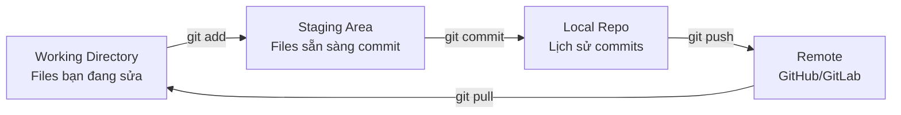

# 🌿 Git Workflow cho AI Engineering

> **Mục tiêu**: Git workflow chuẩn cho ML projects — branching, conflict resolution, hooks, LFS, DVC integration.
> Git là kỹ năng **bắt buộc** — mọi công ty đều dùng, mọi cuộc phỏng vấn đều hỏi.

---

## 1. Git Mental Model



> **💡 Key insight**: Git track **changes** (diffs), không phải files. Mỗi commit = snapshot toàn bộ project tại thời điểm đó.

---

## 2. Workflow Cơ Bản

```bash
# Clone repository
git clone <repo_url>
cd project

# Tạo feature branch (KHÔNG bao giờ code trực tiếp trên main!)
git checkout -b feat/add-data-pipeline

# Xem trạng thái
git status              # Files changed, staged, untracked
git diff                # Xem changes chưa stage
git diff --staged       # Xem changes đã stage

# Stage + Commit (Conventional Commits format)
git add src/pipeline.py
git commit -m "feat(pipeline): add data ingestion module"

# Push và tạo PR
git push -u origin feat/add-data-pipeline
```

### Essential Commands

```bash
# Xem lịch sử đẹp
git log --oneline --graph --all -15

# Stash (lưu tạm changes khi cần switch branch)
git stash push -m "WIP: experiment results"
git stash list                    # Xem danh sách stashes
git stash pop                     # Apply và xóa stash gần nhất
git stash apply stash@{1}        # Apply stash cụ thể (không xóa)

# Cherry-pick (apply 1 commit cụ thể từ branch khác)
git cherry-pick abc1234

# Amend last commit (sửa commit gần nhất)
git commit --amend -m "fix(model): correct loss calculation"

# Undo last commit (giữ changes trong working directory)
git reset --soft HEAD~1

# Xem ai sửa dòng nào
git blame src/model.py

# Tìm commit gây bug
git bisect start
git bisect bad          # Current commit is bad
git bisect good abc123  # This old commit was good
# Git sẽ binary search tìm commit gây bug!
```

---

## 3. Branching Strategies

### GitHub Flow (Recommended cho AI projects nhỏ-vừa)

```
main ──────────────────────────────────────→ (always deployable)
  │                                    │
  └── feat/add-rag-pipeline ──PR──────→  (feature branch)
  │                                    │
  └── fix/embedding-dimension ──PR───→   (bugfix branch)
```

- `main`: Luôn deployable, protected branch
- Feature branches: Tạo từ `main`, merge qua Pull Request
- **Simple, phù hợp cho team nhỏ và solo projects**

### Git Flow (Cho projects lớn, production releases)

```
main ────────────────────tag v1.0───────tag v2.0──→
  │                          ↑                 ↑
develop ─────────────────────┴────────────────┴──→
  │        │                          │
  └ feat/  └ release/1.0 ──(test)───→│
                                      │
  └ hotfix/critical-bug ──────────────→ (merge to main AND develop)
```

### Trunk-Based (Cho CI/CD nhanh, team lớn)

```
main ──A──B──C──D──E──F──G──→ (short-lived branches, merge often)
  │    ↑   ↑       ↑
  └─f1─┘   └──f2───┘     (branches live < 1 day)
```

---

## 4. Merge vs Rebase — QUAN TRỌNG!

```bash
# ── MERGE: giữ lịch sử, tạo merge commit ──
git checkout main
git merge feat/my-feature
# Lịch sử: A──B──C──M (merge commit)
#               └──D──┘

# ── REBASE: viết lại lịch sử, linear ──
git checkout feat/my-feature
git rebase main
# Lịch sử: A──B──C──D' (D' = D replayed on top of C)

# ── Interactive Rebase: sửa lịch sử trước khi push ──
git rebase -i HEAD~3    # Sửa 3 commits gần nhất
# pick   abc123 feat: add model
# squash def456 fix: typo           ← gộp vào commit trước
# reword ghi789 docs: update readme  ← sửa message
```

> **⚠️ GOLDEN RULE**: **Không bao giờ rebase branch đã push và có người khác dùng!**
> 
> Rule of thumb:
> - **Rebase**: local branches, trước khi push, cleanup history
> - **Merge**: shared branches, PR merges, giữ context

### Conflict Resolution

```bash
# Khi merge/rebase gặp conflict:
git merge feat/my-feature
# CONFLICT in src/model.py

# Step 1: Mở file, tìm conflict markers
<<<<<<< HEAD
loss = focal_loss(pred, target)     # Your change (current branch)
=======
loss = dice_loss(pred, target)      # Their change (incoming branch)
>>>>>>> feat/my-feature

# Step 2: Chọn/sửa code đúng — xóa conflict markers
loss = focal_loss(pred, target) + dice_loss(pred, target)  # Combined!

# Step 3: Stage and continue
git add src/model.py
git merge --continue        # Or: git rebase --continue

# Abort nếu muốn hủy
git merge --abort           # Or: git rebase --abort
```

---

## 5. Conventional Commits

```
<type>(<scope>): <description>

[optional body]
[optional footer: BREAKING CHANGE, Closes #123]
```

### Types cho ML/AI Projects

| Type | Khi nào dùng | Ví dụ |
|------|-------------|-------|
| `feat` | Feature mới | `feat(api): add /predict endpoint` |
| `fix` | Bug fix | `fix(training): correct learning rate schedule` |
| `docs` | Documentation | `docs(readme): add setup instructions` |
| `refactor` | Refactor (không đổi behavior) | `refactor(model): simplify forward pass` |
| `test` | Tests | `test(pipeline): add unit tests for preprocessing` |
| `ci` | CI/CD | `ci(github): add model evaluation workflow` |
| `experiment` | ML experiments | `experiment(bert): try larger batch size=64` |
| `model` | Model architecture changes | `model(v2): switch to SegFormer-B5` |
| `data` | Data changes | `data(train): add seq7 to training set` |
| `perf` | Performance improvement | `perf(inference): add ONNX export, 3x speedup` |

```bash
# Commit message tốt
git commit -m "feat(rag): add hybrid BM25+vector search

Implements reciprocal rank fusion (RRF) to combine BM25 keyword 
search with dense vector retrieval. Alpha parameter tunable.

Closes #42"

# Commit message TỆ
git commit -m "update code"         # ❌ Không rõ thay đổi gì
git commit -m "fix bug"             # ❌ Bug gì? Ở đâu?
git commit -m "WIP"                 # ❌ Work in progress không nên commit
```

---

## 6. Git Hooks — Automation

```bash
# Pre-commit hooks: chạy TỰ ĐỘNG trước mỗi commit
pip install pre-commit

# .pre-commit-config.yaml
repos:
  - repo: https://github.com/pre-commit/pre-commit-hooks
    rev: v4.5.0
    hooks:
      - id: trailing-whitespace      # Xóa whitespace thừa
      - id: end-of-file-fixer        # Đảm bảo newline cuối file
      - id: check-yaml               # Validate YAML
      - id: check-json               # Validate JSON
      - id: check-added-large-files  # Chặn large files (>500KB)
        args: ['--maxkb=500']

  - repo: https://github.com/psf/black
    rev: 24.1.0
    hooks:
      - id: black                    # Auto-format Python code

  - repo: https://github.com/astral-sh/ruff-pre-commit
    rev: v0.2.0
    hooks:
      - id: ruff                     # Fast Python linter
        args: [--fix]

# Install hooks
pre-commit install

# Bây giờ mỗi khi `git commit`:
# 1. Check whitespace ✅
# 2. Format code (black) ✅
# 3. Lint (ruff) ✅
# 4. Block large files ✅
# Nếu fail → commit bị chặn → fix → commit lại
```

---

## 7. Large Files — Git LFS & DVC

### Git LFS (Large File Storage)

```bash
# Cho files lớn nhưng KHÔNG phải data/model weights
git lfs install
git lfs track "*.pth"           # Track PyTorch checkpoints
git lfs track "*.onnx"          # Track ONNX models
cat .gitattributes              # Xem tracked patterns

# Workflow bình thường — LFS transparent
git add model.pth
git commit -m "model: add trained checkpoint"
git push                        # File stored on LFS server, not git repo
```

### DVC (Data Version Control) — Cho ML Data

```bash
# DVC = "Git for data" — track data files + model weights
dvc init
dvc remote add -d storage s3://my-bucket/dvc-store

# Track large dataset
dvc add data/training_images/    # Creates data/training_images.dvc
git add data/training_images.dvc .gitignore
git commit -m "data: add training images (DVC tracked)"

# Push data to remote storage (S3, GCS, etc.)
dvc push

# Teammate pulls:
git pull
dvc pull                         # Download data from remote
```

---

## 8. .gitignore cho ML Projects

```gitignore
# ── Python ──
__pycache__/
*.pyc
*.pyo
.pytest_cache/
*.egg-info/

# ── Virtual environments ──
venv/
.venv/
env/

# ── IDE ──
.vscode/
.idea/
*.code-workspace

# ── ML artifacts (use DVC instead) ──
*.pth
*.pt
*.onnx
*.h5
*.pkl
*.safetensors
checkpoints/
outputs/
runs/

# ── Data (use DVC to track) ──
data/raw/
data/processed/
*.csv
*.parquet
*.tfrecord

# ── Experiment tracking ──
wandb/
mlruns/
lightning_logs/

# ── Secrets (NEVER commit!) ──
.env
.env.local
*.key
secrets/

# ── OS ──
.DS_Store
Thumbs.db
```

---

## 🎯 Interview Tips — Chi Tiết

### Q1: "Merge vs Rebase?"
**A**: Merge tạo merge commit, giữ nguyên lịch sử → safe cho shared branches. Rebase rewrite commits thành linear → clean history. **Rule: rebase local, merge shared**. Không bao giờ rebase branch đã push mà người khác đang dùng.

### Q2: "Git trong ML project có gì khác?"
**A**: (1) Data versioning với DVC (data quá lớn cho git), (2) Model weights với LFS/DVC, (3) Experiment branches (`experiment/bert-lr-1e-4`), (4) Reproducibility cần pin exact versions (data + code + config).

### Q3: "Conventional Commits tại sao quan trọng?"
**A**: (1) Auto-generate changelog from commits, (2) Semantic versioning (`feat` → minor, `fix` → patch, BREAKING → major), (3) CI/CD triggers (only deploy on `feat`/`fix`), (4) Dễ review và bisect khi tìm bugs.

### Q4: "Interactive rebase dùng khi nào?"
**A**: Trước khi tạo PR — cleanup local commits: squash WIP commits, reword unclear messages, reorder, drop. Kết quả: PR clean, dễ review. **Chỉ dùng cho local commits chưa push!**

### Q5: "Conflict resolution strategy?"
**A**: (1) Pull/rebase thường xuyên để giảm conflicts, (2) Mở file, hiểu CẢ HAI changes, (3) Chọn/merge manually, (4) Test sau resolve, (5) Dùng tools: VS Code merge editor, `git mergetool`.

### Q6: "Pre-commit hooks?"
**A**: Scripts chạy tự động trước commit: format code (black), lint (ruff), check secrets, validate configs. Chặn commit nếu fail → đảm bảo code quality. Setup: `.pre-commit-config.yaml` + `pre-commit install`.
