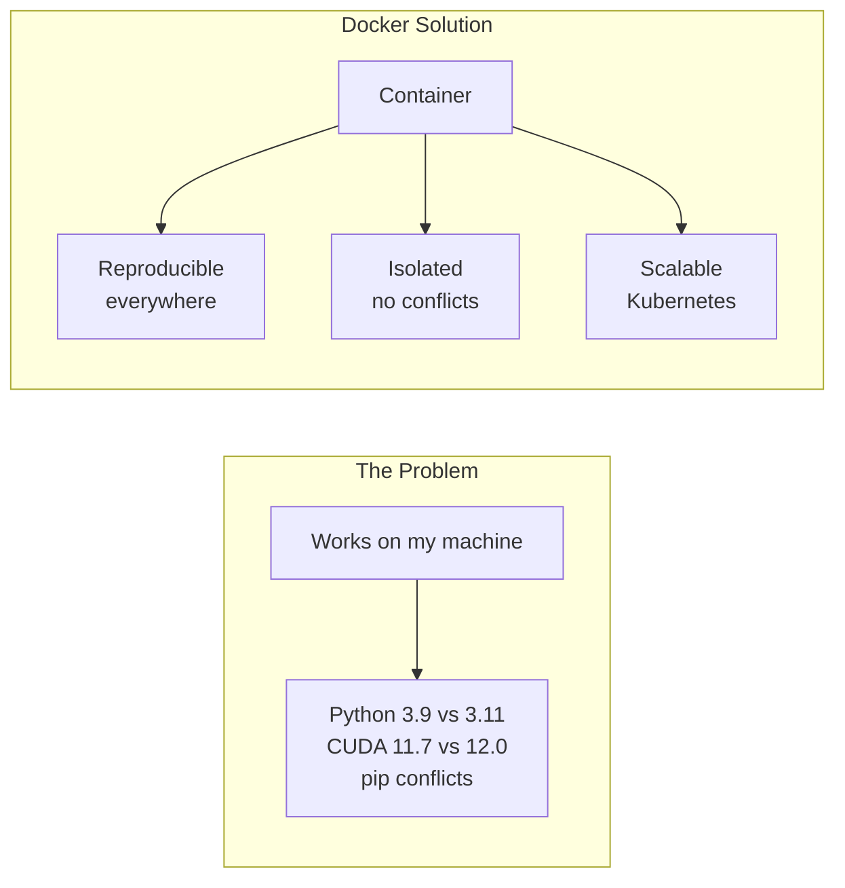
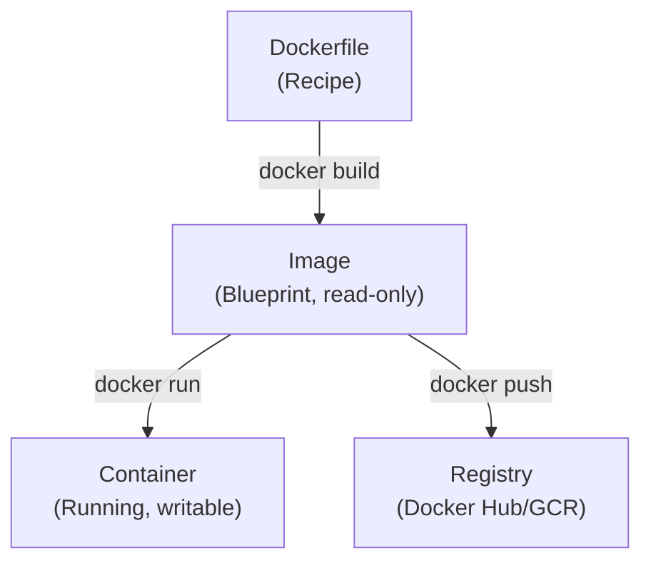

# 🐳 Docker Essentials cho AI Engineer

> **Mục tiêu**: Containerize ML models, tạo reproducible environments, deploy production-ready.
> Docker = **kỹ năng phỏng vấn bắt buộc** — hầu hết AI systems đều containerized.

---

## 1. Tại Sao Cần Docker?



---

## 2. Core Concepts



### Analogy

| Concept | Tương đương |
|---------|------------|
| **Dockerfile** | Recipe (công thức nấu ăn) |
| **Image** | Class (trong OOP) |
| **Container** | Object (instance of class) |
| **Registry** | Package repository (like PyPI) |

---

## 3. Dockerfile — Từ Cơ Bản Đến Production

### 3.1 Dockerfile Cơ Bản

```dockerfile
# Base image — LUÔN dùng version cụ thể, KHÔNG dùng :latest!
FROM python:3.11-slim

# Set working directory
WORKDIR /app

# Copy requirements TRƯỚC (tận dụng layer caching!)
# → Nếu requirements.txt không đổi → pip install được cache
COPY requirements.txt .
RUN pip install --no-cache-dir -r requirements.txt

# Copy source code SAU (thay đổi thường xuyên nhất → layer cuối)
COPY . .

# Expose port (documentation, không thực sự open port)
EXPOSE 8000

# Command to run khi container start
CMD ["uvicorn", "main:app", "--host", "0.0.0.0", "--port", "8000"]
```

### 3.2 Multi-Stage Build — Giảm 60-70% Image Size

```dockerfile
# ════════ Stage 1: Builder ════════
FROM python:3.11-slim AS builder

WORKDIR /build
COPY requirements.txt .

# Install dependencies vào folder riêng
RUN pip install --no-cache-dir --prefix=/install -r requirements.txt

# ════════ Stage 2: Runtime (TINY!) ════════
FROM python:3.11-slim AS runtime

WORKDIR /app

# Copy CHỈ installed packages từ builder — không có pip, setuptools
COPY --from=builder /install /usr/local

# Copy CHỈ application code — không có tests, docs
COPY ./src ./src
COPY ./models ./models

# Non-root user (security best practice — container không chạy root!)
RUN useradd -m -r appuser && chown -R appuser:appuser /app
USER appuser

# Health check
HEALTHCHECK --interval=30s --timeout=5s --retries=3 \
    CMD curl -f http://localhost:8000/health || exit 1

EXPOSE 8000
CMD ["uvicorn", "src.main:app", "--host", "0.0.0.0", "--port", "8000"]
```

**Kết quả**: Builder image ~1.2GB → Runtime image ~400MB (3x nhỏ hơn!)

### 3.3 GPU Support — ML Model Serving

```dockerfile
# ════════ GPU Image cho Deep Learning ════════
FROM nvidia/cuda:12.1.0-cudnn8-runtime-ubuntu22.04

# Cài Python (không dùng python image vì cần CUDA)
RUN apt-get update && apt-get install -y \
    python3.11 python3-pip \
    && rm -rf /var/lib/apt/lists/*   # Clean cache = smaller image

WORKDIR /app
COPY requirements.txt .
RUN pip install --no-cache-dir -r requirements.txt

COPY . .

# Runtime check: is GPU available?
CMD ["python3", "-c", "import torch; print(f'CUDA: {torch.cuda.is_available()}, Device: {torch.cuda.get_device_name(0) if torch.cuda.is_available() else \"CPU\"}')" ]
```

```bash
# Chạy với GPU (cần nvidia-container-toolkit)
docker run --gpus all -p 8000:8000 my-ml-app

# Chỉ dùng 1 GPU cụ thể
docker run --gpus '"device=0"' my-ml-app
```

---

## 4. Docker Commands — Daily Use

```bash
# ── Build ──
docker build -t my-app:v1.0 .           # Build image với tag
docker build -t my-app:v1.0 -f Dockerfile.gpu .  # Custom Dockerfile

# ── Run ──
docker run -p 8000:8000 my-app:v1.0     # Map port host:container
docker run -d --name api my-app:v1.0     # Detached (background)
docker run --rm my-app:v1.0              # Remove after exit
docker run -v ./data:/app/data my-app    # Mount local folder (bind mount)
docker run --env-file .env my-app        # Load env vars from file
docker run --gpus all my-app             # GPU support

# ── Debug ──
docker exec -it <container> /bin/bash    # Shell into running container
docker logs <container> --tail 100       # Xem logs (last 100 lines)
docker logs -f <container>               # Follow logs (realtime)
docker inspect <container>               # Full container details

# ── Manage ──
docker ps                                # Running containers
docker ps -a                             # All containers (including stopped)
docker images                            # List images
docker system prune -a --volumes         # ⚠️ Clean EVERYTHING unused
docker stop $(docker ps -q)              # Stop all running containers
```

---

## 5. Docker Compose — Multi-Service Stack

```yaml
# docker-compose.yml — Full ML serving stack
services:
  api:
    build: .
    ports:
      - "8000:8000"
    environment:
      - DATABASE_URL=postgresql://user:pass@db:5432/mydb
      - REDIS_URL=redis://redis:6379
      - MODEL_PATH=/app/models/latest.pth
    depends_on:
      db:
        condition: service_healthy    # Wait for DB to be ready
      redis:
        condition: service_started
    volumes:
      - ./models:/app/models          # Model weights (persistent)
    deploy:
      resources:
        reservations:
          devices:
            - driver: nvidia
              count: 1
              capabilities: [gpu]
    healthcheck:
      test: ["CMD", "curl", "-f", "http://localhost:8000/health"]
      interval: 30s
      timeout: 5s
      retries: 3

  db:
    image: postgres:16-alpine
    environment:
      POSTGRES_USER: user
      POSTGRES_PASSWORD: pass
      POSTGRES_DB: mydb
    volumes:
      - pgdata:/var/lib/postgresql/data   # Persist DB data!
    healthcheck:
      test: ["CMD-SHELL", "pg_isready -U user"]
      interval: 10s
      timeout: 5s
      retries: 5

  redis:
    image: redis:7-alpine
    ports:
      - "6379:6379"
    volumes:
      - redis_data:/data

  # Vector DB for RAG
  chromadb:
    image: chromadb/chroma:latest
    ports:
      - "8001:8000"
    volumes:
      - chroma_data:/chroma/chroma

volumes:
  pgdata:
  redis_data:
  chroma_data:
```

```bash
# Docker Compose commands
docker compose up -d              # Start all services (detached)
docker compose down               # Stop all services
docker compose logs api -f        # Follow logs of specific service
docker compose exec api bash      # Shell into running service
docker compose build --no-cache   # Rebuild all images (fresh)
docker compose ps                 # Status of all services
```

---

## 6. Docker Networking

```
┌─────────── Docker Network (bridge) ───────────┐
│                                                 │
│  ┌─────────┐    ┌──────┐    ┌───────────┐      │
│  │   API   │───→│  DB  │    │  ChromaDB │      │
│  │:8000    │    │:5432 │    │:8000      │      │
│  └────┬────┘    └──────┘    └───────────┘      │
│       │                                         │
│  ┌────┴────┐                                   │
│  │  Redis  │                                   │
│  │:6379    │                                   │
│  └─────────┘                                   │
│                                                 │
└─────────────────────────────────────────────────┘

# Containers trong cùng network giao tiếp bằng SERVICE NAME
# api → db:5432 (không cần localhost hay IP!)
# api → redis:6379
# api → chromadb:8000
```

```bash
# Custom network
docker network create ml-network
docker run --network ml-network --name api my-api
docker run --network ml-network --name db postgres:16

# Trong code API:
# DATABASE_URL=postgresql://user:pass@db:5432/mydb  ← "db" = container name
```

---

## 7. Optimization Best Practices

### Layer Caching — Tăng Tốc Build

```dockerfile
# ❌ BAD — rebuild pip install MỖI KHI code thay đổi
COPY . .
RUN pip install -r requirements.txt

# ✅ GOOD — chỉ rebuild pip install khi requirements thay đổi
COPY requirements.txt .
RUN pip install --no-cache-dir -r requirements.txt
COPY . .

# ✅ BETTER — separate stable vs changing deps
COPY requirements-base.txt .
RUN pip install --no-cache-dir -r requirements-base.txt   # Stable deps
COPY requirements-dev.txt .
RUN pip install --no-cache-dir -r requirements-dev.txt    # Changing deps
COPY . .
```

### .dockerignore — Giảm Build Context

```
# .dockerignore (giống .gitignore)
__pycache__/
*.pyc
.git/
.env
.env.local
venv/
data/raw/
*.pth
*.onnx
wandb/
mlruns/
.pytest_cache/
*.md
tests/
docs/
notebooks/
```

### Size Optimization Checklist

```
✅ Multi-stage build (bắt buộc)
✅ slim/alpine base images (python:3.11-slim, NOT python:3.11)
✅ --no-cache-dir cho pip install
✅ Combine RUN commands (mỗi RUN = 1 layer)
✅ Clean apt cache: rm -rf /var/lib/apt/lists/*
✅ .dockerignore exclude tests, docs, data
✅ Non-root user (security + best practice)
❌ KHÔNG install dev tools trong production image
❌ KHÔNG dùng :latest tag
```

---

## 8. Health Checks & Monitoring

```dockerfile
# In Dockerfile:
HEALTHCHECK --interval=30s --timeout=5s --start-period=10s --retries=3 \
    CMD curl -f http://localhost:8000/health || exit 1

# Trong FastAPI:
@app.get("/health")
async def health():
    return {
        "status": "healthy",
        "model_loaded": model is not None,
        "gpu_available": torch.cuda.is_available(),
        "version": "1.0.0"
    }

# Kubernetes dùng health check:
# Liveness:  restart container nếu unhealthy
# Readiness: chỉ route traffic khi ready (model loaded xong)
```

---

## 🎯 Interview Tips — Chi Tiết

### Q1: "Image vs Container?"
**A**: Image = blueprint (read-only, nhiều layers). Container = running instance (writable layer on top). Tương tự Class vs Object trong OOP. Từ 1 image tạo nhiều containers.

### Q2: "Multi-stage build là gì? Tại sao cần?"
**A**: Dùng nhiều FROM stages. Stage 1 (builder): install deps, compile. Stage 2 (runtime): copy chỉ artifacts cần thiết → giảm 60-70% size, giảm attack surface (no pip, no build tools in production).

### Q3: "COPY vs ADD?"
**A**: COPY: chỉ copy files (explicit). ADD: copy + extract tar + download URL. **Best practice: luôn dùng COPY** — explicit hơn, predictable hơn. Chỉ dùng ADD khi cần auto-extract tar.

### Q4: "CMD vs ENTRYPOINT?"
**A**: ENTRYPOINT = command cố định (executable). CMD = default arguments (user có thể override). Pattern: `ENTRYPOINT ["python"]` + `CMD ["app.py"]` → user có thể `docker run image test.py`.

### Q5: "Docker Compose dùng khi nào?"
**A**: Multi-container apps: API + DB + Redis + VectorDB. Define services, networks, volumes trong 1 YAML. `docker compose up` start toàn bộ stack. Thường dùng cho development + testing.

### Q6: "Volume vs Bind Mount?"
**A**: Volume: Docker quản lý, persist data, dùng cho production (DB data). Bind mount: map host folder vào container, dùng cho development (source code). Volume an toàn hơn, Bind mount flexible hơn.

### Q7: "Cách giảm Docker image size?"
**A**: (1) Multi-stage builds, (2) slim/alpine base, (3) .dockerignore, (4) --no-cache-dir, (5) Combine RUN, (6) Clean apt cache. Từ 1.2GB → 400MB typical.

### Q8: "Docker cho ML có gì đặc biệt?"
**A**: (1) GPU support via nvidia-container-toolkit, (2) Model weights mount via volumes, (3) Health checks verify model loaded, (4) Large image sizes (CUDA base ~3GB), (5) Cần pin CUDA version match with PyTorch.

### Q9: "Container security best practices?"
**A**: (1) Non-root user (`USER appuser`), (2) No secrets in Dockerfile (use env vars), (3) Pin base image versions, (4) Scan for vulnerabilities (`docker scout`), (5) Read-only filesystem where possible.
