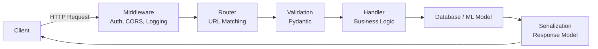

# 🚀 API Design — FastAPI cho AI Engineer

> **Mục tiêu**: Xây dựng production-ready API cho ML models — REST, auth, rate limiting, middleware, testing, deployment.
> Đây là kỹ năng **không thể thiếu** — mọi ML model production đều serve qua API.

---

## API Request Lifecycle



---

## 1. REST Principles

### HTTP Methods & Status Codes

| HTTP Method | Action | Idempotent? | Ví dụ | Status Code |
|-------------|--------|:-----------:|-------|:----------:|
| GET | Read | ✅ | `GET /models/123` | 200 |
| POST | Create | ❌ | `POST /predictions` | 201 |
| PUT | Full update | ✅ | `PUT /models/123` | 200 |
| PATCH | Partial update | ✅ | `PATCH /models/123` | 200 |
| DELETE | Remove | ✅ | `DELETE /models/123` | 204 |

> **💡 Idempotent**: Gọi nhiều lần → kết quả giống nhau. GET, PUT, DELETE = idempotent. POST = không (mỗi lần tạo mới).

### URL Design Best Practices

```
✅ /api/v1/models                    # Noun-based, versioned, plural
✅ /api/v1/models/123/predictions    # Nested resources (nested = belongs to)
✅ /api/v1/models?status=active      # Filtering via query params
✅ /api/v1/predictions?page=2&limit=20  # Pagination
❌ /api/v1/getModel                  # Verb-based (anti-pattern)
❌ /api/predict                      # No versioning
❌ /api/v1/model                     # Singular (should be plural)
```

### Status Codes Cần Nhớ

```
2xx Success:
  200 OK              — GET, PUT, PATCH thành công
  201 Created          — POST tạo mới thành công
  204 No Content       — DELETE thành công

4xx Client Error:
  400 Bad Request      — Invalid input (validation fail)
  401 Unauthorized     — Chưa authenticate (no token)
  403 Forbidden        — Authenticated nhưng không có quyền
  404 Not Found        — Resource không tồn tại
  409 Conflict         — Duplicate resource
  422 Unprocessable    — Validation error (FastAPI default)
  429 Too Many Requests — Rate limit exceeded

5xx Server Error:
  500 Internal Server  — Server error (bug in code)
  502 Bad Gateway      — Upstream service down
  503 Service Unavail  — Server overloaded
  504 Gateway Timeout  — Upstream timeout
```

---

## 2. FastAPI Deep Dive

### 2.1 Complete API Structure

```python
from fastapi import FastAPI, HTTPException, Depends, Query, Path, Header
from fastapi.middleware.cors import CORSMiddleware
from pydantic import BaseModel, Field, field_validator
from typing import Optional
from contextlib import asynccontextmanager
import uvicorn

# ═══ Lifespan: load model 1 lần khi startup ═══
ml_models = {}

@asynccontextmanager
async def lifespan(app: FastAPI):
    """Load model khi server start, cleanup khi shutdown."""
    # Startup
    print("🚀 Loading ML model...")
    ml_models["sentiment"] = {"name": "bert-base", "version": "2.1"}
    # Trong thực tế: ml_models["sentiment"] = torch.load("model.pth")
    yield
    # Shutdown — cleanup resources
    ml_models.clear()
    print("🛑 Server shutdown, models unloaded")

app = FastAPI(
    title="ML Prediction API",
    version="2.0.0",
    description="Production AI model serving with auth and rate limiting",
    lifespan=lifespan,
)

# ═══ CORS Middleware ═══
# Cho phép frontend (React) gọi API từ domain khác
app.add_middleware(
    CORSMiddleware,
    allow_origins=["http://localhost:3000", "https://myapp.com"],
    allow_credentials=True,
    allow_methods=["*"],
    allow_headers=["*"],
)
```

### 2.2 Pydantic Models — Input/Output Validation

```python
class PredictionRequest(BaseModel):
    """Request model — validate input AUTOMATICALLY."""
    text: str = Field(
        ...,                  # ... = required
        min_length=1,
        max_length=10000,
        description="Input text for prediction"
    )
    temperature: float = Field(
        default=0.7,
        ge=0.0,               # Greater or equal
        le=2.0,               # Less or equal
        description="Sampling temperature (0=deterministic, 2=creative)"
    )
    max_tokens: int = Field(default=512, ge=1, le=4096)
    
    @field_validator('text')
    @classmethod
    def text_not_empty(cls, v: str) -> str:
        """Custom validation: text không được chỉ có whitespace."""
        if not v.strip():
            raise ValueError("Text cannot be empty or whitespace only")
        return v.strip()
    
    model_config = {
        "json_schema_extra": {
            "examples": [{
                "text": "This product is amazing!",
                "temperature": 0.7,
                "max_tokens": 256
            }]
        }
    }

class PredictionResponse(BaseModel):
    """Response model — type-safe output."""
    prediction: str
    confidence: float = Field(ge=0, le=1)
    model_version: str
    tokens_used: int
    processing_time_ms: float

class ErrorResponse(BaseModel):
    """Standard error format."""
    error: str
    message: str
    detail: Optional[str] = None
```

### 2.3 Endpoints với Dependency Injection

```python
# ═══ Dependency: inject dependencies vào endpoints ═══
def get_model(model_name: str = "sentiment"):
    """Dependency — provide model instance."""
    model = ml_models.get(model_name)
    if not model:
        raise HTTPException(status_code=503, detail=f"Model '{model_name}' not loaded")
    return model

# ═══ Health Check — Kubernetes liveness/readiness ═══
@app.get("/health", tags=["System"])
async def health_check():
    return {
        "status": "healthy",
        "models_loaded": list(ml_models.keys()),
        "version": "2.0.0"
    }

# ═══ Prediction Endpoint ═══
@app.post(
    "/api/v1/predict",
    response_model=PredictionResponse,
    tags=["Predictions"],
    summary="Generate prediction from ML model",
    responses={
        422: {"model": ErrorResponse, "description": "Validation Error"},
        503: {"model": ErrorResponse, "description": "Model Not Loaded"},
    }
)
async def predict(
    request: PredictionRequest,
    model: dict = Depends(get_model),
    x_request_id: Optional[str] = Header(None),  # Track requests
):
    """Generate prediction. Validates input automatically via Pydantic."""
    import time
    start = time.perf_counter()
    
    # Simulate prediction
    prediction = f"Positive" if "amazing" in request.text.lower() else "Neutral"
    
    elapsed = (time.perf_counter() - start) * 1000
    return PredictionResponse(
        prediction=prediction,
        confidence=0.95,
        model_version=model["version"],
        tokens_used=len(request.text.split()),
        processing_time_ms=round(elapsed, 2)
    )

# ═══ List with Pagination ═══
@app.get("/api/v1/predictions", tags=["Predictions"])
async def list_predictions(
    page: int = Query(default=1, ge=1, description="Page number"),
    limit: int = Query(default=20, ge=1, le=100, description="Items per page"),
    model: Optional[str] = Query(None, description="Filter by model name"),
):
    """List predictions with cursor-based pagination."""
    # In production: query database
    offset = (page - 1) * limit
    return {
        "data": [{"id": i, "prediction": "positive"} for i in range(offset, offset + limit)],
        "pagination": {
            "page": page,
            "limit": limit,
            "total": 1000,
            "total_pages": 1000 // limit,
        }
    }

# ═══ Path Parameters ═══
@app.get("/api/v1/predictions/{prediction_id}", tags=["Predictions"])
async def get_prediction(
    prediction_id: int = Path(..., ge=1, description="Prediction ID")
):
    """Get single prediction by ID."""
    # In production: query database
    return {"id": prediction_id, "prediction": "positive", "confidence": 0.95}
```

---

## 3. Authentication — JWT + API Keys

### 3.1 JWT Authentication

```python
from datetime import datetime, timedelta
from jose import JWTError, jwt
from fastapi import Depends, HTTPException, status
from fastapi.security import HTTPBearer, HTTPAuthorizationCredentials

SECRET_KEY = "your-secret-key"  # ⚠️ Production: load from env!
ALGORITHM = "HS256"
ACCESS_TOKEN_EXPIRE_MINUTES = 30

security = HTTPBearer()

def create_access_token(data: dict, expires_delta: timedelta = None) -> str:
    """Tạo JWT token."""
    to_encode = data.copy()
    expire = datetime.utcnow() + (expires_delta or timedelta(minutes=ACCESS_TOKEN_EXPIRE_MINUTES))
    to_encode.update({"exp": expire, "iat": datetime.utcnow()})
    return jwt.encode(to_encode, SECRET_KEY, algorithm=ALGORITHM)

async def get_current_user(
    credentials: HTTPAuthorizationCredentials = Depends(security)
) -> dict:
    """Dependency — verify JWT, return user info."""
    try:
        payload = jwt.decode(
            credentials.credentials, SECRET_KEY, algorithms=[ALGORITHM]
        )
        user_id = payload.get("sub")
        if user_id is None:
            raise HTTPException(status_code=401, detail="Invalid token: missing 'sub'")
        return {"user_id": user_id, "role": payload.get("role", "user")}
    except JWTError as e:
        raise HTTPException(status_code=401, detail=f"Token error: {str(e)}")

# ═══ Protected Endpoints ═══
@app.post("/api/v1/predict/premium")
async def premium_predict(
    request: PredictionRequest,
    user: dict = Depends(get_current_user),  # ← JWT required!
):
    return {"user": user["user_id"], "prediction": "premium result"}

# ═══ Role-Based Access Control ═══
def require_admin(user: dict = Depends(get_current_user)):
    if user.get("role") != "admin":
        raise HTTPException(status_code=403, detail="Admin access required")
    return user

@app.delete("/api/v1/models/{model_id}")
async def delete_model(model_id: int, admin: dict = Depends(require_admin)):
    return {"message": f"Model {model_id} deleted by admin {admin['user_id']}"}
```

### 3.2 API Key Authentication

```python
from fastapi.security import APIKeyHeader

API_KEY_HEADER = APIKeyHeader(name="X-API-Key")
VALID_API_KEYS = {"sk-abc123": "user1", "sk-def456": "user2"}

async def verify_api_key(api_key: str = Depends(API_KEY_HEADER)) -> str:
    if api_key not in VALID_API_KEYS:
        raise HTTPException(status_code=401, detail="Invalid API key")
    return VALID_API_KEYS[api_key]

@app.post("/api/v1/embeddings")
async def create_embeddings(
    text: str,
    user: str = Depends(verify_api_key),  # API key required
):
    return {"user": user, "embedding": [0.1, 0.2, 0.3]}
```

---

## 4. Middleware & Error Handling

### Request Logging Middleware

```python
import time
import logging
from starlette.middleware.base import BaseHTTPMiddleware

logger = logging.getLogger("api")

class LoggingMiddleware(BaseHTTPMiddleware):
    async def dispatch(self, request, call_next):
        start = time.perf_counter()
        response = await call_next(request)
        elapsed = (time.perf_counter() - start) * 1000
        
        logger.info(
            f"{request.method} {request.url.path} "
            f"→ {response.status_code} ({elapsed:.1f}ms)"
        )
        response.headers["X-Process-Time"] = f"{elapsed:.1f}ms"
        return response

app.add_middleware(LoggingMiddleware)
```

### Global Error Handling

```python
from fastapi import Request
from fastapi.responses import JSONResponse

@app.exception_handler(HTTPException)
async def http_exception_handler(request: Request, exc: HTTPException):
    return JSONResponse(
        status_code=exc.status_code,
        content={
            "error": exc.detail,
            "status_code": exc.status_code,
            "path": str(request.url.path),
        }
    )

@app.exception_handler(Exception)
async def global_exception_handler(request: Request, exc: Exception):
    """Catch-all: KHÔNG leak internal errors ra client."""
    logger.error(f"Unhandled error: {exc}", exc_info=True)
    return JSONResponse(
        status_code=500,
        content={
            "error": "InternalServerError",
            "message": "An unexpected error occurred",
            # ❌ KHÔNG trả str(exc) ra client → security risk
        }
    )
```

---

## 5. Rate Limiting

```python
from slowapi import Limiter, _rate_limit_exceeded_handler
from slowapi.util import get_remote_address
from slowapi.errors import RateLimitExceeded

limiter = Limiter(key_func=get_remote_address)
app.state.limiter = limiter
app.add_exception_handler(RateLimitExceeded, _rate_limit_exceeded_handler)

@app.post("/api/v1/predict")
@limiter.limit("30/minute")      # 30 requests per minute per IP
async def predict(request: PredictionRequest):
    ...

@app.post("/api/v1/predict/premium")
@limiter.limit("100/minute")     # Premium users get higher limits
async def premium_predict(request: PredictionRequest):
    ...
```

---

## 6. Testing APIs

```python
# test_api.py
from fastapi.testclient import TestClient
from main import app

client = TestClient(app)

def test_health():
    response = client.get("/health")
    assert response.status_code == 200
    assert response.json()["status"] == "healthy"

def test_predict_success():
    response = client.post("/api/v1/predict", json={
        "text": "This is amazing!",
        "temperature": 0.5
    })
    assert response.status_code == 200
    data = response.json()
    assert "prediction" in data
    assert 0 <= data["confidence"] <= 1

def test_predict_validation_error():
    response = client.post("/api/v1/predict", json={
        "text": "",              # Empty! Should fail validation
        "temperature": 5.0       # > 2.0! Should fail
    })
    assert response.status_code == 422

def test_predict_unauthorized():
    response = client.post(
        "/api/v1/predict/premium",
        json={"text": "test"},
        # No Authorization header!
    )
    assert response.status_code == 403  # or 401

# Run: pytest test_api.py -v
```

---

## 7. Production Deployment

```bash
# Development
uvicorn main:app --reload --port 8000

# Production — Gunicorn + Uvicorn workers (Linux/Docker only)
gunicorn main:app \
    --workers 4 \                          # CPU cores * 2 + 1
    --worker-class uvicorn.workers.UvicornWorker \
    --bind 0.0.0.0:8000 \
    --timeout 120 \                        # Increase for ML inference
    --access-logfile - \                   # Stdout logging
    --error-logfile -

# Docker
# Xem file 04_docker_essentials.md
```

---

## 🎯 Interview Tips — Chi Tiết

### Q1: "FastAPI vs Flask?"
**A**: FastAPI: async native (high throughput), auto-docs (Swagger UI at /docs), Pydantic validation (type safety at runtime), based on Starlette (high performance). Flask: simpler, larger ecosystem, blocking I/O by default.

### Q2: "JWT vs Session-based auth?"
**A**: JWT: stateless (no server storage), scalable (any server can verify), includes claims (role, exp). Session: server stores session data, easier revocation, smaller payload. **JWT cho microservices/APIs, Session cho traditional web apps.**

### Q3: "REST vs GraphQL cho ML API?"
**A**: REST: simple, cacheable, predictable, HTTP methods. GraphQL: flexible queries (client decides fields), single endpoint, complex. **ML serving = REST** (simple request→response). GraphQL cho complex data apps (dashboards).

### Q4: "Dependency Injection trong FastAPI?"
**A**: `Depends()` — inject shared resources (DB connections, ML models, auth). Benefits: testable (mock deps), reusable, composable (deps can depend on other deps).

### Q5: "CORS là gì? Tại sao cần?"
**A**: Cross-Origin Resource Sharing. Browser blocks requests from different domain by default (security). API server must explicitly allow origins. Cần khi frontend (localhost:3000) gọi API (localhost:8000).

### Q6: "API versioning approach?"
**A**: (1) URL: `/api/v1/...` (most common), (2) Header: `Accept: application/vnd.api.v1+json`, (3) Query: `?version=1`. **URL versioning = recommended** — explicit, easy to cache, easy to route.
