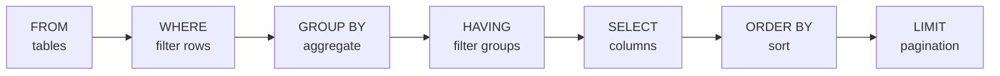

# 🗃️ SQL Essentials cho AI Engineer

> **Mục tiêu**: Nắm SQL nâng cao — Joins, Window Functions, CTEs, Optimization, Transactions, JSONB.
> AI Engineer thường xuyên viết SQL để: EDA, tạo features, monitor models, query vector DBs.

---

## SQL Query Execution Order



> **Key insight**: Thứ tự thực thi ≠ thứ tự viết! WHERE chạy trước SELECT.

---

## 1. SELECT — Foundation

```sql
-- Thứ tự thực thi (KHÔNG giống thứ tự viết!):
-- FROM → WHERE → GROUP BY → HAVING → SELECT → ORDER BY → LIMIT

-- Thứ tự VIẾT:
SELECT columns
FROM table
WHERE condition          -- Filter rows TRƯỚC grouping
GROUP BY columns         -- Aggregate
HAVING condition         -- Filter AFTER grouping
ORDER BY columns         -- Sort
LIMIT n OFFSET m;        -- Pagination
```

---

## 2. Joins — Kết Nối Bảng

```sql
-- ═══ INNER JOIN: chỉ rows match CẢ 2 bảng ═══
SELECT u.name, o.total
FROM users u
INNER JOIN orders o ON u.id = o.user_id;
-- Users KHÔNG có orders → bị loại
-- Orders KHÔNG có users → bị loại

-- ═══ LEFT JOIN: TẤT CẢ rows bảng trái + match bảng phải ═══
SELECT u.name, COALESCE(o.total, 0) AS total
FROM users u
LEFT JOIN orders o ON u.id = o.user_id;
-- Users KHÔNG có orders → total = NULL → COALESCE → 0
-- Useful: "tìm tất cả users, kể cả chưa mua hàng"

-- ═══ RIGHT JOIN: ngược LEFT JOIN (ít dùng) ═══
-- ═══ FULL OUTER JOIN: tất cả rows cả 2 bảng ═══

-- ═══ CROSS JOIN: mọi combination (Cartesian product) ═══
SELECT m.name, h.value
FROM models m
CROSS JOIN hyperparameters h;
-- 3 models × 5 hyperparams = 15 rows → experiment grid

-- ═══ Self-JOIN: join với chính bảng đó ═══
-- Tìm employees có salary > manager
SELECT e.name AS employee, m.name AS manager,
       e.salary AS emp_salary, m.salary AS mgr_salary
FROM employees e
JOIN employees m ON e.manager_id = m.id
WHERE e.salary > m.salary;
```

### Visual Guide

```
INNER JOIN:        LEFT JOIN:         FULL OUTER JOIN:
  ┌───┬───┐          ┌───┬───┐          ┌───┬───┐
  │ A │ B │          │ A │ B │          │ A │ B │
  │   │███│          │███│███│          │███│███│
  │   │███│          │███│███│          │███│███│
  └───┴───┘          │███│   │          │███│███│
   Only match        All A +           All A +
                     matching B         All B
```

---

## 3. Window Functions — QUAN TRỌNG!

```sql
-- Window function = tính toán trên "window" mà GIỮ NGUYÊN số rows
-- Khác GROUP BY: GROUP BY giảm rows, Window function giữ nguyên

-- ═══ ROW_NUMBER: đánh số thứ tự trong mỗi partition ═══
SELECT 
    name, department, salary,
    ROW_NUMBER() OVER(PARTITION BY department ORDER BY salary DESC) AS rank
FROM employees;
-- "Rank nhân viên theo lương trong TỪNG phòng ban"

-- ═══ RANK vs DENSE_RANK vs ROW_NUMBER ═══
-- salary: 100, 100, 90
-- ROW_NUMBER: 1, 2, 3        (unique, arbitrary order for ties)
-- RANK:       1, 1, 3        (skip rank after ties)
-- DENSE_RANK: 1, 1, 2        (no skip after ties)

-- ═══ LAG / LEAD: so sánh với row trước/sau ═══
SELECT 
    date,
    revenue,
    LAG(revenue, 1) OVER(ORDER BY date) AS prev_day_revenue,
    revenue - LAG(revenue) OVER(ORDER BY date) AS daily_growth,
    ROUND(
        (revenue - LAG(revenue) OVER(ORDER BY date)) / 
        LAG(revenue) OVER(ORDER BY date) * 100, 2
    ) AS growth_pct
FROM daily_metrics;
-- "So sánh doanh thu hôm nay vs hôm qua"

-- ═══ Running Total ═══
SELECT 
    date, amount,
    SUM(amount) OVER(ORDER BY date ROWS UNBOUNDED PRECEDING) AS running_total
FROM transactions;
-- "Tổng tích lũy từ đầu đến hiện tại"

-- ═══ Moving Average (7 ngày) ═══
SELECT
    date, accuracy,
    AVG(accuracy) OVER(
        ORDER BY date 
        ROWS BETWEEN 6 PRECEDING AND CURRENT ROW
    ) AS ma_7d
FROM model_metrics;
-- "Average accuracy 7 ngày gần nhất — smoothing noise"

-- ═══ FIRST_VALUE / LAST_VALUE ═══
SELECT
    model_version, accuracy,
    FIRST_VALUE(accuracy) OVER(ORDER BY deploy_date) AS baseline_accuracy,
    accuracy - FIRST_VALUE(accuracy) OVER(ORDER BY deploy_date) AS improvement
FROM model_versions;
-- "So sánh mỗi version với baseline đầu tiên"

-- ═══ NTILE: chia thành N buckets ═══
SELECT
    name, score,
    NTILE(4) OVER(ORDER BY score DESC) AS quartile
FROM students;
-- quartile = 1 → top 25%, quartile = 4 → bottom 25%
```

---

## 4. CTEs & Subqueries

```sql
-- ═══ CTE (Common Table Expression) ═══
-- Readable, reusable, named "temporary view"
WITH monthly_revenue AS (
    SELECT 
        DATE_TRUNC('month', created_at) AS month,
        SUM(amount) AS total
    FROM orders
    GROUP BY 1
),
growth AS (
    SELECT 
        month, total,
        LAG(total) OVER(ORDER BY month) AS prev_total,
        ROUND(
            (total - LAG(total) OVER(ORDER BY month))::numeric / 
            LAG(total) OVER(ORDER BY month) * 100, 2
        ) AS growth_pct
    FROM monthly_revenue
)
SELECT * FROM growth WHERE growth_pct > 10;

-- ═══ Recursive CTE ═══
-- Org chart: tìm tất cả reports (trực tiếp + gián tiếp)
WITH RECURSIVE org_tree AS (
    -- Base case: CEO (no manager)
    SELECT id, name, manager_id, 0 AS level
    FROM employees
    WHERE manager_id IS NULL
    
    UNION ALL
    
    -- Recursive: tìm reports của reports
    SELECT e.id, e.name, e.manager_id, t.level + 1
    FROM employees e
    JOIN org_tree t ON e.manager_id = t.id
)
SELECT REPEAT('  ', level) || name AS org_chart, level
FROM org_tree
ORDER BY level, name;

-- ═══ Lateral Join: subquery tham chiếu outer query ═══
-- Top 3 predictions per model
SELECT m.name, p.*
FROM models m
CROSS JOIN LATERAL (
    SELECT predicted_at, confidence
    FROM predictions
    WHERE model_id = m.id
    ORDER BY confidence DESC
    LIMIT 3
) p;
```

---

## 5. ACID & Transactions

```sql
-- ACID = Atomicity, Consistency, Isolation, Durability
-- "Một nhóm operations hoặc TẤT CẢ thành công, hoặc KHÔNG có gì xảy ra"

-- Transaction example: chuyển tiền
BEGIN;
    UPDATE accounts SET balance = balance - 100 WHERE id = 1;  -- Trừ tiền
    UPDATE accounts SET balance = balance + 100 WHERE id = 2;  -- Cộng tiền
    -- Nếu step 2 fail → step 1 cũng rollback!
COMMIT;

-- Rollback khi có lỗi
BEGIN;
    INSERT INTO predictions (model_id, result) VALUES (1, 'positive');
    -- Oops, model_id 999 doesn't exist
    INSERT INTO predictions (model_id, result) VALUES (999, 'negative');
    -- Error! → 
ROLLBACK;  -- Cả 2 inserts đều bị hủy

-- Isolation Levels (từ lỏng → chặt):
-- READ UNCOMMITTED: đọc được data chưa commit (dirty read) — ❌ ít dùng
-- READ COMMITTED:   chỉ đọc data đã commit — ✅ PostgreSQL default
-- REPEATABLE READ:  data không đổi trong cùng transaction
-- SERIALIZABLE:     strict nhất, như single-threaded — chậm nhất
```

---

## 6. Query Optimization

### EXPLAIN ANALYZE

```sql
EXPLAIN ANALYZE
SELECT * FROM predictions WHERE model_id = 5 AND score > 0.9;

-- Output:
-- Seq Scan on predictions  (cost=0.00..1234.00 rows=500 width=40)
--   Filter: (model_id = 5 AND score > 0.9)
--   Rows Removed by Filter: 99500
--   Planning Time: 0.1ms
--   Execution Time: 45.2ms
-- →→ Seq Scan = FULL TABLE SCAN = SLOW! CẦN INDEX!

-- Tạo composite index
CREATE INDEX idx_pred_model_score ON predictions(model_id, score);

-- Sau khi index:
-- Index Scan using idx_pred_model_score (cost=0.29..8.31 rows=500)
--   Index Cond: (model_id = 5 AND score > 0.9)
--   Execution Time: 0.3ms
-- →→ 150x faster!
```

### Index Types & Guidelines

```sql
-- B-tree (default): equality, range, sorting
CREATE INDEX idx_user_email ON users(email);

-- Hash: equality only (faster than B-tree for =)
CREATE INDEX idx_hash_email ON users USING hash(email);

-- GIN (Generalized Inverted Index): JSONB, arrays, full-text
CREATE INDEX idx_metadata ON predictions USING gin(metadata);

-- GiST: geometric, full-text, range types
-- BRIN: very large tables, sorted data (timestamps)
```

| Nên index | KHÔNG nên index |
|-----------|----------------|
| WHERE, JOIN, ORDER BY columns | Columns ít unique values (boolean, gender) |
| Foreign keys | Tables nhỏ (<1000 rows) |
| High-cardinality columns | Columns thường xuyên UPDATE |
| Composite: (a, b) cho WHERE a=? AND b=? | Quá nhiều indexes → slow writes |

---

## 7. JSONB — Flexible Schema

```sql
-- PostgreSQL JSONB: store semi-structured data
CREATE TABLE experiments (
    id SERIAL PRIMARY KEY,
    name TEXT NOT NULL,
    config JSONB NOT NULL,  -- Flexible config!
    metrics JSONB,
    created_at TIMESTAMPTZ DEFAULT NOW()
);

-- Insert
INSERT INTO experiments (name, config, metrics) VALUES (
    'bert-large-lr-5e-5',
    '{"model": "bert-large", "lr": 5e-5, "epochs": 10, "batch_size": 32}',
    '{"accuracy": 0.92, "f1": 0.89, "loss": 0.15}'
);

-- Query JSONB fields
SELECT name, 
       config->>'model' AS model,           -- Extract as text
       (config->>'lr')::float AS lr,         -- Extract and cast
       (metrics->>'accuracy')::float AS acc
FROM experiments
WHERE config->>'model' = 'bert-large'
  AND (metrics->>'accuracy')::float > 0.85
ORDER BY (metrics->>'accuracy')::float DESC;

-- JSONB contains: @> operator
SELECT * FROM experiments
WHERE config @> '{"model": "bert-large"}';

-- JSONB index for fast queries
CREATE INDEX idx_exp_config ON experiments USING gin(config);
```

---

## 8. Practical ML Queries

```sql
-- ═══ Model performance over time ═══
SELECT 
    model_version,
    DATE_TRUNC('day', predicted_at) AS day,
    COUNT(*) AS total_predictions,
    AVG(CASE WHEN correct THEN 1.0 ELSE 0.0 END) AS accuracy,
    PERCENTILE_CONT(0.5) WITHIN GROUP (ORDER BY confidence) AS median_conf
FROM predictions
GROUP BY model_version, day
ORDER BY day DESC;

-- ═══ Data drift detection ═══
SELECT 
    feature_name,
    PERCENTILE_CONT(0.5) WITHIN GROUP (ORDER BY value) AS median,
    AVG(value) AS mean,
    STDDEV(value) AS std,
    MIN(value) AS min_val,
    MAX(value) AS max_val
FROM feature_store
WHERE created_at >= CURRENT_DATE - INTERVAL '7 days'
GROUP BY feature_name;

-- ═══ A/B test analysis ═══
SELECT 
    experiment_group,
    COUNT(*) AS n,
    AVG(conversion) AS conv_rate,
    STDDEV(conversion) / SQRT(COUNT(*)) AS std_error
FROM ab_test_results
WHERE experiment_id = 'exp_2026_q1'
GROUP BY experiment_group;

-- ═══ Top-N per group (Lateral Join) ═══
-- Top 5 worst predictions per model (for debugging)
SELECT m.name, p.input_text, p.confidence, p.correct
FROM models m
CROSS JOIN LATERAL (
    SELECT input_text, confidence, correct
    FROM predictions
    WHERE model_id = m.id AND NOT correct
    ORDER BY confidence DESC  -- High confidence but WRONG = worst errors
    LIMIT 5
) p;
```

---

## 🎯 Interview Tips — Chi Tiết

### Q1: "INNER JOIN vs LEFT JOIN?"
**A**: INNER: chỉ rows match cả 2 bảng. LEFT: TẤT CẢ bảng trái + matching bảng phải (NULL nếu không match). Dùng LEFT khi muốn giữ all records from main table (e.g., "all users, even without orders").

### Q2: "Window Function vs GROUP BY?"
**A**: GROUP BY aggregate → 1 row per group (giảm rows). Window function tính toán trên window nhưng **GIỮ NGUYÊN** original rows. Window function dùng khi cần aggregate VÀ detail cùng lúc.

### Q3: "CTE vs Subquery?"
**A**: CTE: readable (named), reusable trong cùng query, recursive support. Subquery: inline, sometimes slightly faster (PostgreSQL materializes CTEs). **Best practice: CTE cho complex queries, subquery cho simple ones.**

### Q4: "Index hoạt động thế nào?"
**A**: B-tree index = tree structure, O(log n) lookup. Database đọc index → tìm pointers → đọc actual rows. Composite index `(a, b)` = sorted by a, then b. **Leftmost prefix rule**: index (a,b,c) works for WHERE a=?, WHERE a=? AND b=?, nhưng KHÔNG work cho WHERE b=? alone.

### Q5: "HAVING vs WHERE?"
**A**: WHERE filter **trước** GROUP BY (trên individual rows). HAVING filter **sau** GROUP BY (trên aggregated results). Example: WHERE salary > 50000 bỏ rows, HAVING AVG(salary) > 50000 bỏ groups.

### Q6: "N+1 Query Problem?"
**A**: 1 query lấy N items, rồi N queries lấy details mỗi item → N+1 total. Fix: JOIN trong SQL, hoặc `select_related`/`prefetch_related` trong ORM. **Dễ gặp khi dùng ORM (Django, SQLAlchemy).**

### Q7: "ACID là gì?"
**A**: **A**tomicity (all or nothing), **C**onsistency (valid state), **I**solation (concurrent transactions don't interfere), **D**urability (committed = permanent). Transaction là đơn vị ACID.

### Q8: "Optimize slow query?"
**A**: (1) `EXPLAIN ANALYZE` → xem execution plan, (2) Tìm Seq Scan → cần index, (3) Check index usage, (4) Avoid `SELECT *`, (5) Pagination thay LIMIT offset lớn, (6) Partitioning cho tables lớn.

### Q9: "PostgreSQL JSONB khi nào dùng?"
**A**: Semi-structured data: ML configs, experiment metadata, dynamic schemas. GIN index cho fast @> queries. **Không dùng** cho structured, queryable data (dùng proper columns). Trade-off: flexibility vs query performance.
