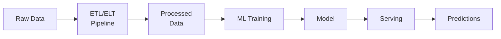

# ⚙️ Data Engineering Basics cho AI Engineer

> **Mục tiêu**: Hiểu data pipeline = "xương sống" của mọi hệ thống AI — Spark, Kafka, ETL, Data Lakehouse.
> AI Engineer cần hiểu data flow từ raw → processed → model → predictions.

---

## 1. Tại sao AI Engineer cần Data Engineering?



- **Garbage In, Garbage Out**: Model chỉ tốt bằng data đầu vào
- **Data-Centric AI** (Andrew Ng): Cải thiện data > cải thiện model
- **Scale**: Production data = triệu/tỷ rows → cần distributed processing

---

## 2. ETL vs ELT

| | ETL | ELT |
|-|-----|-----|
| **Transform** | Trước khi Load | Sau khi Load |
| **Where** | ETL engine (Spark) | In-warehouse (BigQuery, Snowflake) |
| **Best for** | On-prem, structured | Cloud, flexible, AI |
| **Raw data?** | Không giữ | Giữ nguyên raw → reprocess |
| **Tools** | Spark, Airflow | dbt, BigQuery, Snowflake |

> **💡 AI Engineer nên biết ELT**: Giữ raw data cho future retraining, A/B testing với data versions khác nhau.

### dbt (Data Build Tool)

```sql
-- models/staging/stg_predictions.sql
-- dbt model: transform raw predictions → clean table
SELECT
    id,
    model_version,
    CAST(predicted_at AS TIMESTAMP) AS predicted_at,
    confidence_score,
    CASE 
        WHEN confidence_score >= 0.9 THEN 'high'
        WHEN confidence_score >= 0.5 THEN 'medium'
        ELSE 'low'
    END AS confidence_level
FROM {{ source('raw', 'predictions') }}
WHERE confidence_score IS NOT NULL
```

---

## 3. Apache Spark & PySpark

### Architecture

```
Driver Program
    └── SparkContext
         ├── Executor 1 (Worker Node)
         │     ├── Task 1 (Partition 1)
         │     └── Task 2 (Partition 2)
         └── Executor 2 (Worker Node)
               ├── Task 3 (Partition 3)
               └── Task 4 (Partition 4)
```

### PySpark DataFrame API

```python
from pyspark.sql import SparkSession
from pyspark.sql import functions as F

# Khởi tạo Spark Session
spark = SparkSession.builder \
    .appName("ML Pipeline") \
    .master("local[*]") \
    .getOrCreate()

# Đọc data
df = spark.read.csv("data/sales.csv", header=True, inferSchema=True)

# Transformations (LAZY — chưa execute)
result = (
    df
    .filter(F.col("amount") > 0)
    .withColumn("year", F.year("date"))
    .groupBy("year", "category")
    .agg(
        F.count("*").alias("count"),
        F.avg("amount").alias("avg_amount"),
        F.sum("amount").alias("total")
    )
    .orderBy("year", "category")
)

# Action (EXECUTE!) — chỉ khi gọi action mới thực sự chạy
result.show()
```

### Spark MLlib Pipeline

```python
from pyspark.ml import Pipeline
from pyspark.ml.feature import StringIndexer, VectorAssembler, StandardScaler
from pyspark.ml.classification import RandomForestClassifier
from pyspark.ml.evaluation import MulticlassClassificationEvaluator

# 1. Feature Engineering
indexer = StringIndexer(inputCol="category", outputCol="category_idx")
assembler = VectorAssembler(
    inputCols=["feature1", "feature2", "category_idx"],
    outputCol="features"
)
scaler = StandardScaler(inputCol="features", outputCol="scaled_features")

# 2. Model
rf = RandomForestClassifier(
    featuresCol="scaled_features",
    labelCol="label",
    numTrees=100
)

# 3. Pipeline — chain tất cả steps
pipeline = Pipeline(stages=[indexer, assembler, scaler, rf])

# 4. Train
train_df, test_df = df.randomSplit([0.8, 0.2], seed=42)
model = pipeline.fit(train_df)

# 5. Evaluate
predictions = model.transform(test_df)
evaluator = MulticlassClassificationEvaluator(
    labelCol="label", metricName="accuracy"
)
print(f"Accuracy: {evaluator.evaluate(predictions):.4f}")
```

---

## 4. Apache Kafka

### Architecture

```
Producer ──→ [Topic: user_events] ──→ Consumer Group
               ├── Partition 0          ├── Consumer 1
               ├── Partition 1          └── Consumer 2
               └── Partition 2
```

### Use Cases cho AI

| Use Case | Mô tả |
|----------|-------|
| **Real-time feature serving** | Stream user events → compute features → store in feature store |
| **Model predictions** | Stream data → model inference → store results |
| **Data ingestion** | Collect events → batch load → training data |
| **Monitoring** | Stream predictions → detect drift → alert |

### Producer / Consumer Pattern

```python
# producer.py
from kafka import KafkaProducer
import json

producer = KafkaProducer(
    bootstrap_servers=['localhost:9092'],
    value_serializer=lambda v: json.dumps(v).encode('utf-8')
)

# Gửi prediction event
event = {
    "user_id": "u123",
    "model_version": "v2.1",
    "prediction": "positive",
    "confidence": 0.95,
    "timestamp": "2026-01-15T10:30:00Z"
}
producer.send("ml_predictions", value=event)
producer.flush()
```

```python
# consumer.py
from kafka import KafkaConsumer
import json

consumer = KafkaConsumer(
    'ml_predictions',
    bootstrap_servers=['localhost:9092'],
    auto_offset_reset='earliest',
    value_deserializer=lambda m: json.loads(m.decode('utf-8'))
)

for message in consumer:
    event = message.value
    # Process: store to DB, check drift, update dashboard
    print(f"Received: {event['user_id']} → {event['prediction']}")
```

---

## 5. Data Lakehouse

| Feature | Data Lake | Data Warehouse | Data Lakehouse |
|---------|-----------|----------------|----------------|
| Storage | Cheap (S3, GCS) | Expensive | Cheap (S3) + ACID |
| Schema | Schema-on-read | Schema-on-write | Both |
| Format | Parquet, JSON | Proprietary | Delta Lake, Iceberg |
| ACID | ❌ | ✅ | ✅ |
| Time Travel | ❌ | Limited | ✅ |

### Delta Lake Example

```python
# Đọc Delta Lake table
df = spark.read.format("delta").load("/data/ml_features")

# Time travel — truy cập data tại thời điểm cụ thể
df_v0 = spark.read.format("delta") \
    .option("versionAsOf", 0) \
    .load("/data/ml_features")

# Audit: xem history
from delta.tables import DeltaTable
dt = DeltaTable.forPath(spark, "/data/ml_features")
dt.history().show()
```

> **💡 ML Reproducibility**: Dùng Delta Lake time travel để reproduce exact dataset dùng cho training run cụ thể.

---

## 6. Orchestration — Apache Airflow

```python
# airflow_dags/ml_pipeline.py
from airflow import DAG
from airflow.operators.python import PythonOperator
from datetime import datetime, timedelta

default_args = {
    'owner': 'ml-team',
    'retries': 2,
    'retry_delay': timedelta(minutes=5),
}

with DAG(
    'ml_training_pipeline',
    default_args=default_args,
    schedule_interval='@daily',
    start_date=datetime(2026, 1, 1),
    catchup=False,
) as dag:
    
    def extract_data(**kwargs):
        """Extract raw data from source."""
        print("Extracting data from database...")
    
    def transform_features(**kwargs):
        """Feature engineering."""
        print("Computing features...")
    
    def train_model(**kwargs):
        """Train ML model."""
        print("Training model...")
    
    def evaluate_model(**kwargs):
        """Evaluate and register model."""
        print("Evaluating model...")
    
    # DAG: Extract → Transform → Train → Evaluate
    t1 = PythonOperator(task_id='extract', python_callable=extract_data)
    t2 = PythonOperator(task_id='transform', python_callable=transform_features)
    t3 = PythonOperator(task_id='train', python_callable=train_model)
    t4 = PythonOperator(task_id='evaluate', python_callable=evaluate_model)
    
    t1 >> t2 >> t3 >> t4  # Dependencies
```

---

## 7. Data Quality

```python
# great_expectations example
import great_expectations as gx

context = gx.get_context()

# Define expectations
validator = context.sources.pandas_default.read_csv("data/features.csv")
validator.expect_column_values_to_not_be_null("user_id")
validator.expect_column_values_to_be_between("age", min_value=0, max_value=150)
validator.expect_column_mean_to_be_between("score", min_value=0.3, max_value=0.9)

results = validator.validate()
if not results.success:
    raise ValueError("❌ Data quality check FAILED! Do NOT train model.")
```

---

## 8. Data Drift & Monitoring

### Types of Drift

```
Data Drift:     P(X) changes — input distribution shifts
                Example: more young users sign up → age distribution changes
                Detection: PSI, KL divergence, chi-squared test

Concept Drift:  P(Y|X) changes — relationship between input and output changes
                Example: COVID changed shopping → same user features, different behavior
                Detection: model performance degradation over time

Feature Drift:  Individual feature distributions change
                Detection: per-feature statistical tests
```

### Drift Detection with Evidently

```python
import pandas as pd
from evidently.report import Report
from evidently.metric_preset import DataDriftPreset, TargetDriftPreset

# Reference data (training distribution)
reference = pd.read_csv("data/train_features.csv")

# Current data (production)
current = pd.read_csv("data/prod_features_today.csv")

# ── Data Drift Report ──
report = Report(metrics=[
    DataDriftPreset(),
    TargetDriftPreset(),
])
report.run(reference_data=reference, current_data=current)
report.save_html("drift_report.html")

# Extract results programmatically
result = report.as_dict()
n_drifted = result["metrics"][0]["result"]["number_of_drifted_columns"]
drift_share = result["metrics"][0]["result"]["share_of_drifted_columns"]
print(f"Drifted columns: {n_drifted}, Share: {drift_share:.1%}")

if drift_share > 0.3:
    print("⚠️ ALERT: >30% features drifted! Consider retraining.")
```

### Population Stability Index (PSI)

```python
import numpy as np

def calculate_psi(reference: np.ndarray, current: np.ndarray, bins: int = 10) -> float:
    """
    PSI measures distribution shift between reference and current data.
    PSI < 0.1: no significant shift
    PSI 0.1-0.25: moderate shift (monitor)
    PSI > 0.25: significant shift (retrain!)
    """
    # Bin both distributions
    breakpoints = np.percentile(reference, np.linspace(0, 100, bins + 1))
    ref_counts = np.histogram(reference, bins=breakpoints)[0] / len(reference)
    cur_counts = np.histogram(current, bins=breakpoints)[0] / len(current)
    
    # Avoid division by zero
    ref_counts = np.clip(ref_counts, 1e-6, None)
    cur_counts = np.clip(cur_counts, 1e-6, None)
    
    # PSI formula
    psi = np.sum((cur_counts - ref_counts) * np.log(cur_counts / ref_counts))
    return psi

# Example
psi = calculate_psi(train_ages, production_ages)
print(f"PSI (age): {psi:.4f}")  # < 0.1 = stable
```

---

## 9. Data Versioning — DVC

```bash
# ── Setup DVC ──
pip install dvc dvc-s3        # Or dvc-gcs for Google Cloud
cd ml-project
dvc init                       # Initialize DVC in existing git repo

# ── Track large files ──
dvc add data/training_data.csv  # Creates data/training_data.csv.dvc
git add data/training_data.csv.dvc data/.gitignore
git commit -m "data: add training dataset v1"

# ── Remote storage (S3, GCS, etc.) ──
dvc remote add -d storage s3://my-bucket/dvc-store
dvc push                       # Upload data to remote

# ── Reproduce exact dataset ──
git checkout v1.0              # Checkout code version
dvc checkout                   # Checkout matching data version
# Now data matches exactly what was used for v1.0 training!

# ── Data pipeline ──
dvc run -n preprocess \
    -d src/preprocess.py -d data/raw.csv \
    -o data/processed.csv \
    python src/preprocess.py   # Track inputs, outputs, command
```

```
DVC vs Git LFS:
  Git LFS: stores large files in LFS server, integrated with Git
  DVC:     stores data anywhere (S3/GCS/local), tracks .dvc files in Git
           + pipelines, experiments tracking, metrics
  
  ML project → DVC (more features)
  Simple large files → Git LFS (simpler)
```

---

## 10. Feature Store

### Why Feature Stores?

```
Problem: Training-Serving Skew
  Training: compute features in Spark batch job (offline)
  Serving:  compute features in Python API (online)
  → Different code paths → different results → model quality degrades!

Solution: Feature Store
  ┌─────────────────────────────────────────────┐
  │              Feature Store                    │
  │                                               │
  │  Write: Spark/Flink → Feature Store          │
  │  Read (offline): Feature Store → Training     │
  │  Read (online): Feature Store → Serving       │
  │                                               │
  │  Same features, same computation, everywhere │
  └─────────────────────────────────────────────┘
```

### Online vs Offline

| | Online Store | Offline Store |
|-|-------------|---------------|
| **Latency** | <10ms | Minutes-hours |
| **Use** | Real-time serving | Training, batch scoring |
| **Storage** | Redis, DynamoDB | Parquet, BigQuery |
| **Freshness** | Up-to-date | Batch-updated |

### Feast Example

```python
from feast import FeatureStore

store = FeatureStore(repo_path="feature_repo/")

# ── Online: get features for serving (low latency) ──
features = store.get_online_features(
    features=[
        "user_features:age",
        "user_features:total_purchases",
        "user_features:avg_session_duration",
    ],
    entity_rows=[{"user_id": "u123"}],
).to_dict()

# ── Offline: get features for training (historical) ──
training_df = store.get_historical_features(
    entity_df=entity_df,   # DataFrame with entity IDs + timestamps
    features=[
        "user_features:age",
        "user_features:total_purchases",
    ],
).to_df()
```

---

## 11. Modern Orchestration — Prefect

```python
# Prefect — modern alternative to Airflow (Python-native, less boilerplate)
from prefect import flow, task
from prefect.tasks import task_input_hash
from datetime import timedelta

@task(retries=3, retry_delay_seconds=60, 
      cache_key_fn=task_input_hash, cache_expiration=timedelta(hours=1))
def extract_data(source: str) -> pd.DataFrame:
    """Extract with retry + caching."""
    return pd.read_csv(source)

@task
def transform_features(df: pd.DataFrame) -> pd.DataFrame:
    """Feature engineering."""
    df["log_amount"] = np.log1p(df["amount"])
    return df

@task
def train_model(df: pd.DataFrame) -> dict:
    """Train and return metrics."""
    model = RandomForestClassifier()
    model.fit(df.drop("target", axis=1), df["target"])
    return {"accuracy": model.score(X_test, y_test)}

@flow(name="ML Training Pipeline")
def ml_pipeline(data_source: str = "data/train.csv"):
    """Main pipeline flow."""
    raw = extract_data(data_source)
    features = transform_features(raw)
    metrics = train_model(features)
    print(f"✅ Pipeline complete: {metrics}")

# Run
ml_pipeline()
```

### Airflow vs Prefect

| | Airflow | Prefect |
|-|---------|---------|
| Config | DAG file, complex setup | Python decorators, simple |
| Deployment | Scheduler + Workers + DB | Cloud or single process |
| Dynamic | DAGs static at parse time | Dynamic at runtime |
| Testing | Hard (need Airflow context) | Easy (normal Python) |
| Best for | Enterprise, complex deps | ML teams, rapid iteration |

---

## 🎯 Interview Tips — Chi Tiết

### Q1: "ETL vs ELT?"
**A**: ETL: transform before load (Spark, legacy). ELT: load raw, transform in warehouse (dbt, BigQuery, modern). ELT keeps raw data → future retraining, schema evolution.

### Q2: "Spark lazy evaluation?"
**A**: Transformations (filter, map, join) build DAG but don't execute. Only actions (show, count, collect, write) trigger execution. Benefits: Catalyst optimizer rearranges + optimizes the DAG. `explain()` shows the plan.

### Q3: "Kafka use case cho ML?"
**A**: (1) Real-time feature computation (stream events → compute features → feature store), (2) Prediction logging (model output → Kafka → monitoring), (3) Data ingestion (events → batch → training data), (4) Drift monitoring (stream predictions → detect distribution shift).

### Q4: "Data Lakehouse tại sao cho AI?"
**A**: Cheap storage (S3) + ACID transactions + time travel. Time travel = reproduce exact training dataset. Schema evolution = add features without breaking. ACID = concurrent reads/writes safe.

### Q5: "Data drift detect thế nào?"
**A**: Statistical tests per feature: PSI (Population Stability Index), KL divergence, chi-squared. PSI < 0.1 = stable, 0.1-0.25 = monitor, >0.25 = retrain. Tools: Evidently, Alibi Detect, NannyML.

### Q6: "Feature store tại sao cần?"
**A**: Solve training-serving skew (same feature computation everywhere). Online (Redis, <10ms) for serving. Offline (Parquet, BigQuery) for training. Reusable features across teams. Tools: Feast, Tecton, Vertex AI Feature Store.

### Q7: "DVC vs Git LFS?"
**A**: DVC: data versioning + pipelines + metrics + experiments tracking. Git LFS: simple large file storage. ML projects → DVC. Simple binary files → Git LFS.

### Q8: "Airflow vs Prefect?"
**A**: Airflow: enterprise standard, complex setup, static DAGs. Prefect: Python-native, decorators, dynamic, testing-friendly. ML team starting out → Prefect. Enterprise with existing Airflow → keep Airflow.

### Q9: "Schema evolution handle thế nào?"
**A**: Backward compatible: new fields optional (with defaults). Forward compatible: ignore unknown fields. Delta Lake/Iceberg: built-in schema evolution (mergeSchema option). dbt: test schema changes before deploy.

### Q10: "Data quality trong ML pipeline?"
**A**: 5 checks: (1) Schema validation (types, nulls), (2) Distribution checks (PSI per feature), (3) Freshness (is data recent?), (4) Volume (expected row count), (5) Business rules (age > 0, price > 0). Tools: Great Expectations, dbt tests. Run BEFORE training!

