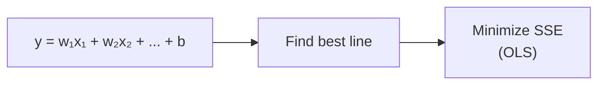
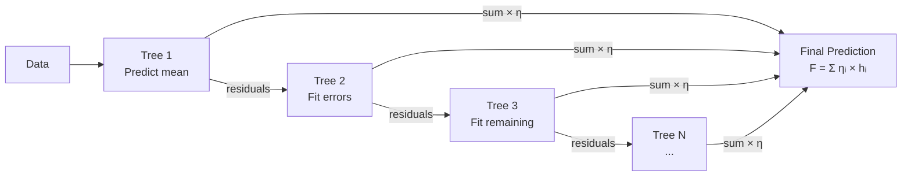
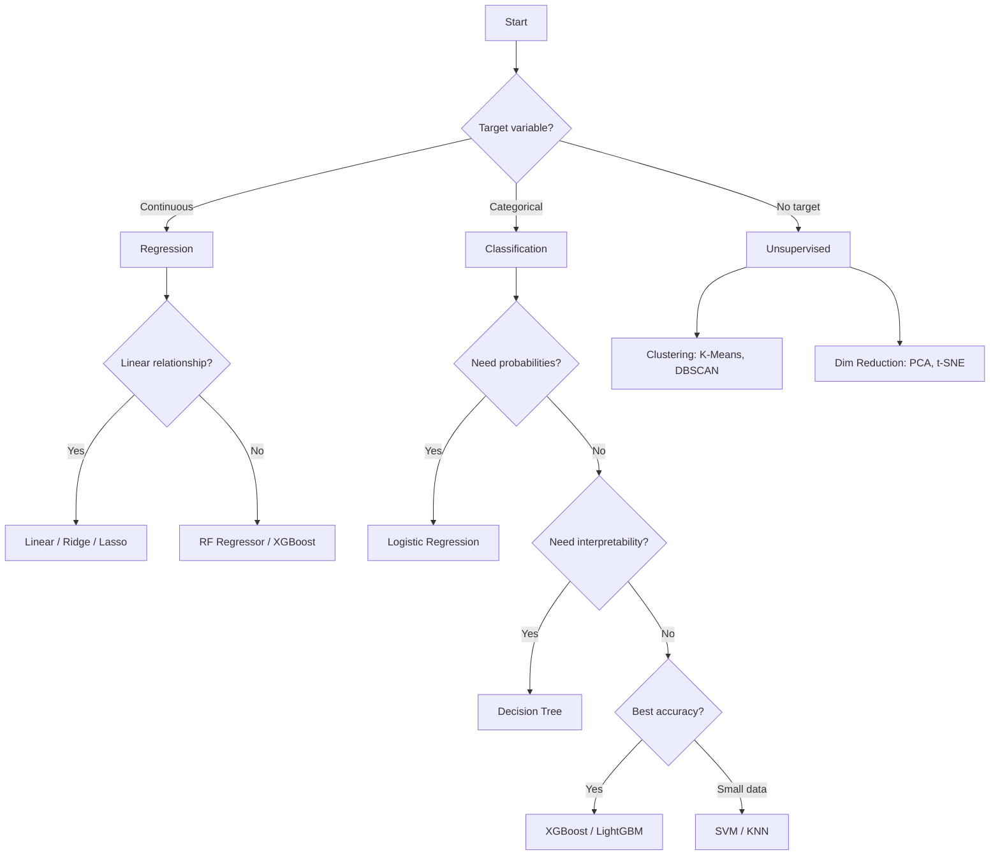

# 📈 Supervised Learning — Toàn Bộ Algorithms Cốt Lõi

> **Mục tiêu**: Nắm vững từng algorithm, khi nào dùng, ưu/nhược điểm, code thực tế.

---

## 1. Linear Regression

### Intuition


> Tìm đường thẳng “tốt nhất” fit qua data. “Tốt nhất” = minimize Sum of Squared Errors.

### Code

```python
import numpy as np
from sklearn.linear_model import LinearRegression, Ridge, Lasso
from sklearn.model_selection import train_test_split
from sklearn.metrics import mean_squared_error, r2_score

# Generate sample data
np.random.seed(42)
X = np.random.randn(200, 3)
y = 3*X[:, 0] + 2*X[:, 1] - X[:, 2] + np.random.randn(200) * 0.5

X_train, X_test, y_train, y_test = train_test_split(X, y, test_size=0.2, random_state=42)

# Basic Linear Regression
lr = LinearRegression()
lr.fit(X_train, y_train)
y_pred = lr.predict(X_test)

print(f"Coefficients: {lr.coef_.round(3)}")   # [3.0, 2.0, -1.0] (gần ground truth)
print(f"R²: {r2_score(y_test, y_pred):.4f}")
print(f"RMSE: {np.sqrt(mean_squared_error(y_test, y_pred)):.4f}")
```

### Regularization: Ridge vs Lasso vs ElasticNet

| | Ridge (L2) | Lasso (L1) | ElasticNet |
|-|-----------|-----------|------------|
| **Penalty** | Σ w² | Σ |w| | α × L1 + (1-α) × L2 |
| **Effect** | Shrink weights small | Some weights → 0 | Both effects |
| **Use case** | Multicollinearity | Feature selection | Many features |
| **Weights** | Small but non-zero | Sparse (auto selection) | Moderate sparsity |

```python
# Ridge — khi features correlated
ridge = Ridge(alpha=1.0)
ridge.fit(X_train, y_train)

# Lasso — khi muốn feature selection
lasso = Lasso(alpha=0.1)
lasso.fit(X_train, y_train)
print(f"Lasso non-zero features: {np.sum(lasso.coef_ != 0)}/{len(lasso.coef_)}")
```

---

## 2. Logistic Regression

### Intuition
```
P(y=1|X) = sigmoid(w·X + b) = 1 / (1 + e^(-z))
→ Output = probability [0, 1]
→ Decision boundary: P > 0.5 → class 1
→ Loss: Binary Cross-Entropy (log loss)
```

```python
from sklearn.linear_model import LogisticRegression
from sklearn.datasets import load_breast_cancer
from sklearn.preprocessing import StandardScaler
from sklearn.metrics import classification_report

data = load_breast_cancer()
X_train, X_test, y_train, y_test = train_test_split(
    data.data, data.target, test_size=0.2, random_state=42
)

# QUAN TRỌNG: scale features cho Logistic Regression
scaler = StandardScaler()
X_train_s = scaler.fit_transform(X_train)
X_test_s = scaler.transform(X_test)

clf = LogisticRegression(C=1.0, max_iter=1000)  # C = 1/lambda (regularization)
clf.fit(X_train_s, y_train)

print(classification_report(y_test, clf.predict(X_test_s)))
# Probabilities
probs = clf.predict_proba(X_test_s)[:5]
print(f"Probabilities (first 5): {probs.round(3)}")
```

> **💡 Interview**: Logistic Regression không phải "regression" — nó là **classification** algorithm. Tên gọi từ logistic function (sigmoid).

---

## 3. Decision Trees

### Intuition
```
                   [Age > 30?]
                  /            \
           Yes /                \ No
        [Income > 50K?]      [Student?]
        /          \          /        \
    Approve     Deny     Approve     Deny
```

### Splitting Criteria

| Criteria | Used for | Formula |
|----------|----------|---------|
| **Gini Impurity** | Classification (default) | 1 - Σ pᵢ² |
| **Entropy** | Classification | -Σ pᵢ log₂(pᵢ) |
| **MSE** | Regression | Mean Squared Error |

```python
from sklearn.tree import DecisionTreeClassifier, export_text

dt = DecisionTreeClassifier(
    max_depth=3,           # Prevent overfitting
    min_samples_split=10,  # Min samples to split a node
    min_samples_leaf=5,    # Min samples in leaf
    criterion="gini",
)
dt.fit(X_train, y_train)

# Visualize tree
print(export_text(dt, feature_names=list(data.feature_names)))

# Feature importance
for name, imp in sorted(
    zip(data.feature_names, dt.feature_importances_), 
    key=lambda x: -x[1]
)[:5]:
    print(f"  {name}: {imp:.4f}")
```

---

## 4. Ensemble Methods

### Bagging (Random Forest)

```python
from sklearn.ensemble import RandomForestClassifier

rf = RandomForestClassifier(
    n_estimators=100,     # Số trees
    max_depth=10,         # Depth mỗi tree
    max_features="sqrt",  # Features per split = √n_features
    min_samples_leaf=5,
    n_jobs=-1,            # Parallel
    random_state=42,
)
rf.fit(X_train, y_train)
print(f"RF Accuracy: {rf.score(X_test, y_test):.4f}")

# OOB score (built-in validation, không cần val set riêng)
rf_oob = RandomForestClassifier(n_estimators=100, oob_score=True, random_state=42)
rf_oob.fit(X_train, y_train)
print(f"OOB Score: {rf_oob.oob_score_:.4f}")
```

### Boosting (XGBoost & LightGBM)

```python
from xgboost import XGBClassifier
from lightgbm import LGBMClassifier

# XGBoost
xgb = XGBClassifier(
    n_estimators=200,
    max_depth=6,
    learning_rate=0.1,    # Step size cho boosting
    subsample=0.8,        # Random sampling of rows
    colsample_bytree=0.8, # Random sampling of features
    eval_metric="logloss",
    random_state=42,
)
xgb.fit(X_train, y_train)

# LightGBM (faster, handles categorical natively)
lgbm = LGBMClassifier(
    n_estimators=200,
    max_depth=6,
    learning_rate=0.1,
    num_leaves=31,        # Leaf-wise growth (vs level-wise)
    verbose=-1,
)
lgbm.fit(X_train, y_train)

print(f"XGBoost:  {xgb.score(X_test, y_test):.4f}")
print(f"LightGBM: {lgbm.score(X_test, y_test):.4f}")
```

### Bagging vs Boosting

| | Bagging (RF) | Boosting (XGBoost) |
|-|-------------|-------------------|
| **Strategy** | Parallel trees, vote | Sequential trees, correct errors |
| **Reduces** | Variance | Bias |
| **Overfitting** | Resistant | More prone (cần regularize) |
| **Speed** | Parallelizable | Sequential |
| **Typical winner** | Noisy data | Clean data, competitions |

### Gradient Boosting — Deep Dive

```
How Gradient Boosting Works (Residual Learning):

Step 0: F₀(x) = mean(y)                    → predict overall average
        residuals₀ = y - F₀(x)              → errors of naive prediction

Step 1: h₁(x) fitted on residuals₀           → learn the ERRORS
        F₁(x) = F₀(x) + η × h₁(x)          → correct previous prediction
        residuals₁ = y - F₁(x)              → smaller errors now

Step 2: h₂(x) fitted on residuals₁           → learn remaining errors
        F₂(x) = F₁(x) + η × h₂(x)          → correct again

...

Final: F(x) = F₀ + η×h₁ + η×h₂ + ... + η×hₙ
       Each tree corrects the mistakes of all previous trees
       η = learning_rate (shrinkage: smaller = more trees needed, but better)
```



### XGBoost vs LightGBM vs CatBoost

| Feature | XGBoost | LightGBM | CatBoost |
|---------|:-------:|:--------:|:--------:|
| **Tree growth** | Level-wise | **Leaf-wise** (faster) | Symmetric |
| **Speed** | ⭐⭐⭐ | ⭐⭐⭐⭐⭐ | ⭐⭐⭐⭐ |
| **Categorical** | Manual encode | Manual encode | **Native** (best) |
| **Missing values** | Native | Native | Native |
| **GPU support** | ✅ | ✅ | ✅ (best) |
| **Overfitting resist** | L1/L2 reg | L1/L2 + GOSS | **Ordered boosting** |
| **Best for** | General | Large data | **Categorical-heavy** |

```python
# ── CatBoost (tốt nhất cho categorical features) ──
from catboost import CatBoostClassifier

cat = CatBoostClassifier(
    iterations=500,
    depth=6,
    learning_rate=0.1,
    cat_features=["city", "category", "device"],  # Auto-encode!
    verbose=100,
)
cat.fit(X_train, y_train, eval_set=(X_val, y_val), early_stopping_rounds=50)
```

### Hyperparameter Tuning với Optuna

```python
import optuna
from sklearn.model_selection import cross_val_score

def objective(trial):
    params = {
        "n_estimators": trial.suggest_int("n_estimators", 100, 1000),
        "max_depth": trial.suggest_int("max_depth", 3, 8),
        "learning_rate": trial.suggest_float("learning_rate", 0.01, 0.3, log=True),
        "subsample": trial.suggest_float("subsample", 0.6, 1.0),
        "colsample_bytree": trial.suggest_float("colsample_bytree", 0.6, 1.0),
        "min_child_weight": trial.suggest_int("min_child_weight", 1, 10),
        "reg_alpha": trial.suggest_float("reg_alpha", 1e-8, 10.0, log=True),
        "reg_lambda": trial.suggest_float("reg_lambda", 1e-8, 10.0, log=True),
    }
    
    model = XGBClassifier(**params, eval_metric="logloss", random_state=42)
    scores = cross_val_score(model, X_train, y_train, cv=5, scoring="roc_auc")
    return scores.mean()

study = optuna.create_study(direction="maximize")
study.optimize(objective, n_trials=100, show_progress_bar=True)
print(f"Best AUC: {study.best_value:.4f}")
print(f"Best params: {study.best_params}")
```

---

## 5. Support Vector Machines (SVM)

```python
from sklearn.svm import SVC

# Linear SVM (fast, interpretable)
svm_linear = SVC(kernel="linear", C=1.0)
svm_linear.fit(X_train_s, y_train)

# RBF SVM (non-linear boundaries)
svm_rbf = SVC(kernel="rbf", C=10.0, gamma="scale")
svm_rbf.fit(X_train_s, y_train)

print(f"Linear SVM: {svm_linear.score(X_test_s, y_test):.4f}")
print(f"RBF SVM:    {svm_rbf.score(X_test_s, y_test):.4f}")
```

> **💡 Key**: SVM **cần feature scaling**. Kernel trick: map data sang higher dimension → linearly separable.

---

## 6. KNN (K-Nearest Neighbors)

```python
from sklearn.neighbors import KNeighborsClassifier

knn = KNeighborsClassifier(
    n_neighbors=5,          # K (odd number)
    weights="distance",     # Closer neighbors = more influence
    metric="minkowski",     # Euclidean distance (p=2)
)
knn.fit(X_train_s, y_train)  # PHẢI scale!
print(f"KNN Accuracy: {knn.score(X_test_s, y_test):.4f}")
```

- **Pros**: Simple, no training, works well for small data
- **Cons**: Slow prediction (compute distance to all), curse of dimensionality

---

## 7. Algorithm Selection Guide



---

## 🎯 Interview Tips — Chi Tiết

### Q1: "Random Forest vs XGBoost?"
**A**: RF: bagging (parallel trees), reduce variance, resistant to overfitting. XGB: boosting (sequential trees), correct errors, reduce bias. XGB usually better accuracy but more hyperparameters to tune. RF safer default.

### Q2: "Linear Regression assumptions?"
**A**: (1) Linearity (y vs x). (2) Independence of errors. (3) Homoscedasticity (constant error variance). (4) Normality of residuals. (5) No multicollinearity between features. Violated? Use Ridge (multicollinearity) or tree-based (non-linear).

### Q3: "Logistic Regression có phải regression?"
**A**: Không! Là classification algorithm. Tên từ logistic function (sigmoid). Output probability → threshold (0.5) → class label. Loss: Binary Cross-Entropy. Advantages: probabilistic, interpretable coefficients.

### Q4: "Kernel trong SVM?"
**A**: Kernel trick maps data sang higher dimension để linearly separable mà không compute explicit transformation. RBF kernel = infinite dimension space. Linear kernel for text (already high-dim). SVM cần feature scaling.

### Q5: "Bias-Variance trong Decision Tree?"
**A**: Single tree: low bias, high variance → dễ overfitting. Fix: pruning (max_depth, min_samples), ensemble. RF = reduce variance (bagging). XGB = reduce bias (boosting). Sweet spot: shallow trees in ensemble.

### Q6: "Ridge vs Lasso khi nào?"
**A**: Ridge (L2): khi features correlated (multicollinearity) — shrink weights but keep all. Lasso (L1): khi muốn feature selection — push some weights to exactly 0. ElasticNet: cả hai. Default: start with Ridge.
