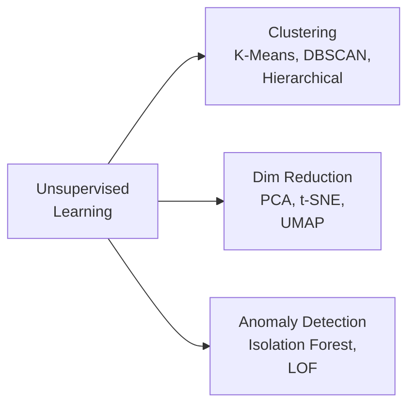

# 🧩 Unsupervised Learning — Deep Dive

> **Mục tiêu**: Clustering, Dimensionality Reduction, Anomaly Detection — khi **KHÔNG CÓ label**.
> 80% real-world data = unlabeled. Unsupervised = khai phá patterns ẩn trong data.

---

## Unsupervised Learning Methods



---

## 1. Clustering

### 1.1 K-Means

```python
from sklearn.cluster import KMeans
from sklearn.datasets import make_blobs
import numpy as np

# Generate sample data
X, y_true = make_blobs(n_samples=300, centers=4, random_state=42)

# K-Means
kmeans = KMeans(n_clusters=4, n_init=10, random_state=42)
labels = kmeans.fit_predict(X)

print(f"Cluster centers shape: {kmeans.cluster_centers_.shape}")
print(f"Inertia (SSE): {kmeans.inertia_:.2f}")
```

**K-Means Algorithm:**
```
1. Random init K centroids
2. Assign each point to nearest centroid → K clusters
3. Recompute centroids = mean of assigned points
4. Repeat 2-3 until convergence (centroids don't move)

Limitations:
  ❌ Must specify K
  ❌ Assumes spherical clusters (equal-size)
  ❌ Sensitive to initialization → n_init=10 (run 10 times, pick best)
  ❌ Sensitive to outliers (use K-Medoids for robustness)
```

#### Elbow Method + Silhouette — Chọn K

```python
from sklearn.metrics import silhouette_score

inertias = []
silhouettes = []
K_range = range(2, 10)

for k in K_range:
    km = KMeans(n_clusters=k, n_init=10, random_state=42)
    km.fit(X)
    inertias.append(km.inertia_)
    silhouettes.append(silhouette_score(X, km.labels_))

# Elbow: plot inertia vs K → "elbow" point = optimal K
# Silhouette: plot score vs K → MAX point = optimal K
# Silhouette Score: [-1, 1], >0.5 good, >0.7 excellent

best_k = K_range[np.argmax(silhouettes)]
print(f"Best K by silhouette: {best_k}, score: {max(silhouettes):.4f}")
```

### 1.2 DBSCAN — Density-Based

```python
from sklearn.cluster import DBSCAN

db = DBSCAN(
    eps=0.5,          # Neighborhood radius (critical parameter!)
    min_samples=5,    # Min points to form core point
)
labels = db.fit_predict(X)

n_clusters = len(set(labels)) - (1 if -1 in labels else 0)
n_noise = list(labels).count(-1)
print(f"Clusters: {n_clusters}, Noise points: {n_noise}")
```

**DBSCAN Concepts:**
```
Core Point:   ≥ min_samples neighbors within eps → belongs to cluster
Border Point: < min_samples neighbors, but near a core point → edge of cluster
Noise Point:  Not core, not border → outlier (label = -1)

How it works:
1. Pick unvisited point
2. If core → start new cluster, expand to all density-reachable points
3. If border → assign to nearby core's cluster
4. If noise → mark as -1
5. Repeat until all points visited

Advantages:
  ✅ Auto-detect K
  ✅ Arbitrary shapes
  ✅ Built-in outlier detection
```

### 1.3 Hierarchical Clustering

```python
from sklearn.cluster import AgglomerativeClustering
from scipy.cluster.hierarchy import dendrogram, linkage

# Agglomerative (bottom-up)
agg = AgglomerativeClustering(
    n_clusters=None,          # Auto-determine
    distance_threshold=10,    # Cut dendrogram at this height
    linkage='ward',           # Minimize within-cluster variance
)
labels = agg.fit_predict(X)

# Dendrogram visualization
Z = linkage(X, method='ward')
# dendrogram(Z, truncate_mode='level', p=5)
# Cut where dendrogram has longest vertical line → natural K
```

### 1.4 Gaussian Mixture Models (GMM)

```python
from sklearn.mixture import GaussianMixture

# Soft clustering — each point has PROBABILITY of belonging to each cluster
gmm = GaussianMixture(n_components=4, covariance_type='full', random_state=42)
gmm.fit(X)

labels = gmm.predict(X)        # Hard assignment
probs = gmm.predict_proba(X)   # Soft assignment (probabilities)

# BIC/AIC for model selection (lower = better)
for k in range(2, 8):
    g = GaussianMixture(n_components=k, random_state=42).fit(X)
    print(f"K={k}: BIC={g.bic(X):.0f}, AIC={g.aic(X):.0f}")
# Choose K with lowest BIC
```

### 1.5 Clustering Comparison Table

| | K-Means | DBSCAN | Hierarchical | GMM |
|-|---------|--------|-------------|-----|
| **K required?** | Yes | No | Optional | Yes |
| **Shape** | Spherical | Any | Any | Elliptical |
| **Outliers** | Assigns to nearest | Marks as -1 | Assigns | Low probability |
| **Soft assign?** | No | No | No | **Yes** (probabilities) |
| **Scalability** | ✅ O(n·k·d) | ⚠️ O(n²) naive | ❌ O(n²) | ⚠️ O(n·k·d²) |
| **Best for** | Large data, round | Irregular, noise | Small data, dendrogram | Overlapping clusters |

---

## 2. Dimensionality Reduction

### 2.1 PCA (Principal Component Analysis)

```python
from sklearn.decomposition import PCA
from sklearn.preprocessing import StandardScaler

# ⚠️ PHẢI scale trước PCA (PCA sensitive to scale!)
scaler = StandardScaler()
X_scaled = scaler.fit_transform(X)

# Reduce to 2D for visualization
pca = PCA(n_components=2)
X_2d = pca.fit_transform(X_scaled)

print(f"Explained variance ratio: {pca.explained_variance_ratio_.round(3)}")
print(f"Total variance kept: {sum(pca.explained_variance_ratio_)*100:.1f}%")

# ── Auto-select n_components (giữ 95% variance) ──
pca_auto = PCA(n_components=0.95)
X_reduced = pca_auto.fit_transform(X_scaled)
print(f"Components needed for 95%: {pca_auto.n_components_}")

# ── Feature importance (loading) ──
# Which original features contribute most to each PC?
loadings = pca.components_  # (n_components, n_features)
for i, comp in enumerate(loadings):
    top_features = np.argsort(np.abs(comp))[::-1][:5]
    print(f"PC{i+1}: top features = {top_features}")
```

**PCA Intuition:**
```
1. Center data (subtract mean)
2. Compute covariance matrix
3. Find eigenvectors (principal directions) + eigenvalues (variance)
4. Sort by eigenvalue (most variance first)
5. Project data onto top-k eigenvectors

Mathematically equivalent to SVD:
  X = U × Σ × V^T
  Principal components = columns of V
  Projected data = X × V[:, :k]
```

### 2.2 t-SNE (Visualization)

```python
from sklearn.manifold import TSNE

tsne = TSNE(
    n_components=2,
    perplexity=30,      # ~number of neighbors (5-50)
    learning_rate='auto',
    random_state=42,
    n_iter=1000,
)
X_tsne = tsne.fit_transform(X_scaled)

# ⚠️ CRITICAL CAVEATS:
# 1. ONLY for visualization — cannot transform new data
# 2. Cluster sizes DON'T mean anything (t-SNE expands dense clusters)
# 3. Distances BETWEEN clusters are NOT meaningful
# 4. Different perplexity → different results (try 5, 30, 50)
# 5. SLOW — O(n²) for large datasets
```

### 2.3 UMAP (Modern Standard)

```python
# pip install umap-learn
from umap import UMAP

reducer = UMAP(
    n_components=2,
    n_neighbors=15,     # Local structure (smaller = local, larger = global)
    min_dist=0.1,       # Spread (smaller = tighter clusters)
    metric='cosine',    # Distance metric (good for text/embeddings)
    random_state=42,
)
X_umap = reducer.fit_transform(X_scaled)

# ✅ UMAP advantages over t-SNE:
# 1. MUCH faster (minutes vs hours for 100K+ points)
# 2. Can transform NEW data: reducer.transform(X_new)
# 3. Preserves global structure better
# 4. Works for dimensionality reduction (not just viz)
```

### 2.4 Comparison

| | PCA | t-SNE | UMAP |
|-|-----|-------|------|
| **Type** | Linear | Non-linear | Non-linear |
| **Speed** | ⚡⚡⚡ O(n·d²) | ❌ O(n²) | ⚡⚡ O(n^1.14) |
| **Transform new data?** | ✅ Yes | ❌ No | ✅ Yes |
| **Global structure** | ✅ Preserved | ❌ Lost | ✅ Mostly preserved |
| **Use for features?** | ✅ Feature reduction | ❌ Viz only | ✅ Both |
| **Hyperparams** | Just n_components | perplexity, lr | n_neighbors, min_dist |
| **When to use** | Default, pre-pipeline | Publication figures | Best overall |

---

## 3. Anomaly Detection

### 3.1 Isolation Forest

```python
from sklearn.ensemble import IsolationForest

# How: randomly split feature space, anomalies are "isolated" faster
# (fewer splits needed → shorter path length)
iso_forest = IsolationForest(
    contamination=0.05,  # Expected fraction of outliers
    n_estimators=100,
    max_samples='auto',
    random_state=42,
)
outlier_labels = iso_forest.fit_predict(X)  # 1=normal, -1=outlier
anomaly_scores = iso_forest.decision_function(X)  # Lower = more anomalous

print(f"Outliers: {(outlier_labels == -1).sum()}")
print(f"Most anomalous score: {anomaly_scores.min():.4f}")
```

### 3.2 Local Outlier Factor (LOF)

```python
from sklearn.neighbors import LocalOutlierFactor

# LOF: compares local density of a point to its neighbors
# If much lower density → outlier
lof = LocalOutlierFactor(n_neighbors=20, contamination=0.05)
lof_labels = lof.fit_predict(X)
print(f"LOF outliers: {(lof_labels == -1).sum()}")

# LOF scores (negative = more anomalous)
lof_scores = lof.negative_outlier_factor_
```

### 3.3 Autoencoder Anomaly Detection

```python
import torch
import torch.nn as nn

class Autoencoder(nn.Module):
    """Anomaly detection via reconstruction error.
    Normal data → low reconstruction error
    Anomalous data → high reconstruction error (never seen during training)
    """
    def __init__(self, input_dim, latent_dim=32):
        super().__init__()
        self.encoder = nn.Sequential(
            nn.Linear(input_dim, 128), nn.ReLU(),
            nn.Linear(128, 64), nn.ReLU(),
            nn.Linear(64, latent_dim),
        )
        self.decoder = nn.Sequential(
            nn.Linear(latent_dim, 64), nn.ReLU(),
            nn.Linear(64, 128), nn.ReLU(),
            nn.Linear(128, input_dim),
        )
    
    def forward(self, x):
        latent = self.encoder(x)
        reconstructed = self.decoder(latent)
        return reconstructed

# Train on NORMAL data only
model = Autoencoder(input_dim=X.shape[1])
# ... training loop ...

# Detect anomalies
with torch.no_grad():
    reconstruction = model(X_test_tensor)
    errors = torch.mean((X_test_tensor - reconstruction) ** 2, dim=1)
    threshold = errors.quantile(0.95)  # Top 5% = anomalies
    anomalies = errors > threshold
```

### 3.4 Anomaly Detection Methods Comparison

| Method | Type | Unsupervised? | Scalability | Best For |
|--------|------|:---:|:-----------:|----------|
| **Isolation Forest** | Tree | ✅ | ✅ O(n log n) | Tabular, general |
| **LOF** | Density | ✅ | ⚠️ O(n²) | Local anomalies |
| **One-Class SVM** | Boundary | ✅ | ❌ O(n²-n³) | Small datasets |
| **Autoencoder** | Reconstruction | ✅ | ✅ | High-dim, images |
| **DBSCAN (label=-1)** | Density | ✅ | ⚠️ | With clustering |

---

## 4. Embedding & Representation Learning

```python
# ── Word/Document Embeddings → Clustering ──
from sentence_transformers import SentenceTransformer

model = SentenceTransformer('all-MiniLM-L6-v2')
texts = ["Machine learning is great", "Deep learning is powerful", 
         "I love cooking", "Recipe for pasta"]
embeddings = model.encode(texts)  # (4, 384)

# Cluster embeddings
kmeans = KMeans(n_clusters=2).fit(embeddings)
# → Cluster 0: ML texts, Cluster 1: cooking texts

# ── Image Embeddings → Anomaly Detection ──
# Extract embeddings from pretrained CNN → use Isolation Forest
# Normal images → cluster together, defective → isolated
```

---

## 🎯 Interview Tips — Chi Tiết

### Q1: "K-Means vs DBSCAN?"
**A**: K-Means: must specify K, spherical clusters, O(n·k), sensitive to outliers. DBSCAN: auto K, arbitrary shapes, built-in noise detection, needs eps/min_samples tuning. Choose: known K + round → K-Means. Unknown K + irregular → DBSCAN.

### Q2: "PCA hoạt động thế nào?"
**A**: Find directions (eigenvectors of covariance matrix) of maximum variance. Project data onto top-k directions. Equivalently: SVD of centered data matrix. Must scale features first! n_components=0.95 → auto-select for 95% variance.

### Q3: "PCA vs t-SNE vs UMAP?"
**A**: PCA: linear, fast, feature reduction + viz. t-SNE: non-linear, slow, viz only. UMAP: non-linear, fast, both reduction + viz, preserves global structure. Default: UMAP. Publication: t-SNE (more established). Pipeline: PCA.

### Q4: "Silhouette Score giải thích?"
**A**: For each point: s = (b - a) / max(a, b). a = mean distance to same-cluster points. b = mean distance to nearest other cluster. Range [-1, 1]. >0.5 good, >0.7 excellent, <0 means wrong cluster assignment.

### Q5: "Anomaly detection production?"
**A**: (1) Isolation Forest for tabular (fast, scalable). (2) Autoencoder for high-dim (images, time series). (3) Set contamination based on business context. (4) Monitor: anomaly rate over time → concept drift detection. (5) Human-in-loop: review flagged anomalies → label → improve.

### Q6: "GMM vs K-Means?"
**A**: GMM: soft assignment (probabilities), handles elliptical clusters, BIC for model selection. K-Means: hard assignment, spherical only, faster. If need "how confident is this assignment?" → GMM. Otherwise → K-Means.

### Q7: "Embedding clustering workflow?"
**A**: (1) Extract embeddings (SentenceTransformer, CLIP, CNN). (2) Reduce dimensions (UMAP to 50-100D). (3) Cluster (K-Means or HDBSCAN). (4) Evaluate (silhouette, human inspection of cluster samples). Real use: topic discovery, customer segmentation, image organization.
