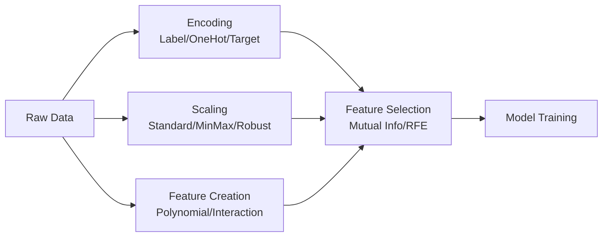

# 🔧 Feature Engineering

> **Mục tiêu**: Biến raw data → useful features. "Feature Engineering wins competitions" — nền tảng của mọi ML pipeline.

---

## Feature Engineering Pipeline



---

## 1. Encoding Categorical Features

### Label Encoding vs One-Hot vs Target Encoding

```python
import pandas as pd
import numpy as np
from sklearn.preprocessing import LabelEncoder, OneHotEncoder, OrdinalEncoder

df = pd.DataFrame({
    "color": ["red", "blue", "green", "red", "blue"],
    "size": ["S", "M", "L", "XL", "M"],
    "price": [10, 20, 30, 15, 25],
})

# 1. Label Encoding — ordinal features (S < M < L < XL)
ordinal = OrdinalEncoder(categories=[["S", "M", "L", "XL"]])
df["size_encoded"] = ordinal.fit_transform(df[["size"]])

# 2. One-Hot Encoding — nominal features (no order)
df_onehot = pd.get_dummies(df, columns=["color"], drop_first=True)
# drop_first=True → tránh multicollinearity (n-1 columns)

# 3. Target Encoding — high cardinality (1000+ categories)
# Thay category bằng mean of target variable
# ⚠️ Cần smoothing để tránh overfitting trên rare categories
def target_encode(df, col, target, smoothing=10):
    global_mean = df[target].mean()
    agg = df.groupby(col)[target].agg(["mean", "count"])
    smooth = (agg["count"] * agg["mean"] + smoothing * global_mean) / (agg["count"] + smoothing)
    return df[col].map(smooth)
```

| Method | Cardinality | Keeps Order | Tree Models | Linear Models |
|--------|-------------|-------------|-------------|---------------|
| **One-Hot** | Low (<20) | ❌ | ✅ | ✅ |
| **Ordinal** | Any | ✅ | ✅ | ⚠️ (assumes linear) |
| **Target** | High (1000+) | ❌ | ✅ | ✅ |

---

## 2. Feature Scaling

```python
from sklearn.preprocessing import StandardScaler, MinMaxScaler, RobustScaler

# StandardScaler: z = (x - mean) / std → mean=0, std=1
# Best for: most cases, Gaussian-like data
scaler_std = StandardScaler()

# MinMaxScaler: x' = (x - min) / (max - min) → [0, 1]
# Best for: neural networks, bounded data
scaler_mm = MinMaxScaler()

# RobustScaler: uses median/IQR instead of mean/std
# Best for: data with outliers
scaler_robust = RobustScaler()

# ⚠️ CRITICAL: fit trên TRAIN, transform trên TRAIN + TEST
X_train_scaled = scaler_std.fit_transform(X_train)
X_test_scaled = scaler_std.transform(X_test)  # KHÔNG fit_transform!
```

---

## 3. Handling Missing Values

```python
from sklearn.impute import SimpleImputer, KNNImputer

# Strategy selection
strategies = {
    "Numerical": "median",     # Robust với outliers
    "Categorical": "most_frequent",
    "Advanced": "KNNImputer",  # Dùng neighbors để estimate
}

# Simple Imputer
imputer = SimpleImputer(strategy="median")
X_imputed = imputer.fit_transform(X_train)

# KNN Imputer (smarter)
knn_imputer = KNNImputer(n_neighbors=5)
X_knn = knn_imputer.fit_transform(X_train)

# ⚠️ Add indicator column: is_missing → model có thể learn pattern
from sklearn.impute import MissingIndicator
indicator = MissingIndicator()
missing_flags = indicator.fit_transform(X_train)
```

---

## 4. Feature Creation

```python
# Polynomial Features
from sklearn.preprocessing import PolynomialFeatures

poly = PolynomialFeatures(degree=2, interaction_only=True, include_bias=False)
X_poly = poly.fit_transform(X_train[:, :3])
# [x1, x2, x3] → [x1, x2, x3, x1*x2, x1*x3, x2*x3]

# Date/Time features
df["day_of_week"] = df["timestamp"].dt.dayofweek
df["hour"] = df["timestamp"].dt.hour
df["is_weekend"] = df["day_of_week"].isin([5, 6]).astype(int)
df["month_sin"] = np.sin(2 * np.pi * df["timestamp"].dt.month / 12)  # Cyclical encoding

# Text features
df["text_length"] = df["text"].str.len()
df["word_count"] = df["text"].str.split().str.len()
df["has_url"] = df["text"].str.contains(r"http", regex=True).astype(int)

# Binning numerical features
df["age_group"] = pd.cut(df["age"], bins=[0, 18, 35, 55, 100], labels=["teen", "young", "middle", "senior"])

# Log transform (skewed distributions)
df["log_income"] = np.log1p(df["income"])  # log1p = log(1 + x) for handling 0
```

---

## 5. Feature Selection

```python
from sklearn.feature_selection import SelectKBest, f_classif, mutual_info_classif

# Filter method: statistical tests
selector = SelectKBest(score_func=f_classif, k=10)
X_selected = selector.fit_transform(X_train, y_train)
selected_features = np.array(feature_names)[selector.get_support()]

# Wrapper method: Recursive Feature Elimination
from sklearn.feature_selection import RFE
rfe = RFE(estimator=RandomForestClassifier(n_estimators=50), n_features_to_select=10)
rfe.fit(X_train, y_train)

# Embedded method: L1 Regularization (automatic selection)
from sklearn.linear_model import LogisticRegression
l1_model = LogisticRegression(penalty="l1", solver="saga", C=0.1)
l1_model.fit(X_train_scaled, y_train)
selected_l1 = np.where(l1_model.coef_[0] != 0)[0]  # Non-zero coefficients = selected
```

| Method | Type | Pros | Cons |
|--------|------|------|------|
| **SelectKBest** | Filter | Fast, model-agnostic | Ignores feature interactions |
| **RFE** | Wrapper | Considers model | Slow (retrain per step) |
| **L1 (Lasso)** | Embedded | Auto-selects during training | Only for linear models |
| **SHAP** | Post-hoc | Per-prediction, gold standard | Slow for large datasets |

---

## 6. SHAP — Feature Importance Gold Standard

```python
import shap

# TreeSHAP — fast for tree-based models (O(TLD²))
model = XGBClassifier(n_estimators=100).fit(X_train, y_train)
explainer = shap.TreeExplainer(model)
shap_values = explainer.shap_values(X_test)

# 1. Summary plot: global feature importance + direction
shap.summary_plot(shap_values, X_test, feature_names=feature_names)

# 2. Bar plot: mean absolute SHAP value per feature
shap.summary_plot(shap_values, X_test, plot_type="bar", feature_names=feature_names)

# 3. Single prediction explanation (local)
shap.force_plot(explainer.expected_value, shap_values[0], X_test[0])

# 4. Interaction effects (which features work together?)
shap_interaction = explainer.shap_interaction_values(X_test[:100])

# KernelSHAP — model-agnostic but slower
# For neural networks, non-tree models
kernel_explainer = shap.KernelExplainer(model.predict, X_train[:100])
kernel_shap_values = kernel_explainer.shap_values(X_test[:50])
```

---

## 7. Data Leakage Anti-Patterns

```python
# ❌ WRONG: fit on full dataset
scaler = StandardScaler()
X_scaled = scaler.fit_transform(X)       # Leaks test statistics!
X_train, X_test = train_test_split(X_scaled, ...)

# ✅ CORRECT: fit on train only
X_train, X_test = train_test_split(X, ...)
scaler = StandardScaler()
X_train_scaled = scaler.fit_transform(X_train)
X_test_scaled = scaler.transform(X_test)  # transform only!

# ❌ WRONG: target encoding on full dataset
df["city_encoded"] = df.groupby("city")["target"].transform("mean")

# ✅ CORRECT: target encoding with cross-validation
from sklearn.model_selection import KFold
kf = KFold(n_splits=5, shuffle=True, random_state=42)
df["city_encoded"] = 0.0
for train_idx, val_idx in kf.split(df):
    means = df.iloc[train_idx].groupby("city")["target"].mean()
    df.loc[val_idx, "city_encoded"] = df.loc[val_idx, "city"].map(means)
    # Fill unknown cities with global mean
    df["city_encoded"].fillna(df.iloc[train_idx]["target"].mean(), inplace=True)

# ❌ WRONG: feature selection using full dataset
selector = SelectKBest(k=10).fit(X, y)  # Test info leaks!

# ✅ CORRECT: feature selection inside pipeline
from sklearn.pipeline import Pipeline
pipe = Pipeline([
    ("scaler", StandardScaler()),
    ("selector", SelectKBest(k=10)),
    ("model", RandomForestClassifier()),
])
pipe.fit(X_train, y_train)  # All steps use train only
```

---

## 🎯 Interview Tips — Chi Tiết

### Q1: "Feature scaling khi nào cần?"
**A**: Distance-based (KNN, SVM, PCA) và gradient-based (Neural Nets, Logistic Regression) CẦN scaling. Tree-based (RF, XGBoost, LightGBM) KHÔNG cần vì chỉ so sánh thứ tự, không dùng magnitude.

### Q2: "One-Hot vs Target Encoding?"
**A**: One-Hot: low cardinality (<20 categories), creates binary columns. Target Encoding: high cardinality (cities, zip codes), replaces category with mean of target. Warning: target encoding cần smoothing + cross-validation để tránh data leakage.

### Q3: "Missing values strategy?"
**A**: Median cho numerical (robust với outliers). Most frequent cho categorical. KNN Imputer cho advanced (dùng neighbors). ALWAYS add indicator column `is_missing` — missingness itself can be informative. Never drop rows blindly.

### Q4: "Data leakage trong feature engineering?"
**A**: Fit scaler/imputer trên TRAIN ONLY. Transform cả train + test. Không dùng test info để cài gì bất kì. Common leaks: using full dataset for scaling, target encoding without CV, future data in time series. Prevention: use `sklearn.pipeline.Pipeline`.

### Q5: "SHAP vs Feature Importance?"
**A**: Tree-based feature importance: global ranking, biased toward high-cardinality features, impurity-based = inconsistent. SHAP: per-prediction, theoretically grounded (Shapley values from game theory), consistent, supports interactions. SHAP is gold standard for ML interpretability.

### Q6: "Cyclical encoding?"
**A**: Temporal features (hour, day, month) are cyclical: hour 23 gần hour 0. Encoding: sin/cos transform. `month_sin = sin(2π·month/12)`, `month_cos = cos(2π·month/12)`. This preserves the circular relationship that ordinal encoding breaks.

### Q7: "Feature Selection method nào chọn?"
**A**: Start: correlation filter (drop >0.95). Then: mutual info (captures non-linear). Production: SHAP importance. Quick: L1 regularization (auto-select). Exhaustive: RFE (slow but thorough). Always validate: does removing a feature hurt CV score?

### Q8: "Khi nào dùng Pipeline?"
**A**: ALWAYS. Pipeline đảm bảo: (1) No data leakage (fit only on train). (2) Reproducible (same transforms on new data). (3) Simplifies deployment (pickle entire pipeline). (4) GridSearchCV works with full pipeline.
