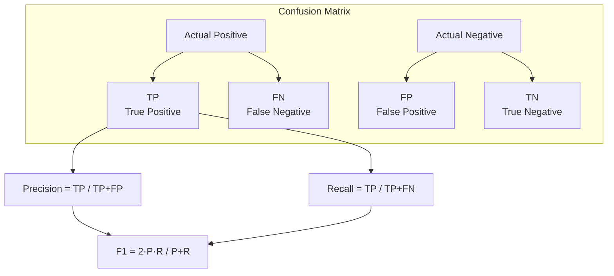

# 📏 Evaluation Metrics — Deep Dive

> **Mục tiêu**: Chọn metric đúng cho từng problem. Sai metric → optimize sai hướng.
> "You get what you measure" — metric QUYẾT ĐỊNH model học gì.

---

## 1. Classification Metrics

### 1.1 Confusion Matrix



```python
from sklearn.metrics import (
    accuracy_score, precision_score, recall_score, f1_score,
    confusion_matrix, classification_report, roc_auc_score,
    precision_recall_curve, average_precision_score
)
import numpy as np

y_true = [1, 1, 0, 1, 0, 0, 1, 0, 1, 0]
y_pred = [1, 0, 0, 1, 0, 1, 1, 0, 1, 0]

print(f"Accuracy:  {accuracy_score(y_true, y_pred):.4f}")
print(f"Precision: {precision_score(y_true, y_pred):.4f}")
print(f"Recall:    {recall_score(y_true, y_pred):.4f}")
print(f"F1:        {f1_score(y_true, y_pred):.4f}")

# Confusion matrix
cm = confusion_matrix(y_true, y_pred)
print(f"\nConfusion Matrix:\n{cm}")
# [[4, 1],     TN=4, FP=1
#  [1, 4]]     FN=1, TP=4

# Full report — ALWAYS print this
print("\n" + classification_report(y_true, y_pred))
```

### 1.2 Khi Nào Dùng Metric Nào?

| Metric | Formula | Ưu tiên khi | Ví dụ thực tế |
|--------|---------|------------|----------------|
| **Precision** | TP/(TP+FP) | FP costly | Spam filter (mất email quan trọng) |
| **Recall** | TP/(TP+FN) | FN costly | Cancer detection (miss cancer = nguy hiểm) |
| **F1** | 2PR/(P+R) | Balance P&R | General classification |
| **F2** | 5PR/(4P+R) | Recall quan trọng hơn | Medical screening |
| **AUC-ROC** | Area under ROC | Ranking, threshold-free | Fraud, click-through prediction |
| **AUC-PR** | Area under PR curve | Severe imbalance | Object detection, rare disease |
| **Accuracy** | (TP+TN)/Total | Balanced classes | ⚠️ MISLEADING cho imbalanced |

> **⚠️ RẤT QUAN TRỌNG**: Với imbalanced data (99:1), model predict ALL negative → 99% accuracy nhưng Recall = 0, F1 = 0. **Luôn check F1 hoặc AUC.**

### 1.3 AUC-ROC vs AUC-PR

```python
from sklearn.metrics import roc_curve, auc, precision_recall_curve

y_proba = clf.predict_proba(X_test)[:, 1]  # Probability scores

# ── AUC-ROC ──
fpr, tpr, thresholds = roc_curve(y_test, y_proba)
roc_auc = auc(fpr, tpr)
print(f"AUC-ROC: {roc_auc:.4f}")
# 0.5 = random, 0.7-0.8 OK, 0.8-0.9 good, >0.9 excellent

# ── AUC-PR (tốt hơn cho imbalanced) ──
precision_vals, recall_vals, _ = precision_recall_curve(y_test, y_proba)
ap = average_precision_score(y_test, y_proba)
print(f"Average Precision (AUC-PR): {ap:.4f}")
```

**AUC-ROC vs AUC-PR — khi nào dùng?**
| | AUC-ROC | AUC-PR |
|-|---------|--------|
| Focus | Overall discrimination | Positive class (minority) |
| Baseline | 0.5 (random) | % positives (varies) |
| Imbalanced | Can be **misleading** (high AUC even with many FP) | **Honest** — shows true positive performance |
| Use | Balanced problems, general | Detection, fraud, medical |

### 1.4 Threshold Tuning

```python
from sklearn.metrics import precision_recall_curve, f1_score
import numpy as np

# Tìm threshold maximize F1
precisions, recalls, thresholds = precision_recall_curve(y_test, y_proba)
f1_scores = 2 * (precisions * recalls) / (precisions + recalls + 1e-8)
best_idx = np.argmax(f1_scores)
best_threshold = thresholds[best_idx]

print(f"Best threshold: {best_threshold:.3f}")
print(f"Best F1: {f1_scores[best_idx]:.4f}")

# Apply custom threshold (default 0.5 không phải luôn optimal!)
y_pred_custom = (y_proba >= best_threshold).astype(int)
```

---

## 2. Regression Metrics

```python
from sklearn.metrics import mean_absolute_error, mean_squared_error, r2_score
import numpy as np

y_true = [3, -0.5, 2, 7, 100]  # Note: 100 is an outlier
y_pred = [2.5, 0.0, 2, 8, 80]

mae = mean_absolute_error(y_true, y_pred)     # Mean Absolute Error
mse = mean_squared_error(y_true, y_pred)       # Mean Squared Error
rmse = np.sqrt(mse)                            # Root MSE
r2 = r2_score(y_true, y_pred)                  # R² coefficient

print(f"MAE:  {mae:.4f}")   # Robust to outliers
print(f"RMSE: {rmse:.4f}")  # Penalizes large errors more
print(f"R²:   {r2:.4f}")    # % variance explained by model

# MAPE — percentage error (business-friendly)
mape = np.mean(np.abs((np.array(y_true) - np.array(y_pred)) / 
              (np.array(y_true) + 1e-8))) * 100
print(f"MAPE: {mape:.1f}%")
```

| Metric | Formula | Penalizes outliers | Interpretable | Use case |
|--------|---------|:-:|-----|-----|
| **MAE** | mean(\|y-ŷ\|) | Less | Same unit as target | Salary prediction |
| **RMSE** | √mean((y-ŷ)²) | More (squared) | Same unit | When large errors costly |
| **R²** | 1 - SS_res/SS_tot | — | % explained (0-1) | Compare models/baselines |
| **MAPE** | mean(\|(y-ŷ)/y\|) | — | Percentage | Business reporting |

> **R² < 0**: Model TỆ HƠN predicting mean. Thường do bug, wrong features, hoặc data mismatch.
>
> **MAE vs RMSE**: `RMSE ≥ MAE` always. If `RMSE >> MAE` → có large outlier errors.

---

## 3. Multi-class Metrics

```python
# Average strategies cho multi-class
y_true_mc = [0, 1, 2, 0, 1, 2, 0, 0, 1, 2]
y_pred_mc = [0, 2, 2, 0, 1, 1, 0, 0, 1, 2]

# ── Macro: mean of per-class metrics (each class equal weight) ──
# Good: tất cả classes quan trọng như nhau (even rare ones)
print(f"Macro F1: {f1_score(y_true_mc, y_pred_mc, average='macro'):.4f}")

# ── Weighted: weighted by support (class frequency) ──
# Good: overall performance, accounts for imbalance
print(f"Weighted F1: {f1_score(y_true_mc, y_pred_mc, average='weighted'):.4f}")

# ── Micro: compute global TP, FP, FN ──
# Same as accuracy for multi-class single-label
print(f"Micro F1: {f1_score(y_true_mc, y_pred_mc, average='micro'):.4f}")
```

### Chọn average strategy

| Strategy | Khi nào | Ý nghĩa |
|----------|---------|---------|
| **macro** | Tất cả classes quan trọng | Mean of per-class F1. Rare class = same weight |
| **weighted** | Default safe choice | Weighted by frequency. Common class = more weight |
| **micro** | Cần overall view | = Accuracy cho single-label. Global TP/FP/FN |

---

## 4. Segmentation & Detection Metrics

```python
# ── IoU (Intersection over Union) cho Semantic Segmentation ──
def iou(pred_mask, true_mask, class_id):
    pred = (pred_mask == class_id)
    true = (true_mask == class_id)
    intersection = (pred & true).sum()
    union = (pred | true).sum()
    return intersection / (union + 1e-8)

# mIoU = mean IoU across all classes
# Dice = 2 * intersection / (|pred| + |true|)

# ── mAP (mean Average Precision) cho Object Detection ──
# AP per class = area under Precision-Recall curve at different IoU thresholds
# mAP@0.5: IoU threshold = 0.5 (COCO standard)
# mAP@0.5:0.95: average mAP at IoU 0.5, 0.55, ..., 0.95 (stricter)
```

| Metric | Task | Range | Interpretation |
|--------|------|-------|----------------|
| **IoU** | Segmentation | 0-1 | Overlap predicted vs truth |
| **mIoU** | Segmentation | 0-1 | Mean IoU all classes |
| **Dice** | Medical/Seg | 0-1 | ≈ F1 for segmentation |
| **mAP@0.5** | Detection | 0-1 | Precision at 50% overlap |
| **mAP@0.5:0.95** | Detection | 0-1 | COCO standard (strict) |

---

## 5. Cross-Validation

```python
from sklearn.model_selection import cross_val_score, StratifiedKFold
from sklearn.model_selection import TimeSeriesSplit, GroupKFold

# ── Stratified K-Fold (maintains class ratio) — DEFAULT ──
cv = StratifiedKFold(n_splits=5, shuffle=True, random_state=42)
scores = cross_val_score(clf, X, y, cv=cv, scoring="f1")
print(f"CV F1: {scores.mean():.4f} ± {scores.std():.4f}")

# ── Time Series Split (respect temporal order) ──
# KHÔNG shuffle! Train on past → test on future
tscv = TimeSeriesSplit(n_splits=5)
ts_scores = cross_val_score(model, X_ts, y_ts, cv=tscv, scoring="r2")

# ── Group K-Fold (same patient/user stays in 1 fold) ──
gkf = GroupKFold(n_splits=5)
g_scores = cross_val_score(model, X, y, cv=gkf, groups=patient_ids)
```

| CV Type | Best for | Key rule |
|---------|----------|----------|
| **K-Fold** | General, large data | k=5 or 10 |
| **Stratified K-Fold** | Imbalanced classification | Preserves class ratios |
| **Time Series Split** | Temporal data | NO shuffling! |
| **Group K-Fold** | Grouped data (patients, users) | Groups don't leak across folds |
| **LOOCV** | Very small datasets (<100) | k=n, high variance, expensive |

---

## 6. Statistical Significance

```python
from scipy import stats

# ── Model A vs Model B: is B REALLY better? ──
scores_a = [0.85, 0.87, 0.83, 0.86, 0.88]  # 5-fold CV scores
scores_b = [0.90, 0.89, 0.91, 0.88, 0.92]

# Paired t-test (same folds, paired comparison)
t_stat, p_value = stats.ttest_rel(scores_a, scores_b)  # paired!
print(f"t-statistic: {t_stat:.4f}")
print(f"p-value: {p_value:.4f}")

if p_value < 0.05:
    print("✅ Difference is statistically significant")
else:
    print("❌ Not significant — difference may be due to chance")

# Bootstrap confidence interval (more robust)
def bootstrap_ci(scores, n_bootstrap=10000, ci=0.95):
    means = [np.mean(np.random.choice(scores, size=len(scores), replace=True))
             for _ in range(n_bootstrap)]
    lower = np.percentile(means, (1 - ci) / 2 * 100)
    upper = np.percentile(means, (1 + ci) / 2 * 100)
    return lower, upper
```

---

## 7. Probability Calibration

```
Problem: Model outputs ≠ true probabilities!
  Model predict_proba = 0.90 → thực tế chỉ đúng 70% of the time
  → "Confident but wrong" = dangerous in production

Why matters in production:
  🏥 Medical: "90% cancer probability" must mean ~90% of patients with this 
     score actually have cancer → treatment decisions depend on it
  🏦 Finance: credit scoring requires calibrated probabilities for risk pricing  
  🤖 AI systems: confidence thresholds for auto-approve vs human review
```

```python
from sklearn.calibration import (
    CalibratedClassifierCV, 
    calibration_curve,
)
from sklearn.metrics import brier_score_loss
import matplotlib.pyplot as plt

# ── Brier Score (lower = better calibrated) ──
y_proba = model.predict_proba(X_test)[:, 1]
brier = brier_score_loss(y_test, y_proba)
print(f"Brier Score: {brier:.4f}")  # Perfect = 0.0, Random = 0.25

# ── Reliability Diagram (Visual Calibration Check) ──
prob_true, prob_pred = calibration_curve(y_test, y_proba, n_bins=10)

plt.figure(figsize=(8, 6))
plt.plot(prob_pred, prob_true, "s-", label=f"Model (Brier={brier:.3f})")
plt.plot([0, 1], [0, 1], "k--", label="Perfectly calibrated")
plt.xlabel("Mean predicted probability")
plt.ylabel("Fraction of positives (true)")
plt.title("Reliability Diagram")
plt.legend()
plt.show()
# Points above diagonal → model is UNDER-confident
# Points below diagonal → model is OVER-confident

# ── Fix: Calibrate with Platt Scaling or Isotonic ──
calibrated = CalibratedClassifierCV(
    model,
    method="isotonic",   # "sigmoid" = Platt scaling (parametric, less data)
                          # "isotonic" = non-parametric (needs more data, flexible)
    cv=5,
)
calibrated.fit(X_train, y_train)
y_cal = calibrated.predict_proba(X_test)[:, 1]
print(f"Brier Before: {brier:.4f}")
print(f"Brier After:  {brier_score_loss(y_test, y_cal):.4f}")
```

---

## 🎯 Interview Tips — Chi Tiết

### Q1: "Accuracy tại sao misleading?"
**A**: 99% accuracy trên 99:1 imbalanced data → model predict ALL negative cũng đạt 99%. Recall = 0, F1 = 0. **Luôn check F1, AUC-PR cho imbalanced data.**

### Q2: "Precision vs Recall trade-off?"
**A**: Tăng threshold → ↑ Precision ↓ Recall. Hạ threshold → ↑ Recall ↓ Precision. Chọn theo business: cancer detection → Recall ≥ 0.95. Spam → Precision ≥ 0.95. F1 cho balance.

### Q3: "R² âm nghĩa là gì?"
**A**: Model TỆ HƠN just predicting mean. R² = 1 - SS_res/SS_tot. If residuals > total variance → R² < 0. Thường do: feature mismatch, data leakage, wrong model.

### Q4: "Macro vs Weighted F1?"
**A**: Macro: mỗi class equal weight → rare class ảnh hưởng nhiều. Weighted: common class dominate → better overall picture. Rare class quan trọng → dùng macro.

### Q5: "AUC-ROC vs AUC-PR cho imbalanced?"
**A**: AUC-ROC misleading khi class rất imbalanced (can be high even with many FP). AUC-PR honest hơn — focuses on positive class performance. Rule: >10:1 imbalance → dùng AUC-PR.

### Q6: "Cross-validation vs Hold-out?"
**A**: CV robust hơn (multiple evaluations), less variance. Hold-out nhanh hơn, enough for large datasets. Small data → CV essential. Large data → hold-out OK.

### Q7: "Làm sao biết model improvement có significant?"
**A**: Paired t-test trên K-Fold scores (p < 0.05). Bootstrap confidence intervals. Never compare single hold-out scores — too noisy.

### Q8: "Metric cho semantic segmentation?"
**A**: mIoU (mean IoU across classes) = primary. Dice coefficient ≈ F1 for pixels. Per-class IoU để tìm weak classes. mAP for detection (IoU thresholds).
