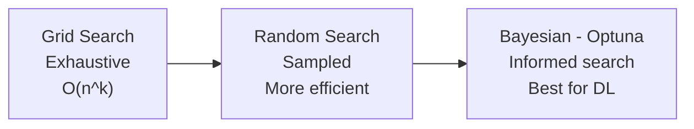

# ⚡ Hyperparameter Tuning

> **Mục tiêu**: Tối ưu hyperparameters hiệu quả — Grid Search → Random Search → Bayesian (Optuna).

---

## Tuning Strategy Comparison



> Grid → Random → Bayesian: tradeoff giữa **thoroughness** vs **efficiency**.

---

## 1. Grid Search (Exhaustive)

```python
from sklearn.model_selection import GridSearchCV
from sklearn.ensemble import RandomForestClassifier

param_grid = {
    "n_estimators": [50, 100, 200],
    "max_depth": [5, 10, 20],
    "min_samples_leaf": [1, 5, 10],
}
# Total combinations: 3 × 3 × 3 = 27 × 5-fold CV = 135 fits

grid = GridSearchCV(
    RandomForestClassifier(random_state=42),
    param_grid,
    cv=5,
    scoring="f1",
    n_jobs=-1,
    verbose=1,
)
grid.fit(X_train, y_train)

print(f"Best params: {grid.best_params_}")
print(f"Best F1: {grid.best_score_:.4f}")
```

> **⚠️ Nhược điểm**: Exponential scaling. 10 params × 10 values = 10^10 combinations!

---

## 2. Random Search (Efficient)

```python
from sklearn.model_selection import RandomizedSearchCV
from scipy.stats import randint, uniform

param_distributions = {
    "n_estimators": randint(50, 300),
    "max_depth": randint(3, 30),
    "min_samples_leaf": randint(1, 20),
    "max_features": uniform(0.1, 0.9),
}

random_search = RandomizedSearchCV(
    RandomForestClassifier(random_state=42),
    param_distributions,
    n_iter=50,        # Chỉ thử 50 combinations
    cv=5,
    scoring="f1",
    n_jobs=-1,
    random_state=42,
)
random_search.fit(X_train, y_train)
print(f"Best params: {random_search.best_params_}")
```

> **💡 Research**: Random search finds good params with 60 iterations covers 95% of optimal.

---

## 3. Bayesian Optimization (Optuna)

```python
import optuna
from sklearn.ensemble import RandomForestClassifier
from sklearn.model_selection import cross_val_score

def objective(trial):
    """Optuna tự chọn params thông minh dựa trên results trước."""
    params = {
        "n_estimators": trial.suggest_int("n_estimators", 50, 300),
        "max_depth": trial.suggest_int("max_depth", 3, 30),
        "min_samples_leaf": trial.suggest_int("min_samples_leaf", 1, 20),
        "max_features": trial.suggest_float("max_features", 0.1, 1.0),
        "criterion": trial.suggest_categorical("criterion", ["gini", "entropy"]),
    }
    
    clf = RandomForestClassifier(**params, random_state=42, n_jobs=-1)
    score = cross_val_score(clf, X_train, y_train, cv=5, scoring="f1").mean()
    return score

# Create study
study = optuna.create_study(direction="maximize")
study.optimize(objective, n_trials=100, show_progress_bar=True)

print(f"Best F1: {study.best_value:.4f}")
print(f"Best params: {study.best_params}")

# Visualization
optuna.visualization.plot_optimization_history(study)
optuna.visualization.plot_param_importances(study)
```

### Optuna cho XGBoost

```python
def xgb_objective(trial):
    params = {
        "n_estimators": trial.suggest_int("n_estimators", 100, 500),
        "max_depth": trial.suggest_int("max_depth", 3, 12),
        "learning_rate": trial.suggest_float("learning_rate", 0.01, 0.3, log=True),
        "subsample": trial.suggest_float("subsample", 0.5, 1.0),
        "colsample_bytree": trial.suggest_float("colsample_bytree", 0.5, 1.0),
        "min_child_weight": trial.suggest_int("min_child_weight", 1, 10),
        "reg_alpha": trial.suggest_float("reg_alpha", 1e-8, 10.0, log=True),
        "reg_lambda": trial.suggest_float("reg_lambda", 1e-8, 10.0, log=True),
    }
    
    clf = XGBClassifier(**params, random_state=42, eval_metric="logloss")
    score = cross_val_score(clf, X_train, y_train, cv=5, scoring="f1").mean()
    return score
```

---

## 4. Optuna Advanced — Multi-Objective

```python
# Optimize accuracy AND inference speed simultaneously
import optuna
import time

def multi_objective(trial):
    params = {
        "n_estimators": trial.suggest_int("n_estimators", 50, 500),
        "max_depth": trial.suggest_int("max_depth", 3, 30),
        "min_samples_leaf": trial.suggest_int("min_samples_leaf", 1, 20),
    }
    
    clf = RandomForestClassifier(**params, random_state=42, n_jobs=-1)
    
    # Objective 1: F1 score
    f1 = cross_val_score(clf, X_train, y_train, cv=3, scoring="f1").mean()
    
    # Objective 2: Inference speed (lower = better)
    clf.fit(X_train, y_train)
    start = time.perf_counter()
    clf.predict(X_test[:100])
    latency = time.perf_counter() - start
    
    return f1, latency  # Maximize F1, minimize latency

study = optuna.create_study(
    directions=["maximize", "minimize"],
    study_name="accuracy_vs_speed",
)
study.optimize(multi_objective, n_trials=100)

# Get Pareto-optimal trials (best tradeoff between objectives)
pareto = study.best_trials
for t in pareto:
    print(f"F1={t.values[0]:.4f}, Latency={t.values[1]:.4f}ms → {t.params}")
```

---

## 5. Pruning — Early Termination

```python
# Stop bad trials early → save 50-80% compute
import optuna
from optuna.pruners import MedianPruner, HyperbandPruner
from sklearn.model_selection import StratifiedKFold

def objective_with_pruning(trial):
    params = {
        "n_estimators": trial.suggest_int("n_estimators", 50, 500),
        "max_depth": trial.suggest_int("max_depth", 3, 30),
        "learning_rate": trial.suggest_float("learning_rate", 0.01, 0.3, log=True),
    }
    
    clf = XGBClassifier(**params, random_state=42, eval_metric="logloss")
    
    # Report intermediate values per CV fold for pruning
    skf = StratifiedKFold(n_splits=5, shuffle=True, random_state=42)
    scores = []
    
    for step, (train_idx, val_idx) in enumerate(skf.split(X_train, y_train)):
        clf.fit(X_train[train_idx], y_train[train_idx])
        score = clf.score(X_train[val_idx], y_train[val_idx])
        scores.append(score)
        
        # Report to Optuna: if below median of other trials → prune
        trial.report(np.mean(scores), step)
        if trial.should_prune():
            raise optuna.TrialPruned()
    
    return np.mean(scores)

# Pruner options
study = optuna.create_study(
    direction="maximize",
    pruner=MedianPruner(        # Prune if below median
        n_startup_trials=10,    # Don't prune first 10 trials  
        n_warmup_steps=2,       # Don't prune first 2 CV folds
    ),
    # Alternative: HyperbandPruner() — more aggressive, best for deep learning
)
study.optimize(objective_with_pruning, n_trials=200)
```

---

## 6. Learning Curves & Validation Curves

```python
from sklearn.model_selection import learning_curve, validation_curve
import matplotlib.pyplot as plt
import numpy as np

# 1. Learning Curve: Does more data help?
train_sizes, train_scores, val_scores = learning_curve(
    RandomForestClassifier(n_estimators=100),
    X_train, y_train,
    train_sizes=np.linspace(0.1, 1.0, 10),
    cv=5, scoring="f1", n_jobs=-1,
)

plt.figure(figsize=(10, 4))
plt.subplot(1, 2, 1)
plt.plot(train_sizes, train_scores.mean(axis=1), label="Train")
plt.plot(train_sizes, val_scores.mean(axis=1), label="Validation")
plt.xlabel("Training Size"); plt.ylabel("F1 Score")
plt.title("Learning Curve"); plt.legend()

# Gap large → overfitting → get more data or regularize
# Both plateau low → underfitting → more complex model

# 2. Validation Curve: Impact of one hyperparameter
param_range = [3, 5, 10, 15, 20, 30, 50]
train_scores, val_scores = validation_curve(
    RandomForestClassifier(n_estimators=100),
    X_train, y_train,
    param_name="max_depth", param_range=param_range,
    cv=5, scoring="f1", n_jobs=-1,
)

plt.subplot(1, 2, 2)
plt.plot(param_range, train_scores.mean(axis=1), label="Train")
plt.plot(param_range, val_scores.mean(axis=1), label="Validation")
plt.xlabel("max_depth"); plt.ylabel("F1 Score")
plt.title("Validation Curve"); plt.legend()
plt.tight_layout(); plt.show()

# Sweet spot = where val score peaks before gap widens
```

---

## 7. Hyperparameter Importance Analysis

```python
# After Optuna study, analyze which params matter most
fig = optuna.visualization.plot_param_importances(study)
fig.show()

# Typical importance pattern:
# 1. learning_rate  → 45% importance (almost always #1)
# 2. n_estimators   → 20% importance
# 3. max_depth      → 15% importance
# 4. reg_lambda     → 10% importance
# 5. subsample      → 5% importance
# 6. colsample      → 5% importance

# → Focus tuning budget on top 2-3 params
# → Fix less important params at reasonable defaults
```

---

## Comparison

| Method | Efficiency | Intelligence | Use case |
|--------|-----------|-------------|----------|
| **Grid** | O(n^k) | None (brute force) | Few params, small search space |
| **Random** | O(n_iter) | None (random) | Many params, quick exploration |
| **Optuna** | O(n_trials) | TPE (learns from history) | **Best choice for most cases** |
| **Multi-objective** | O(n_trials) | Pareto front | Accuracy vs cost/speed tradeoff |

---

## 🎯 Interview Tips — Chi Tiết

### Q1: "Grid vs Random vs Bayesian?"
**A**: Grid: exhaustive, O(n^k), only for tiny search space. Random: surprisingly effective, 60 iterations covers 95% of optimal (Bergstra 2012). Bayesian (Optuna): learns from history via TPE, most sample-efficient. Default: **Optuna**.

### Q2: "Overfitting during tuning?"
**A**: Nested cross-validation: outer loop = unbiased model evaluation, inner loop = param tuning. Without nesting, you’re selecting params that overfit to your CV folds. Alternative: holdout validation set separate from CV.

### Q3: "Learning rate tuning?"
**A**: Start high (0.1), reduce if training unstable (loss oscillates). Use log scale for search. Common pattern: find best LR first, then tune other params. LR scheduling (cosine, step) can compensate for suboptimal initial LR.

### Q4: "Optuna vs sklearn GridSearchCV?"
**A**: Optuna: Bayesian, pruning (early stop bad trials), dashboard, distributed. GridSearchCV: brute force, no intelligence. Random > Grid for same budget. Optuna > Random for complex spaces. Use Optuna for anything > 3 params.

### Q5: "Early stopping trong tuning?"
**A**: Optuna MedianPruner: prune trial if intermediate result below median of completed trials. Saves 50-80% compute. XGBoost/LightGBM: built-in early_stopping_rounds — stop training when validation metric stops improving.

### Q6: "Tuning dễ sai ở đâu?"
**A**: (1) Test set leakage — phải dùng nested CV. (2) Chỉ tune model, quên tune preprocessing (scaler, imputer). (3) Too many trials = overfit to CV. (4) Không fix random_state = kết quả không reproducible. (5) Tune accuracy thay vì business metric.
