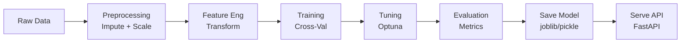

# 🏭 Practical ML Pipeline — Production Ready

> **Mục tiêu**: End-to-end sklearn Pipeline — preprocessing → training → evaluation → tuning → saving → serving.
> Pipeline = "hệ thống xương sống" — thiếu nó = data leakage, không reproducible, deploy khó.

---

## End-to-End ML Pipeline



---

## 1. sklearn Pipeline

### 1.1 Basic Pipeline

```python
from sklearn.pipeline import Pipeline
from sklearn.compose import ColumnTransformer
from sklearn.preprocessing import StandardScaler, OneHotEncoder
from sklearn.impute import SimpleImputer
from sklearn.ensemble import RandomForestClassifier

# ── Define column types ──
numeric_features = ["age", "income", "credit_score"]
categorical_features = ["city", "education", "employment"]

# ── Separate pipelines per data type ──
numeric_transformer = Pipeline(steps=[
    ("imputer", SimpleImputer(strategy="median")),  # Handle missing
    ("scaler", StandardScaler()),                    # Normalize
])

categorical_transformer = Pipeline(steps=[
    ("imputer", SimpleImputer(strategy="most_frequent")),
    ("encoder", OneHotEncoder(handle_unknown="ignore", drop="first")),
    # handle_unknown="ignore": new categories at inference → zeros
    # drop="first": avoid multicollinearity (N-1 columns for N categories)
])

# ── Combine all preprocessing ──
preprocessor = ColumnTransformer(
    transformers=[
        ("num", numeric_transformer, numeric_features),
        ("cat", categorical_transformer, categorical_features),
    ],
    remainder="drop",  # Drop columns not listed (safe default)
)

# ── Full pipeline: preprocessing + model ──
pipeline = Pipeline(steps=[
    ("preprocessor", preprocessor),
    ("classifier", RandomForestClassifier(
        n_estimators=200, 
        max_depth=10,
        class_weight="balanced",  # Handle imbalanced classes
        random_state=42,
        n_jobs=-1,
    )),
])

# Train (no manual preprocessing needed!)
pipeline.fit(X_train, y_train)

# Predict (preprocessing automatic)
y_pred = pipeline.predict(X_test)
y_proba = pipeline.predict_proba(X_test)[:, 1]

print(f"Accuracy: {pipeline.score(X_test, y_test):.4f}")
```

### 1.2 Tại Sao PHẢI Dùng Pipeline?

```
❌ Without Pipeline (DATA LEAKAGE):
    scaler.fit(X_all)  → Scaler "sees" test data → biased evaluation!
    X_train_scaled = scaler.transform(X_train)
    X_test_scaled = scaler.transform(X_test)

✅ With Pipeline (CORRECT):
    pipeline.fit(X_train, y_train)  → Scaler fits ONLY on training data
    pipeline.predict(X_test)        → Scaler transforms test with train stats
    
Benefits:
  1. No data leakage (fit only on train, transform both)
  2. Reproducible (single object, consistent preprocessing)
  3. Easy deploy (1 file = preprocessor + model)
  4. Works with cross_val_score (correct per-fold fitting)
```

---

## 2. Feature Engineering in Pipeline

```python
from sklearn.base import BaseEstimator, TransformerMixin
import numpy as np

# ── Custom Transformer (follow sklearn API) ──
class FeatureEngineer(BaseEstimator, TransformerMixin):
    """Custom feature engineering step."""
    
    def fit(self, X, y=None):
        # Learn from training data (e.g., statistics)
        self.income_median_ = X["income"].median()
        return self  # Must return self
    
    def transform(self, X):
        X = X.copy()
        # Feature interactions
        X["income_per_age"] = X["income"] / (X["age"] + 1)
        X["high_income"] = (X["income"] > self.income_median_).astype(int)
        # Log transform (reduce skewness)
        X["log_income"] = np.log1p(X["income"])
        return X

# ── Pipeline with custom transformer ──
pipeline = Pipeline(steps=[
    ("engineer", FeatureEngineer()),           # Custom features first
    ("preprocessor", preprocessor),             # Then standard preprocessing
    ("classifier", RandomForestClassifier()),   # Then model
])

# ── Feature Selection in Pipeline ──
from sklearn.feature_selection import SelectKBest, f_classif

pipeline_with_selection = Pipeline(steps=[
    ("preprocessor", preprocessor),
    ("selector", SelectKBest(f_classif, k=10)),  # Keep top 10 features
    ("classifier", RandomForestClassifier()),
])
```

---

## 3. Hyperparameter Tuning

```python
from sklearn.model_selection import RandomizedSearchCV, StratifiedKFold
from scipy.stats import randint, uniform

# ── Parameter grid ──
# Note: use "step__parameter" format for pipeline parameters
param_distributions = {
    "classifier__n_estimators": randint(100, 500),
    "classifier__max_depth": [5, 10, 15, 20, None],
    "classifier__min_samples_split": randint(2, 20),
    "classifier__min_samples_leaf": randint(1, 10),
    "preprocessor__num__imputer__strategy": ["mean", "median"],
}

# ── Randomized Search (faster than Grid Search) ──
cv = StratifiedKFold(n_splits=5, shuffle=True, random_state=42)

search = RandomizedSearchCV(
    pipeline,
    param_distributions,
    n_iter=50,           # Number of random combinations
    cv=cv,
    scoring="f1",
    n_jobs=-1,
    random_state=42,
    verbose=1,
)

search.fit(X_train, y_train)
print(f"Best F1: {search.best_score_:.4f}")
print(f"Best params: {search.best_params_}")

best_pipeline = search.best_estimator_
```

### Optuna (Smarter Tuning)

```python
import optuna
from sklearn.model_selection import cross_val_score

def objective(trial):
    params = {
        "n_estimators": trial.suggest_int("n_estimators", 100, 500),
        "max_depth": trial.suggest_int("max_depth", 3, 20),
        "min_samples_split": trial.suggest_int("min_samples_split", 2, 20),
        "learning_rate": trial.suggest_float("learning_rate", 1e-3, 0.3, log=True),
    }
    
    from sklearn.ensemble import GradientBoostingClassifier
    clf = Pipeline(steps=[
        ("preprocessor", preprocessor),
        ("classifier", GradientBoostingClassifier(**params, random_state=42)),
    ])
    
    scores = cross_val_score(clf, X_train, y_train, cv=5, scoring="f1")
    return scores.mean()

study = optuna.create_study(direction="maximize")
study.optimize(objective, n_trials=100, show_progress_bar=True)

print(f"Best F1: {study.best_trial.value:.4f}")
print(f"Best params: {study.best_trial.params}")
```

---

## 4. Evaluation & Error Analysis

```python
from sklearn.metrics import classification_report, confusion_matrix
import pandas as pd

# ── Full evaluation ──
y_pred = best_pipeline.predict(X_test)
y_proba = best_pipeline.predict_proba(X_test)[:, 1]

print(classification_report(y_test, y_pred))

# ── Error Analysis (MOST IMPORTANT STEP!) ──
errors = X_test.copy()
errors["true"] = y_test
errors["pred"] = y_pred
errors["correct"] = (y_test == y_pred)
errors["proba"] = y_proba

# False Positives — predicted positive, actually negative
fp = errors[(errors["true"] == 0) & (errors["pred"] == 1)]
print(f"\n{len(fp)} False Positives — analyze WHY model confused:")
print(fp.describe())

# False Negatives — predicted negative, actually positive
fn = errors[(errors["true"] == 1) & (errors["pred"] == 0)]
print(f"\n{len(fn)} False Negatives — missed positive cases:")
print(fn.describe())

# ── Confidence analysis ──
# Cases where model was confident but WRONG
confident_wrong = errors[
    (~errors["correct"]) & (errors["proba"].between(0.8, 1.0) | errors["proba"].between(0.0, 0.2))
]
print(f"\n{len(confident_wrong)} Confident but Wrong — likely data quality issues")
```

### Feature Importance

```python
import numpy as np

# ── Tree-based feature importance ──
clf = best_pipeline.named_steps["classifier"]
feature_names = best_pipeline.named_steps["preprocessor"].get_feature_names_out()
importances = clf.feature_importances_

# Sort and display
indices = np.argsort(importances)[::-1]
for i in range(min(10, len(feature_names))):
    print(f"  {feature_names[indices[i]]}: {importances[indices[i]]:.4f}")

# ── Permutation Importance (model-agnostic, more reliable) ──
from sklearn.inspection import permutation_importance

perm_imp = permutation_importance(best_pipeline, X_test, y_test, n_repeats=10)
for i in np.argsort(perm_imp.importances_mean)[::-1][:10]:
    print(f"  {X_test.columns[i]}: {perm_imp.importances_mean[i]:.4f} ± {perm_imp.importances_std[i]:.4f}")
```

---

## 5. Saving & Loading

```python
import joblib
from datetime import datetime
import json

# ── Save pipeline (includes preprocessor + model) ──
model_path = f"models/pipeline_{datetime.now():%Y%m%d_%H%M}.joblib"
joblib.dump(best_pipeline, model_path)

# ── Save metadata alongside ──
metadata = {
    "model_type": "RandomForestClassifier",
    "features": numeric_features + categorical_features,
    "best_params": search.best_params_,
    "cv_f1": float(search.best_score_),
    "test_f1": float(f1_score(y_test, y_pred)),
    "trained_at": datetime.now().isoformat(),
    "data_shape": list(X_train.shape),
}
with open(model_path.replace(".joblib", "_metadata.json"), "w") as f:
    json.dump(metadata, f, indent=2)

# ── Load ──
loaded_pipeline = joblib.load(model_path)
y_pred = loaded_pipeline.predict(X_test)

# ── ONNX export for production serving ──
from skl2onnx import to_onnx
import numpy as np

onnx_model = to_onnx(best_pipeline, X_train[:1].values.astype(np.float32))
with open("model.onnx", "wb") as f:
    f.write(onnx_model.SerializeToString())
print("✅ Exported to ONNX")
```

---

## 6. Complete Workflow Template

```python
"""
End-to-end ML Pipeline Template
Usage: python train.py --data data.csv --output models/
"""
import pandas as pd
import numpy as np
from sklearn.model_selection import train_test_split, cross_val_score, StratifiedKFold
from sklearn.metrics import classification_report, f1_score
import joblib, json
from datetime import datetime

# ══════════════ 1. Load & EDA ══════════════
df = pd.read_csv("data.csv")
print(f"Shape: {df.shape}")
print(f"Missing:\n{df.isnull().sum()}")
print(f"Target:\n{df['target'].value_counts(normalize=True)}")

# ══════════════ 2. Split FIRST (prevent leakage!) ══════════════
X = df.drop("target", axis=1)
y = df["target"]
X_train, X_test, y_train, y_test = train_test_split(
    X, y, test_size=0.2, random_state=42, stratify=y
)

# ══════════════ 3. Build pipeline ══════════════
# (use pipeline from Section 1 above)
pipeline = build_pipeline()

# ══════════════ 4. Cross-validate ══════════════
cv = StratifiedKFold(n_splits=5, shuffle=True, random_state=42)
scores = cross_val_score(pipeline, X_train, y_train, cv=cv, scoring="f1")
print(f"\nCV F1: {scores.mean():.4f} ± {scores.std():.4f}")

# ══════════════ 5. Hyperparameter tuning ══════════════
# (use RandomizedSearchCV or Optuna from Section 3)

# ══════════════ 6. Final train + evaluate ══════════════
pipeline.fit(X_train, y_train)
y_pred = pipeline.predict(X_test)
print("\n" + classification_report(y_test, y_pred))

# ══════════════ 7. Error analysis ══════════════
# (analyze FP, FN, confident-but-wrong cases)

# ══════════════ 8. Save ══════════════
joblib.dump(pipeline, "production_model.joblib")
print("✅ Model saved!")
```

---

## 🎯 Interview Tips — Chi Tiết

### Q1: "Tại sao dùng Pipeline?"
**A**: 3 lý do critical: (1) **Prevent data leakage** — fit preprocessing trên train only, auto transform test. (2) **Reproducible** — 1 object chứa tất cả steps. (3) **Easy deployment** — save/load 1 file, no manual preprocessing at serving time.

### Q2: "ColumnTransformer là gì?"
**A**: Apply different preprocessing cho different column types. Numeric → impute + scale. Categorical → impute + encode. Text → TF-IDF. All combined into single transformer.

### Q3: "Custom transformer viết thế nào?"
**A**: Inherit `BaseEstimator, TransformerMixin`. Implement `fit(X, y)` (return self) và `transform(X)`. Stateful computations (medians, means) → compute in `fit`, apply in `transform`.

### Q4: "Error analysis workflow?"
**A**: (1) Confusion matrix → identify FP vs FN. (2) Analyze FP/FN patterns (common features, edge cases). (3) Check confident-but-wrong predictions (data quality issues). (4) Feature importance → which features drive errors. This is MORE valuable than tuning hyperparameters.

### Q5: "Grid Search vs Random Search vs Bayesian?"
**A**: Grid: exhaustive, OK for 2-3 params. Random: sample N combinations, efficient for many params. Bayesian (Optuna): learn from previous trials, best for expensive evaluations. Start: Random Search. Optimize: Optuna.

### Q6: "Deploy sklearn model?"
**A**: (1) joblib.dump → FastAPI → Docker (simple). (2) ONNX export with skl2onnx → ONNX Runtime (fast, 2-3x faster). (3) Include metadata (features, params, metrics) alongside model for reproducibility.
