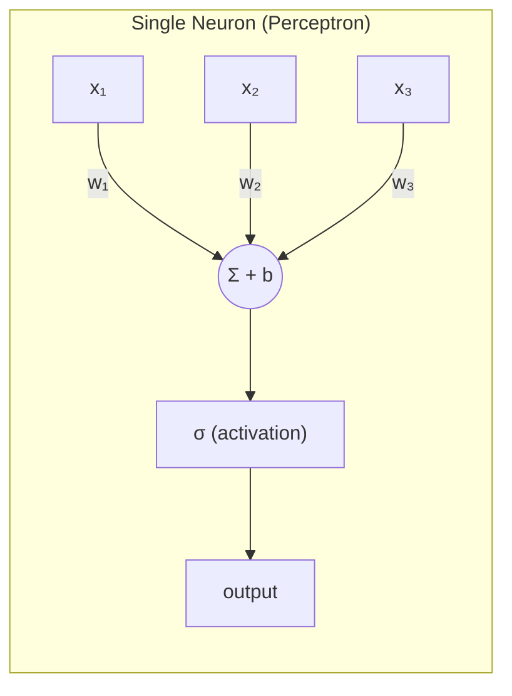
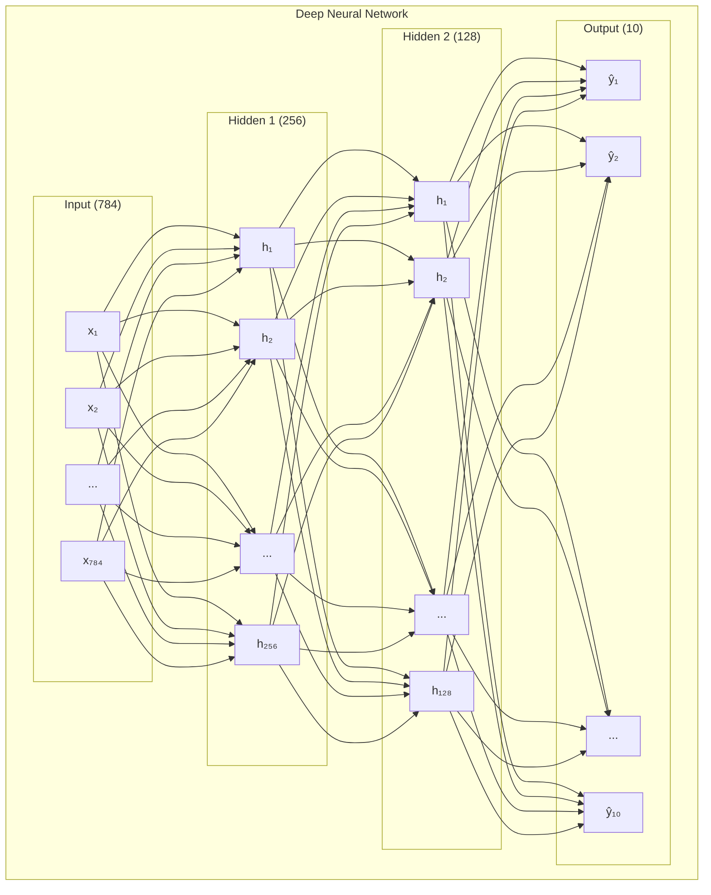
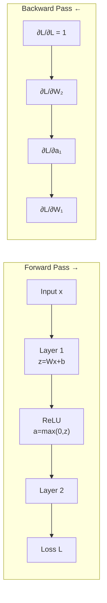
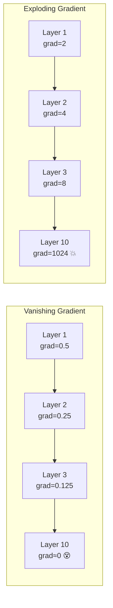
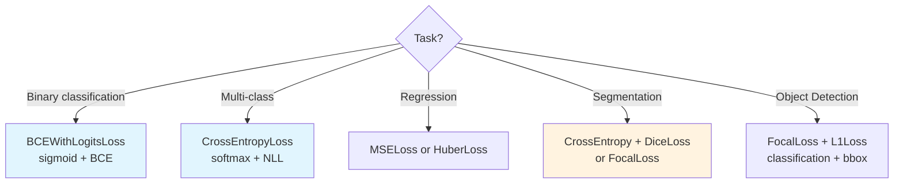
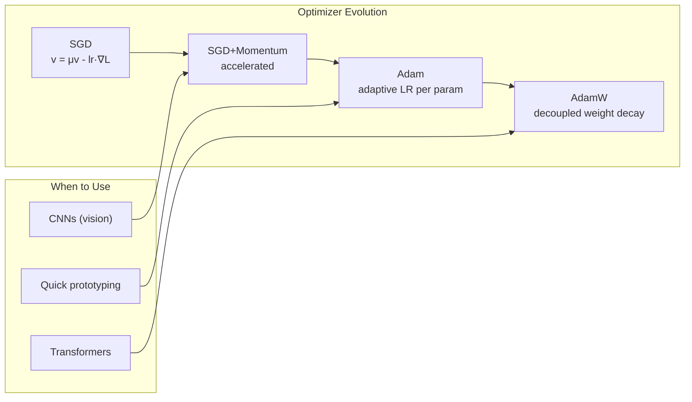
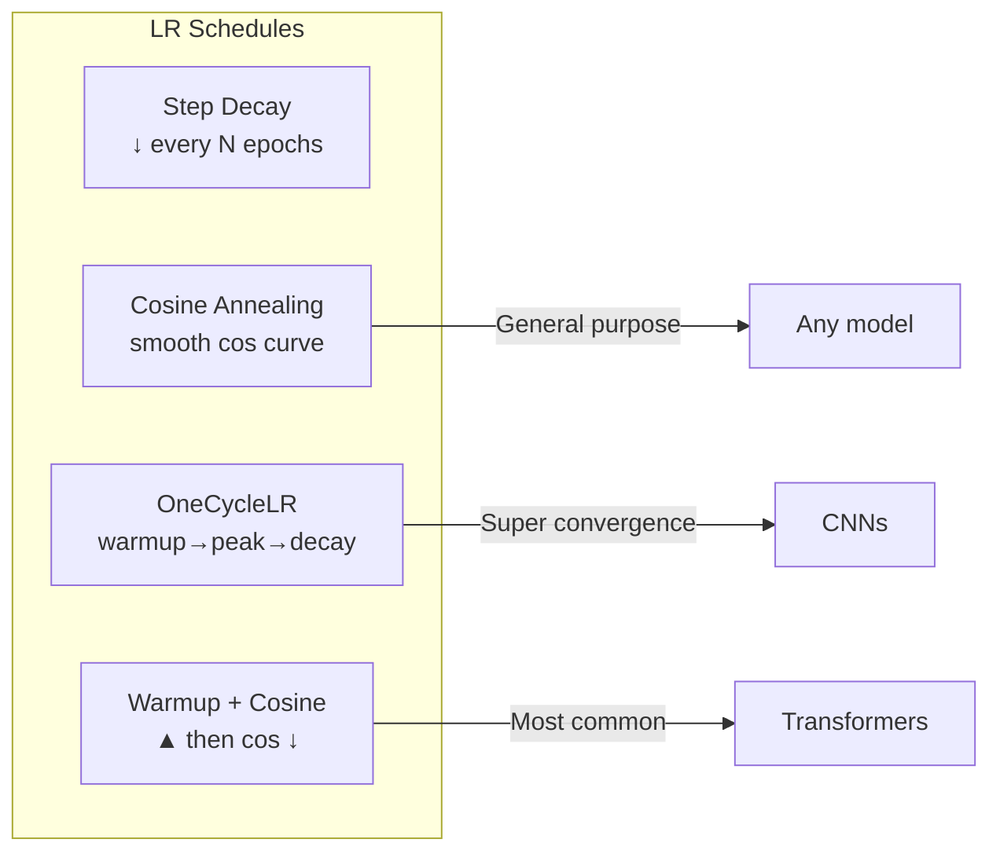
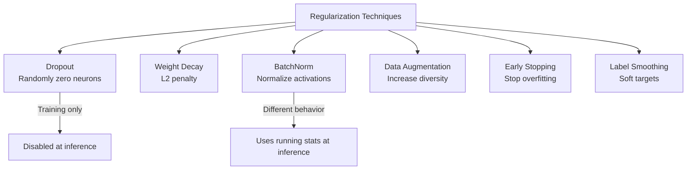

# 🧠 Neural Networks Fundamentals — Production Guide

> **Mục tiêu**: Hiểu sâu neural nets — forward pass, backprop, activations, optimizers, regularization.
> Đây là nền tảng CỐT LÕI — mọi kiến trúc DL đều xây trên đây.

---

## 1. From Perceptron to Deep Networks





### Forward Pass — PyTorch

```python
import torch
import torch.nn as nn

class SimpleNet(nn.Module):
    def __init__(self, input_dim, hidden_dim, output_dim):
        super().__init__()
        self.layers = nn.Sequential(
            nn.Linear(input_dim, hidden_dim),    # W₁x + b₁
            nn.ReLU(),                           # Activation
            nn.Linear(hidden_dim, hidden_dim),   # W₂h₁ + b₂
            nn.ReLU(),
            nn.Linear(hidden_dim, output_dim),   # W₃h₂ + b₃
        )
    
    def forward(self, x):
        return self.layers(x)

model = SimpleNet(784, 256, 10)  # MNIST: 28×28 → 256 hidden → 10 classes
print(f"Parameters: {sum(p.numel() for p in model.parameters()):,}")
# 784×256 + 256 + 256×256 + 256 + 256×10 + 10 = 269,322
```

---

## 2. Backpropagation — Chain Rule



```python
# PyTorch autograd handles backprop automatically
x = torch.randn(32, 784)      # Batch of 32 images
y_true = torch.randint(0, 10, (32,))  # True labels

# Forward
logits = model(x)                      # ŷ = f(x; W)
loss = nn.CrossEntropyLoss()(logits, y_true)  # L = CE(ŷ, y)

# Backward — Chain Rule through ALL layers automatically
loss.backward()  # ∂L/∂W for every parameter

# Each parameter now has .grad
for name, param in model.named_parameters():
    if param.grad is not None:
        print(f"{name}: shape={param.grad.shape}, norm={param.grad.norm():.4f}")
        break

# Manual chain rule example:
# L = CrossEntropy(softmax(W₃ · ReLU(W₂ · ReLU(W₁x + b₁) + b₂) + b₃), y)
# ∂L/∂W₁ = ∂L/∂ŷ · ∂ŷ/∂h₂ · ∂h₂/∂h₁ · ∂h₁/∂W₁
# Each term = Jacobian of that layer
```

### Gradient Problems



```python
# Fix vanishing gradient:
# 1. ReLU activation (gradient = 0 or 1, not < 1)
# 2. Residual connections (gradient highway)
# 3. Proper initialization (Kaiming/Xavier)
# 4. BatchNorm (normalize activations)

# Fix exploding gradient:
# 1. Gradient clipping
torch.nn.utils.clip_grad_norm_(model.parameters(), max_norm=1.0)
# 2. Proper initialization
nn.init.kaiming_normal_(layer.weight, mode='fan_out', nonlinearity='relu')
```

---

## 3. Activation Functions

| Function | Formula | Pros | Cons | Use |
|----------|---------|------|------|-----|
| **ReLU** | max(0, x) | Simple, fast, no vanishing | Dying neurons | Hidden layers (default) |
| **LeakyReLU** | max(0.01x, x) | No dying neurons | Slightly slower | When ReLU dies |
| **GELU** | x·Φ(x) | Smooth, Transformers | Slower | Transformers |
| **SiLU/Swish** | x·σ(x) | Non-monotonic, deep nets | Slower | EfficientNet, LLMs |
| **Sigmoid** | 1/(1+e⁻ˣ) | Output [0,1] | Vanishing gradient | Output (binary) |
| **Softmax** | eˣⁱ/Σeˣʲ | Probability distribution | — | Output (multi-class) |

```python
# ⚠️ Dying ReLU: if weights → all negative input, output = 0 forever
# gradient = 0 → weights never update → neuron is "dead"

# Fix options:
nn.LeakyReLU(negative_slope=0.01)  # f(x) = max(0.01x, x)
nn.PReLU()                          # Learnable negative slope
nn.GELU()                           # Smooth approximation of ReLU
```

---

## 4. Loss Functions



```python
# Binary Classification
loss_bce = nn.BCEWithLogitsLoss()  # Sigmoid + BCE (numerically stable)
# ⚠️ Input = raw logits, NOT after sigmoid

# Multi-class Classification
loss_ce = nn.CrossEntropyLoss()    # Softmax + NLL (numerically stable)
# ⚠️ Input = raw logits, NOT after softmax

# Regression
loss_mse = nn.MSELoss()            # Sensitive to outliers
loss_huber = nn.HuberLoss(delta=1.0)  # Robust to outliers (smooth L1)

# Imbalanced Classification
loss_weighted = nn.CrossEntropyLoss(
    weight=torch.tensor([1.0, 5.0, 3.0])  # Higher weight = rare class
)

# Segmentation: Focal Loss (hard example mining)
class FocalLoss(nn.Module):
    def __init__(self, alpha=0.25, gamma=2.0):
        super().__init__()
        self.alpha = alpha
        self.gamma = gamma
    
    def forward(self, inputs, targets):
        bce = nn.functional.binary_cross_entropy_with_logits(
            inputs, targets, reduction='none'
        )
        pt = torch.exp(-bce)  # probability of correct class
        focal = self.alpha * (1 - pt) ** self.gamma * bce
        return focal.mean()

# Segmentation: Dice Loss (overlap-based)
class DiceLoss(nn.Module):
    def __init__(self, smooth=1.0):
        super().__init__()
        self.smooth = smooth
    
    def forward(self, pred, target):
        pred = torch.sigmoid(pred)
        intersection = (pred * target).sum(dim=(2, 3))
        union = pred.sum(dim=(2, 3)) + target.sum(dim=(2, 3))
        dice = (2 * intersection + self.smooth) / (union + self.smooth)
        return 1 - dice.mean()

# Combined Loss (production standard for segmentation)
total_loss = 0.5 * ce_loss + 0.5 * dice_loss
```

---

## 5. Optimizers



```python
# SGD + Momentum (best for CNNs with careful tuning)
optimizer = torch.optim.SGD(
    model.parameters(), lr=0.01, momentum=0.9, weight_decay=1e-4
)

# Adam (default, quick convergence)
optimizer = torch.optim.Adam(model.parameters(), lr=1e-3)

# AdamW (STANDARD for Transformers — decoupled weight decay)
optimizer = torch.optim.AdamW(
    model.parameters(), lr=1e-3, weight_decay=0.01, betas=(0.9, 0.999)
)

# ⚠️ Adam vs AdamW:
# Adam: weight_decay mixed into gradient → wrong effective LR
# AdamW: weight_decay applied SEPARATELY → correct regularization
# → Always use AdamW for anything with weight decay
```

| Optimizer | Best for | LR Range | Key Params |
|-----------|----------|:--------:|-----------|
| **SGD + Momentum** | CNNs (ResNet, EfficientNet) | 0.01-0.1 | momentum=0.9 |
| **Adam** | Quick experiments | 1e-3 | betas=(0.9, 0.999) |
| **AdamW** | **Transformers** (standard) | 1e-5 to 5e-4 | wd=0.01-0.1 |
| **LAMB** | Large-batch training | 1e-3 | Used by BERT pre-training |

---

## 6. Learning Rate Scheduling



```python
from torch.optim.lr_scheduler import (
    StepLR, CosineAnnealingLR, OneCycleLR
)

# Cosine Annealing (smooth decay, most popular)
scheduler = CosineAnnealingLR(optimizer, T_max=100, eta_min=1e-6)

# OneCycleLR (warmup → peak → anneal — "super convergence")
scheduler = OneCycleLR(
    optimizer, max_lr=1e-3, 
    total_steps=len(train_loader) * num_epochs,
    pct_start=0.1,     # 10% warmup
    anneal_strategy='cos',
)

# Warmup + Cosine (Transformers standard)
from transformers import get_cosine_schedule_with_warmup
scheduler = get_cosine_schedule_with_warmup(
    optimizer, 
    num_warmup_steps=500,      # 5-10% of total steps
    num_training_steps=10000,
)

# ⚠️ Step scheduler: call per STEP for OneCycleLR, per EPOCH for others
```

---

## 7. Regularization



| Technique | Mechanism | Typical Value | When |
|-----------|-----------|:------------:|------|
| **Dropout** | Randomly zero neurons | p=0.1-0.5 | Hidden layers |
| **Weight Decay** | L2 penalty on weights | 0.01-0.1 | Always (AdamW) |
| **Batch Norm** | Normalize per batch | — | CNNs |
| **Layer Norm** | Normalize per sample | — | Transformers |
| **Data Augmentation** | Random transforms | — | Always for images |
| **Early Stopping** | Stop when val ↑ | patience=10-20 | Training loop |
| **Label Smoothing** | Soft targets | 0.1 | Classification |
| **Stochastic Depth** | Drop entire layers | p=0.1-0.3 | Deep ResNets |

```python
# Label Smoothing — prevents over-confidence
loss = nn.CrossEntropyLoss(label_smoothing=0.1)
# Target: [0, 0, 1, 0] → [0.025, 0.025, 0.925, 0.025]
# → Better calibration, better generalization

# Mixup — mix two training samples
def mixup(x1, y1, x2, y2, alpha=0.2):
    lam = np.random.beta(alpha, alpha)
    x_mixed = lam * x1 + (1 - lam) * x2
    y_mixed = lam * y1 + (1 - lam) * y2
    return x_mixed, y_mixed
```

---

## 8. Weight Initialization

```python
# ⚠️ Bad init → vanishing/exploding activations → training fails

# Kaiming (He) — best for ReLU networks
nn.init.kaiming_normal_(conv.weight, mode='fan_out', nonlinearity='relu')

# Xavier (Glorot) — best for sigmoid/tanh
nn.init.xavier_uniform_(linear.weight)

# Modern practice: most frameworks handle this automatically
# PyTorch nn.Linear and nn.Conv2d use Kaiming uniform by default

# Custom initialization for a full model:
def init_weights(m):
    if isinstance(m, nn.Conv2d):
        nn.init.kaiming_normal_(m.weight, mode='fan_out', nonlinearity='relu')
    elif isinstance(m, nn.BatchNorm2d):
        nn.init.constant_(m.weight, 1)
        nn.init.constant_(m.bias, 0)
    elif isinstance(m, nn.Linear):
        nn.init.xavier_uniform_(m.weight)
        nn.init.constant_(m.bias, 0)

model.apply(init_weights)
```

---

## 🎯 Interview Tips — Chi Tiết

### Q1: "Backpropagation giải thích?"
**A**: Chain rule: ∂L/∂W = ∂L/∂ŷ · ∂ŷ/∂h · ∂h/∂W. Start from output, propagate gradients back through each layer. PyTorch autograd builds computation graph during forward, then traverses backward. Complexity: O(params) per backward pass.

### Q2: "Vanishing gradient?"
**A**: Gradients shrink through many layers (sigmoid/tanh derivatives < 1). After 10+ layers, gradient ≈ 0 → early layers don't learn. Fix: (1) ReLU (gradient = 0 or 1), (2) Residual connections (gradient highway), (3) Proper init (Kaiming), (4) BatchNorm.

### Q3: "BatchNorm vs LayerNorm?"
**A**: BatchNorm: normalize across batch dimension → needs large batch, different train/eval behavior. LayerNorm: normalize across feature dimension → batch-independent, same train/eval. BN for CNNs, LN for Transformers. RMSNorm (LLaMA): simplified LN, no mean subtraction.

### Q4: "AdamW vs Adam?"
**A**: Adam: weight decay mixed into gradient → incorrect effective regularization with adaptive LR. AdamW: weight decay applied separately (decoupled) → mathematically correct. Always use AdamW when using weight decay (especially Transformers).

### Q5: "Dropout at inference?"
**A**: Disabled (model.eval()). During training: randomly zero p% of neurons → prevent co-adaptation → each neuron must be independent. At inference: all neurons active, outputs scaled by (1-p) to maintain expected values.

### Q6: "Loss function for imbalanced data?"
**A**: (1) Weighted CrossEntropy (class weights inversely proportional to frequency). (2) Focal Loss (down-weight easy examples, focus on hard). (3) Dice Loss (overlap-based, good for segmentation). (4) Oversampling minority class. Production: combine CE + Dice for segmentation.

### Q7: "Learning rate warmup?"
**A**: Early training: random weights → large, noisy gradients → unstable. Warmup: start with tiny LR → ramp up → stabilize training. Standard: 5-10% of total steps. Critical for Transformers (Adam needs time to estimate moments).

### Q8: "Gradient clipping?"
**A**: Prevent exploding gradients by capping gradient norm. `clip_grad_norm_(params, max_norm=1.0)` → if ‖∇‖ > 1.0, scale down proportionally. Essential for RNNs and Transformers. Set max_norm=1.0 as default.
