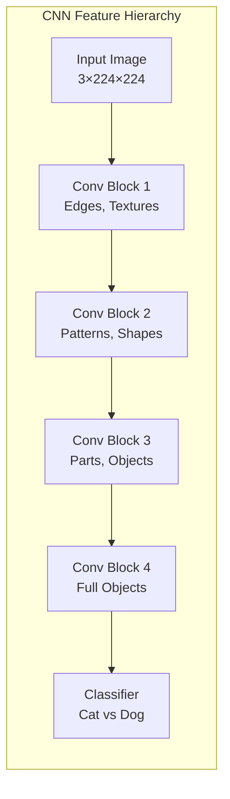
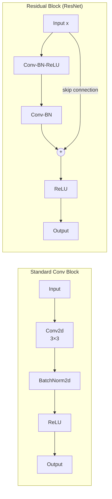
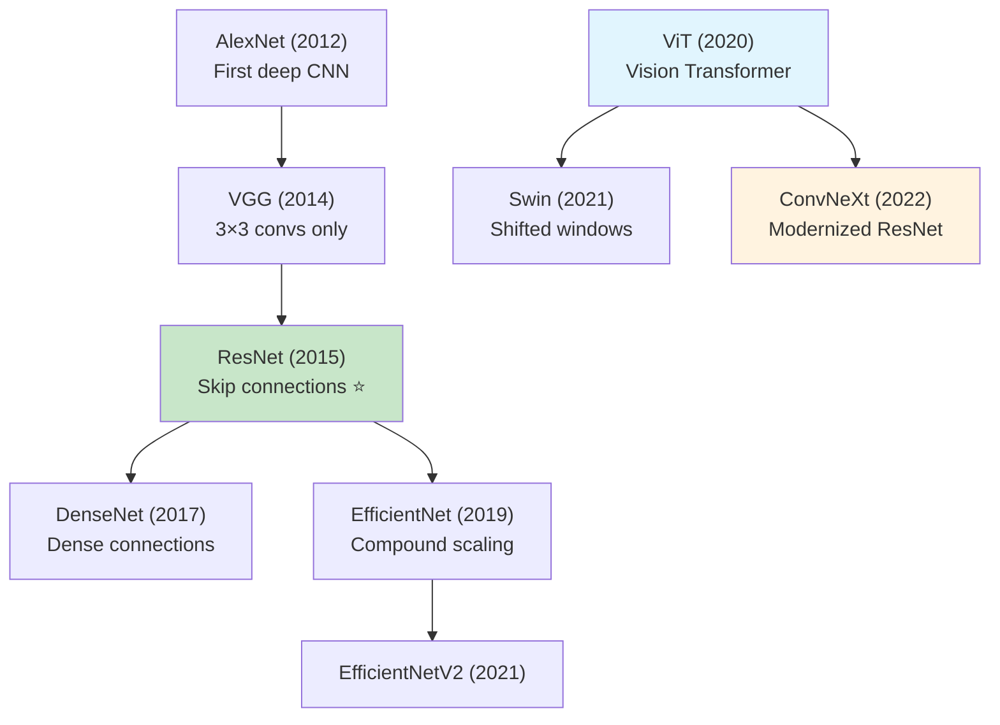
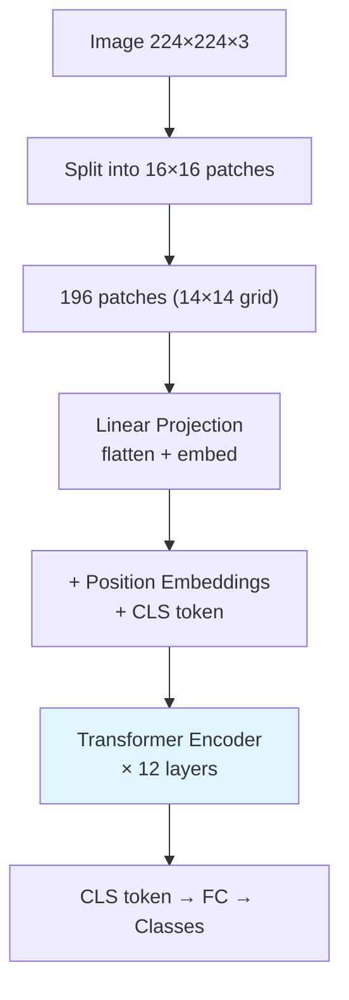
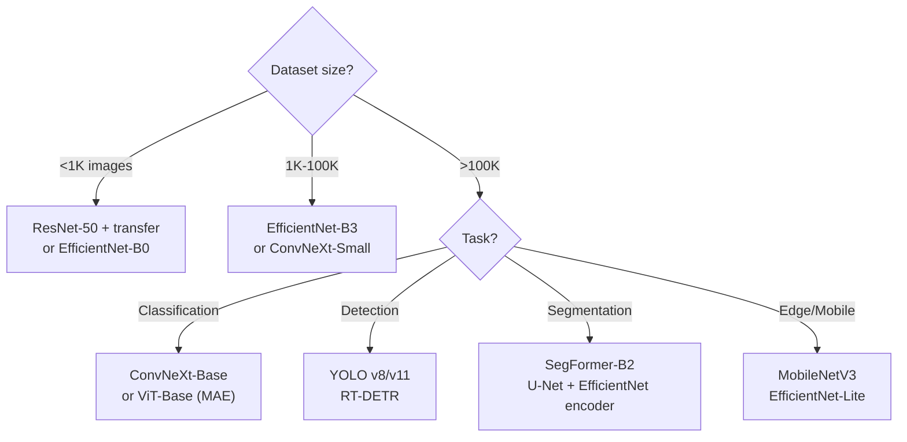

# 🏗️ CNN Architectures — Production Guide

> **Mục tiêu**: Hiểu CNN từ cơ bản đến modern — Conv ops, ResNet, EfficientNet, ViT, ConvNeXt.
> CNN = backbone of every computer vision system.

---

## 1. Convolution Operation



```python
import torch.nn as nn

# Conv2d — the fundamental building block
conv = nn.Conv2d(
    in_channels=3,     # RGB input
    out_channels=16,   # 16 filters → 16 output feature maps
    kernel_size=3,     # 3×3 filter
    stride=1,          # Step size (1 = slide by 1 pixel)
    padding=1,         # Same padding: output_size = input_size
)
# Parameters: C_in × C_out × K × K + C_out(bias)
# = 3 × 16 × 3 × 3 + 16 = 448

# Output size formula:
# H_out = (H_in + 2×padding - kernel_size) / stride + 1
# With padding=1, stride=1, kernel=3: H_out = H_in ✅

# Receptive field (what one output neuron "sees"):
# Layer 1 (3×3): sees 3×3 pixels
# Layer 2 (3×3): sees 5×5 pixels (through layer 1)
# Layer 3 (3×3): sees 7×7 pixels
# → Deeper = larger receptive field = more global context
```

---

## 2. Key Building Blocks



```python
# Standard Conv-BN-ReLU block
class ConvBlock(nn.Module):
    def __init__(self, in_ch, out_ch, kernel=3, stride=1):
        super().__init__()
        self.block = nn.Sequential(
            nn.Conv2d(in_ch, out_ch, kernel, stride, padding=kernel//2, bias=False),
            nn.BatchNorm2d(out_ch),
            nn.ReLU(inplace=True),
        )
    def forward(self, x):
        return self.block(x)

# Residual Block (ResNet)
class ResidualBlock(nn.Module):
    def __init__(self, channels):
        super().__init__()
        self.conv1 = nn.Conv2d(channels, channels, 3, padding=1, bias=False)
        self.bn1 = nn.BatchNorm2d(channels)
        self.conv2 = nn.Conv2d(channels, channels, 3, padding=1, bias=False)
        self.bn2 = nn.BatchNorm2d(channels)
        self.relu = nn.ReLU(inplace=True)
    
    def forward(self, x):
        identity = x                      # Skip connection = gradient highway
        out = self.relu(self.bn1(self.conv1(x)))
        out = self.bn2(self.conv2(out))
        out = out + identity               # F(x) + x
        return self.relu(out)

# Bottleneck Block (ResNet-50+) — more efficient
class Bottleneck(nn.Module):
    def __init__(self, in_ch, mid_ch, out_ch):
        super().__init__()
        self.conv1 = nn.Conv2d(in_ch, mid_ch, 1, bias=False)     # 1×1 reduce
        self.bn1 = nn.BatchNorm2d(mid_ch)
        self.conv2 = nn.Conv2d(mid_ch, mid_ch, 3, padding=1, bias=False)  # 3×3
        self.bn2 = nn.BatchNorm2d(mid_ch)
        self.conv3 = nn.Conv2d(mid_ch, out_ch, 1, bias=False)    # 1×1 expand
        self.bn3 = nn.BatchNorm2d(out_ch)
        self.relu = nn.ReLU(inplace=True)
        # Shortcut if dimensions change
        self.shortcut = nn.Identity() if in_ch == out_ch else \
            nn.Sequential(nn.Conv2d(in_ch, out_ch, 1, bias=False), nn.BatchNorm2d(out_ch))
    
    def forward(self, x):
        out = self.relu(self.bn1(self.conv1(x)))
        out = self.relu(self.bn2(self.conv2(out)))
        out = self.bn3(self.conv3(out))
        return self.relu(out + self.shortcut(x))

# Depthwise Separable Conv (MobileNet) — 8-9x fewer params!
class DepthwiseSeparable(nn.Module):
    def __init__(self, in_ch, out_ch):
        super().__init__()
        self.depthwise = nn.Conv2d(in_ch, in_ch, 3, padding=1, groups=in_ch)  # Per-channel
        self.pointwise = nn.Conv2d(in_ch, out_ch, 1)                          # Mix channels
    def forward(self, x):
        return self.pointwise(self.depthwise(x))
# Standard: C_in × C_out × 3 × 3 = 64×128×9 = 73,728 params
# DW Sep:   C_in × 9 + C_in × C_out = 64×9 + 64×128 = 8,768 params (8.4x fewer!)
```

---

## 3. Architecture Evolution



| Year | Model | Key Innovation | Params | ImageNet Top-1 |
|------|-------|---------------|:------:|:--------------:|
| 2012 | **AlexNet** | First deep CNN, GPU training | 61M | 63.3% |
| 2014 | **VGG-16** | 3×3 convs only, deeper is better | 138M | 74.4% |
| 2015 | **ResNet-50** | **Skip connections** ⭐ | 25M | 76.1% |
| 2017 | **DenseNet** | Dense connections between layers | 20M | 77.4% |
| 2019 | **EfficientNet-B0** | **Compound scaling** (d×w×r) | 5M | 77.1% |
| 2020 | **ViT-B/16** | Image patches as tokens | 86M | 77.9% |
| 2021 | **Swin-B** | Shifted window attention | 88M | 83.5% |
| 2022 | **ConvNeXt-B** | Modernized ResNet (learned from ViT) | 89M | 84.1% |

### EfficientNet — Compound Scaling

```python
# EfficientNet scales 3 dimensions simultaneously:
# depth (layers), width (channels), resolution (input size)
# B0 → B7: increasingly larger

import timm

# Using timm (PyTorch Image Models) — best library for pretrained models
model = timm.create_model('efficientnet_b0', pretrained=True, num_classes=10)
model = timm.create_model('efficientnet_b3', pretrained=True, num_classes=10)

# Parameters comparison:
# B0: 5.3M params, 224×224 → fast, good baseline
# B3: 12M params, 300×300 → excellent accuracy/speed trade-off
# B7: 66M params, 600×600 → max accuracy, slow
```

---

## 4. Vision Transformers (ViT)



```python
import timm

# ViT — needs large dataset or strong pretrained weights
vit = timm.create_model('vit_base_patch16_224', pretrained=True, num_classes=10)

# Swin Transformer — hierarchical, more efficient
swin = timm.create_model('swin_base_patch4_window7_224', pretrained=True, num_classes=10)

# ConvNeXt — "modernized ResNet" rivaling ViT
convnext = timm.create_model('convnext_base', pretrained=True, num_classes=10)

# SegFormer — segmentation transformer
import segmentation_models_pytorch as smp
segformer = smp.create_model(
    "segformer",
    encoder_name="mit_b2",
    encoder_weights="imagenet",
    in_channels=3,
    classes=9,
)
```

### ViT vs CNN

| | CNN | ViT | ConvNeXt |
|-|-----|-----|----------|
| **Inductive bias** | Translation invariance, locality | None (learned) | Locality |
| **Small data** | ⭐⭐⭐⭐⭐ | ⭐⭐ (needs 300M+ images) | ⭐⭐⭐⭐⭐ |
| **Large data** | ⭐⭐⭐ | ⭐⭐⭐⭐⭐ | ⭐⭐⭐⭐ |
| **Compute** | Efficient | Quadratic attention | Efficient |
| **Best for** | Small/medium datasets | Huge datasets, MAE pre-training | General purpose |

---

## 5. Model Selection Guide



---

## 🎯 Interview Tips — Chi Tiết

### Q1: "Conv layer parameter count?"
**A**: `C_in × C_out × K × K + C_out(bias)`. Example: Conv2d(3, 16, 3) = 3×16×3×3+16 = 448. No padding/stride in param count — they only affect output spatial size.

### Q2: "ResNet skip connections tại sao quan trọng?"
**A**: Giải quyết vanishing gradient: gradient flows directly through skip connection (identity shortcut). Train 100+ layers without degradation. Mathematically: gradient of identity = 1, always non-zero. Also: ensemble of shallow networks.

### Q3: "1×1 convolution dùng gì?"
**A**: (1) Reduce channels cheaply (ResNet bottleneck: 256→64→256). (2) Mix channel information. (3) Add non-linearity without changing spatial dims. Used in: Inception, ResNet, MobileNet, SqueezeNet.

### Q4: "ViT vs CNN?"
**A**: ViT: global attention (any patch attends to any other), needs huge data (300M+) or strong pre-training (MAE/DINOv2). CNN: local filters, translation invariance (inductive bias), works with small data. ConvNeXt: best of both worlds.

### Q5: "Receptive field?"
**A**: Region in input that one output neuron "sees". Stack of 3×3 convs: layer1=3×3, layer2=5×5, layer3=7×7. Dilated conv: increase RF without adding params. Global Average Pooling: RF = entire image. Attention: RF = unlimited.

### Q6: "Depthwise separable conv?"
**A**: Split standard conv into: (1) depthwise = one filter per channel (spatial), (2) pointwise = 1×1 conv (channel mixing). 8-9x fewer params, similar accuracy. Used in MobileNet, EfficientNet. Trade-off: slightly less representational power.

### Q7: "EfficientNet compound scaling?"
**A**: Scale depth (layers), width (channels), resolution (input size) simultaneously with fixed ratios. B0→B7. Better than scaling only one dimension. Example: B0=224×224, B3=300×300, B7=600×600.

### Q8: "BatchNorm in CNN?"
**A**: Normalize activations per batch → smoother loss landscape → faster training. Uses running mean/var at inference. Issues: small batch size breaks BN (use GroupNorm instead), different train/eval behavior causes bugs if you forget model.eval().
