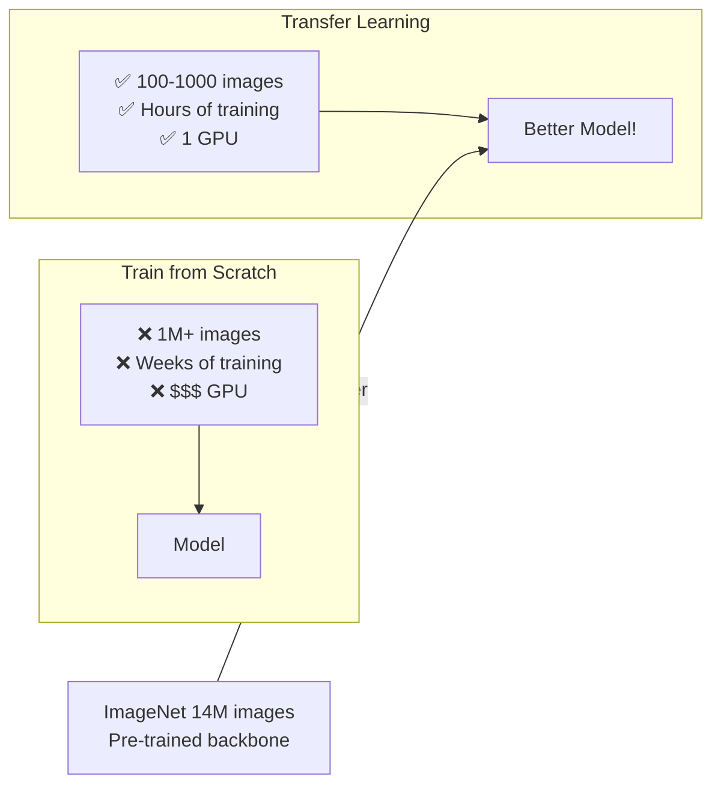
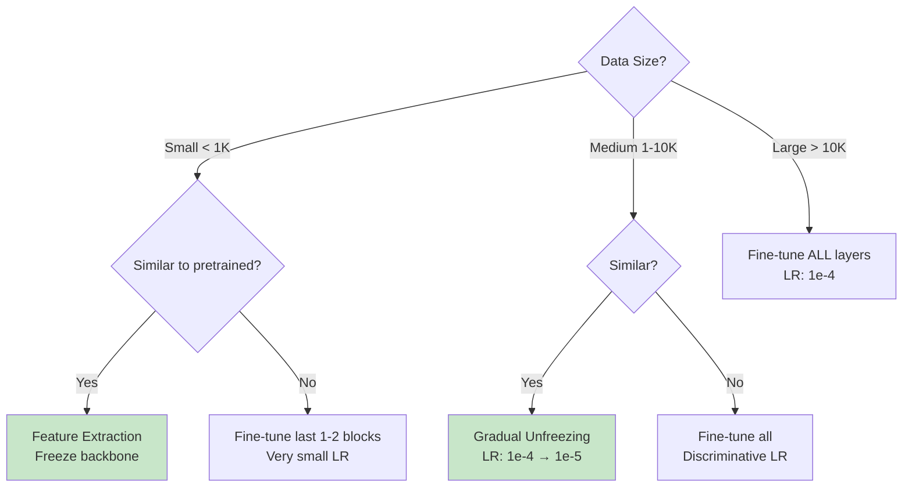
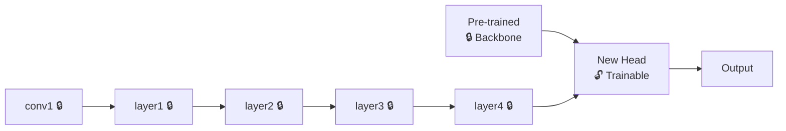
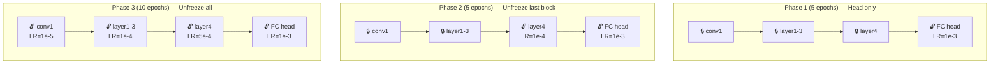
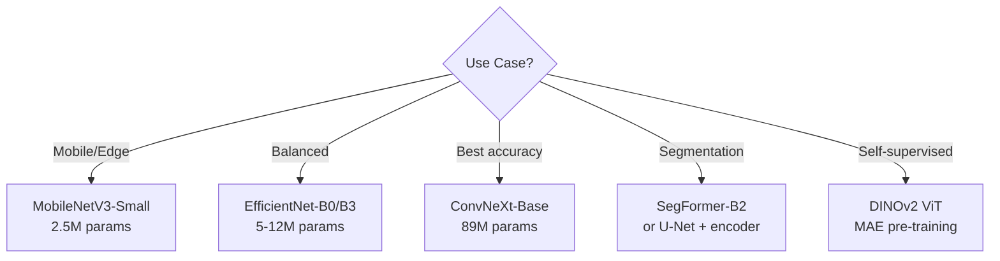

# 🎯 Transfer Learning — Production Guide

> **Mục tiêu**: Tận dụng pretrained models — fine-tuning strategies, feature extraction, domain adaptation.
> Transfer learning = "đứng trên vai người khổng lồ". 95% CV tasks nên bắt đầu từ đây.

---

## 1. Tại sao Transfer Learning?





| Data Size | Similar to ImageNet | Strategy | Example |
|:---------:|:-------------------:|----------|---------|
| **Small + Similar** | ✅ | Feature extraction (freeze all) | Medical X-ray → Medical CT |
| **Small + Different** | ❌ | Fine-tune last layers only | Natural images → satellite |
| **Large + Similar** | ✅ | Fine-tune all (lower LR) | ImageNet → food classification |
| **Large + Different** | ❌ | Fine-tune all or train from scratch | Photos → microscope images |

---

## 2. Feature Extraction (Freeze Backbone)



```python
import torch
import torchvision.models as models
import timm

# === Method 1: torchvision ===
model = models.resnet50(weights="IMAGENET1K_V2")

# Freeze ALL backbone parameters
for param in model.parameters():
    param.requires_grad = False

# Replace classifier head (only this is trainable)
model.fc = torch.nn.Sequential(
    torch.nn.Linear(2048, 512),
    torch.nn.ReLU(),
    torch.nn.Dropout(0.3),
    torch.nn.Linear(512, num_classes),
)

trainable = sum(p.numel() for p in model.parameters() if p.requires_grad)
total = sum(p.numel() for p in model.parameters())
print(f"Trainable: {trainable:,} / {total:,} ({100*trainable/total:.1f}%)")
# → Trainable: 1,054,730 / 24,558,026 (4.3%)

# === Method 2: timm (RECOMMENDED) ===
model = timm.create_model('efficientnet_b3', pretrained=True, num_classes=num_classes)

# Freeze backbone, keep classifier trainable
for param in model.parameters():
    param.requires_grad = False
for param in model.classifier.parameters():
    param.requires_grad = True

# === Method 3: timm with feature extraction ===
model = timm.create_model('convnext_base', pretrained=True, num_classes=0)  # Remove head
features = model(images)  # Returns feature vector (1024-d for ConvNeXt-Base)
```

---

## 3. Fine-tuning Strategies

### 3.1 Gradual Unfreezing



```python
# === Phase 1: Train only head (5 epochs, LR=1e-3) ===
for param in model.parameters():
    param.requires_grad = False
for param in model.fc.parameters():
    param.requires_grad = True

optimizer = torch.optim.AdamW(model.fc.parameters(), lr=1e-3)
train_epochs(model, optimizer, epochs=5)

# === Phase 2: Unfreeze last block (5 epochs, LR=1e-4) ===
for param in model.layer4.parameters():
    param.requires_grad = True

optimizer = torch.optim.AdamW([
    {"params": model.layer4.parameters(), "lr": 1e-4},
    {"params": model.fc.parameters(), "lr": 1e-3},
], weight_decay=0.01)
train_epochs(model, optimizer, epochs=5)

# === Phase 3: Unfreeze all (10 epochs, LR=1e-5) ===
for param in model.parameters():
    param.requires_grad = True
# Use discriminative learning rates (see below)
```

### 3.2 Discriminative Learning Rates

```python
# Different learning rates for different depths
# Early layers (generic features: edges, textures): LOW LR — don't destroy
# Later layers (task-specific features): HIGHER LR — adapt fast

param_groups = [
    {"params": model.conv1.parameters(), "lr": 1e-5},    # Very generic
    {"params": model.layer1.parameters(), "lr": 1e-5},
    {"params": model.layer2.parameters(), "lr": 5e-5},
    {"params": model.layer3.parameters(), "lr": 1e-4},
    {"params": model.layer4.parameters(), "lr": 5e-4},   # Task-specific
    {"params": model.fc.parameters(), "lr": 1e-3},       # New head
]
optimizer = torch.optim.AdamW(param_groups, weight_decay=0.01)

# Alternative: layer-wise LR decay (multiplicative factor)
def get_param_groups_with_decay(model, base_lr=1e-3, decay_factor=0.65):
    """Each layer group gets decay_factor × previous layer's LR"""
    groups = []
    layers = [model.conv1, model.layer1, model.layer2, model.layer3, model.layer4, model.fc]
    for i, layer in enumerate(reversed(layers)):
        lr = base_lr * (decay_factor ** i)
        groups.append({"params": layer.parameters(), "lr": lr})
    return groups
# fc: 1e-3, layer4: 6.5e-4, layer3: 4.2e-4, layer2: 2.7e-4, ...
```

---

## 4. Data Augmentation cho Fine-tuning

```python
from torchvision import transforms
import albumentations as A
from albumentations.pytorch import ToTensorV2

# === Standard torchvision ===
train_transform = transforms.Compose([
    transforms.RandomResizedCrop(224, scale=(0.8, 1.0)),
    transforms.RandomHorizontalFlip(),
    transforms.RandomVerticalFlip(),
    transforms.RandomRotation(15),
    transforms.ColorJitter(brightness=0.2, contrast=0.2, saturation=0.2),
    transforms.ToTensor(),
    transforms.Normalize(mean=[0.485, 0.456, 0.406], std=[0.229, 0.224, 0.225]),
])

# === Albumentations (FASTER, more options) ===
train_transform = A.Compose([
    A.RandomResizedCrop(224, 224, scale=(0.8, 1.0)),
    A.HorizontalFlip(p=0.5),
    A.ShiftScaleRotate(shift_limit=0.1, scale_limit=0.1, rotate_limit=15, p=0.5),
    A.OneOf([
        A.GaussianBlur(blur_limit=3),
        A.MedianBlur(blur_limit=3),
    ], p=0.3),
    A.CoarseDropout(max_holes=8, max_height=16, max_width=16, p=0.3),  # Cutout
    A.Normalize(mean=[0.485, 0.456, 0.406], std=[0.229, 0.224, 0.225]),
    ToTensorV2(),
])

# Validation/Test — NO augmentation!
val_transform = A.Compose([
    A.Resize(256, 256),
    A.CenterCrop(224, 224),
    A.Normalize(mean=[0.485, 0.456, 0.406], std=[0.229, 0.224, 0.225]),
    ToTensorV2(),
])

# ⚠️ Domain-specific cautions:
# Medical: DON'T flip left/right (organ laterality matters)
# Satellite: DO flip + rotate 90° (no fixed orientation)
# OCR/Text: DON'T rotate heavily (text direction matters)
```

---

## 5. Production Fine-tuning Pipeline

```python
import timm
import torch
import torch.nn as nn
from torch.cuda.amp import autocast, GradScaler

class FineTuner:
    def __init__(self, model_name='efficientnet_b3', num_classes=10, device='cuda'):
        self.device = device
        self.model = timm.create_model(model_name, pretrained=True, num_classes=num_classes)
        self.model.to(device)
        self.scaler = GradScaler()
    
    def freeze_backbone(self):
        """Phase 1: Only train classifier"""
        for param in self.model.parameters():
            param.requires_grad = False
        for param in self.model.classifier.parameters():
            param.requires_grad = True
    
    def unfreeze_all(self, base_lr=1e-4, head_lr=1e-3):
        """Phase 2: Discriminative LR"""
        for param in self.model.parameters():
            param.requires_grad = True
        
        # Separate backbone and head
        backbone_params = [p for n, p in self.model.named_parameters() 
                          if 'classifier' not in n]
        head_params = list(self.model.classifier.parameters())
        
        self.optimizer = torch.optim.AdamW([
            {"params": backbone_params, "lr": base_lr},
            {"params": head_params, "lr": head_lr},
        ], weight_decay=0.01)
    
    def train_step(self, images, labels):
        self.model.train()
        images, labels = images.to(self.device), labels.to(self.device)
        
        with autocast(device_type='cuda', dtype=torch.float16):
            logits = self.model(images)
            loss = nn.CrossEntropyLoss(label_smoothing=0.1)(logits, labels)
        
        self.scaler.scale(loss).backward()
        self.scaler.unscale_(self.optimizer)
        torch.nn.utils.clip_grad_norm_(self.model.parameters(), 1.0)
        self.scaler.step(self.optimizer)
        self.scaler.update()
        self.optimizer.zero_grad()
        
        return loss.item(), logits.argmax(1)

# Usage:
finetuner = FineTuner('convnext_small', num_classes=5)
finetuner.freeze_backbone()       # Phase 1
# ... train head for 5 epochs ...
finetuner.unfreeze_all()          # Phase 2  
# ... train all for 15 epochs ...
```

---

## 6. Pretrained Models Cheat Sheet



| Model | Params | Speed | Accuracy | Best For |
|-------|:------:|:-----:|:--------:|----------|
| MobileNetV3-Small | 2.5M | ⭐⭐⭐⭐⭐ | ⭐⭐ | Edge/Mobile deploy |
| **EfficientNet-B0** | 5M | ⭐⭐⭐⭐ | ⭐⭐⭐ | Quick baseline |
| **EfficientNet-B3** | 12M | ⭐⭐⭐ | ⭐⭐⭐⭐ | **Sweet spot** ⭐ |
| ResNet-50 | 25M | ⭐⭐⭐ | ⭐⭐⭐ | Standard comparison |
| **ConvNeXt-Base** | 89M | ⭐⭐ | ⭐⭐⭐⭐⭐ | Max accuracy (CNN) |
| ViT-Base (MAE) | 86M | ⭐⭐ | ⭐⭐⭐⭐ | Large dataset |
| SegFormer-B2 | 25M | ⭐⭐⭐ | ⭐⭐⭐⭐ | Segmentation |
| DINOv2 ViT-B | 86M | ⭐⭐ | ⭐⭐⭐⭐⭐ | Feature extraction |

---

## 🎯 Interview Tips — Chi Tiết

### Q1: "Freeze layers tại sao?"
**A**: Early CNN layers learn generic features (edges, textures) applicable to any image → keep them. Late layers learn task-specific features → retrain. Freezing also prevents catastrophic forgetting of pretrained knowledge and reduces compute/memory.

### Q2: "Learning rate cho fine-tuning?"
**A**: 10-100x nhỏ hơn training from scratch. Head: 1e-3, backbone: 1e-5. Lý do: pretrained weights already near good minimum → large LR sẽ destroy them. Discriminative LR: lower for early layers, higher for later layers.

### Q3: "Catastrophic forgetting?"
**A**: Model forgets pretrained knowledge when fine-tuned aggressively. Fix: (1) Small LR, (2) Gradual unfreezing, (3) L2 regularization toward pretrained weights (EWC), (4) Learning without Forgetting (LwF) — distillation from original model.

### Q4: "Data augmentation khi nào KHÔNG nên?"
**A**: When augmentation changes semantic meaning. Medical: flip left/right (organ laterality). Text OCR: heavy rotation. Satellite: vertical flip OK but color jitter risky. Always domain-specific validation.

### Q5: "Transfer learning failure cases?"
**A**: Source domain quá khác target (ImageNet → microscope images). Fix: (1) Find closer pretrained model, (2) Self-supervised pre-training on target domain, (3) Domain adaptation techniques (fine-tune on unlabeled target data).

### Q6: "timm vs torchvision?"
**A**: timm: 800+ models, latest architectures (ConvNeXt, EfficientNetV2, MaxViT), consistent API, pretrained weights from various sources. torchvision: fewer models but more stable, official PyTorch. Production: timm for model selection → export to ONNX.
