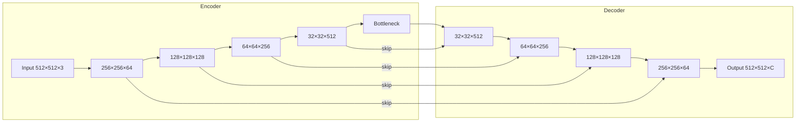
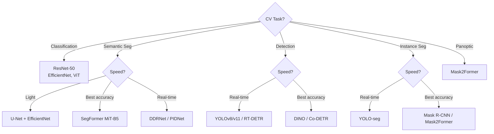
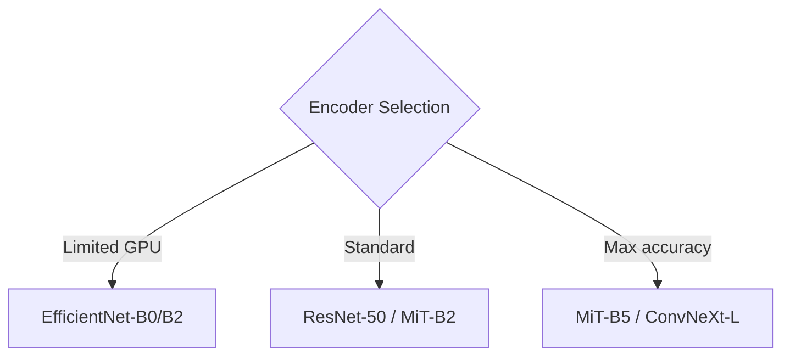

# 🖼️ Segmentation & Object Detection — Deep Dive

> **Mục tiêu**: U-Net variants, YOLO family, mIoU/mAP, loss functions, augmentation, model selection.
> Computer Vision = backbone + task head. Master cả hai.

---

## 1. Semantic Segmentation

### 1.1 Architecture: Encoder-Decoder + Skip Connections



**Skip Connections**: combine low-level features (edges, textures — spatial detail) + high-level features (objects, context — semantic info). Thiếu skip connections → output smooth, mất detail.

### 1.2 Architecture Comparison

| Architecture | Encoder | Decoder | Key Innovation | Best For |
|-------------|---------|---------|----------------|----------|
| **U-Net** | Symmetric | Skip connections | Simple, effective | Medical, general |
| **U-Net++** | Nested | Dense skip paths | Better feature fusion | Medical (small objects) |
| **FPN** | Top-down | Multi-scale | Feature pyramids | Detection + segmentation |
| **DeepLabV3+** | Atrous/dilated conv | ASPP | Multi-scale w/o downsample | Scene parsing |
| **SegFormer** | MiT (Transformer) | Simple MLP | Efficient, no positional encoding | SOTA general |

### 1.3 Using segmentation-models-pytorch (SMP)

```python
import segmentation_models_pytorch as smp

# ── U-Net (default choice) ──
model = smp.Unet(
    encoder_name="resnet50",        # Backbone
    encoder_weights="imagenet",     # Pretrained weights
    in_channels=3,
    classes=9,                      # Number of output classes
)

# ── FPN (Feature Pyramid Network) — good for multi-scale ──
model = smp.FPN(
    encoder_name="efficientnet-b4",
    encoder_weights="imagenet",
    classes=9,
)

# ── DeepLabV3+ — state-of-art for scene understanding ──
model = smp.DeepLabV3Plus(
    encoder_name="mit_b5",          # MiT-B5 (SegFormer backbone)
    encoder_weights="imagenet",
    classes=9,
)

# ── Inference ──
import torch
model.eval()
with torch.no_grad():
    x = torch.randn(1, 3, 512, 512)
    logits = model(x)               # (1, 9, 512, 512)
    pred = logits.argmax(dim=1)     # (1, 512, 512) — class per pixel
```

### 1.4 Encoder Selection Guide

| Encoder | Params | Speed | Accuracy | Use Case |
|---------|:------:|:-----:|:--------:|----------|
| ResNet-34 | 21M | ⚡⚡⚡ | Good | Baseline, fast inference |
| ResNet-50 | 25M | ⚡⚡ | Better | Default safe choice |
| EfficientNet-B4 | 19M | ⚡⚡ | Better+ | Efficiency-focused |
| MiT-B2 | 25M | ⚡⚡ | SOTA | General production |
| MiT-B5 | 82M | ⚡ | Best | Max accuracy, enough GPU |

---

## 2. Metrics Deep Dive

### 2.1 IoU (Intersection over Union)

```python
import numpy as np

def iou_per_class(pred, target, num_classes):
    """
    IoU per class + mIoU.
    pred, target: (H, W) arrays with class indices.
    """
    ious = {}
    for cls in range(num_classes):
        pred_mask = (pred == cls)
        target_mask = (target == cls)
        
        intersection = (pred_mask & target_mask).sum()
        union = (pred_mask | target_mask).sum()
        
        if union == 0:
            ious[cls] = float('nan')  # Class absent in both
        else:
            ious[cls] = float(intersection / union)
    
    miou = np.nanmean(list(ious.values()))
    return ious, miou

# Example
ious, miou = iou_per_class(pred_mask, gt_mask, num_classes=9)
for cls, iou in ious.items():
    print(f"  Class {cls}: IoU = {iou:.4f}")
print(f"mIoU: {miou:.4f}")
```

### 2.2 Dice Coefficient

```python
def dice_score(pred, target, smooth=1e-6):
    """
    Dice = 2 * |A ∩ B| / (|A| + |B|)
    Equivalent to F1-score for pixels.
    Dice = 2*IoU / (1 + IoU)
    """
    intersection = (pred & target).sum()
    return (2 * intersection + smooth) / (pred.sum() + target.sum() + smooth)

# Dice vs IoU relationship:
# IoU = 0.5 → Dice = 0.667
# IoU = 0.7 → Dice = 0.824
# IoU = 0.9 → Dice = 0.947
# Dice always >= IoU
```

### 2.3 Confusion Matrix for Segmentation

```python
def segmentation_confusion_matrix(pred, target, num_classes):
    """Per-pixel confusion matrix."""
    cm = np.zeros((num_classes, num_classes), dtype=np.int64)
    for true_cls in range(num_classes):
        for pred_cls in range(num_classes):
            cm[true_cls, pred_cls] = ((target == true_cls) & (pred == pred_cls)).sum()
    
    # Per-class metrics from confusion matrix
    per_class_acc = np.diag(cm) / (cm.sum(axis=1) + 1e-8)  # Recall per class
    per_class_prec = np.diag(cm) / (cm.sum(axis=0) + 1e-8)  # Precision per class
    return cm, per_class_acc, per_class_prec
```

---

## 3. Loss Functions cho Segmentation

### 3.1 Standard Losses

```python
import torch
import torch.nn as nn

# ── Cross-Entropy (per-pixel classification) ──
# ⚠️ class_weights CRITICAL cho imbalanced datasets
class_counts = [500000, 10000, 3000, 2000, ...]  # pixel counts per class
class_weights = 1.0 / torch.tensor(class_counts, dtype=torch.float)
class_weights /= class_weights.sum()
loss_ce = nn.CrossEntropyLoss(weight=class_weights.cuda())

# ── Focal Loss (hard example mining) ──
class FocalLoss(nn.Module):
    """Down-weight easy examples, focus on hard ones."""
    def __init__(self, alpha=0.25, gamma=2.0):
        super().__init__()
        self.alpha = alpha
        self.gamma = gamma  # γ=0 → standard CE, γ=2 → focus on hard
    
    def forward(self, pred, target):
        ce = nn.functional.cross_entropy(pred, target, reduction='none')
        pt = torch.exp(-ce)  # p_t = model confidence
        focal = self.alpha * (1 - pt) ** self.gamma * ce
        return focal.mean()

# ── Dice Loss (region-based overlap) ──
class DiceLoss(nn.Module):
    def forward(self, pred, target, smooth=1e-6):
        pred = torch.softmax(pred, dim=1)
        # One-hot encode target
        target_oh = torch.zeros_like(pred).scatter_(1, target.unsqueeze(1), 1)
        intersection = (pred * target_oh).sum(dim=(2, 3))
        union = pred.sum(dim=(2, 3)) + target_oh.sum(dim=(2, 3))
        dice = (2 * intersection + smooth) / (union + smooth)
        return 1 - dice.mean()
```

### 3.2 Loss Combination Strategy

```python
# ── Combined Loss (BEST PRACTICE) ──
class CombinedLoss(nn.Module):
    def __init__(self, alpha=0.5, gamma=2.0, ce_weight=0.4, dice_weight=0.6):
        super().__init__()
        self.focal = FocalLoss(alpha=alpha, gamma=gamma)
        self.dice = DiceLoss()
        self.ce_weight = ce_weight
        self.dice_weight = dice_weight
    
    def forward(self, pred, target):
        return self.ce_weight * self.focal(pred, target) + \
               self.dice_weight * self.dice(pred, target)

# Typical choices:
# Balanced data    → CE + Dice (0.5 + 0.5)
# Imbalanced data  → Focal + Dice (0.4 + 0.6)
# Extreme imbalance → Focal(γ=3) + Dice + class weights
```

---

## 4. Object Detection

### 4.1 Single-stage vs Two-stage

```
Two-Stage (Faster R-CNN):
  Image → Backbone → RPN (Region Proposal) → ROI Pooling → Classification + Bbox Regression
  ✅ More accurate     ❌ Slower (5-15 FPS)

Single-Stage (YOLO, SSD):
  Image → Backbone → Detect (classification + bbox in ONE pass)
  ✅ Real-time (30-100+ FPS)    ❌ Slightly less accurate

Anchor-Free (CenterNet, FCOS):
  Image → Backbone → Predict center + size (no anchors)
  ✅ Simpler, no anchor tuning    ✅ Good accuracy
```

### 4.2 YOLO Family

```python
from ultralytics import YOLO

# ── Model sizes ──
# yolov8n: nano (3.2M params, fastest)
# yolov8s: small (11.2M)
# yolov8m: medium (25.9M)
# yolov8l: large (43.7M)
# yolov8x: extra-large (68.2M, most accurate)

model = YOLO("yolov8m.pt")

# ── Train ──
results = model.train(
    data="dataset.yaml",      # paths + class names
    epochs=100,
    imgsz=640,
    batch=16,
    lr0=0.01,
    augment=True,
    patience=20,              # Early stopping
    mosaic=1.0,               # Mosaic augmentation (4 images → 1)
    mixup=0.1,                # MixUp augmentation
)

# ── Inference ──
results = model.predict("image.jpg", conf=0.25, iou=0.45)
for r in results:
    for box in r.boxes:
        cls_name = r.names[int(box.cls)]
        conf = float(box.conf)
        x1, y1, x2, y2 = box.xyxy[0].tolist()
        print(f"{cls_name} ({conf:.2f}): [{x1:.0f},{y1:.0f},{x2:.0f},{y2:.0f}]")

# ── Export ──
model.export(format="onnx")  # Also: torchscript, tflite, coreml
```

### 4.3 YOLO for Segmentation

```python
# YOLOv8 instance segmentation
model = YOLO("yolov8m-seg.pt")

results = model.predict("image.jpg")
for r in results:
    if r.masks is not None:
        for mask, box in zip(r.masks.data, r.boxes):
            # mask: (H, W) binary mask per instance
            # box: bounding box + class + confidence
            pass
```

### 4.4 Detection Metrics

| Metric | Meaning | Calculation |
|--------|---------|-------------|
| **AP** | Average Precision per class | Area under P-R curve at IoU threshold |
| **mAP@0.5** | Mean AP at IoU≥0.5 | Mean of per-class AP |
| **mAP@0.5:0.95** | Mean AP at IoU 0.5→0.95 (step 0.05) | COCO standard (stricter) |
| **Precision** | Correct/Total detections | TP / (TP + FP) |
| **Recall** | Found/Total objects | TP / (TP + FN) |

```
How AP is calculated:
1. Sort detections by confidence (high → low)
2. For each detection: check if IoU with ground truth ≥ threshold
3. Compute precision-recall at each threshold
4. AP = area under this P-R curve (11-point or all-point interpolation)
5. mAP = mean AP across all classes
```

---

## 5. Instance & Panoptic Segmentation

```
Semantic:   "This pixel is 'tree'" → per-pixel class, no instance separation
Instance:   "This pixel belongs to 'tree #3'" → per-object masks
Panoptic:   Semantic + Instance combined → every pixel labeled with class + instance

Task Hierarchy:
  Classification → Detection → Semantic Seg → Instance Seg → Panoptic Seg
       (image)      (boxes)    (per-pixel)    (per-object)   (everything)
```

| Task | Output | Example Models |
|------|--------|---------------|
| Semantic | (H, W) class map | U-Net, DeepLabV3+, SegFormer |
| Instance | N masks + N boxes | Mask R-CNN, YOLO-seg |
| Panoptic | (H, W) class + instance | Mask2Former, PanopticFPN |

---

## 6. Data Augmentation cho CV

### 6.1 Albumentations (Industry Standard)

```python
import albumentations as A
from albumentations.pytorch import ToTensorV2

# ── Segmentation augmentation ──
train_transform = A.Compose([
    # Spatial (MUST apply to BOTH image AND mask)
    A.RandomResizedCrop(512, 512, scale=(0.5, 1.0)),
    A.HorizontalFlip(p=0.5),
    A.VerticalFlip(p=0.5),
    A.RandomRotate90(p=0.5),
    A.ShiftScaleRotate(shift_limit=0.1, scale_limit=0.2, rotate_limit=30, p=0.3),
    
    # Color (ONLY apply to image, NOT mask)
    A.OneOf([
        A.GaussNoise(var_limit=(10, 50)),
        A.GaussianBlur(blur_limit=3),
        A.MedianBlur(blur_limit=3),
    ], p=0.3),
    A.RandomBrightnessContrast(brightness_limit=0.2, contrast_limit=0.2, p=0.3),
    A.ColorJitter(brightness=0.2, contrast=0.2, saturation=0.2, hue=0.1, p=0.2),
    A.CLAHE(clip_limit=4.0, p=0.2),  # Contrast Limited Adaptive Histogram Eq
    
    # Normalize + tensor (ALWAYS LAST)
    A.Normalize(mean=(0.485, 0.456, 0.406), std=(0.229, 0.224, 0.225)),
    ToTensorV2(),
])

# ⚠️ SAME transform = same spatial ops for image AND mask
augmented = train_transform(image=image, mask=mask)
aug_image = augmented["image"]   # (3, H, W) tensor
aug_mask = augmented["mask"]     # (H, W) tensor
```

### 6.2 Advanced Augmentation Techniques

```python
# ── Mosaic (YOLO-style) ──
# Combine 4 random images into 1 → model sees more objects per image
# Built into YOLO: model.train(mosaic=1.0)

# ── CutMix / MixUp ──
# CutMix: paste random patch from another image
# MixUp: blend two images with alpha
# Both generate soft labels → better generalization

# ── Copy-Paste (Instance-level) ──
# Copy objects from one image, paste into another
# Great for rare object classes
# Built into YOLO: model.train(copy_paste=0.5)

# ── Test-Time Augmentation (TTA) ──
# At inference: run multiple augmented versions → average predictions
import ttach
tta_model = ttach.SegmentationTTAWrapper(
    model, 
    ttach.aliases.d4_transform(),  # 8 transformations (horizontal, vertical, rotations)
    merge_mode='mean',
)
# Better accuracy at cost of 8x slower inference
```

---

## 7. Model Selection Flowchart





---

## 🎯 Interview Tips — Chi Tiết

### Q1: "U-Net skip connections tại sao quan trọng?"
**A**: Combine low-level (edges, textures, spatial detail) + high-level (semantic meaning) features. Without skip connections → decoder chỉ có coarse features → output blurry. Skip = "residual" at feature level. Variants: U-Net++ uses dense nested skip connections for even better fusion.

### Q2: "mIoU vs accuracy cho segmentation?"
**A**: Pixel accuracy misleading — background thường 80-90% pixels. Model predict ALL background → 90% accuracy nhưng mIoU = 0. mIoU treats each CLASS equally → penalizes ignoring rare classes. Always report per-class IoU + mIoU.

### Q3: "Dice vs CE loss?"
**A**: CE: per-pixel, gradient luôn stable, good default. Dice: region-based, naturally handles class imbalance (weights by overlap). Combined (CE + Dice): almost always best. Focal: focus hard examples (γ=2 default). Production: Focal + Dice.

### Q4: "YOLOv8 vs Faster R-CNN?"
**A**: YOLO: single-stage, 30-100+ FPS, good accuracy, easy to train. Faster R-CNN: two-stage, 5-15 FPS, slightly more accurate on small objects. Rule: real-time → YOLO. Research/max accuracy → Faster R-CNN or DETR.

### Q5: "Semantic vs Instance vs Panoptic?"
**A**: Semantic: per-pixel class (no instance separation). Instance: per-object mask + bbox (only "things"). Panoptic: both — every pixel gets class + instance ID. Panoptic = semantic(stuff) + instance(things).

### Q6: "mAP@0.5 vs mAP@0.5:0.95?"
**A**: mAP@0.5: easy threshold, used in VOC. mAP@0.5:0.95: average over 10 IoU thresholds (0.5, 0.55, ..., 0.95), COCO standard. Much stricter — requires precise localization. Always report both.

### Q7: "TTA (Test-Time Augmentation)?"
**A**: Run inference on multiple augmented versions → average predictions. Typically 8 transforms (d4: flips + rotations). Improves accuracy 1-3% mIoU. Cost: 8x slower. Use for: competitions, offline batch inference. Not for: real-time.

### Q8: "Albumentations vs torchvision transforms?"
**A**: Albumentations: faster (C++/OpenCV), supports masks (same spatial transform), more augmentations, industry standard. torchvision: simpler, no mask support, PyTorch-native. Always use Albumentations for segmentation/detection.
