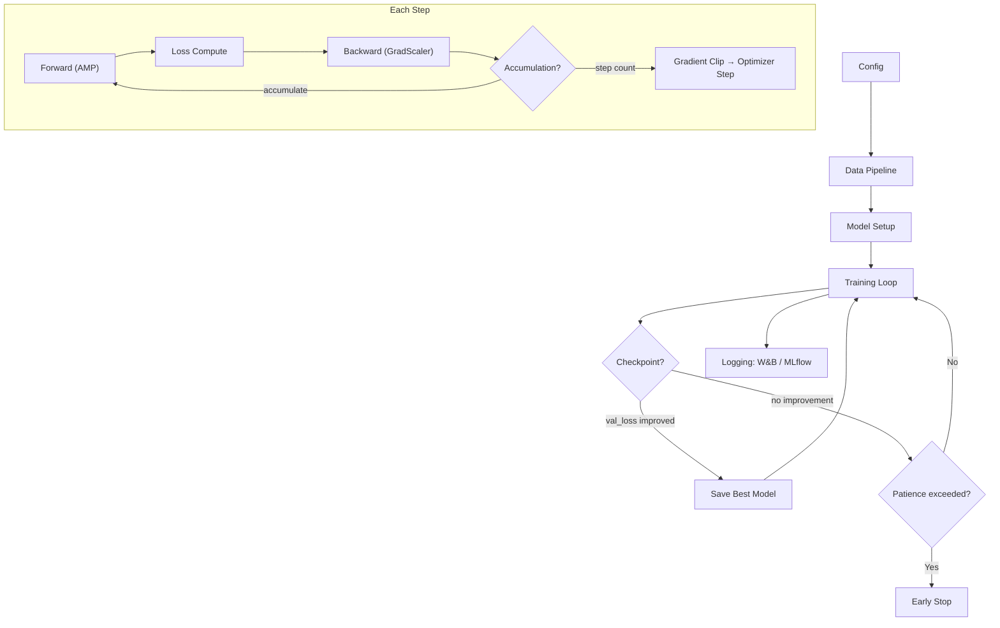
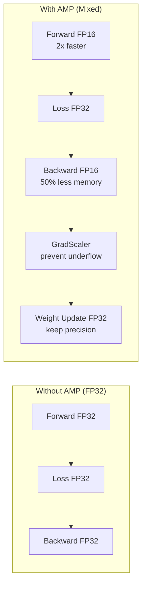
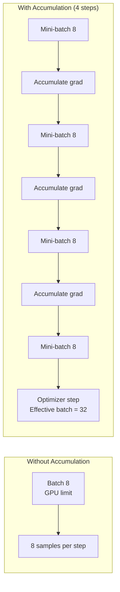
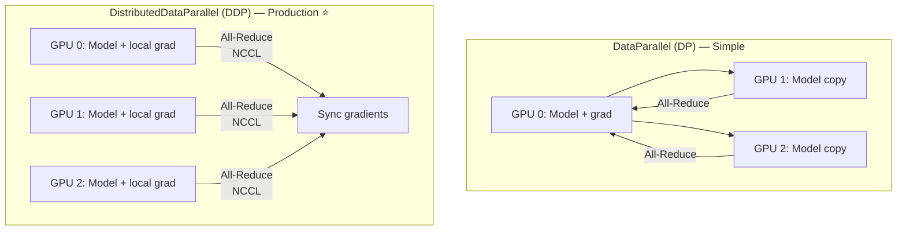

# 🏋️ Training Recipes — Production Guide

> **Mục tiêu**: Training loop chuẩn production — AMP, gradient accumulation, distributed training, W&B logging.
> "80% of ML engineering is getting training right."

---

## 1. Training Pipeline Overview



---

## 2. Complete Training Loop

```python
import torch
import torch.nn as nn
from torch.cuda.amp import autocast, GradScaler
from torch.utils.data import DataLoader
from tqdm import tqdm
import wandb
import time

class Trainer:
    def __init__(self, model, train_loader, val_loader, config):
        self.model = model.to(config["device"])
        self.train_loader = train_loader
        self.val_loader = val_loader
        self.config = config
        self.device = config["device"]
        
        # Optimizer
        self.optimizer = torch.optim.AdamW(
            model.parameters(), 
            lr=config["lr"], 
            weight_decay=config["weight_decay"]
        )
        
        # Scheduler
        total_steps = len(train_loader) * config["epochs"] // config["accumulation_steps"]
        self.scheduler = torch.optim.lr_scheduler.OneCycleLR(
            self.optimizer, 
            max_lr=config["lr"],
            total_steps=total_steps,
            pct_start=0.1,
        )
        
        # Loss
        self.criterion = nn.CrossEntropyLoss(label_smoothing=config.get("label_smoothing", 0.0))
        
        # AMP
        self.scaler = GradScaler() if config["amp"] else None
        
        # Tracking
        self.best_val_loss = float('inf')
        self.patience_counter = 0
    
    def train_one_epoch(self, epoch):
        self.model.train()
        total_loss = 0
        correct = 0
        total = 0
        
        pbar = tqdm(self.train_loader, desc=f"Epoch {epoch}")
        for batch_idx, (images, targets) in enumerate(pbar):
            images = images.to(self.device, non_blocking=True)
            targets = targets.to(self.device, non_blocking=True)
            
            # Forward with AMP
            with autocast(device_type='cuda', dtype=torch.float16, enabled=self.config["amp"]):
                outputs = self.model(images)
                loss = self.criterion(outputs, targets)
                loss = loss / self.config["accumulation_steps"]  # Scale for accumulation
            
            # Backward
            if self.scaler:
                self.scaler.scale(loss).backward()
            else:
                loss.backward()
            
            # Gradient Accumulation
            if (batch_idx + 1) % self.config["accumulation_steps"] == 0:
                if self.scaler:
                    self.scaler.unscale_(self.optimizer)
                
                # Gradient clipping
                torch.nn.utils.clip_grad_norm_(
                    self.model.parameters(), 
                    max_norm=self.config["grad_clip"]
                )
                
                if self.scaler:
                    self.scaler.step(self.optimizer)
                    self.scaler.update()
                else:
                    self.optimizer.step()
                
                self.optimizer.zero_grad(set_to_none=True)  # More memory efficient
                self.scheduler.step()
            
            # Metrics
            total_loss += loss.item() * self.config["accumulation_steps"]
            pred = outputs.argmax(dim=1)
            correct += (pred == targets).sum().item()
            total += targets.size(0)
            
            pbar.set_postfix(
                loss=f"{loss.item() * self.config['accumulation_steps']:.4f}",
                acc=f"{100*correct/total:.1f}%",
                lr=f"{self.optimizer.param_groups[0]['lr']:.1e}"
            )
        
        return total_loss / len(self.train_loader), correct / total
    
    @torch.no_grad()
    def validate(self):
        self.model.eval()
        total_loss = 0
        correct = 0
        total = 0
        
        for images, targets in tqdm(self.val_loader, desc="Validation"):
            images = images.to(self.device, non_blocking=True)
            targets = targets.to(self.device, non_blocking=True)
            
            with autocast(device_type='cuda', dtype=torch.float16, enabled=self.config["amp"]):
                outputs = self.model(images)
                loss = self.criterion(outputs, targets)
            
            total_loss += loss.item()
            pred = outputs.argmax(dim=1)
            correct += (pred == targets).sum().item()
            total += targets.size(0)
        
        return total_loss / len(self.val_loader), correct / total
    
    def save_checkpoint(self, epoch, val_loss, path="best_model.pth"):
        torch.save({
            'epoch': epoch,
            'model_state_dict': self.model.state_dict(),
            'optimizer_state_dict': self.optimizer.state_dict(),
            'scheduler_state_dict': self.scheduler.state_dict(),
            'val_loss': val_loss,
            'config': self.config,
        }, path)
    
    def fit(self):
        for epoch in range(1, self.config["epochs"] + 1):
            # Train
            train_loss, train_acc = self.train_one_epoch(epoch)
            
            # Validate
            val_loss, val_acc = self.validate()
            
            # Log
            print(f"Epoch {epoch}: train_loss={train_loss:.4f}, val_loss={val_loss:.4f}, "
                  f"train_acc={train_acc:.3f}, val_acc={val_acc:.3f}")
            
            wandb.log({
                "train/loss": train_loss, "train/acc": train_acc,
                "val/loss": val_loss, "val/acc": val_acc,
                "lr": self.optimizer.param_groups[0]["lr"],
                "epoch": epoch,
            })
            
            # Checkpoint
            if val_loss < self.best_val_loss:
                self.best_val_loss = val_loss
                self.patience_counter = 0
                self.save_checkpoint(epoch, val_loss)
                print(f"  ✅ Best model saved (val_loss={val_loss:.4f})")
            else:
                self.patience_counter += 1
                if self.patience_counter >= self.config["patience"]:
                    print(f"  ⏹️ Early stopping at epoch {epoch}")
                    break
```

---

## 3. Mixed Precision Training (AMP)



```python
from torch.cuda.amp import autocast, GradScaler

scaler = GradScaler()  # Prevents gradient underflow in FP16

# Training step
with autocast(device_type='cuda', dtype=torch.float16):
    output = model(input)     # Forward in FP16
    loss = criterion(output, target)

scaler.scale(loss).backward()  # Backward in FP16 with scaling
scaler.step(optimizer)         # Unscale + step in FP32
scaler.update()                # Adjust scale factor

# BF16 (better for Ampere+ GPUs: A100, RTX 3090+)
with autocast(device_type='cuda', dtype=torch.bfloat16):
    output = model(input)
    loss = criterion(output, target)
# BF16: no GradScaler needed! Same range as FP32, less precision
```

| Precision | Memory | Speed | Accuracy | GPU Support |
|-----------|:------:|:-----:|:--------:|------------|
| FP32 | Baseline | Baseline | Baseline | All |
| **FP16 + AMP** | **~50% less** | **2-3x faster** | **~Same** | Volta+ (V100) |
| **BF16** | **~50% less** | **2-3x faster** | **Better than FP16** | Ampere+ (A100, RTX 3090) |

---

## 4. Gradient Accumulation



```python
# Problem: GPU fits only batch_size=8, need effective batch=32
accumulation_steps = 4  # effective_batch = 8 × 4 = 32

for i, (images, targets) in enumerate(train_loader):
    with autocast(device_type='cuda', dtype=torch.float16):
        loss = criterion(model(images.cuda()), targets.cuda())
        loss = loss / accumulation_steps  # ⚠️ MUST scale loss!
    
    scaler.scale(loss).backward()  # Accumulate gradients
    
    if (i + 1) % accumulation_steps == 0:
        scaler.unscale_(optimizer)
        torch.nn.utils.clip_grad_norm_(model.parameters(), max_norm=1.0)
        scaler.step(optimizer)
        scaler.update()
        optimizer.zero_grad(set_to_none=True)  # ← set_to_none=True saves memory

# ⚠️ Common bug: forgetting to scale loss by accumulation_steps
# Without scaling: effective LR is accumulation_steps × intended LR
```

---

## 5. Distributed Training (Multi-GPU)



```python
# === DDP Setup (RECOMMENDED for production) ===
import torch.distributed as dist
from torch.nn.parallel import DistributedDataParallel as DDP
from torch.utils.data.distributed import DistributedSampler

def setup(rank, world_size):
    dist.init_process_group("nccl", rank=rank, world_size=world_size)
    torch.cuda.set_device(rank)

def train_ddp(rank, world_size):
    setup(rank, world_size)
    
    model = MyModel().to(rank)
    model = DDP(model, device_ids=[rank])
    
    sampler = DistributedSampler(dataset, num_replicas=world_size, rank=rank)
    loader = DataLoader(dataset, batch_size=32, sampler=sampler, num_workers=4)
    
    for epoch in range(100):
        sampler.set_epoch(epoch)  # ⚠️ MUST set epoch for proper shuffling
        for batch in loader:
            # Training step (same as single GPU)
            ...

# Launch: torchrun --nproc_per_node=4 train.py

# === Simpler: Accelerate (Hugging Face) ===
from accelerate import Accelerator

accelerator = Accelerator(mixed_precision="fp16")
model, optimizer, train_loader = accelerator.prepare(model, optimizer, train_loader)

for batch in train_loader:
    outputs = model(batch["input"])
    loss = criterion(outputs, batch["target"])
    accelerator.backward(loss)
    optimizer.step()
    optimizer.zero_grad()

# Launch: accelerate launch --num_processes 4 train.py
```

---

## 6. Config Template

```python
config = {
    # Model
    "model_name": "efficientnet_b3",
    "pretrained": True,
    "num_classes": 9,
    
    # Data
    "img_size": 512,
    "batch_size": 8,
    "num_workers": 4,
    "pin_memory": True,
    
    # Training
    "epochs": 100,
    "accumulation_steps": 4,  # effective_batch = 32
    "amp": True,              # Mixed precision
    "grad_clip": 1.0,
    
    # Optimizer
    "optimizer": "AdamW",
    "lr": 1e-4,
    "weight_decay": 0.01,
    
    # Scheduler
    "scheduler": "OneCycleLR",
    "pct_start": 0.1,        # 10% warmup
    
    # Regularization
    "label_smoothing": 0.1,
    "dropout": 0.2,
    
    # Early Stopping
    "patience": 15,
    "min_delta": 0.001,
    
    # Device
    "device": "cuda" if torch.cuda.is_available() else "cpu",
    "seed": 42,
}

# Reproducibility
def set_seed(seed):
    torch.manual_seed(seed)
    torch.cuda.manual_seed_all(seed)
    torch.backends.cudnn.deterministic = True
    torch.backends.cudnn.benchmark = False
    import numpy as np; np.random.seed(seed)
    import random; random.seed(seed)
```

---

## 🎯 Interview Tips — Chi Tiết

### Q1: "AMP tại sao tốn ít memory hơn?"
**A**: FP16 = 2 bytes vs FP32 = 4 bytes. Activations + gradients lưu FP16 → ~50% memory. GradScaler tránh underflow (FP16 min ≈ 6e-8). BF16 (A100+): same range as FP32, no scaler needed, slightly better accuracy than FP16.

### Q2: "Gradient accumulation?"
**A**: Simulate larger batch size khi GPU memory limited. Accumulate gradients over N steps before optimizer.step(). ⚠️ Must scale loss by 1/N. Effective batch = batch_size × accumulation_steps. BN behavior may differ (sees small batch).

### Q3: "Learning rate warmup tại sao?"
**A**: Early training: random weights → large noisy gradients → Adam moments not yet estimated → unstable. Warmup: start LR tiny → ramp up over 5-10% steps → stabilize training. Critical for Transformers, optional for CNNs.

### Q4: "DataParallel vs DistributedDataParallel?"
**A**: DP: single-process, GPU 0 bottleneck (gathers all gradients), easy but slow. DDP: multi-process, each GPU independent, AllReduce via NCCL, near-linear scaling. Always use DDP for production. DP is only for quick experiments.

### Q5: "Gradient clipping?"
**A**: Prevent exploding gradients by capping norm. `clip_grad_norm_(params, max_norm=1.0)`: if ‖∇‖ > 1.0, scale all gradients proportionally. Preserves gradient direction. Essential for RNNs, Transformers, fine-tuning.

### Q6: "Reproducibility?"
**A**: Set seeds (torch, numpy, random), `cudnn.deterministic=True`, `cudnn.benchmark=False`. But: DDP non-deterministic by default, some ops inherently non-deterministic (atomicAdd). Trade-off: deterministic ≈ 10-15% slower. Log all seeds + config.

### Q7: "Early stopping?"
**A**: Monitor val_loss/val_metric. If no improvement for `patience` epochs → stop. Save best checkpoint. Prevents overfitting. Common: patience=10-20. Use with checkpoint to always keep best model.

### Q8: "Effective batch size matters?"
**A**: Larger batch → smoother gradients → need higher LR (linear scaling rule). batch×2 → LR×2. Too large batch → generalization gap. Sweet spot: 32-256 for most tasks. ImageNet: 1024+ with LARS/LAMB optimizer.
