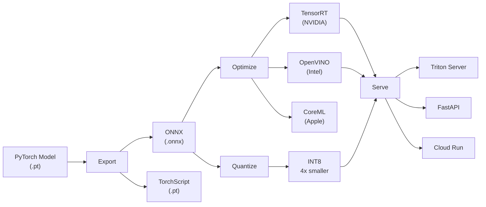
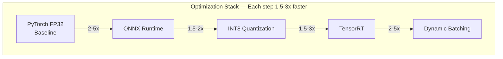

# 📦 Model Deployment — Production Guide

> **Mục tiêu**: Export, optimize, và serve DL models — ONNX, TorchScript, Quantization, TensorRT, Triton.
> Deployment = "cầu nối" giữa research và production. 90% giá trị nằm ở đây.

---

## Overview — Deployment Pipeline





---

## 1. ONNX Export

### 1.1 Export from PyTorch

```python
import torch
import torch.onnx

model.eval()  # BẮT BUỘC: switch to eval mode (BatchNorm, Dropout behavior)
dummy_input = torch.randn(1, 3, 512, 512).to(device)

torch.onnx.export(
    model,
    dummy_input,
    "model.onnx",
    input_names=["input"],
    output_names=["output"],
    dynamic_axes={
        "input": {0: "batch_size", 2: "height", 3: "width"},  # Dynamic dims
        "output": {0: "batch_size"},
    },
    opset_version=17,
)
print("✅ Exported to model.onnx")
```

### 1.2 Verify ONNX Model

```python
import onnx

# Check model valid
model_onnx = onnx.load("model.onnx")
onnx.checker.check_model(model_onnx)  # Throws if invalid

# Print graph info
print(f"IR version: {model_onnx.ir_version}")
print(f"Opset: {model_onnx.opset_import}")
for node in model_onnx.graph.input:
    print(f"Input: {node.name}, shape: {[d.dim_value for d in node.type.tensor_type.shape.dim]}")
```

### 1.3 ONNX Runtime Inference

```python
import onnxruntime as ort
import numpy as np
import time

# Create session with GPU
session = ort.InferenceSession(
    "model.onnx",
    providers=["CUDAExecutionProvider", "CPUExecutionProvider"],
    # Falls back to CPU if no CUDA
)

# Warmup (first run slower due to graph optimization)
input_data = np.random.randn(1, 3, 512, 512).astype(np.float32)
_ = session.run(None, {"input": input_data})

# Benchmark
times = []
for _ in range(100):
    start = time.perf_counter()
    outputs = session.run(None, {"input": input_data})
    times.append(time.perf_counter() - start)

print(f"Latency: {np.mean(times)*1000:.1f}ms ± {np.std(times)*1000:.1f}ms")
# Typically 2-5x faster than PyTorch native!
```

### 1.4 ONNX Optimization

```python
# Graph optimization (fold constants, eliminate dead nodes)
import onnxruntime as ort

sess_options = ort.SessionOptions()
sess_options.graph_optimization_level = ort.GraphOptimizationLevel.ORT_ENABLE_ALL
sess_options.optimized_model_filepath = "model_optimized.onnx"
sess_options.intra_op_num_threads = 4   # CPU threads within ops
sess_options.inter_op_num_threads = 2   # CPU threads between ops

session = ort.InferenceSession("model.onnx", sess_options)
```

---

## 2. TorchScript

```python
# ── Method 1: Tracing (for models WITHOUT control flow) ──
# Records ONE execution path — if/else NOT captured
model.eval()
traced = torch.jit.trace(model, dummy_input)
traced.save("model_traced.pt")

# ── Method 2: Scripting (for models WITH if/loops) ──
# Analyzes Python code → converts to TorchScript IR
scripted = torch.jit.script(model)
scripted.save("model_scripted.pt")

# Load & inference (NO Python dependency needed!)
loaded = torch.jit.load("model_traced.pt")
loaded.eval()
output = loaded(dummy_input)
```

### Tracing vs Scripting

| | Tracing | Scripting |
|-|---------|-----------|
| How | Record 1 forward pass | Analyze Python code |
| Control flow | ❌ Not captured | ✅ Handled |
| Python features | All (just runs Python) | Limited subset |
| Debugging | Harder | Better error messages |
| Recommendation | **Default choice** | When control flow needed |

---

## 3. Quantization

### 3.1 Overview

| Type | Precision | Speed | Quality | Effort |
|------|:---------:|:-----:|:-------:|--------|
| **FP32** | 32-bit | 1x | Baseline | None |
| **FP16/BF16** | 16-bit | ~1.5-2x | ~Same | Trivial |
| **INT8 PTQ** | 8-bit | ~2-4x | Slight drop | Low |
| **INT8 QAT** | 8-bit | ~2-4x | ~Same | Medium |
| **INT4** | 4-bit | ~4-6x | Some drop | High |

### 3.2 Post-Training Quantization (PTQ)

```python
# Dynamic Quantization — easiest, good for LSTM/Linear-heavy models
quantized_model = torch.quantization.quantize_dynamic(
    model.cpu(),
    {torch.nn.Linear, torch.nn.LSTM},  # Which layers
    dtype=torch.qint8,
)

# Static Quantization — better accuracy, needs calibration data
model.eval()
model.qconfig = torch.quantization.get_default_qconfig('fbgemm')  # x86
torch.quantization.prepare(model, inplace=True)

# Calibrate with representative data (100-1000 samples)
with torch.no_grad():
    for batch in calibration_dataloader:
        model(batch)

torch.quantization.convert(model, inplace=True)
```

### 3.3 Size & Speed Comparison

```python
import os

# Save and compare sizes
torch.save(model.state_dict(), "model_fp32.pth")
torch.save(quantized_model.state_dict(), "model_int8.pth")

fp32_size = os.path.getsize("model_fp32.pth") / 1e6
int8_size = os.path.getsize("model_int8.pth") / 1e6
print(f"FP32: {fp32_size:.1f}MB → INT8: {int8_size:.1f}MB")
print(f"Compression: {fp32_size/int8_size:.1f}x")
# ResNet-50: FP32: 98MB → INT8: 25MB (4x smaller)
```

---

## 4. TensorRT (NVIDIA GPU Optimization)

```python
# TensorRT via torch.compile (PyTorch 2.0+)
import torch._dynamo

model = model.cuda().eval()
optimized = torch.compile(model, backend="tensorrt")  # TensorRT backend!

# Warmup
with torch.no_grad():
    _ = optimized(dummy_input.cuda())

# Now 3-5x faster than vanilla PyTorch on NVIDIA GPUs

# ── Alternative: ONNX → TensorRT ──
# trtexec --onnx=model.onnx --saveEngine=model.trt --fp16
# Best performance but less flexible
```

### Performance Comparison

```
Model: ResNet-50, Input: (1, 3, 224, 224), RTX 4090

PyTorch FP32:     2.1 ms/image
PyTorch FP16:     1.2 ms/image  (1.8x)
ONNX Runtime:     0.9 ms/image  (2.3x)
TensorRT FP16:    0.4 ms/image  (5.3x)
TensorRT INT8:    0.3 ms/image  (7.0x)
```

---

## 5. Serving Architecture

### 5.1 FastAPI + ONNX (Simple)

```python
from fastapi import FastAPI, UploadFile, HTTPException
from pydantic import BaseModel
import onnxruntime as ort
import numpy as np
from PIL import Image
import io
from contextlib import asynccontextmanager

# ── Lifespan: load model ONCE at startup ──
session = None

@asynccontextmanager
async def lifespan(app: FastAPI):
    global session
    session = ort.InferenceSession(
        "model.onnx",
        providers=["CUDAExecutionProvider", "CPUExecutionProvider"],
    )
    print("✅ Model loaded")
    yield
    print("🔄 Shutting down")

app = FastAPI(lifespan=lifespan)

class PredictionResponse(BaseModel):
    class_id: int
    confidence: float
    class_name: str

CLASS_NAMES = ["background", "tree", "building", "road", "water"]

@app.post("/predict", response_model=PredictionResponse)
async def predict(file: UploadFile):
    if not file.content_type.startswith("image/"):
        raise HTTPException(400, "Must be an image file")
    
    # Preprocess
    image = Image.open(io.BytesIO(await file.read())).convert("RGB").resize((512, 512))
    input_array = np.array(image).transpose(2, 0, 1)[None].astype(np.float32) / 255.0
    
    # Inference
    output = session.run(None, {"input": input_array})[0]
    class_id = int(output.argmax(axis=1)[0])
    confidence = float(output[0, class_id].max())
    
    return PredictionResponse(
        class_id=class_id,
        confidence=confidence,
        class_name=CLASS_NAMES[class_id],
    )

@app.get("/health")
async def health():
    return {"status": "healthy", "model_loaded": session is not None}
```

### 5.2 NVIDIA Triton (Production)

```
Triton Inference Server:
  ✅ Multi-model serving
  ✅ Dynamic batching (accumulate requests → batch inference)
  ✅ Model versioning (A/B testing)
  ✅ ONNX, TensorRT, PyTorch, TensorFlow support
  ✅ GPU scheduling & optimization
  ✅ gRPC + HTTP endpoints
  
Directory structure:
  model_repository/
  ├── segmentation/
  │   ├── 1/                 # Version 1
  │   │   └── model.onnx
  │   └── config.pbtxt       # Model configuration
  └── classification/
      ├── 1/
      │   └── model.plan      # TensorRT engine
      └── config.pbtxt
```

### 5.3 Deployment Pipeline

```
Research → Production Pipeline:

1. Train (PyTorch/Lightning)
   └── best_model.pth

2. Export
   └── torch.onnx.export → model.onnx
   └── Verify: onnx.checker.check_model

3. Optimize
   └── Quantization (INT8 PTQ) → model_int8.onnx
   └── Or TensorRT → model.trt

4. Serve
   └── FastAPI + ONNX Runtime (simple)
   └── Or Triton (production, multi-model)

5. Containerize
   └── Dockerfile (multi-stage, GPU base image)
   └── docker compose (api + model server)

6. Deploy
   └── Kubernetes (auto-scaling, rolling updates)
   └── Or Cloud Run / Lambda (serverless, scale-to-zero)

7. Monitor
   └── Latency, throughput, error rate
   └── Model performance (data drift, accuracy degradation)
```

---

## 6. Edge Deployment

### Mobile & Edge Devices

| Framework | Target | From | Features |
|-----------|--------|------|----------|
| **ONNX Runtime Mobile** | iOS, Android | ONNX | Cross-platform |
| **CoreML** | iOS/macOS | ONNX/PyTorch | Apple hardware optimized |
| **TensorFlow Lite** | Mobile, IoT | TF/ONNX | Smallest runtime |
| **NCNN** | Mobile | ONNX | Fast, Tencent |
| **OpenVINO** | Intel CPU/iGPU | ONNX | Intel optimized |

```python
# Convert to CoreML (iOS)
import coremltools as ct

mlmodel = ct.convert(
    traced_model,
    inputs=[ct.TensorType(shape=(1, 3, 512, 512))],
    minimum_deployment_target=ct.target.iOS16,
)
mlmodel.save("model.mlpackage")

# Convert to TFLite (Android/IoT)
# ONNX → TF → TFLite pipeline
# onnx-tf convert -i model.onnx -o model_tf
# tflite_convert --saved_model_dir=model_tf --output_file=model.tflite
```

---

## 🎯 Interview Tips — Chi Tiết

### Q1: "ONNX tại sao tốt cho production?"
**A**: Framework-agnostic (PyTorch/TF → ONNX → anywhere). Optimized graph (constant folding, dead node elimination). Hardware acceleration via execution providers (CUDA, TensorRT, OpenVINO, CoreML). 2-5x faster than PyTorch native.

### Q2: "PTQ vs QAT?"
**A**: PTQ: post-training, no retraining needed, fast, 1-3% accuracy drop. QAT: simulate quantization during training, better accuracy but needs training infra. Rule: start PTQ → if accuracy unacceptable → QAT.

### Q3: "TorchScript trace vs script?"
**A**: Trace: record one forward pass, cannot capture if/else. Script: analyze Python code, handles control flow. Default: trace. Use script only when model has dynamic control flow.

### Q4: "Model latency optimize?"
**A**: Stack: ONNX export → INT8 quantization → TensorRT optimization → dynamic batching → hardware upgrade. Each step: 1.5-3x improvement. Total: potentially 10x over vanilla PyTorch.

### Q5: "Dynamic batching?"
**A**: Accumulate individual requests over short window (e.g., 10ms) → batch together → single GPU forward pass → split results back. Triton does this automatically. Throughput 5-10x higher than single-request.

### Q6: "Model versioning?"
**A**: Triton: model_repo/model_name/1/, 2/, 3/ → serve specific version. A/B testing: route % traffic to each version. Rollback: switch back to previous version instantly. Always keep last 2-3 versions.

### Q7: "GPU vs CPU serving?"
**A**: GPU: high throughput, batch-friendly, expensive. CPU: cheaper, scales horizontally, good for small models. Rule: ResNet/small CNN → CPU enough. Large model (segmentation, LLM) → GPU. Cost: compare total requests/dollar.

### Q8: "Serverless (Lambda/Cloud Run) cho ML?"
**A**: Pros: scale to zero, pay per request, no infra management. Cons: cold start (5-30s for ML models!), limited GPU, timeout limits. Good for: low-traffic, CPU-only models. Bad for: real-time, GPU models.
