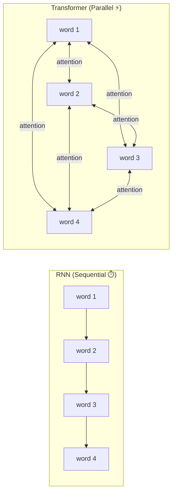
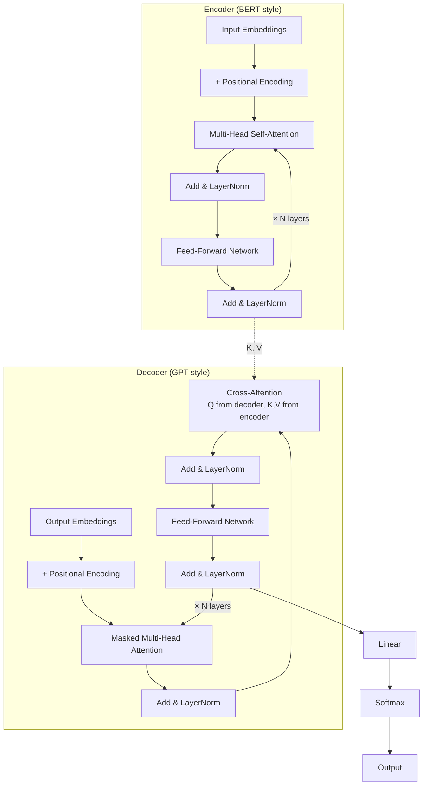
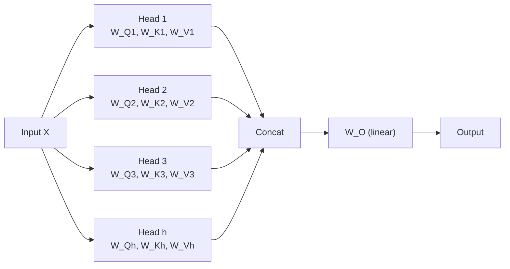
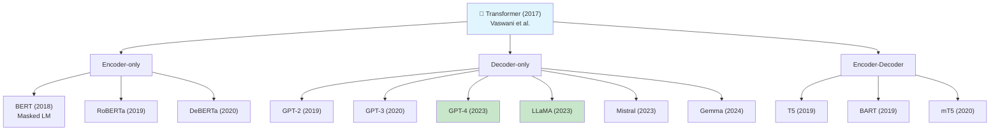
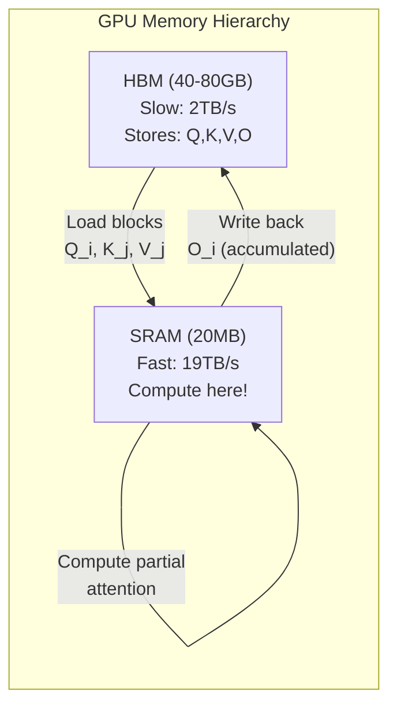

# 🔮 Transformer Architecture — Deep Dive

> **Mục tiêu**: Hiểu sâu Transformer — kiến trúc thay đổi toàn bộ AI. Đây là câu hỏi phỏng vấn #1 cho AI Engineer.

---

## 1. Tại sao Transformers thay thế RNN/LSTM?

| | RNN/LSTM | Transformer |
|-|----------|-------------|
| **Processing** | Sequential (word by word) | Parallel (all words at once) |
| **Long-range deps** | Vanishing gradient | Attention connects any positions |
| **Training speed** | Slow (no parallelism) | Fast (GPU parallelism) |
| **Scaling** | Poor (diminishing returns) | Excellent (scaling laws) |



---

## 2. Transformer Architecture



### Architecture Variants

| Type | Architecture | Examples | Use Case |
|------|-------------|----------|----------|
| **Encoder-only** | N encoder layers | BERT, RoBERTa, DeBERTa | Understanding, classification |
| **Decoder-only** | N decoder layers | GPT, LLaMA, Mistral | Generation, chat |
| **Encoder-Decoder** | N+N layers | T5, BART, mT5 | Translation, summarization |

---

## 3. Self-Attention — Step by Step

```
Attention(Q, K, V) = softmax(QK^T / √d_k) × V
```

### From Scratch Implementation

```python
import numpy as np

def scaled_dot_product_attention(Q, K, V, mask=None):
    """
    Q, K, V: matrices [seq_len, d_k]
    mask: optional [seq_len, seq_len] — for causal (decoder) attention
    """
    d_k = Q.shape[-1]
    
    # Step 1: Compute similarity scores
    scores = Q @ K.T  # [seq_len, seq_len]
    # scores[i][j] = how much token i "attends to" token j
    
    # Step 2: Scale by √d_k
    # WHY? When d_k is large, dot products become large
    # → softmax saturates (near 0 or 1) → gradient ≈ 0 → training fails
    scores = scores / np.sqrt(d_k)
    
    # Step 3: Apply mask (causal attention for decoder)
    if mask is not None:
        scores = scores + mask * (-1e9)  # -inf where mask=1
    
    # Step 4: Softmax → attention weights (probabilities)
    def softmax(x):
        exp_x = np.exp(x - np.max(x, axis=-1, keepdims=True))
        return exp_x / exp_x.sum(axis=-1, keepdims=True)
    
    weights = softmax(scores)  # [seq_len, seq_len]
    # weights[i][j] = probability token i attends to token j
    # Each row sums to 1.0
    
    # Step 5: Weighted sum of values
    output = weights @ V  # [seq_len, d_k]
    # output[i] = weighted average of all V vectors, 
    #             weighted by how much token i attends to each token
    
    return output, weights

# Example
seq_len, d_k = 4, 8
Q = np.random.randn(seq_len, d_k)
K = np.random.randn(seq_len, d_k)
V = np.random.randn(seq_len, d_k)

output, weights = scaled_dot_product_attention(Q, K, V)
print(f"Output shape: {output.shape}")   # (4, 8)
print(f"Attention weights:\n{weights}")   # (4, 4) — each row sums to 1
```

### Q, K, V — Intuition

```
Analogy: Library Search
  Q (Query)  = "What am I looking for?" — the question each token asks
  K (Key)    = "What do I contain?"     — the label each token advertises  
  V (Value)  = "What information do I provide?" — the actual content

Process:
  1. Each token creates Q, K, V by multiplying with learned weight matrices:
     Q = X @ W_Q    K = X @ W_K    V = X @ W_V
  2. Q·K = how relevant is token j to token i?
  3. softmax = normalize → attention probabilities
  4. Multiply by V = get weighted information from relevant tokens
```

---

## 4. Multi-Head Attention



```python
import torch
import torch.nn as nn

class MultiHeadAttention(nn.Module):
    def __init__(self, d_model: int, num_heads: int):
        super().__init__()
        assert d_model % num_heads == 0
        
        self.d_model = d_model
        self.num_heads = num_heads
        self.d_k = d_model // num_heads  # Each head dimension
        
        # Projection matrices (all heads combined)
        self.W_Q = nn.Linear(d_model, d_model)
        self.W_K = nn.Linear(d_model, d_model)
        self.W_V = nn.Linear(d_model, d_model)
        self.W_O = nn.Linear(d_model, d_model)
    
    def forward(self, x, mask=None):
        batch_size, seq_len, _ = x.shape
        
        # 1. Project to Q, K, V
        Q = self.W_Q(x)  # [batch, seq, d_model]
        K = self.W_K(x)
        V = self.W_V(x)
        
        # 2. Split into heads: [batch, heads, seq, d_k]
        Q = Q.view(batch_size, seq_len, self.num_heads, self.d_k).transpose(1, 2)
        K = K.view(batch_size, seq_len, self.num_heads, self.d_k).transpose(1, 2)
        V = V.view(batch_size, seq_len, self.num_heads, self.d_k).transpose(1, 2)
        
        # 3. Scaled dot-product attention (per head)
        scores = (Q @ K.transpose(-2, -1)) / (self.d_k ** 0.5)
        if mask is not None:
            scores = scores.masked_fill(mask == 0, -1e9)
        weights = torch.softmax(scores, dim=-1)
        context = weights @ V  # [batch, heads, seq, d_k]
        
        # 4. Concatenate heads
        context = context.transpose(1, 2).contiguous().view(batch_size, seq_len, self.d_model)
        
        # 5. Final linear projection
        return self.W_O(context)

# Why multiple heads?
# Each head learns DIFFERENT attention patterns:
# Head 1: syntax (subject-verb agreement)
# Head 2: coreference (pronouns → nouns)
# Head 3: positional (adjacent words)
# ...
mha = MultiHeadAttention(d_model=512, num_heads=8)
x = torch.randn(2, 10, 512)  # [batch=2, seq=10, d_model=512]
output = mha(x)               # [2, 10, 512]
```

---

## 5. Positional Encoding

```python
# WHY? Attention is permutation-invariant!
# "dog bites man" and "man bites dog" would produce SAME attention
# → Need to tell model WHERE each token is

# ── Method 1: Sinusoidal (original Transformer) ──
def sinusoidal_encoding(seq_len: int, d_model: int) -> np.ndarray:
    pe = np.zeros((seq_len, d_model))
    for pos in range(seq_len):
        for i in range(0, d_model, 2):
            pe[pos, i] = np.sin(pos / (10000 ** (i / d_model)))
            pe[pos, i+1] = np.cos(pos / (10000 ** (i / d_model)))
    return pe
# Properties: fixed, no parameters, generalizes to unseen lengths

# ── Method 2: Learned (BERT, GPT) ──
class LearnedPositionalEncoding(nn.Module):
    def __init__(self, max_len: int, d_model: int):
        super().__init__()
        self.pe = nn.Embedding(max_len, d_model)
    
    def forward(self, x):
        positions = torch.arange(x.size(1), device=x.device)
        return x + self.pe(positions)
# Properties: learned during training, limited to max_len

# ── Method 3: RoPE — Rotary Position Embedding (LLaMA, Mistral) ──
# Encodes position as rotation in 2D subspaces
# Advantages:
# - Relative position info preserved in dot product
# - Better extrapolation to longer sequences
# - No added parameters
# Used by: LLaMA, Mistral, Gemma, Qwen

# ── Method 4: ALiBi — Attention with Linear Biases (MPT) ──
# Adds linear penalty to attention scores based on distance
# attention_score[i][j] -= m * |i - j|
# Advantage: no positional embeddings needed, infinite context
```

---

## 6. Key Components Deep-Dive

### 6.1 LayerNorm vs BatchNorm

```python
# LayerNorm (used in Transformers):
# Normalize across FEATURES for each sample independently
# → Works with variable sequence lengths, batch_size=1

# BatchNorm (used in CNNs):
# Normalize across BATCH for each feature
# → Needs batch statistics, fails with batch_size=1

# Pre-norm (modern, LLaMA style):
x = x + attention(layer_norm(x))   # ← more stable training

# Post-norm (original Transformer):
x = layer_norm(x + attention(x))   # ← harder to train deep models
```

### 6.2 Feed-Forward Network

```python
# FFN in each Transformer layer:
# FFN(x) = GELU(x @ W1 + b1) @ W2 + b2
# 
# W1: d_model → 4*d_model (expand)
# W2: 4*d_model → d_model (compress)
# 
# Modern variant: SwiGLU (LLaMA, Gemma):
# FFN(x) = (x @ W1 * sigmoid(x @ W_gate)) @ W2
# → Gated activation, better performance
```

---

## 7. Transformer Family Tree



---

## 8. Flash Attention — Tại Sao Nhanh Hơn

### Problem: Standard Attention = Memory Bottleneck

```
Standard Self-Attention:
  1. Compute S = Q × K^T         → O(N²) memory để lưu N×N matrix
  2. P = softmax(S / √d_k)       → đọc/ghi S từ HBM (chậm!)
  3. O = P × V                   → đọc P từ HBM lần nữa

  Total HBM reads/writes: O(N² + N·d) 
  → N=128K tokens: 128K × 128K = 16 BILLION entries! ❌ Impossible
```

### Solution: Tiling — Compute on GPU SRAM



```
Flash Attention Algorithm (simplified):
  1. Split Q into blocks Q_1, Q_2, ...  (fits in SRAM)
  2. Split K, V into blocks K_1, K_2, ... 
  3. For each Q_i:
     For each K_j, V_j:
       - Load Q_i, K_j, V_j into SRAM (fast!)
       - Compute local attention: S_ij = Q_i × K_j^T
       - Compute local softmax (with running max trick)
       - Accumulate: O_i += softmax(S_ij) × V_j
     Write O_i back to HBM
  
  Key insight: NEVER materialize full N×N attention matrix!
  → Memory: O(N) instead of O(N²)
  → Speed: 2-4x faster (fewer HBM reads)
```

### Flash Attention v1 vs v2

| Feature | v1 (2022) | v2 (2023) |
|---------|:---------:|:---------:|
| **Memory** | O(N) | O(N) |
| **Speed vs standard** | 2-4x | 5-9x |
| **Parallelism** | Batch + head | + sequence dimension |
| **Causal masking** | Supported | Optimized (skip blocks) |
| **GPU support** | A100+ | A100, H100, RTX 4090 |

### Code: PyTorch 2.0+ (Built-in!)

```python
import torch
import torch.nn.functional as F

# PyTorch 2.0+ auto-selects Flash Attention if available
Q = torch.randn(2, 8, 1024, 64, device="cuda", dtype=torch.float16)  # (batch, heads, seq, d)
K = torch.randn(2, 8, 1024, 64, device="cuda", dtype=torch.float16)
V = torch.randn(2, 8, 1024, 64, device="cuda", dtype=torch.float16)

# scaled_dot_product_attention automatically uses:
# - Flash Attention (if available on GPU)
# - Memory-efficient attention (fallback)
# - Standard attention (last resort)
output = F.scaled_dot_product_attention(
    Q, K, V,
    is_causal=True,     # Causal mask for decoder (GPT-like)
    dropout_p=0.0,       # No dropout at inference
)
# ✅ No code change needed — PyTorch handles backend selection!

# Force specific backend (for benchmarking)
with torch.backends.cuda.sdp_kernel(
    enable_flash=True,
    enable_math=False,          # Disable standard attention
    enable_mem_efficient=False,  # Disable xformers
):
    output = F.scaled_dot_product_attention(Q, K, V, is_causal=True)
```

### Impact

```
Context window scalability:
  Standard Attention: 32K tokens max on A100 (memory limit)
  Flash Attention:    128K+ tokens on same hardware

Inference speedup:
  Standard: 100 tok/s on Llama 70B
  Flash:    250 tok/s on same hardware (2.5x)

Training:
  Standard: 4096 seq_len, 8 GPU-hours
  Flash:    16384 seq_len, 3 GPU-hours (4x longer context, less time)
```

---

## 🎯 Interview Tips — Chi Tiết

### Q1: "Self-attention hoạt động thế nào?"
**A**: Mỗi token tạo Q, K, V bằng learned weight matrices. Q·K = similarity → softmax → attention weights. Weights × V = output. Token nào relevant thì attention weight cao → thông tin được truyền. Complexity: O(n²·d).

### Q2: "Tại sao cần scale √d_k?"
**A**: Khi d_k lớn, dot product lớn → softmax saturates (gần 0 hoặc 1) → gradient ≈ 0. Scale by √d_k keeps variance ≈ 1.0 → softmax produces meaningful gradients.

### Q3: "Multi-head attention là gì?"
**A**: Chạy attention nhiều lần parallel với learned projections khác. Mỗi head học pattern khác: syntax, coreference, position. Concat + project lại. h heads, mỗi head d_model/h dimension.

### Q4: "Encoder vs Decoder?"
**A**: Encoder: bi-directional (thấy tất cả tokens) → understanding (BERT). Decoder: causal masking (chỉ thấy tokens trước) → generation (GPT). Encoder-Decoder: encoder bi-dir + decoder cross-attention → seq2seq (T5).

### Q5: "RoPE vs Sinusoidal?"
**A**: Sinusoidal: fixed, additive. RoPE: rotation-based, relative position preserved in dot product, better extrapolation to longer sequences. RoPE is standard (LLaMA, Mistral, Gemma). ALiBi: distance penalty, no embeddings needed.

### Q6: "Pre-norm vs Post-norm?"
**A**: Pre-norm: `x + attn(LN(x))` — more stable, easier to train deep models (LLaMA, GPT). Post-norm: `LN(x + attn(x))` — original Transformer, needs careful learning rate. Pre-norm is standard now.

### Q7: "Transformer complexity?"
**A**: Self-attention: O(n²·d) — quadratic in sequence length. FFN: O(n·d²). Total per layer: O(n²·d + n·d²). For long sequences: use Flash Attention, sliding window, or linear attention variants.

### Q8: "SwiGLU vs GELU?"
**A**: GELU: standard activation (BERT, GPT). SwiGLU: gated activation `x·W₁ * sigmoid(x·W_gate)` — better empirically, used in LLaMA, Gemma, PaLM. Trade-off: 50% more params in FFN, but better quality.
