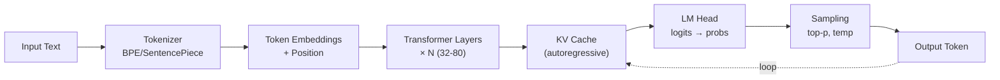
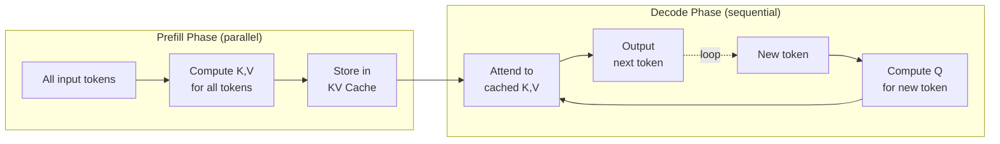
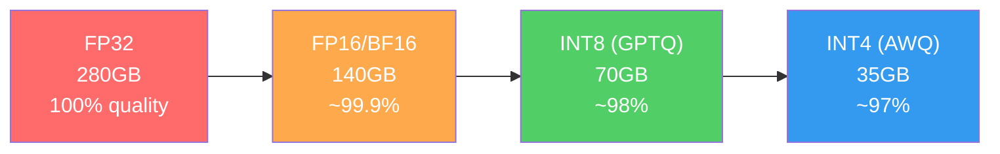

# 🧠 LLM Fundamentals — Deep Dive

> **Mục tiêu**: Hiểu sâu cách LLM hoạt động — tokenization, context window, inference, KV cache, quantization, scaling laws.
> Đây là kiến thức **CỐT LÕI** cho AI Engineer — mọi cuộc phỏng vấn đều hỏi.

---

## LLM Inference Pipeline



---

## 1. Tokenization — Cách LLM "Đọc" Text

### 1.1 Cơ bản

```python
import tiktoken  # OpenAI's tokenizer

enc = tiktoken.encoding_for_model("gpt-4")

text = "Hello, AI Engineer! 🚀"
tokens = enc.encode(text)
print(f"Text: {text}")
print(f"Tokens: {tokens}")           # [9906, 11, 15592, 29583, 0, 12520, 248, 222]
print(f"Token count: {len(tokens)}")  # 8 tokens

# Decode từng token
for t in tokens:
    print(f"  {t} → '{enc.decode([t])}'")

# ⚠️ Token count ≠ word count!
# "unhappiness" = 2-3 tokens
# "AI" = 1 token
# Emoji = 2-3 tokens
# Tiếng Việt = nhiều tokens hơn tiếng Anh (1.5-2x)
```

### 1.2 Tokenizer Algorithms

| Algorithm | Used by | Cách hoạt động |
|-----------|---------|----|
| **BPE** (Byte-Pair Encoding) | GPT-4, Claude | Merge frequent byte pairs iteratively. Start from bytes → build subwords |
| **SentencePiece** | Llama, Gemini | Language-agnostic, handle Unicode. Treats input as raw byte stream |
| **WordPiece** | BERT | Maximize likelihood of training data. Uses `##` prefix for subwords |

```
BPE Process:
Step 0: "low" "lower" "newest" → ['l','o','w'] ['l','o','w','e','r'] ['n','e','w','e','s','t']
Step 1: Merge most frequent pair 'e'+'s' → 'es'
Step 2: Merge 'es'+'t' → 'est'
Step 3: Merge 'l'+'o' → 'lo'
Step 4: Merge 'lo'+'w' → 'low'
...
Result: "low" "low_er" "new_est" → vocabulary keeps growing until target size
```

> **💡 Tại sao quan trọng?**
> - Token count = **chi phí API** (GPT-4: ~$10/1M input tokens)
> - Context window tính bằng tokens, không bằng characters
> - "café" có thể là 1, 2, hoặc 3 tokens tùy tokenizer
> - Tiếng Việt "xin chào" ≈ 3-5 tokens (vs English "hello" = 1 token)

### 1.3 Special Tokens

```python
# Special tokens control model behavior:
# <BOS> / <s>      — Beginning of sequence
# <EOS> / </s>     — End of sequence
# <PAD>            — Padding (batch processing)
# <UNK>            — Unknown token (rare)
# [INST] [/INST]   — Instruction markers (Llama)
# <|im_start|>     — Chat role marker (GPT format)

# Chat Template (Llama 3):
"""
<|begin_of_text|><|start_header_id|>system<|end_header_id|>
You are a helpful assistant.<|eot_id|>
<|start_header_id|>user<|end_header_id|>
Hello!<|eot_id|>
<|start_header_id|>assistant<|end_header_id|>
"""
```

---

## 2. Context Window & KV Cache



### 2.1 Context Window

```
┌───────────────────────────────────────────────────┐
│              Context Window (128K tokens)          │
│                                                   │
│  [System Prompt]  [Chat History]  [User Input]    │
│  ~~~~2K~~~~~   ~~~~100K~~~~~   ~~~2K~~~~        │
│                                                   │
│  ← prefill (all at once) → ← decode (one by one) │
└───────────────────────────────────────────────────┘
```

### Model Context Windows (2026)

| Model | Context | Price (input) | Notes |
|-------|---------|---------------|-------|
| GPT-4.1 | 1M tokens | $2/1M | Longest commercial |
| Gemini 2.5 Pro | 1M tokens | $1.25/1M | Native multimodal |
| Claude 3.7 Sonnet | 200K | $3/1M | Strong reasoning |
| Llama 3.3 70B | 128K | Free (self-host) | Open-source |
| Qwen 3 72B | 128K | Free (self-host) | Good multilingual/Vietnamese |

### 2.2 KV Cache — Tại Sao Inference Tốn Memory

```
Token Generation Process (Autoregressive):
  Step 1: "The"      → compute K,V for "The"      → store in cache
  Step 2: "The cat"  → reuse K,V for "The"        → compute K,V for "cat"
  Step 3: "The cat sat" → reuse K,V for "The cat" → compute K,V for "sat"
  ...
  
Without KV Cache: mỗi step compute lại TẤT CẢ → O(n²) per token
With KV Cache:    chỉ compute token MỚI         → O(n) per token

Memory cost:
  KV Cache = 2 × num_layers × num_heads × head_dim × seq_len × precision
  
  Llama 2 70B, 4096 sequence:
  = 2 × 80 × 64 × 128 × 4096 × 2 bytes (FP16)
  = ~10GB per request!
  → Batch 8 users = 80GB → cần GPU lớn
```

### 2.3 Tối ưu KV Cache

```
Grouped Query Attention (GQA) — Llama 3, Gemini:
  Standard MHA: 32 Q heads, 32 K heads, 32 V heads → 32 KV pairs
  GQA:          32 Q heads,  8 K heads,  8 V heads → 8 KV pairs
  → 4x less KV cache memory!

Multi-Query Attention (MQA):
  32 Q heads, 1 K head, 1 V head → minimum cache
  → Fastest but slightly lower quality

PagedAttention (vLLM):
  KV cache = "pages" like OS virtual memory
  → No fragmentation → serve more concurrent users
  → 2-4x throughput improvement
```

---

## 3. Inference Parameters & Decoding

### 3.1 Temperature & Sampling

```python
from openai import OpenAI
client = OpenAI()

response = client.chat.completions.create(
    model="gpt-4o",
    messages=[{"role": "user", "content": "Explain attention mechanism"}],
    
    temperature=0.7,    # Controls randomness of token selection
    top_p=0.9,          # Nucleus sampling: consider top 90% probability mass
    max_tokens=512,     # Hard limit on output length
    frequency_penalty=0.3,  # Penalize tokens already used (reduce repetition)
    presence_penalty=0.1,   # Encourage exploring new topics
)
```

### 3.2 Decoding Strategies

```
Greedy Decoding (temperature=0):
  Always pick highest probability token
  "The" → "capital" → "of" → "France" → "is" → "Paris"
  ✅ Deterministic, consistent
  ❌ Repetitive, boring

Top-K Sampling:
  Pick randomly from top K tokens
  K=5: consider only 5 most likely next tokens
  ❌ Fixed K ignores probability distribution

Nucleus/Top-P Sampling (RECOMMENDED):
  Pick from smallest set of tokens summing to P probability
  P=0.9: tokens covering 90% of probability mass
  ✅ Adaptive: more options when uncertain, fewer when confident

Beam Search:
  Keep K best partial sequences, expand all
  Good for translation, summarization
  ❌ Slow for long generation

Temperature Scaling:
  p_i = exp(logit_i / T) / Σ exp(logit_j / T)
  T < 1: sharper distribution  → more deterministic
  T = 1: original distribution → balanced
  T > 1: flatter distribution  → more random/creative
```

| Use Case | Temperature | Top-p | Why |
|----------|:-----------:|:-----:|-----|
| Code generation | 0.0-0.2 | 0.95 | Correctness > creativity |
| Factual Q&A | 0.1-0.3 | 0.9 | Accuracy matters |
| Chatbot | 0.5-0.7 | 0.9 | Natural but controlled |
| Creative writing | 0.8-1.2 | 0.95 | Variety, surprise |
| Brainstorming | 1.0-1.5 | 1.0 | Maximum diversity |

---

## 4. Scaling Laws

```
Chinchilla Scaling Law (DeepMind, 2022):
  
  Loss ≈ A/N^α + B/D^β + E
  
  N = model parameters
  D = training data tokens
  
  Optimal ratio: D ≈ 20 × N
  → 7B model needs ~140B tokens
  → 70B model needs ~1.4T tokens
  
  Implication: "over-training" small models on MORE data
  can match "under-trained" larger models!
  
  Llama 3 approach: train 8B model on 15T tokens (75x Chinchilla)
  → Small model, huge data → cheap inference, good quality
```

### Emergent Abilities

```
Small models (< 10B):
  ✅ Simple Q&A, classification, summarization
  ❌ Complex reasoning, math, code

Medium models (10-70B):
  ✅ Above + chain-of-thought, multi-step reasoning
  ✅ Code generation, translation
  ❌ Very complex multi-hop reasoning

Large models (70B+, GPT-4 class):
  ✅ Above + complex reasoning, planning
  ✅ Few-shot learning, instruction following
  ✅ Tool use, multi-agent coordination
```

---

## 5. Quantization — Chạy LLM Rẻ Hơn



```
Full Precision → Quantized:
  FP32 (32-bit) → FP16 (16-bit) → INT8 (8-bit) → INT4 (4-bit)
  
  Llama 3 70B:
  FP32: 280GB (impossible on consumer GPU)
  FP16: 140GB (2x A100 80GB)  
  INT8:  70GB (1x A100 80GB)
  INT4:  35GB (1x RTX 4090 24GB + CPU offload)
```

### Quantization Methods

| Method | Precision | Quality Loss | Speed | Used by |
|--------|:---------:|:------------:|:-----:|---------|
| **FP16/BF16** | 16-bit | ~0% | Baseline | Training standard |
| **GPTQ** | 4-bit | 1-3% | Fast GPU | ExLlama, text-gen |
| **AWQ** | 4-bit | 0.5-2% | Very fast | vLLM, production |
| **GGUF** | 2-8bit | Varies | CPU+GPU | llama.cpp, Ollama |
| **bitsandbytes** | 4/8-bit | 1-2% | Moderate | QLoRA training |

```python
# Load 4-bit quantized model (bitsandbytes)
from transformers import AutoModelForCausalLM, BitsAndBytesConfig

bnb_config = BitsAndBytesConfig(
    load_in_4bit=True,
    bnb_4bit_quant_type="nf4",       # NormalFloat4 — best for LLMs
    bnb_4bit_compute_dtype="bfloat16",
    bnb_4bit_use_double_quant=True,   # Quantize the quantization constants
)

model = AutoModelForCausalLM.from_pretrained(
    "meta-llama/Llama-3-8B",
    quantization_config=bnb_config,
    device_map="auto",
)
# 8B model: FP16 = 16GB → 4-bit = ~5GB (fits on RTX 3060!)
```

---

## 6. Inference Optimization

### 6.1 Speculative Decoding

```
Problem: LLM generates 1 token at a time → slow (memory-bound)

Solution: Use small "draft" model to predict N tokens,
          then verify all N with large model in ONE forward pass

Draft model (1B):  "The" "cat" "sat" "on" "the" "mat"  ← fast, 6 tokens
Main model (70B):   ✅    ✅    ✅   ❌                  ← verify in parallel
                   "The" "cat" "sat" "upon"              ← accept 3, fix 4th

Speedup: 2-3x for code/structured text (high prediction accuracy)
```

### 6.2 Batching Strategies

```
Static Batching:
  Wait for B requests → process together → return all
  ❌ Problem: short requests wait for longest one

Continuous Batching (vLLM):
  Process requests as they arrive
  When 1 request finishes → immediately add new one
  ✅ Much higher throughput, lower latency

Key-Value Cache Management:
  PagedAttention (vLLM): virtual memory for KV cache
  → No wasted memory → serve 3-5x more concurrent users
```

### 6.3 Serving Stack

```
Production LLM Serving:

Option 1: API Providers (easiest)
  OpenAI, Anthropic, Google → just API calls
  ✅ No infra management
  ❌ Cost at scale, data privacy

Option 2: Self-hosted (control + cost)
  vLLM + NVIDIA GPU → deploy on your servers
  ✅ Full control, data privacy, cheaper at scale
  ❌ Need GPU infra, DevOps skills

Option 3: Managed inference
  Together AI, Fireworks, Groq → hosted open models
  ✅ Open model access, reasonable cost
  ❌ Less control than self-hosted
```

---

## 7. Hallucination — Vấn Đề Lớn Nhất

### Causes

```
1. Training data gaps:
   Model "invents" facts khi knowledge không có trong training data
   → Tự tin nói sai: "The Eiffel Tower is 1,000m tall" (thực tế 330m)

2. Decoding strategy:
   High temperature → more creative → more hallucination
   
3. Pattern completion:
   LLM optimized cho FLUENT text, KHÔNG phải TRUTHFUL text
   "Albert Einstein invented the..." → "telephone" (sounds fluent but wrong)

4. Context confusion (lost in the middle):
   Long context → model nhớ đầu + cuối, QUÊN giữa
   → Citations ở giữa context bị bỏ qua
```

### Mitigation Strategies

| Strategy | Hiệu quả | Cách làm |
|----------|:---------:|----------|
| **RAG** | ⭐⭐⭐⭐⭐ | Provide ground-truth documents as context |
| **Grounding** | ⭐⭐⭐⭐ | Force citations: "Answer using ONLY the provided context" |
| **Low temp** | ⭐⭐⭐ | Temperature 0-0.3 cho factual tasks |
| **Self-consistency** | ⭐⭐⭐⭐ | Generate N answers → majority vote |
| **Fine-tuning** | ⭐⭐⭐⭐ | Train on domain data → less confabulation |
| **Guardrails** | ⭐⭐⭐⭐ | Fact-check output against knowledge base |
| **Structured output** | ⭐⭐⭐ | JSON mode → constrain output format |

---

## 8. Model Selection Guide (2026)

```
Decision Tree:
  │
  ├── Budget/Speed priority?
  │   ├── Cheapest: GPT-4o-mini ($0.15/1M), Gemini Flash ($0.075/1M)
  │   └── Fastest: Groq (Llama), Cerebras
  │
  ├── Quality priority?
  │   ├── GPT-4.1 (best overall)
  │   ├── Claude 3.7 Sonnet (best reasoning, coding)
  │   └── Gemini 2.5 Pro (best multimodal, long context)
  │
  ├── Open-source / Self-hosted?
  │   ├── Llama 3.3 70B (Meta, best open model)
  │   ├── Qwen 3 72B (Alibaba, good multilingual)
  │   └── Mistral Large 2 (European, strong)
  │
  ├── Vietnamese support?
  │   ├── Gemini 2.5 (good Vietnamese)
  │   ├── Qwen 3 (trained on Vietnamese data)
  │   └── Vistral / PhoGPT (Vietnamese-specific)
  │
  └── Fine-tuning needed?
      ├── Small: Llama 3.1 8B, Qwen 3 8B (LoRA on 1 GPU)
      ├── Medium: Llama 3.1 70B (QLoRA, multi-GPU)
      └── Reasoning: DeepSeek R1 (distilled versions)
```

---

## 🎯 Interview Tips — Chi Tiết

### Q1: "Temperature ảnh hưởng output thế nào?"
**A**: Controls randomness in token sampling. 0: always pick highest probability (deterministic). 0.7: balanced. >1: flatter distribution, more diverse. Code gen → 0, chat → 0.7, creative → 1.0+. **Technically**: divides logits before softmax: p = softmax(logits/T).

### Q2: "KV Cache là gì? Tại sao quan trọng?"
**A**: Store computed Key/Value tensors for all previous tokens → avoid recomputation. Without: O(n²) per token. With: O(n) per token. **Problem**: memory grows linearly with sequence length → limit concurrent users. Solutions: GQA (share KV heads), PagedAttention (vLLM), quantized KV cache.

### Q3: "Quantization ảnh hưởng quality thế nào?"
**A**: INT4 quantization thường chỉ giảm 1-3% accuracy nhưng giảm 4x memory. Methods: GPTQ (post-training), AWQ (activation-aware), GGUF (flexible). Best practice: 4-bit inference, full precision training.

### Q4: "Hallucination xử lý cách nào?"
**A**: (1) RAG: cung cấp ground truth context, (2) Low temperature: giảm creativity, (3) Structured output: JSON mode, (4) Self-consistency: generate N answers → vote, (5) Guardrails: fact-check output. RAG = most effective.

### Q5: "Speculative decoding?"
**A**: Dùng small draft model generate N tokens nhanh, verify bằng main model trong 1 forward pass. Accepted tokens = free, rejected = regenerate from main model. 2-3x speedup cho structured tasks.

### Q6: "Context window hết thì sao?"
**A**: (1) Summarize chat history (compress old messages), (2) Sliding window (drop oldest), (3) RAG (retrieve relevant context instead of keeping everything), (4) Hierarchical summarization (summary of summaries).

### Q7: "BPE tokenizer hoạt động thế nào?"
**A**: Start from individual bytes. Count all byte pairs → merge most frequent pair → repeat until vocabulary size reached. "unhappiness" → ["un", "happi", "ness"]. Tiếng Việt dùng nhiều tokens hơn English → cost cao hơn.

### Q8: "Scaling laws nói gì?"
**A**: Chinchilla: optimal D ≈ 20N (data = 20x params). But modern practice: over-train small models on much more data (Llama 3: 15T tokens for 8B model = 1875x ratio). Benefit: cheaper inference with good quality.
