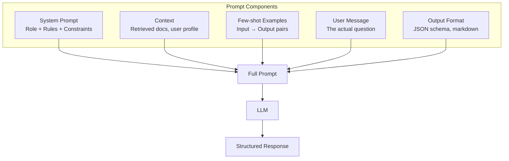
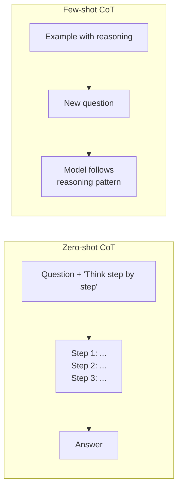
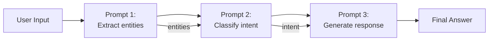

# ✨ Prompt Engineering — Production Guide

> **Mục tiêu**: System prompts, few-shot, CoT, structured output, advanced patterns.
> Prompt engineering = 80% of AI application development. Master this first.

---

## 1. Prompt Architecture



---

## 2. System Prompts — Thiết lập "Nhân cách"

```python
# ── Basic Structure ──
system_prompt = """
You are an expert AI Engineer assistant specializing in MLOps and deployment.

## Role & Expertise:
- 10+ years in production ML systems
- Expert in Python, PyTorch, Kubernetes

## Guidelines:
- Always provide code examples in Python
- Include error handling in all code snippets
- When uncertain, say "I'm not sure" instead of guessing
- Format responses using markdown with clear headers

## Constraints:
- Do NOT provide medical, legal, or financial advice
- Keep responses under 500 words unless asked for detail
- Always mention potential security concerns

## Output Format:
Always respond with:
1. Brief explanation (2-3 sentences)
2. Code example
3. Common pitfalls
"""

# ── System Prompt Patterns ──
# 1. Expert Role:     "You are a senior [X] engineer..."
# 2. Audience:        "Explain to a [junior dev / non-technical PM]..."
# 3. Constraints:     "Never do X, always do Y..."
# 4. Output format:   "Respond in JSON with { ... }"
# 5. Examples:        "Here's what good output looks like: ..."
```

---

## 3. Few-Shot Learning

```python
from openai import OpenAI
client = OpenAI()

# ── Static Few-Shot ──
messages = [
    {"role": "system", "content": "You are a sentiment analyzer. Classify as positive/negative/neutral."},
    # Example 1
    {"role": "user", "content": "The product quality is amazing!"},
    {"role": "assistant", "content": '{"sentiment": "positive", "confidence": 0.95}'},
    # Example 2
    {"role": "user", "content": "Delivery was late and the box was damaged."},
    {"role": "assistant", "content": '{"sentiment": "negative", "confidence": 0.92}'},
    # Example 3
    {"role": "user", "content": "The product arrived on time."},
    {"role": "assistant", "content": '{"sentiment": "neutral", "confidence": 0.78}'},
    # Actual query
    {"role": "user", "content": "I love this but the price is too high."},
]

response = client.chat.completions.create(
    model="gpt-4o-mini",
    messages=messages,
    temperature=0.0,
)

# ── Dynamic Few-Shot (RAG-powered) ──
def get_similar_examples(query: str, k: int = 3) -> list[dict]:
    """Retrieve most relevant examples from vector DB."""
    results = vector_db.search(query, k=k)
    return [
        {"input": r["input"], "output": r["output"]} 
        for r in results
    ]

def build_dynamic_prompt(query: str) -> list[dict]:
    examples = get_similar_examples(query, k=3)
    messages = [
        {"role": "system", "content": "Classify the intent of customer messages."},
    ]
    for ex in examples:
        messages.append({"role": "user", "content": ex["input"]})
        messages.append({"role": "assistant", "content": ex["output"]})
    messages.append({"role": "user", "content": query})
    return messages
```

---

## 4. Chain-of-Thought (CoT)



```python
# ── Zero-shot CoT ──
messages = [
    {"role": "user", "content": """
A store sells apples at $2 each. If you buy 5 or more, you get 20% off.
A customer buys 7 apples. How much do they pay?

Think step by step before giving the final answer.
"""},
]
# Output:
# Step 1: 7 apples × $2 = $14
# Step 2: 7 ≥ 5, so 20% discount applies
# Step 3: 20% of $14 = $2.80
# Step 4: $14 - $2.80 = $11.20
# Answer: $11.20

# ── Structured CoT with Self-Verification ──
COT_PROMPT = """
Solve this problem using the following framework:

## Analysis
Identify key information and constraints.

## Reasoning Steps
Walk through the solution step by step. Show your work.

## Verification
Double-check by approaching from a different angle.

## Answer
State the final answer clearly.

Problem: {problem}
"""

# ── CoT for Classification ──
CLASSIFICATION_COT = """
Classify this customer message. Before classifying, analyze:

1. **Key phrases**: What words/phrases indicate intent?
2. **Tone**: Is the customer happy, frustrated, or neutral?
3. **Urgency**: Does this need immediate action?
4. **Classification**: Based on the above, what category?

Categories: [billing, technical, feedback, cancellation, general]

Message: {message}
"""
```

---

## 5. Structured Output — Production Patterns

### 5.1 JSON Mode vs JSON Schema

```python
from openai import OpenAI
client = OpenAI()

# ── Method 1: JSON Mode (loose — chỉ đảm bảo valid JSON) ──
response = client.chat.completions.create(
    model="gpt-4o-mini",
    messages=[{
        "role": "user",
        "content": "Extract entities from: 'John works at Google in NYC since 2020'. Return JSON."
    }],
    response_format={"type": "json_object"},
    # ⚠️ MUST mention "JSON" in prompt, otherwise model may not comply
)
# Output structure NOT guaranteed — could be any valid JSON

# ── Method 2: JSON Schema (strict — enforced structure) ──
response = client.chat.completions.create(
    model="gpt-4o-mini",
    messages=[{
        "role": "user",
        "content": "Extract entities from: 'Elon Musk founded SpaceX in California'"
    }],
    response_format={
        "type": "json_schema",
        "json_schema": {
            "name": "extraction",
            "strict": True,  # 🔥 Constrained decoding — 100% schema compliance
            "schema": {
                "type": "object",
                "properties": {
                    "entities": {
                        "type": "array",
                        "items": {
                            "type": "object",
                            "properties": {
                                "name": {"type": "string"},
                                "type": {"type": "string", "enum": ["person", "org", "location"]},
                            },
                            "required": ["name", "type"],
                        }
                    },
                    "confidence": {"type": "number"}
                },
                "required": ["entities", "confidence"],
            }
        }
    },
)
# ✅ Output ALWAYS matches schema — no parsing errors in production
```

### 5.2 Pydantic + Instructor (Best DX)

```python
from pydantic import BaseModel, Field
from enum import Enum
import instructor

# Define structured output with Pydantic
class EntityType(str, Enum):
    PERSON = "person"
    ORG = "organization"
    LOCATION = "location"

class Entity(BaseModel):
    name: str = Field(description="Entity name as it appears in text")
    type: EntityType
    context: str = Field(description="Surrounding context from original text")

class ExtractionResult(BaseModel):
    entities: list[Entity]
    confidence: float = Field(ge=0.0, le=1.0)
    language: str = Field(default="en")

# ── OpenAI native (beta) ──
response = client.beta.chat.completions.parse(
    model="gpt-4o-mini",
    messages=[{"role": "user", "content": "Extract: 'Elon Musk founded SpaceX in Hawthorne'"}],
    response_format=ExtractionResult,
)
result = response.choices[0].message.parsed  # Already an ExtractionResult instance!

# ── Instructor (any provider: OpenAI, Anthropic, Gemini, Ollama) ──
client_patched = instructor.from_openai(client)

result = client_patched.chat.completions.create(
    model="gpt-4o-mini",
    response_model=ExtractionResult,
    messages=[{"role": "user", "content": "Extract entities from the text..."}],
    max_retries=3,        # Auto-retry on validation failure!
    validation_context={"strict_mode": True},
)

# ── Instructor with Anthropic ──
import anthropic
anthropic_client = instructor.from_anthropic(anthropic.Anthropic())
result = anthropic_client.messages.create(
    model="claude-sonnet-4-20250514",
    response_model=ExtractionResult,
    messages=[{"role": "user", "content": "Extract entities..."}],
    max_tokens=1024,
)
```

### 5.3 Function Calling as Structured Output

```python
# Use tool_choice="required" to FORCE structured output via function calling
tools = [{
    "type": "function",
    "function": {
        "name": "extract_entities",
        "description": "Extract named entities from text",
        "parameters": {
            "type": "object",
            "properties": {
                "entities": {
                    "type": "array",
                    "items": {
                        "type": "object",
                        "properties": {
                            "name": {"type": "string"},
                            "type": {"type": "string", "enum": ["person", "org", "location"]},
                        },
                    }
                }
            },
            "required": ["entities"],
        }
    }
}]

response = client.chat.completions.create(
    model="gpt-4o-mini",
    messages=[{"role": "user", "content": "Extract from: 'Sundar Pichai leads Google'"}],
    tools=tools,
    tool_choice={"type": "function", "function": {"name": "extract_entities"}},
    # ↑ FORCE call this function → guaranteed structure
)

import json
result = json.loads(response.choices[0].message.tool_calls[0].function.arguments)
```

### Comparison Table

| Method | Schema Enforced | Provider | Retry | DX | Use Case |
|--------|:---------------:|----------|:-----:|:--:|----------|
| **JSON Mode** | ❌ Loose | OpenAI | Manual | ⭐⭐ | Quick prototyping |
| **JSON Schema** | ✅ Strict | OpenAI | No | ⭐⭐⭐ | Production, no dependencies |
| **Pydantic parse** | ✅ Strict | OpenAI | No | ⭐⭐⭐⭐ | OpenAI-only projects |
| **Instructor** | ✅ + validation | Any provider | ✅ Auto | ⭐⭐⭐⭐⭐ | **Production recommended** |
| **Function calling** | ✅ Strict | OpenAI/Anthropic | No | ⭐⭐⭐ | When also using real tools |

---

## 6. Advanced Patterns

### 6.1 Mega-Prompt (Comprehensive Instructions)

```python
MEGA_PROMPT = """
# Role
You are an expert IELTS writing examiner with 20+ years of experience.

# Task
Evaluate the IELTS Writing Task 2 essay below.

# Evaluation Criteria
Score each criterion on the IELTS 1-9 band scale:
1. **Task Response (TR)**: Does the essay address all parts of the question?
2. **Coherence & Cohesion (CC)**: Is the essay logically organized?
3. **Lexical Resource (LR)**: Range and accuracy of vocabulary?
4. **Grammatical Range (GRA)**: Variety and accuracy of grammar?

# Anti-Bias Instructions
- Do NOT penalize for informal tone if ideas are strong
- Evaluate at the BAND level, not mark-by-mark
- A Band 7+ essay CAN have minor errors

# Output Format
Respond with this exact JSON:
{
    "band_scores": {"TR": <float>, "CC": <float>, "LR": <float>, "GRA": <float>},
    "overall_band": <float>,
    "strengths": ["..."],
    "weaknesses": ["..."],
    "improvement_tips": ["..."]
}

# Essay
{essay}
"""
```

### 6.2 Self-Reflection / Self-Critique

```python
REFLECT_PROMPT = """
You gave the following answer to a question.

Question: {question}
Your Answer: {first_answer}

Now critically review your answer:
1. Are there any factual errors?
2. Did you miss any important points?
3. Is the answer accurate and complete?

If you find issues, provide a corrected answer.
If the answer is good, confirm it and add any helpful details.
"""
```

### 6.3 Prompt Chaining



```python
async def prompt_chain(user_message: str) -> str:
    # Step 1: Extract key info
    entities = await llm_call(
        "Extract the product name, issue type, and urgency from: " + user_message,
        response_model=TicketInfo,
    )
    
    # Step 2: Retrieve relevant docs
    docs = await vector_search(entities.product_name + " " + entities.issue_type)
    
    # Step 3: Generate response
    response = await llm_call(
        f"Using these docs: {docs}\n\nRespond to customer: {user_message}",
    )
    
    return response
```

---

## 7. Prompt Optimization

### 7.1 Temperature & Sampling

```python
# temperature = 0.0: deterministic (classification, extraction)
# temperature = 0.3: slightly creative (rewriting, code)
# temperature = 0.7: creative (stories, brainstorming)
# temperature = 1.0: very creative (poetry, novel ideas)

# Top-p (nucleus sampling):
# top_p = 0.1: conservative (consider top 10% of tokens)
# top_p = 0.9: diverse (consider top 90% of tokens)
# Rule: adjust EITHER temperature OR top_p, not both

# Deterministic tasks:
response = client.chat.completions.create(
    model="gpt-4o-mini",
    messages=messages,
    temperature=0.0,   # Exact same output every time
    seed=42,           # For full reproducibility
)

# Creative tasks:
response = client.chat.completions.create(
    model="gpt-4o-mini",
    messages=messages,
    temperature=0.8,
    top_p=0.9,
)
```

### 7.2 Common Pitfalls

```
❌ Vague: "Write something about AI"
✅ Clear: "Write a 200-word summary of RAG architecture for a technical blog"

❌ No format: "Extract the data"
✅ Format: "Extract the data as JSON: {name: str, age: int, role: str}"

❌ No examples: "Classify this text"
✅ Few-shot: "Positive: 'Great!' | Negative: 'Terrible!' | Classify: '...'"

❌ One massive prompt
✅ Chain of focused prompts (extract → classify → respond)

❌ "Be careful and accurate"
✅ "List 3 potential errors in your response and verify each"
```

---

## 🎯 Interview Tips — Chi Tiết

### Q1: "Prompt engineering quan trọng thế nào?"
**A**: In production AI, 80% of work is prompt engineering. Good prompts: structured output, few-shot examples, clear constraints. Bad prompts: vague, no format, no examples. Prompt = your "code" for LLMs.

### Q2: "Few-shot vs fine-tuning?"
**A**: Few-shot: 3-5 examples in prompt, no training, fast iteration. Fine-tuning: 100-10K examples, training required, better quality but slower to iterate. Start few-shot, fine-tune only if quality insufficient.

### Q3: "Chain-of-Thought?"
**A**: Force model to "think step by step" before answering. Improves reasoning, math, and complex tasks. Zero-shot: add "Think step by step". Few-shot: show reasoning examples. Self-consistency: run CoT multiple times, vote.

### Q4: "Temperature?"
**A**: Controls randomness. 0.0 for deterministic tasks (classification, extraction, JSON). 0.7 for creative tasks (writing, brainstorming). Never use high temperature for factual tasks.

### Q5: "Structured output?"
**A**: (1) JSON mode (response_format). (2) Pydantic models (OpenAI beta). (3) Instructor library (auto-retry). Always define schema explicitly. Use Pydantic for production (type validation + retry).

### Q6: "Prompt injection defense?"
**A**: (1) Input sanitization. (2) Separate system/user messages. (3) Output validation. (4) Guardrails (check for harmful content). Never put user input directly in system prompt. Use Pydantic to validate output.
