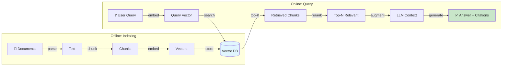
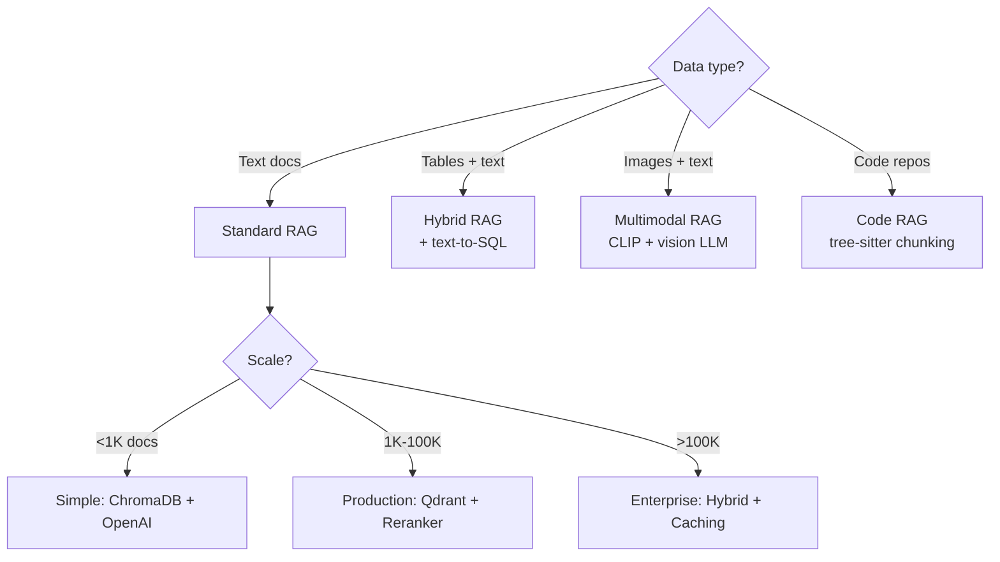
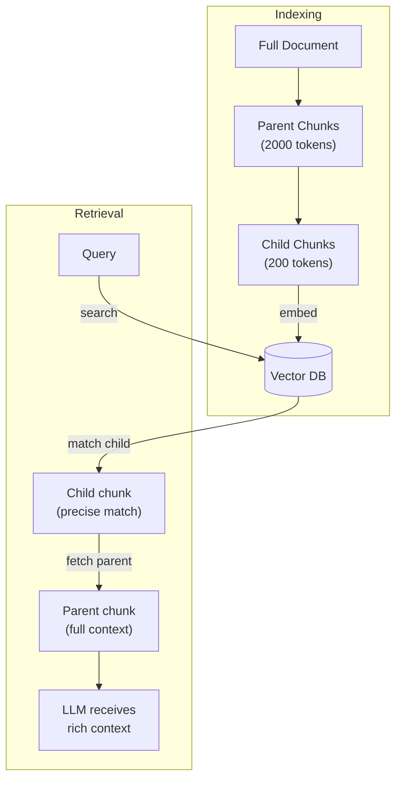
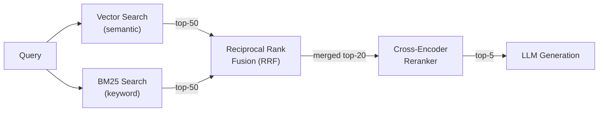
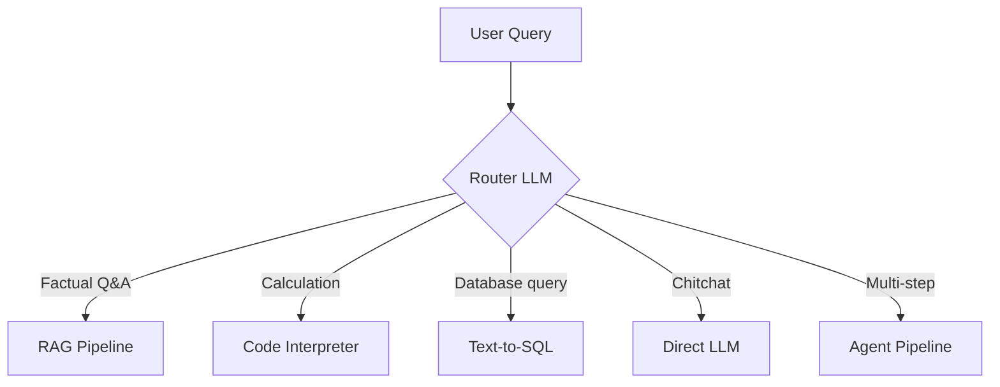

# 🔍 RAG Architecture — Production Guide

> **Mục tiêu**: Xây dựng RAG pipeline end-to-end — chunking, embeddings, retrieval, reranking, generation.
> RAG = kiến trúc **được hỏi nhiều nhất** trong phỏng vấn AI Engineer 2026.

---

## 1. RAG Pipeline Overview



### Architecture Decision Tree



---

## 2. Chunking Strategies

| Strategy | How | Pros | Cons | Best for |
|----------|-----|------|------|----------|
| **Fixed-size** | Every 500 tokens | Simple, consistent | Breaks mid-sentence | Simple docs |
| **Recursive** | Split by \n\n → \n → . | Respects structure | Variable sizes | **Default** ✅ |
| **Semantic** | Embed + cluster similar | Semantically coherent | Expensive | High-quality |
| **Sentence-level** | One sentence per chunk | Clean boundaries | Too small | Q&A |
| **Parent-child** | Small search, big context | Precision + context | Complex | Production |
| **Document** | Whole doc as chunk | Full context | Only for short docs | Summaries |

### 2.1 Recursive Chunking (Default)

```python
from langchain.text_splitter import RecursiveCharacterTextSplitter

splitter = RecursiveCharacterTextSplitter(
    chunk_size=500,         # Target size in characters
    chunk_overlap=50,       # Overlap between chunks (don't lose context!)
    separators=["\n\n", "\n", ". ", " ", ""],  # Try split in order
    length_function=len,
)

chunks = splitter.split_text(document_text)
# Typical result: ~200-500 char chunks, respecting paragraph boundaries
```

### 2.2 Semantic Chunking

```python
from langchain_experimental.text_splitter import SemanticChunker
from langchain_openai.embeddings import OpenAIEmbeddings

# Groups sentences with similar embeddings into chunks
semantic_splitter = SemanticChunker(
    OpenAIEmbeddings(),
    breakpoint_threshold_type="percentile",
    breakpoint_threshold_amount=95,  # Split when similarity drops below 95th percentile
)

chunks = semantic_splitter.split_text(document_text)
# Result: variable-size chunks, each semantically coherent
```

### 2.3 Parent-Child (Production Pattern)



```python
from langchain.retrievers import ParentDocumentRetriever
from langchain.storage import InMemoryStore

# Small chunks for search precision, big chunks for LLM context
parent_splitter = RecursiveCharacterTextSplitter(chunk_size=2000)
child_splitter = RecursiveCharacterTextSplitter(chunk_size=200)

retriever = ParentDocumentRetriever(
    vectorstore=vectorstore,
    docstore=InMemoryStore(),
    child_splitter=child_splitter,
    parent_splitter=parent_splitter,
)
retriever.add_documents(documents)

# Search matches small precise chunks → returns big parent for context
results = retriever.invoke("What is attention mechanism?")
```

### 2.4 Metadata Enrichment

```python
# Add rich metadata → enables filtering at query time
documents = []
for i, chunk in enumerate(chunks):
    documents.append({
        "content": chunk,
        "metadata": {
            "source": "ml_textbook.pdf",
            "chapter": "Introduction",
            "page": 5,
            "chunk_index": i,
            "date_indexed": "2026-04-01",
            "doc_type": "technical",       # Filter by type
            "language": "en",             # Multi-language support
            "token_count": len(tokenizer.encode(chunk)),
        }
    })
```

---

## 3. Embeddings

### 3.1 Model Selection

| Model | Dim | MTEB | Speed | Cost | Best For |
|-------|:---:|:----:|:-----:|:----:|---------|
| `text-embedding-3-large` | 3072 | 64.6 | Fast | $$ | Production (English) |
| `text-embedding-3-small` | 1536 | 62.3 | Fast | $ | Cost-effective |
| `all-MiniLM-L6-v2` | 384 | 56.3 | Very fast | Free | Prototyping, on-prem |
| `bge-large-en-v1.5` | 1024 | 64.2 | Medium | Free | Production (open-source) |
| `Cohere embed-v3` | 1024 | 64.5 | Fast | $$ | Multilingual |
| `e5-mistral-7b` | 4096 | 66.6 | Slow | Free | Best quality (open) |

```python
from sentence_transformers import SentenceTransformer

model = SentenceTransformer('all-MiniLM-L6-v2')

# Embed documents (batch for efficiency!)
doc_embeddings = model.encode(
    ["ML uses data to learn", "DL uses neural networks", "SQL queries databases"],
    batch_size=64,
    show_progress_bar=True,
    normalize_embeddings=True,    # L2 normalize → cosine = dot product
)

# Embed query
query_embedding = model.encode("What is deep learning?", normalize_embeddings=True)

# Similarity
from sklearn.metrics.pairwise import cosine_similarity
similarities = cosine_similarity([query_embedding], doc_embeddings)[0]
print(f"Similarities: {similarities.round(3)}")  # [0.63, 0.82, 0.15]
```

### 3.2 Embedding Best Practices

```
✅ Use instruction-prefixed models (query vs passage):
   query:  "query: What is deep learning?"
   doc:    "passage: Deep learning uses neural networks with many layers"

✅ Normalize embeddings → cosine = dot product (faster!)

✅ Batch embed documents (64-256 at a time)

✅ Cache embeddings (don't re-embed same documents)

⚠️ Same model for docs AND queries (MUST match!)

⚠️ Don't mix embedding models in same collection
```

---

## 4. Retrieval Methods

### 4.1 Dense Retrieval (Vector Search)

```python
# Standard vector search — captures semantic meaning
results = vectorstore.similarity_search(
    query="How does attention work?",
    k=10,                                          # Retrieve top-10
    filter={"doc_type": "technical"},               # Metadata filter
)
```

### 4.2 Sparse Retrieval (BM25)

```python
from rank_bm25 import BM25Okapi

# BM25 — keyword matching, great for exact terms
tokenized_corpus = [doc.split() for doc in documents]
bm25 = BM25Okapi(tokenized_corpus)

query_tokens = "NVIDIA CUDA installation".split()
scores = bm25.get_scores(query_tokens)
top_k = sorted(range(len(scores)), key=lambda i: scores[i], reverse=True)[:10]
```

### 4.3 Hybrid Search (Best of Both)



```python
def reciprocal_rank_fusion(rankings: list[list[str]], k: int = 60) -> list[str]:
    """Fuse multiple ranked lists using RRF — simple but effective."""
    scores = {}
    for ranking in rankings:
        for rank, doc_id in enumerate(ranking):
            scores.setdefault(doc_id, 0)
            scores[doc_id] += 1 / (k + rank + 1)
    return sorted(scores, key=scores.get, reverse=True)

# Example
vector_results = ["doc_A", "doc_C", "doc_B"]  # Semantic: "puppy" finds "dog"
bm25_results = ["doc_B", "doc_A", "doc_D"]    # Keyword: "NVIDIA" finds "NVIDIA"

hybrid = reciprocal_rank_fusion([vector_results, bm25_results])
# doc_A and doc_B ranked highest (appear in BOTH lists)
```

### 4.4 Reranking (Critical for Quality!)

```python
from sentence_transformers import CrossEncoder

# Cross-encoder reranker — much more accurate than bi-encoder
reranker = CrossEncoder("cross-encoder/ms-marco-MiniLM-L-6-v2")

# Rerank retrieved documents
query = "How does attention mechanism work?"
retrieved_docs = ["Attention computes QKV...", "SQL is fast...", "Transformers use attention..."]

pairs = [(query, doc) for doc in retrieved_docs]
scores = reranker.predict(pairs)

# Sort by rerank score
reranked = sorted(zip(scores, retrieved_docs), reverse=True)
top_5 = [doc for _, doc in reranked[:5]]

# Why reranking?
# Bi-encoder (retrieval): embeds query and doc INDEPENDENTLY → fast but less accurate
# Cross-encoder (rerank): processes query+doc TOGETHER → slow but very accurate
# Pipeline: bi-encoder top-50 → cross-encoder rerank → top-5
```

---

## 5. Generation

### 5.1 RAG Prompt Template

```python
RAG_PROMPT = """Answer the question based ONLY on the following context.
If the context doesn't contain the answer, say "I don't have enough information."

Context:
{context}

Question: {question}

Instructions:
- Use direct quotes from the context when possible
- Cite the source [Source: filename, page X] for each claim
- Be concise and specific
- If multiple sources agree, mention consensus
"""

def generate_answer(question: str, retrieved_docs: list[dict]) -> str:
    # Format context with source citations
    context_parts = []
    for i, doc in enumerate(retrieved_docs, 1):
        source = doc.get("metadata", {}).get("source", "unknown")
        page = doc.get("metadata", {}).get("page", "?")
        context_parts.append(f"[Source {i}: {source}, p.{page}]\n{doc['content']}")
    
    context = "\n\n---\n\n".join(context_parts)
    
    response = client.chat.completions.create(
        model="gpt-4o-mini",
        messages=[
            {"role": "system", "content": "You are a helpful assistant. Always cite your sources."},
            {"role": "user", "content": RAG_PROMPT.format(context=context, question=question)},
        ],
        temperature=0.1,  # Low for factual accuracy
    )
    return response.choices[0].message.content
```

### 5.2 Streaming Response

```python
async def stream_rag_response(question: str):
    """Stream RAG response for better UX."""
    docs = await retrieve(question)
    context = format_context(docs)
    
    stream = client.chat.completions.create(
        model="gpt-4o-mini",
        messages=[
            {"role": "system", "content": "Answer based on context. Cite sources."},
            {"role": "user", "content": f"Context:\n{context}\n\nQuestion: {question}"},
        ],
        temperature=0.1,
        stream=True,
    )
    
    for chunk in stream:
        if chunk.choices[0].delta.content:
            yield chunk.choices[0].delta.content
```

---

## 6. Production Patterns

### 6.1 Semantic Caching

```python
import redis
import numpy as np

class SemanticCache:
    """Cache similar queries → avoid redundant LLM calls."""
    
    def __init__(self, threshold: float = 0.95):
        self.cache = {}  # In production: Redis + vector index
        self.threshold = threshold
    
    def get(self, query: str, query_embedding: np.ndarray):
        for cached_query, data in self.cache.items():
            similarity = np.dot(query_embedding, data["embedding"])
            if similarity >= self.threshold:
                return data["answer"]  # Cache hit!
        return None
    
    def set(self, query: str, embedding: np.ndarray, answer: str):
        self.cache[query] = {"embedding": embedding, "answer": answer}
```

### 6.2 Query Routing



```python
ROUTER_PROMPT = """Classify this query into one category:
- "rag": needs information from documents
- "sql": needs database query
- "code": needs calculation/code execution
- "chat": casual conversation

Query: {query}
Category:"""

async def route_query(query: str) -> str:
    category = await llm_classify(ROUTER_PROMPT.format(query=query))
    
    match category:
        case "rag":   return await rag_pipeline(query)
        case "sql":   return await text_to_sql(query)
        case "code":  return await code_execute(query)
        case "chat":  return await direct_llm(query)
```

### 6.3 Multi-Tenancy

```python
# Each user/org accesses ONLY their documents
results = collection.query(
    query_texts=[query],
    n_results=10,
    where={
        "$and": [
            {"organization_id": current_user.org_id},
            {"access_level": {"$lte": current_user.access_level}},
        ]
    },
)
```

---

## 🎯 Interview Tips — Chi Tiết

### Q1: "Design RAG cho legal firm."
**A**: Parse PDFs (PyMuPDF) → recursive chunk (500 tokens) → metadata (case number, date, court, type) → bge-large embeddings → pgvector (SQL power for filtering) → hybrid search (vector + keyword for legal terms) → cross-encoder rerank → GPT-4o with citations → output validation.

### Q2: "RAG vs Fine-tuning?"
**A**: RAG: dynamic knowledge, instant update, grounded (less hallucination). Fine-tuning: style/format change, static, expensive. NOT mutually exclusive! Best: fine-tune for output format + RAG for knowledge.

### Q3: "Chunking strategy nào tốt nhất?"
**A**: No one-size-fits-all. Recursive = default start. Parent-child for production (search precision + context). Semantic for high-quality needs. Must experiment: chunk_size, overlap, metadata. Measure with RAGAS.

### Q4: "Hybrid search tại sao tốt?"
**A**: Vector misses exact terms (product codes, acronyms). BM25 misses semantics ("puppy" ≠ "dog"). Hybrid + RRF = best of both. Standard in production RAG. 10-20% improvement over vector-only.

### Q5: "Reranking quan trọng thế nào?"
**A**: Bi-encoder (retrieval): fast but less accurate. Cross-encoder (rerank): 3-5x more accurate but slow. Pipeline: bi-encoder top-50 → cross-encoder top-5. Improves quality 15-30%. Always use in production.

### Q6: "RAG debugging?"
**A**: Systematic: (1) Check retrieval first (are top-5 chunks relevant?). (2) If not → fix chunking/embedding/search. (3) If yes but answer bad → fix prompt/temperature. Tools: LangSmith trace, Langfuse scoring. Retrieval quality drives 80% of RAG quality.
