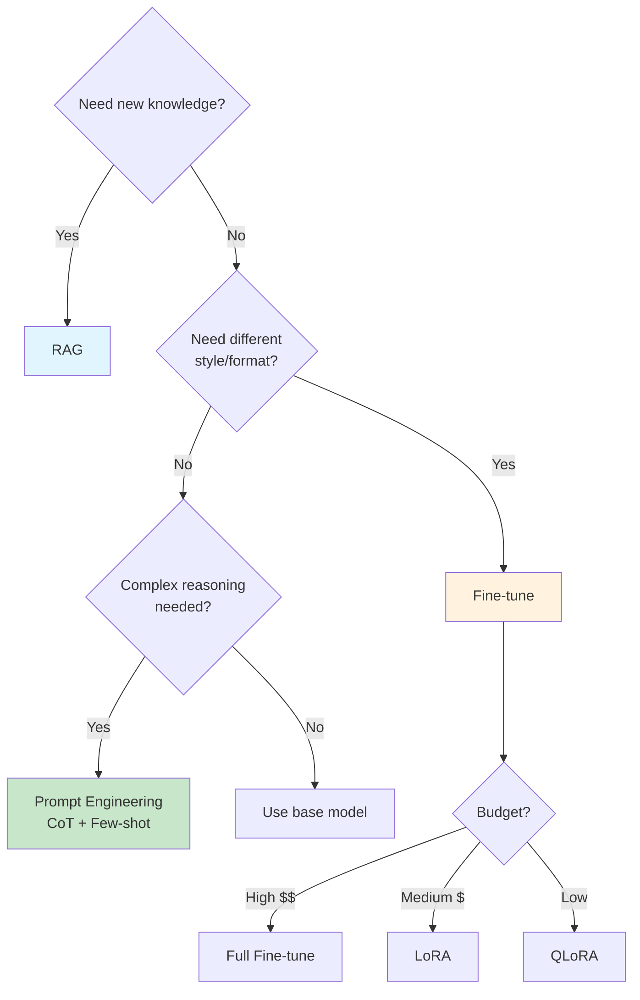
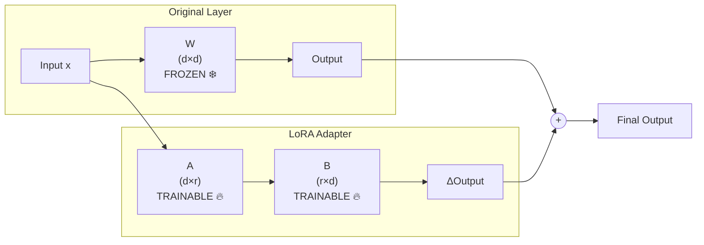
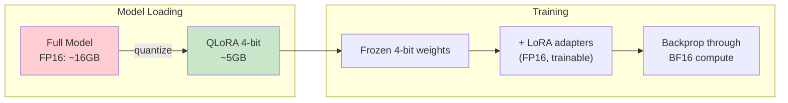
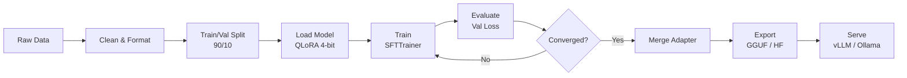

# 🎛️ Fine-tuning LLM — LoRA, QLoRA, PEFT — Production Guide

> **Mục tiêu**: Master LoRA/QLoRA fine-tuning — khi nào cần, config, data prep, deploy, evaluate.
> Fine-tuning = teaching a pre-trained model YOUR specific task/style/format.

---

## 1. Khi nào Fine-tune vs RAG vs Prompt?



| Method | Knowledge | Style/Format | Data Needed | Cost | Setup |
|--------|:---------:|:------------:|:-----------:|:----:|:-----:|
| **Prompt (few-shot)** | ❌ | ⭐⭐ | 3-5 examples | $0 | Minutes |
| **RAG** | ✅ | ⭐ | Documents | $ | Hours |
| **LoRA Fine-tune** | ⭐ | ⭐⭐⭐⭐⭐ | 100-10K | $$ | Days |
| **Full Fine-tune** | ⭐⭐ | ⭐⭐⭐⭐⭐ | 10K+ | $$$ | Days |
| **Fine-tune + RAG** | ✅ | ⭐⭐⭐⭐⭐ | Both | $$$ | Week |

---

## 2. LoRA — Low-Rank Adaptation

### 2.1 How It Works



```
Original weight: W ∈ R^(d×d)    → millions of parameters
LoRA addition:   W + ΔW          where ΔW = A × B
                                 A ∈ R^(d×r), B ∈ R^(r×d)
                                 r << d (typically 8-64)

Example: LLaMA 8B, d=4096, r=16
- Original per layer: 4096 × 4096 = 16.7M params ❄️ frozen
- LoRA per layer:     (4096×16) + (16×4096) = 131K params 🔥 trainable
- Reduction: 99.2% fewer trainable parameters!
- Total trainable: ~0.5-2% of model params
```

### 2.2 Key Hyperparameters

```python
from peft import LoraConfig, TaskType

config = LoraConfig(
    # === Rank (r) ===
    # Low (4-16):   simple tasks, style transfer, format learning
    # Medium (32):  domain adaptation, moderate complexity
    # High (64-256): complex knowledge injection, math
    # Start with: 16, increase if underfitting
    r=16,
    
    # === Alpha (lora_alpha) ===
    # Scaling factor: effective_lr = alpha / r * base_lr
    # Rule of thumb: alpha = 2 × r
    # Higher alpha = stronger LoRA effect
    lora_alpha=32,
    
    # === Target Modules ===
    # "all-linear": ALL linear layers (best accuracy, most params)
    # ["q_proj", "v_proj"]: attention only (less params, often sufficient)
    # ["q_proj", "k_proj", "v_proj", "o_proj"]: full attention
    target_modules="all-linear",
    
    # === Dropout ===
    # Regularization: 0.0 for large datasets, 0.05-0.1 for small
    lora_dropout=0.05,
    
    # === Bias ===
    # "none": don't train bias (default, most stable)
    # "lora_only": train bias in LoRA layers  
    bias="none",
    
    task_type=TaskType.CAUSAL_LM,
)
```

---

## 3. QLoRA — 4-bit Quantized LoRA



```python
from transformers import AutoModelForCausalLM, BitsAndBytesConfig
import torch

# ── Quantization config ──
bnb_config = BitsAndBytesConfig(
    load_in_4bit=True,
    bnb_4bit_quant_type="nf4",          # NormalFloat4 (best for normally-distributed weights)
    bnb_4bit_compute_dtype=torch.bfloat16,  # Compute in BF16 (not FP16, more stable)
    bnb_4bit_use_double_quant=True,     # Quantize the quantization constants too!
)

# Load model in 4-bit
model = AutoModelForCausalLM.from_pretrained(
    "meta-llama/Llama-3.1-8B",
    quantization_config=bnb_config,
    device_map="auto",
    torch_dtype=torch.bfloat16,
)

# VRAM comparison:
# Full FP32:  ~32 GB  → Can't fit on consumer GPU
# FP16/BF16:  ~16 GB  → Needs A100/H100
# QLoRA 4-bit: ~5 GB  → Fits on RTX 3090/4090! ✅
```

---

## 4. Data Preparation

### 4.1 Dataset Formats

```python
# ── ChatML Format (recommended) ──
training_data = [
    {
        "messages": [
            {"role": "system", "content": "You are a helpful coding assistant."},
            {"role": "user", "content": "Write a Python function to flatten a list."},
            {"role": "assistant", "content": "```python\ndef flatten(lst):\n    return [item for sub in lst for item in (flatten(sub) if isinstance(sub, list) else [sub])]\n```"},
        ]
    },
    # ... more examples
]

# ── Instruction Format ──
training_data = [
    {
        "instruction": "Summarize this text in 3 bullet points.",
        "input": "Machine learning is a subset of AI...",
        "output": "• ML is a subset of AI\n• It learns from data\n• Applications include..."
    },
]

# ── Apply Chat Template ──
from transformers import AutoTokenizer

tokenizer = AutoTokenizer.from_pretrained("meta-llama/Llama-3.1-8B-Instruct")
tokenizer.pad_token = tokenizer.eos_token

def format_chat(example):
    messages = [
        {"role": "system", "content": "You are a helpful AI assistant."},
        {"role": "user", "content": example["instruction"]},
        {"role": "assistant", "content": example["output"]},
    ]
    return {"text": tokenizer.apply_chat_template(messages, tokenize=False)}

# ── Data Quality Checklist ──
# ✅ Remove duplicates
# ✅ Filter low-quality examples
# ✅ Balance categories
# ✅ Verify output format consistency
# ✅ Test with 10% sample first
# ✅ Minimum: 100 examples, recommended: 1000-5000
```

---

## 5. Training Pipeline



```python
from trl import SFTTrainer, SFTConfig
from datasets import load_dataset

# ── Dataset ──
dataset = load_dataset("json", data_files="data/train.jsonl", split="train")
dataset = dataset.map(format_chat)
dataset = dataset.train_test_split(test_size=0.1)

# ── Training Config ──
training_args = SFTConfig(
    output_dir="./checkpoints",
    
    # ── Epochs & Steps ──
    num_train_epochs=3,               # 2-5 for most tasks
    max_steps=-1,                     # -1 = use epochs, or set specific step count
    
    # ── Batch Size ──
    per_device_train_batch_size=4,
    per_device_eval_batch_size=4,
    gradient_accumulation_steps=4,    # Effective batch = 4 × 4 = 16
    
    # ── Learning Rate ──
    learning_rate=2e-4,               # LoRA needs higher LR (2e-4 to 5e-4)
    lr_scheduler_type="cosine",       # cosine > linear for fine-tuning
    warmup_ratio=0.1,                 # 10% warmup
    weight_decay=0.01,
    
    # ── Sequence Length ──
    max_seq_length=2048,              # Match your data length
    packing=True,                     # Pack short examples → faster training!
    
    # ── Precision ──
    bf16=True,                        # BF16 for A100/H100/3090+
    # fp16=True,                      # FP16 for older GPUs
    
    # ── Logging & Saving ──
    logging_steps=10,
    eval_strategy="steps",
    eval_steps=100,
    save_strategy="steps",
    save_steps=100,
    save_total_limit=3,               # Keep only 3 best checkpoints
    load_best_model_at_end=True,
    metric_for_best_model="eval_loss",
    
    # ── Optimization ──
    optim="adamw_torch_fused",        # Fused AdamW (faster)
    gradient_checkpointing=True,      # Save VRAM (trade compute for memory)
    
    # ── Reporting ──
    report_to="wandb",                # Track in W&B
)

# ── Train ──
trainer = SFTTrainer(
    model=model,
    args=training_args,
    train_dataset=dataset["train"],
    eval_dataset=dataset["test"],
    peft_config=config,               # LoRA config
)

trainer.train()
trainer.save_model("./lora_adapter")
```

---

## 6. Evaluation

```python
# ── Training Curves ──
# ✅ Good: train_loss and eval_loss both decrease, eval stabilizes
# ⚠️ Overfitting: train_loss ↓ but eval_loss ↑ 
# ❌ Underfitting: both losses stay high

# ── Automated Evaluation ──
from bert_score import score as bert_score

def evaluate_finetuned(model, tokenizer, test_data: list[dict]) -> dict:
    predictions, references = [], []
    
    for item in test_data:
        inputs = tokenizer(item["input"], return_tensors="pt").to(model.device)
        with torch.no_grad():
            output = model.generate(**inputs, max_new_tokens=256, temperature=0.0)
        pred = tokenizer.decode(output[0], skip_special_tokens=True)
        predictions.append(pred)
        references.append(item["expected_output"])
    
    # BERTScore for semantic similarity
    P, R, F1 = bert_score(predictions, references, lang="en")
    
    # Exact match rate
    exact_match = sum(p == r for p, r in zip(predictions, references)) / len(predictions)
    
    return {
        "bertscore_f1": F1.mean().item(),
        "exact_match": exact_match,
        "n_samples": len(test_data),
    }
```

### 6.2 Base vs Fine-tuned — A/B Comparison

```python
import json
import time

def ab_evaluate(base_model, finetuned_model, tokenizer, test_prompts: list[dict]) -> dict:
    """Run same prompts through both models, compare quality + speed."""
    results = {"base": [], "finetuned": []}
    
    for prompt in test_prompts:
        for name, model in [("base", base_model), ("finetuned", finetuned_model)]:
            inputs = tokenizer(prompt["input"], return_tensors="pt").to(model.device)
            
            start = time.perf_counter()
            with torch.no_grad():
                output = model.generate(**inputs, max_new_tokens=256, temperature=0.0)
            latency = time.perf_counter() - start
            
            pred = tokenizer.decode(output[0], skip_special_tokens=True)
            results[name].append({
                "input": prompt["input"],
                "output": pred,
                "expected": prompt.get("expected"),
                "latency_ms": latency * 1000,
            })
    
    # Compare metrics
    for name in ["base", "finetuned"]:
        outputs = results[name]
        avg_latency = sum(r["latency_ms"] for r in outputs) / len(outputs)
        if outputs[0]["expected"]:
            accuracy = sum(
                r["output"].strip() == r["expected"].strip() for r in outputs
            ) / len(outputs)
        else:
            accuracy = None
        results[f"{name}_summary"] = {"avg_latency_ms": avg_latency, "accuracy": accuracy}
    
    return results

# ── LLM-as-Judge (blind evaluation) ──
def llm_judge_compare(base_output: str, ft_output: str, prompt: str) -> dict:
    """Use GPT-4o to judge which output is better (blind)."""
    import random
    # Randomize order to prevent position bias
    if random.random() > 0.5:
        a, b, order = base_output, ft_output, "base_first"
    else:
        a, b, order = ft_output, base_output, "ft_first"
    
    judge_prompt = f"""Compare these two AI responses to the same prompt.

Prompt: {prompt}

Response A:
{a}

Response B:
{b}

Which response is better? Consider: accuracy, completeness, format compliance.
Return JSON: {{"winner": "A" or "B" or "tie", "reason": "..."}}"""
    
    response = client.chat.completions.create(
        model="gpt-4o",
        messages=[{"role": "user", "content": judge_prompt}],
        response_format={"type": "json_object"},
    )
    result = json.loads(response.choices[0].message.content)
    # Map back to base/finetuned
    if order == "base_first":
        result["actual_winner"] = "base" if result["winner"] == "A" else "finetuned"
    else:
        result["actual_winner"] = "finetuned" if result["winner"] == "A" else "base"
    return result
```

### 6.3 Evaluation Checklist

```
Before deploying fine-tuned model:
  ✅ Task-specific metrics improved (accuracy, format compliance)
  ✅ General capabilities NOT degraded (test on MMLU subset)
  ✅ Latency acceptable (LoRA merged → same speed as base)
  ✅ Edge cases tested (empty input, very long input, adversarial)
  ✅ Cost analysis: fine-tune cost vs prompt engineering cost
  
Cost comparison example:
  Prompt engineering: $0.01/request (long system prompt)
  Fine-tuned model:   $0.003/request (shorter prompts needed)
  Fine-tuning cost:   $50 (one-time)
  Break-even:         ~7,000 requests → fine-tune worth it at scale
```

---

## 7. Deployment

### 7.1 Merge & Export

```python
from peft import PeftModel, AutoPeftModelForCausalLM

# ── Option 1: Merge adapter into base (recommended for serving) ──
base_model = AutoModelForCausalLM.from_pretrained(
    "meta-llama/Llama-3.1-8B",
    torch_dtype=torch.bfloat16,
)
model = PeftModel.from_pretrained(base_model, "./lora_adapter")
model = model.merge_and_unload()         # Merge LoRA weights into base
model.save_pretrained("./merged_model")  # Save as standard HF model
tokenizer.save_pretrained("./merged_model")

# ── Option 2: Keep adapter separate (multi-adapter serving) ──
# Useful when serving multiple LoRA adapters on same base model
# vLLM supports this natively!

# ── Option 3: Convert to GGUF (Ollama / llama.cpp) ──
# python convert_hf_to_gguf.py ./merged_model --outtype q4_k_m
# ollama create my-model -f Modelfile
```

### 7.2 Serve with vLLM

```python
# vLLM: fast LLM serving with PagedAttention + continuous batching
from vllm import LLM, SamplingParams

# ── Serve merged model ──
llm = LLM(
    model="./merged_model",
    dtype="bfloat16",
    gpu_memory_utilization=0.9,
    max_model_len=4096,
)

params = SamplingParams(temperature=0.0, max_tokens=512, top_p=0.95)
outputs = llm.generate(["Write a Python function to sort a list."], params)
print(outputs[0].outputs[0].text)

# ── Serve multiple LoRA adapters ──
from vllm.lora.request import LoRARequest

llm = LLM(model="meta-llama/Llama-3.1-8B", enable_lora=True)

# Different tasks, same base model!
coding_adapter = LoRARequest("coding", 1, "./lora_coding")
support_adapter = LoRARequest("support", 2, "./lora_support")

# Route by task type
output_coding = llm.generate(["Write code..."], params, lora_request=coding_adapter)
output_support = llm.generate(["Help user..."], params, lora_request=support_adapter)
```

---

## 8. Common Pitfalls

| Problem | Symptom | Fix |
|---------|---------|-----|
| **Overfitting** | Train loss ↓, eval loss ↑ | ↑ dropout, ↓ epochs, ↑ data |
| **Underfitting** | Both losses stay high | ↑ rank r, ↑ alpha, ↑ epochs |
| **Data format bug** | Loss doesn't decrease at all | Check chat template, tokenizer |
| **Catastrophic forgetting** | Model forgets base knowledge | ↓ LR (1e-5), fewer epochs |
| **OOM** | CUDA out of memory | ↓ batch, ↑ grad accumulation, QLoRA |
| **Gibberish output** | Random tokens | Check data quality, ↓ LR |
| **Repetition** | Model loops | ↓ temperature, add repetition_penalty |

---

## 🎯 Interview Tips — Chi Tiết

### Q1: "LoRA hoạt động thế nào?"
**A**: Freeze base model, add low-rank matrices A (d×r) and B (r×d) to linear layers. ΔW = A×B. r=16 means only train ~1% params. During inference: merge W+ΔW → zero overhead.

### Q2: "Rank r ảnh hưởng gì?"
**A**: r = capacity of adaptation. Low r (4-16): style/format (IELTS grading). High r (64-256): complex tasks (math, code). Start 16, increase if eval loss plateaus. Higher r = more VRAM + longer training.

### Q3: "QLoRA vs LoRA?"
**A**: QLoRA = LoRA + NF4 quantization. Base model loaded in 4-bit (4x less VRAM). LoRA adapters still trained in FP16/BF16. Quality loss: <1% compared to full LoRA. Game-changer: train 70B on single A100.

### Q4: "Alpha (lora_alpha)?"
**A**: Scaling factor for LoRA update. Effective scaling = alpha/r. Rule: alpha = 2×r. Higher alpha = stronger LoRA effect, risk instability. Lower alpha = more conservative, might underfit.

### Q5: "Fine-tune vs RAG?"
**A**: Fine-tune: change behavior/style/format. RAG: add knowledge. Not mutually exclusive! Best systems: fine-tune for format + RAG for knowledge. Example: fine-tune for JSON output format, RAG for company docs.

### Q6: "Merge vs separate adapters?"
**A**: Merge: single model file, no overhead, simpler deployment. Separate: serve multiple adapters on one base (vLLM), swap tasks without reloading. Production with 1 task → merge. Multi-task → separate with vLLM.

### Q7: "How to prevent catastrophic forgetting?"
**A**: (1) Low learning rate (1e-5 to 5e-5). (2) Short training (2-3 epochs). (3) Include diverse general data (10-20%). (4) Evaluate on general benchmarks during training. LoRA naturally prevents it (base weights frozen).

### Q8: "Data requirements?"
**A**: Minimum viable: 100 high-quality examples. Sweet spot: 1K-5K. Diminishing returns after 10K. Quality > quantity. 100 perfect examples > 10K noisy ones. Always test with 10% subset first.
