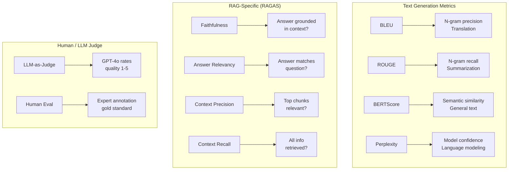
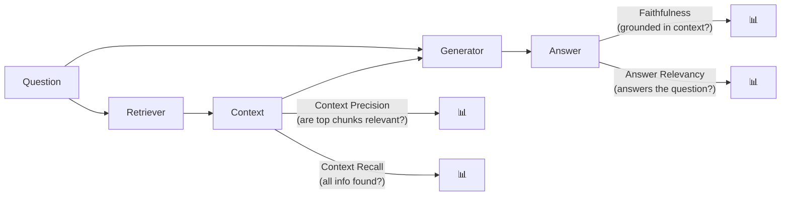
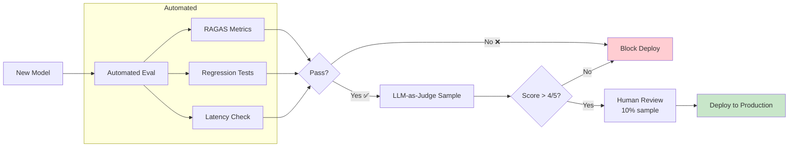

# 📊 LLM & NLP Evaluation — Production Guide

> **Mục tiêu**: BLEU, ROUGE, BERTScore, RAGAS, LLM-as-Judge, benchmarks.
> "You can't improve what you can't measure" — evaluation drives every ML decision.

---

## 1. NLP Evaluation Landscape



---

## 2. Traditional NLP Metrics

### 2.1 BLEU (Bilingual Evaluation Understudy)

```python
# BLEU = precision of n-grams (how much of prediction matches reference)
# Used for: Machine Translation

from nltk.translate.bleu_score import sentence_bleu, corpus_bleu

reference = [["the", "cat", "sat", "on", "the", "mat"]]
candidate = ["the", "cat", "is", "on", "the", "mat"]

# Sentence-level BLEU
score = sentence_bleu(reference, candidate)
print(f"BLEU: {score:.3f}")  # ~0.67

# BLEU-1/2/3/4 (different n-gram levels)
from nltk.translate.bleu_score import SmoothingFunction
smooth = SmoothingFunction().method1

bleu_1 = sentence_bleu(reference, candidate, weights=(1, 0, 0, 0))      # Unigram
bleu_2 = sentence_bleu(reference, candidate, weights=(0.5, 0.5, 0, 0))  # Uni+Bigram
bleu_4 = sentence_bleu(reference, candidate, weights=(0.25,0.25,0.25,0.25), 
                        smoothing_function=smooth)

# ⚠️ BLEU limitations:
# - Only measures precision (not recall)
# - Ignores semantics ("good" vs "great" = 0 match)
# - Brevity penalty can be harsh
# - Poor for creative/open-ended text
```

### 2.2 ROUGE (Recall-Oriented Understudy)

```python
from rouge_score import rouge_scorer

scorer = rouge_scorer.RougeScorer(['rouge1', 'rouge2', 'rougeL'], use_stemmer=True)

reference = "The cat sat on the mat in the living room"
prediction = "A cat was sitting on a mat"

scores = scorer.score(reference, prediction)

for metric, score in scores.items():
    print(f"{metric}: P={score.precision:.3f} R={score.recall:.3f} F1={score.fmeasure:.3f}")
# rouge1: P=0.857 R=0.600 F1=0.706  → unigram overlap
# rouge2: P=0.600 R=0.375 F1=0.462  → bigram overlap
# rougeL: P=0.714 R=0.500 F1=0.588  → longest common subsequence

# ⚠️ ROUGE limitations:
# - Only lexical overlap (not semantic)
# - "Machine learning is great" vs "ML is awesome" → ROUGE ≈ 0
```

### 2.3 BERTScore (Semantic Similarity)

```python
from bert_score import score as bert_score

references = ["The cat sat on the mat"]
candidates = ["A feline was resting on a rug"]

P, R, F1 = bert_score(candidates, references, lang="en", model_type="roberta-large")
print(f"BERTScore F1: {F1.mean():.3f}")  # ~0.85 (captures semantic similarity!)

# ✅ BERTScore advantages:
# - Semantic (not just lexical) matching
# - Works across paraphrases
# - Pre-trained embeddings capture meaning

# ⚠️ Limitations:
# - Slower than BLEU/ROUGE
# - Model-dependent (different scores with different models)
```

### 2.4 Perplexity

```python
import torch
from transformers import AutoModelForCausalLM, AutoTokenizer

model_name = "gpt2"
model = AutoModelForCausalLM.from_pretrained(model_name)
tokenizer = AutoTokenizer.from_pretrained(model_name)

text = "The quick brown fox jumps over the lazy dog"
inputs = tokenizer(text, return_tensors="pt")

with torch.no_grad():
    outputs = model(**inputs, labels=inputs["input_ids"])
    perplexity = torch.exp(outputs.loss).item()

print(f"Perplexity: {perplexity:.2f}")
# Lower = model is more confident/better
# PPL 10     → very confident
# PPL 100    → moderate
# PPL 1000+  → bad model or unusual text
```

---

## 3. RAG Evaluation (RAGAS)

### 3.1 Metrics Deep-Dive



| Metric | Measures | Low Score = | Target |
|--------|----------|-------------|:------:|
| **Faithfulness** | Answer only uses context info | Hallucination! | >0.90 |
| **Answer Relevancy** | Answer addresses the question | Off-topic | >0.85 |
| **Context Precision** | Top-K chunks are relevant | Bad ranking | >0.80 |
| **Context Recall** | Retrieved all needed info | Missing info | >0.80 |

### 3.2 Full Evaluation Pipeline

```python
from ragas import evaluate
from ragas.metrics import (
    faithfulness,
    answer_relevancy,
    context_precision,
    context_recall,
    answer_correctness,
)
from datasets import Dataset

# ── Create evaluation dataset ──
eval_data = Dataset.from_dict({
    "question": [
        "What is the return policy?",
        "How do I cancel my subscription?",
        "Does the product support GPU?",
    ],
    "answer": [
        "We offer a 30-day money-back guarantee for all products.",
        "You can cancel your subscription from the account settings page.",
        "Yes, the product supports NVIDIA GPUs with CUDA 12.0+.",
    ],
    "contexts": [
        ["Our return policy offers a 30-day money-back guarantee. Contact support for returns."],
        ["To cancel, go to Account > Settings > Subscription > Cancel."],
        ["System requirements: NVIDIA GPU with CUDA 12.0+, 8GB VRAM minimum."],
    ],
    "ground_truth": [
        "30-day money-back guarantee.",
        "Cancel from account settings page.",
        "Yes, supports NVIDIA GPUs with CUDA 12.0+.",
    ],
})

# ── Run evaluation ──
result = evaluate(
    eval_data,
    metrics=[
        faithfulness,
        answer_relevancy,
        context_precision,
        context_recall,
        answer_correctness,
    ],
)

print(result)
# {'faithfulness': 0.95, 'answer_relevancy': 0.92,
#  'context_precision': 0.88, 'context_recall': 0.90,
#  'answer_correctness': 0.91}

# ── Per-question analysis ──
df = result.to_pandas()
# Find worst-performing questions
worst = df.nsmallest(5, "faithfulness")
print("Low faithfulness questions (hallucination risk):")
print(worst[["question", "faithfulness", "answer"]])
```

---

## 4. LLM-as-Judge

### 4.1 Single Rating

```python
import json
from openai import OpenAI

client = OpenAI()

JUDGE_PROMPT = """You are an expert evaluator. Rate the following answer on a scale of 1-5.

Question: {question}
Reference Answer: {reference}
Model Answer: {answer}

Evaluate on these criteria:
1. **Factual Accuracy** (matches reference facts?)
2. **Completeness** (covers all key points?)
3. **Conciseness** (no unnecessary info?)
4. **Clarity** (well-structured, easy to understand?)

Respond with JSON:
{{"overall_score": <1-5>, "accuracy": <1-5>, "completeness": <1-5>, "reasoning": "<explanation>"}}
"""

async def judge_answer(question: str, reference: str, answer: str) -> dict:
    response = await client.chat.completions.create(
        model="gpt-4o",
        messages=[{
            "role": "user",
            "content": JUDGE_PROMPT.format(
                question=question, reference=reference, answer=answer
            ),
        }],
        response_format={"type": "json_object"},
        temperature=0.0,  # Deterministic scoring
    )
    return json.loads(response.choices[0].message.content)
```

### 4.2 Pairwise Comparison (More Reliable)

```python
PAIRWISE_PROMPT = """Compare two answers to the same question.

Question: {question}
Answer A: {answer_a}
Answer B: {answer_b}

Which answer is better? Consider accuracy, completeness, and clarity.

Respond with JSON:
{{"winner": "A" or "B" or "tie", "reasoning": "<explanation>"}}
"""

async def pairwise_judge(question: str, answer_a: str, answer_b: str) -> dict:
    # Run BOTH orderings to reduce position bias!
    result_ab = await _judge(question, answer_a, answer_b)
    result_ba = await _judge(question, answer_b, answer_a)  # Swap order
    
    # Consistent winner = reliable. Different = tie.
    if result_ab["winner"] == "A" and result_ba["winner"] == "B":
        return {"winner": "A", "confidence": "high"}
    elif result_ab["winner"] == "B" and result_ba["winner"] == "A":
        return {"winner": "B", "confidence": "high"}
    else:
        return {"winner": "tie", "confidence": "low"}
```

### 4.3 LLM-as-Judge Pitfalls

```
Known biases:
  1. Position bias: prefers Answer A (first) — fix: run both orderings
  2. Verbosity bias: prefers longer answers — fix: add conciseness criterion
  3. Self-enhancement: GPT prefers GPT outputs — fix: use different judge model
  4. Number bias: prefers answers with statistics — fix: explicit criteria
  5. Style bias: prefers formal/academic tone — fix: task-specific rubric

Best practices:
  ✅ Use specific rubric (not "which is better?")
  ✅ Run both orderings for pairwise comparison
  ✅ Use temperature=0 for deterministic scoring
  ✅ Calibrate against human annotations (Cohen's Kappa > 0.7)
  ✅ Use strongest model as judge (GPT-4o, Claude 3.5)
```

---

## 5. LLM Benchmarks

| Benchmark | Measures | Tasks | Used By |
|-----------|----------|-------|---------|
| **MMLU** | Knowledge | 57 subjects, MCQ | Everyone |
| **HumanEval** | Coding | Python problems | Code models |
| **GSM8K** | Math reasoning | Grade-school math | Math models |
| **MT-Bench** | Chat quality | Multi-turn conversation | LLM leaderboard |
| **TruthfulQA** | Truthfulness | Tricky factual questions | Safety |
| **HellaSwag** | Common sense | Sentence completion | General |
| **ARC** | Science | Grade-school science | Knowledge |
| **GPQA** | Expert knowledge | PhD-level science | Frontier models |

```
⚠️ Benchmark limitations:
  1. Data contamination (training data includes test questions)
  2. Metric gaming (optimize for benchmark, not real performance)
  3. Saturation (most models score >90% on easy benchmarks)
  4. Doesn't capture real-world usefulness
  
→ Always evaluate on YOUR specific use case, not just benchmarks!
```

---

## 6. Evaluation Pipeline for Production



```python
class EvaluationPipeline:
    """Production evaluation pipeline for RAG/LLM systems."""
    
    def __init__(self, golden_dataset: list[dict]):
        self.golden = golden_dataset
    
    def run_full_evaluation(self, rag_pipeline) -> dict:
        results = {
            "ragas": self._ragas_eval(rag_pipeline),
            "regression": self._regression_test(rag_pipeline),
            "latency": self._latency_test(rag_pipeline),
        }
        
        results["passed"] = all([
            results["ragas"]["faithfulness"] > 0.90,
            results["ragas"]["answer_relevancy"] > 0.85,
            results["regression"]["all_passed"],
            results["latency"]["p95_ms"] < 2000,
        ])
        
        return results
    
    def _regression_test(self, pipeline) -> dict:
        failures = []
        for test in self.golden:
            answer = pipeline.query(test["question"])
            if test["expected_keyword"] not in answer.lower():
                failures.append(test["question"])
        
        return {
            "total": len(self.golden),
            "passed": len(self.golden) - len(failures),
            "failures": failures,
            "all_passed": len(failures) == 0,
        }
```

---

## 🎯 Interview Tips — Chi Tiết

### Q1: "BLEU vs ROUGE?"
**A**: BLEU = precision (how much of prediction matches reference). ROUGE = recall (how much of reference is captured). BLEU for translation, ROUGE for summarization. Both: only lexical overlap, no semantic understanding.

### Q2: "BERTScore vs BLEU/ROUGE?"
**A**: BERTScore uses embeddings → captures paraphrases and synonyms. "Awesome ML tool" vs "Great machine learning library" → BLEU≈0, BERTScore≈0.85. Slower but more meaningful. Use for open-ended generation.

### Q3: "RAGAS metrics?"
**A**: Faithfulness (no hallucination), Answer Relevancy (answers the question), Context Precision (top chunks useful), Context Recall (all info found). Targets: >0.90 faithfulness, >0.85 relevancy.

### Q4: "LLM-as-Judge pitfalls?"
**A**: Position bias (prefers first answer), verbosity bias (prefers longer), self-enhancement (GPT prefers GPT). Fix: run both orderings, specific rubric, temperature=0, calibrate vs human.

### Q5: "Perplexity?"
**A**: Measures how surprised the model is by text. Lower = more confident. PPL=1 is perfect. Used for: language model quality, detecting generated text (real text has lower PPL). Not meaningful for comparing DIFFERENT models.

### Q6: "How to evaluate production RAG?"
**A**: (1) Golden dataset (50-100 curated Q&A). (2) RAGAS automated metrics. (3) LLM-as-Judge on sample. (4) Human review of edge cases. (5) Regression tests in CI/CD. (6) A/B testing for business metrics.
