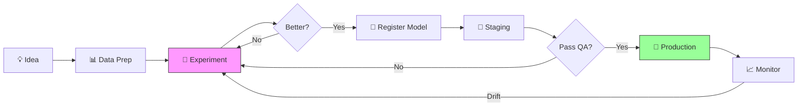
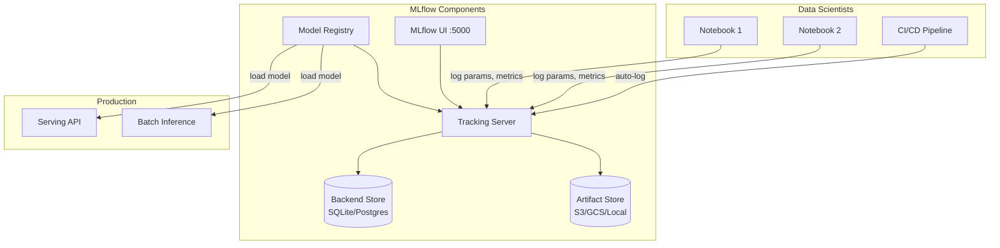
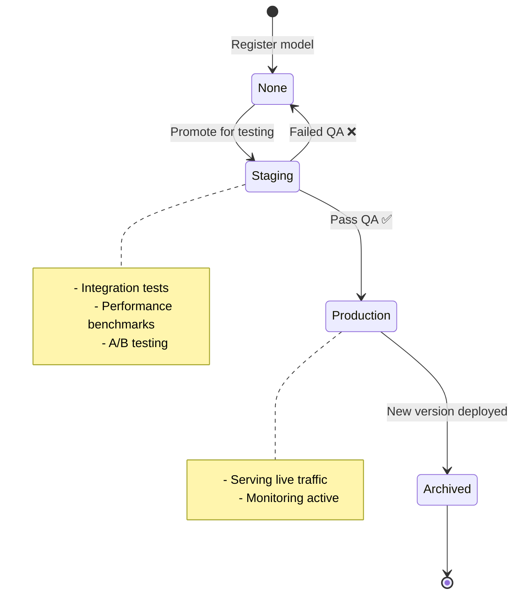

# 📊 Experiment Tracking — Production Guide

> **Mục tiêu**: MLflow, W&B — track, compare, reproduce, serve models.
> "If you can't track it, you can't improve it." — ML without tracking = guessing.

---

## 1. Tại sao cần Experiment Tracking?

```
Không tracking:
  "Model nào cho accuracy 92%?"  → Không ai biết
  "Hyperparameters gì?"          → Quên mất
  "Code version nào?"            → Đã commit đè

Có tracking:
  Run #47 → model=ResNet50, lr=0.001, epochs=30                → acc=92.3%
  Run #48 → model=ResNet50, lr=0.0005, epochs=50, aug=heavy    → acc=93.1% ✅
  → Mọi thứ tracked, comparable, reproducible trong 1 dashboard
```

### ML Lifecycle & Tracking



---

## 2. MLflow — Deep Dive

### 2.1 MLflow Architecture



### 2.2 Setup & Basic Tracking

```python
import mlflow
import mlflow.sklearn
from sklearn.ensemble import RandomForestClassifier
from sklearn.metrics import accuracy_score, f1_score, classification_report

# ── Server setup ──
# Local:  mlflow.set_tracking_uri("sqlite:///mlflow.db")
# Remote: mlflow.set_tracking_uri("http://mlflow-server:5000")
# Databricks: mlflow.set_tracking_uri("databricks")
mlflow.set_tracking_uri("sqlite:///mlflow.db")

mlflow.set_experiment("customer-churn-prediction")

# ── Full experiment run ──
with mlflow.start_run(run_name="rf-baseline") as run:
    # 1. Log parameters
    params = {
        "n_estimators": 100,
        "max_depth": 10,
        "min_samples_split": 5,
        "random_state": 42,
        "class_weight": "balanced",
    }
    mlflow.log_params(params)
    
    # 2. Log tags (metadata for organization)
    mlflow.set_tags({
        "developer": "phu",
        "dataset_version": "v2.1",
        "experiment_type": "baseline",
    })
    
    # 3. Train
    model = RandomForestClassifier(**params)
    model.fit(X_train, y_train)
    
    # 4. Evaluate
    y_pred = model.predict(X_test)
    y_proba = model.predict_proba(X_test)[:, 1]
    
    metrics = {
        "accuracy": accuracy_score(y_test, y_pred),
        "f1_score": f1_score(y_test, y_pred, average="weighted"),
        "precision": precision_score(y_test, y_pred, average="weighted"),
        "recall": recall_score(y_test, y_pred, average="weighted"),
        "auc_roc": roc_auc_score(y_test, y_proba),
    }
    mlflow.log_metrics(metrics)
    
    # 5. Log model (with signature for validation)
    from mlflow.models import infer_signature
    signature = infer_signature(X_test, y_pred)
    mlflow.sklearn.log_model(
        model, "model",
        signature=signature,
        input_example=X_test[:3],
    )
    
    # 6. Log artifacts (charts, reports)
    mlflow.log_artifact("confusion_matrix.png")
    mlflow.log_artifact("feature_importance.png")
    mlflow.log_text(classification_report(y_test, y_pred), "classification_report.txt")
    
    print(f"Run ID: {run.info.run_id}")
    print(f"Metrics: {metrics}")
```

### 2.3 MLflow Autolog (Zero-effort)

```python
# ── Autolog — automatically captures EVERYTHING ──
mlflow.autolog()

# Just train normally — MLflow captures:
# ✅ All hyperparameters
# ✅ Training metrics per epoch
# ✅ Model artifacts
# ✅ Feature importance (if applicable)
# ✅ Model signature

model = RandomForestClassifier(n_estimators=100)
model.fit(X_train, y_train)

# Supported frameworks:
# mlflow.sklearn.autolog()
# mlflow.pytorch.autolog()   ← logs loss, lr per step
# mlflow.tensorflow.autolog()
# mlflow.xgboost.autolog()
# mlflow.lightgbm.autolog()
# mlflow.transformers.autolog()  ← HuggingFace!
```

### 2.4 Model Registry — Lifecycle Management



```python
from mlflow.tracking import MlflowClient
client = MlflowClient()

# Register model from a run
result = mlflow.register_model(
    model_uri=f"runs:/{run_id}/model",
    name="churn-prediction-model",
    tags={"task": "classification", "framework": "sklearn"},
)

# Transition stages
client.transition_model_version_stage(
    name="churn-prediction-model",
    version=result.version,
    stage="Staging",
)

# Promote to production (after testing)
client.transition_model_version_stage(
    name="churn-prediction-model",
    version=result.version,
    stage="Production",
    archive_existing_versions=True,  # Auto-archive old production
)

# Load production model
model = mlflow.sklearn.load_model("models:/churn-prediction-model/Production")
predictions = model.predict(new_data)

# List all versions
for mv in client.search_model_versions("name='churn-prediction-model'"):
    print(f"  v{mv.version}: stage={mv.current_stage}, run={mv.run_id}")
```

### 2.5 MLflow Serving

```bash
# Serve model as REST API
mlflow models serve -m "models:/churn-prediction-model/Production" \
    --port 5001 --host 0.0.0.0

# Test
curl -X POST http://localhost:5001/invocations \
    -H "Content-Type: application/json" \
    -d '{"inputs": [[25, 50000, 3, 1, 0]]}'
```

---

## 3. Weights & Biases (W&B)

### 3.1 Full Training Loop

```python
import wandb
from wandb.integration.ultralytics import add_wandb_callback

# ── Initialize ──
run = wandb.init(
    project="uav-segmentation",
    name="segformer-b5-focal-dice",
    config={
        "model": "SegFormer-B5",
        "backbone": "mit_b5",
        "loss": "focal_dice",
        "lr": 0.0001,
        "optimizer": "AdamW",
        "scheduler": "CosineAnnealing",
        "epochs": 50,
        "img_size": 768,
        "batch_size": 8,
    },
    tags=["segformer", "production", "768px"],
    notes="Best config from hyperparameter sweep",
)

# ── Training loop with rich logging ──
for epoch in range(wandb.config.epochs):
    train_loss = train_one_epoch(model, train_loader)
    val_loss, val_miou, val_dice = validate(model, val_loader)
    
    # Log metrics
    wandb.log({
        "epoch": epoch,
        "train/loss": train_loss,
        "val/loss": val_loss,
        "val/mIoU": val_miou,
        "val/dice": val_dice,
        "lr": optimizer.param_groups[0]["lr"],
    })
    
    # Log images every 10 epochs
    if epoch % 10 == 0:
        wandb.log({
            "predictions": [
                wandb.Image(img, masks={
                    "predictions": {"mask_data": pred_mask},
                    "ground_truth": {"mask_data": gt_mask},
                })
                for img, pred_mask, gt_mask in samples[:4]
            ],
        })

# ── Log model artifact ──
artifact = wandb.Artifact("segformer-b5-best", type="model")
artifact.add_file("best_model.pth")
artifact.add_file("config.yaml")
wandb.log_artifact(artifact)

wandb.finish()
```

### 3.2 W&B Sweeps (Hyperparameter Search)

```python
# sweep_config.yaml
sweep_config = {
    "method": "bayes",     # bayes, grid, random
    "metric": {"name": "val/mIoU", "goal": "maximize"},
    "parameters": {
        "lr": {"min": 1e-5, "max": 1e-3, "distribution": "log_uniform_values"},
        "batch_size": {"values": [4, 8, 16]},
        "optimizer": {"values": ["adam", "adamw", "sgd"]},
        "weight_decay": {"min": 0.001, "max": 0.1},
    },
    "early_terminate": {
        "type": "hyperband",
        "min_iter": 5,
        "eta": 3,
    },
}

sweep_id = wandb.sweep(sweep_config, project="uav-segmentation")

def train_sweep():
    with wandb.init() as run:
        config = wandb.config
        model = build_model(config)
        train(model, config)

wandb.agent(sweep_id, function=train_sweep, count=50)
```

---

## 4. PyTorch + MLflow Integration

```python
import mlflow
import mlflow.pytorch

with mlflow.start_run():
    mlflow.log_params({
        "model": "SegFormer-B5",
        "lr": 1e-4,
        "optimizer": "AdamW",
        "scheduler": "CosineAnnealingLR",
        "loss": "FocalDice",
        "img_size": 768,
    })
    
    best_miou = 0
    for epoch in range(num_epochs):
        train_loss = train(model, train_loader)
        val_loss, val_miou = validate(model, val_loader)
        
        mlflow.log_metrics({
            "train_loss": train_loss,
            "val_loss": val_loss,
            "val_mIoU": val_miou,
            "lr": scheduler.get_last_lr()[0],
        }, step=epoch)
        
        # Log best model
        if val_miou > best_miou:
            best_miou = val_miou
            mlflow.pytorch.log_model(model, "best_model")
            mlflow.log_metric("best_mIoU", best_miou)
    
    # Also log ONNX export
    torch.onnx.export(model, dummy_input, "model.onnx")
    mlflow.log_artifact("model.onnx")
```

---

## 5. Experiment Organization Best Practices

### Project Structure

```
mlflow-experiments/
├── customer-churn/           ← Experiment (business problem)
│   ├── run-rf-baseline       ← Run (one training attempt)
│   ├── run-xgb-v1
│   ├── run-xgb-tuned
│   └── run-lgbm-final ✅
├── uav-segmentation/
│   ├── run-unet-baseline
│   ├── run-segformer-b2
│   └── run-segformer-b5-768 ✅
└── fraud-detection/
```

### Naming Convention

```python
# ✅ Good run names — searchable, informative
"resnet50-lr0.001-aug-heavy-epoch50"
"segformer-b5-focal-dice-768px"
"xgb-tuned-optuna-v3"

# ❌ Bad run names
"test1", "final_final", "run_123"
```

### Comparison & Selection

```python
# Search and compare runs
from mlflow.tracking import MlflowClient
client = MlflowClient()

# Find best run by metric
best_run = client.search_runs(
    experiment_ids=["1"],
    filter_string="metrics.val_mIoU > 0.8",
    order_by=["metrics.val_mIoU DESC"],
    max_results=5,
)[0]

print(f"Best run: {best_run.info.run_id}")
print(f"mIoU: {best_run.data.metrics['val_mIoU']:.4f}")
print(f"Params: {best_run.data.params}")
```

---

## 6. MLflow vs W&B — When to Use

| Feature | MLflow | W&B |
|---------|--------|-----|
| **Price** | Free (open source) | Free tier + $50/user/mo |
| **Hosting** | Self-hosted / Databricks | Cloud managed |
| **UI** | ⭐⭐⭐ Good | ⭐⭐⭐⭐⭐ Excellent |
| **Model Registry** | ✅ Built-in stages | ✅ Artifacts + linking |
| **Model Serving** | ✅ `mlflow serve` | ❌ (use separately) |
| **Sweeps (HPO)** | ❌ (use Optuna) | ✅ Built-in Bayes/Grid |
| **Collaboration** | Basic | Team dashboards, reports |
| **Integration** | sklearn, PyTorch, TF, XGB | PyTorch, HF, Lightning |
| **Offline** | ✅ Works fully offline | ❌ Needs internet |
| **Best for** | Enterprise, self-hosted, regulated | Research teams, quick prototyping |

```
Decision:
  Enterprise / regulated (healthcare, finance) → MLflow (self-hosted, data stays internal)
  Research team / fast iteration              → W&B (better UI, sweeps, collaboration)
  Both → MLflow for registry/serving + W&B for experiment UI
```

---

## 7. LLM Experiment Tracking

```python
# ── Prompt Versioning ──
import hashlib
import json

def version_prompt(template: str, variables: dict) -> str:
    """Hash prompt template for tracking versions."""
    content = json.dumps({"template": template, "vars": sorted(variables.keys())})
    return hashlib.sha256(content.encode()).hexdigest()[:8]

# ── Cost Tracking per Experiment ──
PRICING = {  # per 1M tokens (2025 prices)
    "gpt-4o": {"input": 2.50, "output": 10.00},
    "gpt-4o-mini": {"input": 0.15, "output": 0.60},
    "claude-sonnet": {"input": 3.00, "output": 15.00},
}

def estimate_cost(model: str, input_tokens: int, output_tokens: int) -> float:
    p = PRICING[model]
    return (input_tokens * p["input"] + output_tokens * p["output"]) / 1_000_000

# ── LangSmith / LangFuse Integration ──
# Track every LLM call: prompt, response, latency, cost, evaluation
import os
os.environ["LANGCHAIN_TRACING_V2"] = "true"
os.environ["LANGCHAIN_API_KEY"] = "ls_..."

# All LangChain/LangGraph calls automatically logged!
# View traces at smith.langchain.com

# ── A/B Testing Prompts ──
def ab_test_prompts(prompts: dict[str, str], test_inputs: list[str], judge_model="gpt-4o"):
    """Compare multiple prompt variants on same inputs."""
    results = {}
    for name, prompt in prompts.items():
        scores = []
        for inp in test_inputs:
            response = client.chat.completions.create(
                model="gpt-4o-mini",
                messages=[{"role": "system", "content": prompt}, {"role": "user", "content": inp}],
            )
            # Use LLM-as-judge to score
            judge_response = client.chat.completions.create(
                model=judge_model,
                messages=[{"role": "user", "content": f"Rate 1-5: {response.choices[0].message.content}"}],
                response_format={"type": "json_object"},
            )
            scores.append(json.loads(judge_response.choices[0].message.content).get("score", 3))
        results[name] = {"avg_score": sum(scores) / len(scores), "scores": scores}
    return results
```

---

## 🎯 Interview Tips — Chi Tiết

### Q1: "Experiment tracking tại sao cần?"
**A**: Reproducibility (reproduce exact results), Comparison (which model is best), Collaboration (team sees all runs), Auditability (regulated industries). Without tracking: "which model gave 92%?" → nobody knows.

### Q2: "MLflow components?"
**A**: (1) **Tracking**: log params/metrics/artifacts. (2) **Projects**: packaging code for reproducibility. (3) **Models**: unified model format. (4) **Model Registry**: staging → production lifecycle. (5) **Serving**: REST API from registered models.

### Q3: "Model Registry stages?"
**A**: None → Staging (testing) → Production (live traffic) → Archived (retired). Only ONE version in Production at a time. `archive_existing_versions=True` for safe transitions.

### Q4: "W&B vs MLflow?"
**A**: W&B: better UI, cloud sweeps, great for research. MLflow: open source, self-hosted, model serving, better for enterprise. Many teams use BOTH: W&B for experiment UI + MLflow for registry/serving.

### Q5: "Autolog?"
**A**: `mlflow.autolog()` — hooks into framework training loop, auto-captures params, metrics per epoch, model, signature. Zero code changes. Works with sklearn, PyTorch, XGBoost, HuggingFace.

### Q6: "How to organize experiments?"
**A**: 1 experiment = 1 business problem. Meaningful run names (`resnet50-lr0.001-aug-v2`). Tags for filtering (`developer`, `dataset_version`). Compare with `search_runs` + metric ordering.
