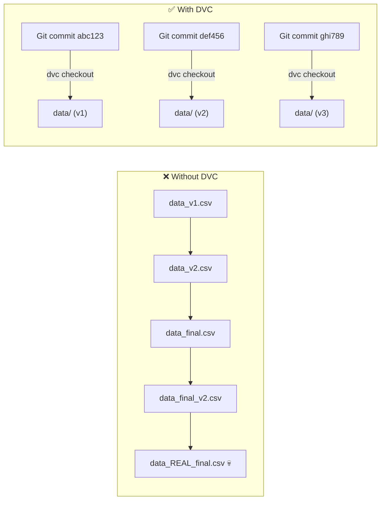
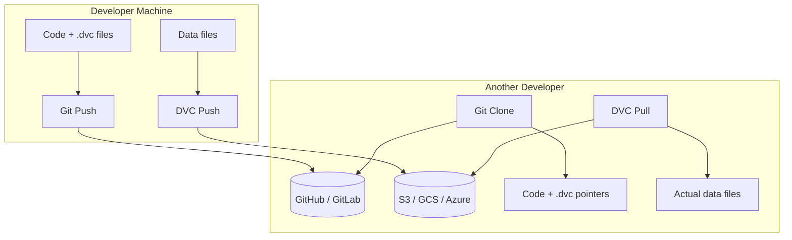
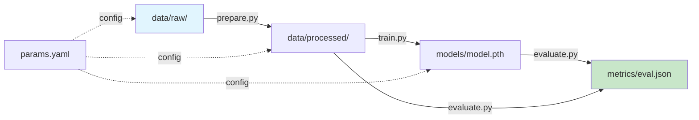

# 📦 Data Versioning & DVC — Production Guide

> **Mục tiêu**: DVC, Data Validation, Reproducible Pipelines, Remote Storage.
> "Code in Git, Data in DVC, Models in Registry" — the holy trinity of ML versioning.

---

## 1. Vấn đề — Tại sao cần Data Versioning?



```
Git tracks code → great!
Git tracks 10GB dataset → 💀 repo explodes, history balloons

DVC solution:
  Git tracks: code + .dvc files (tiny pointer files, ~100 bytes)
  DVC tracks: actual data files (in S3/GCS/Azure/local)
  → Each git commit points to EXACT data version
```

---

## 2. DVC Basics

### 2.1 Setup & Initialize

```bash
# Install with remote backend
pip install dvc dvc-s3    # AWS S3
pip install dvc dvc-gs    # Google Cloud Storage
pip install dvc dvc-azure # Azure Blob

# Initialize in existing git repo
cd my-ml-project
dvc init
git add .dvc .dvcignore
git commit -m "chore: initialize DVC"
```

### 2.2 Track Data

```bash
# Track a dataset
dvc add data/training_images/
# Creates: data/training_images.dvc (pointer file)
# Creates: data/.gitignore (auto-ignores actual data)

# Commit pointer to git
git add data/training_images.dvc data/.gitignore
git commit -m "data: add training images v1 (5000 samples)"

# ── .dvc file content (pointer) ──
# outs:
# - md5: abc123def456
#   size: 2048000000     # 2GB
#   nfiles: 5000
#   path: training_images
```

### 2.3 Remote Storage



```bash
# Setup remote storage
dvc remote add -d myremote s3://my-bucket/dvc-store
dvc remote add -d myremote gs://my-bucket/dvc-store
dvc remote add -d myremote gdrive://folder_id
dvc remote add -d myremote /mnt/shared/dvc-store  # Local/NFS

# Configure credentials (S3 example)
dvc remote modify myremote access_key_id "AKIAXXXX"
dvc remote modify myremote secret_access_key "xxxx"
# Or use AWS profiles: dvc remote modify myremote profile myprofile

# Push data to remote
dvc push

# Pull data (on another machine)
git clone https://github.com/user/ml-project
cd ml-project
dvc pull   # Downloads actual data from remote
```

---

## 3. DVC Pipelines — Reproducible ML

### 3.1 Pipeline DAG



### 3.2 dvc.yaml (Pipeline Definition)

```yaml
# dvc.yaml — define reproducible ML pipeline
stages:
  prepare:
    cmd: python src/prepare.py
    deps:
      - src/prepare.py
      - data/raw/
    params:           # From params.yaml
      - prepare.split_ratio
      - prepare.seed
      - prepare.img_size
    outs:
      - data/processed/train/
      - data/processed/val/
      - data/processed/test/

  train:
    cmd: python src/train.py
    deps:
      - src/train.py
      - data/processed/train/
      - data/processed/val/
    params:
      - train.model
      - train.lr
      - train.epochs
      - train.batch_size
    outs:
      - models/best_model.pth
    metrics:
      - metrics/train_metrics.json:
          cache: false    # Always show in `dvc metrics show`
    plots:
      - metrics/loss_curve.csv:
          x: epoch
          y: loss

  evaluate:
    cmd: python src/evaluate.py
    deps:
      - src/evaluate.py
      - models/best_model.pth
      - data/processed/test/
    metrics:
      - metrics/eval_metrics.json:
          cache: false
    plots:
      - metrics/confusion_matrix.png
      - metrics/roc_curve.csv:
          x: fpr
          y: tpr
```

### 3.3 params.yaml (Centralized Config)

```yaml
# params.yaml — single source of truth for ALL hyperparams
prepare:
  split_ratio: 0.8
  seed: 42
  img_size: 768
  augmentation: true

train:
  model: segformer-b5
  backbone: mit_b5
  lr: 0.0001
  weight_decay: 0.01
  epochs: 50
  batch_size: 8
  loss: focal_dice
  optimizer: adamw
  scheduler: cosine
  early_stopping:
    patience: 10
    min_delta: 0.001

evaluate:
  threshold: 0.5
  metrics: [miou, dice, accuracy, f1]
```

### 3.4 Running Pipelines

```bash
# Run full pipeline (only re-runs CHANGED stages)
dvc repro

# Force re-run specific stage
dvc repro train --force

# Visualize DAG
dvc dag
# prepare → train → evaluate

# Show metrics
dvc metrics show
# Path                       accuracy    f1    mIoU
# metrics/eval_metrics.json  0.943       0.891 0.832

# Compare with another branch/commit
dvc metrics diff HEAD~1
# Path                       accuracy    f1      mIoU
# metrics/eval_metrics.json  +0.012      +0.023  +0.015
```

---

## 4. DVC Experiments

```bash
# Run experiment with param overrides
dvc exp run --set-param train.lr=0.001
dvc exp run --set-param train.lr=0.0005
dvc exp run --set-param train.model=resnet50
dvc exp run --set-param train.batch_size=16 --set-param train.lr=0.0003

# Compare ALL experiments in a table
dvc exp show
# ┏━━━━━━━━━━━━┳━━━━━━━━┳━━━━━━┳━━━━━━━┳━━━━━━━━━━┓
# ┃ Experiment  ┃ mIoU   ┃ lr   ┃ model ┃ batch    ┃
# ┡━━━━━━━━━━━━╇━━━━━━━━╇━━━━━━╇━━━━━━━╇━━━━━━━━━━┩
# │ exp-abc123  │ 0.832  │ 1e-4 │ segf  │ 8        │
# │ exp-def456  │ 0.845  │ 5e-4 │ segf  │ 8        │ ← best
# │ exp-ghi789  │ 0.821  │ 1e-3 │ resn  │ 16       │
# └─────────────┴────────┴──────┴───────┴──────────┘

# Apply best experiment to workspace
dvc exp apply exp-def456
git add .
git commit -m "experiment: best config lr=5e-4 mIoU=0.845"

# Clean up other experiments
dvc exp remove --all
```

---

## 5. Data Validation (Great Expectations)

```python
import great_expectations as gx

# Create context
context = gx.get_context()

# Define expectations for training data
validator = context.sources.pandas_default.read_csv("data/train.csv")

# ── Data quality checks ──
validator.expect_column_values_to_not_be_null("label")
validator.expect_column_values_to_be_between("pixel_value", 0, 255)
validator.expect_column_distinct_values_to_be_in_set(
    "label", ["background", "tree", "building", "road"]
)
validator.expect_table_row_count_to_be_between(1000, 100000)

# Run validation
results = validator.validate()
if not results.success:
    raise ValueError(f"Data validation failed: {results}")
```

### Integration in DVC Pipeline

```yaml
# dvc.yaml — add validation stage
stages:
  validate:
    cmd: python src/validate_data.py
    deps:
      - src/validate_data.py
      - data/raw/
    outs:
      - reports/validation_report.json
    
  prepare:
    cmd: python src/prepare.py
    deps:
      - reports/validation_report.json  # Must pass validation first!
      - data/raw/
    outs:
      - data/processed/
```

---

## 6. DVC vs Alternatives

| Feature | DVC | Git LFS | LakeFS | Delta Lake |
|---------|-----|---------|--------|------------|
| **Storage** | Any (S3, GCS, local) | Git server | S3-compatible | Cloud storage |
| **Pipeline** | ✅ `dvc.yaml` | ❌ | ❌ | ❌ |
| **Experiments** | ✅ `dvc exp` | ❌ | ❌ | ❌ |
| **Branching** | Via Git | Via Git | ✅ Native | ✅ Native |
| **Data format** | Any file | Any file | Any file | Parquet |
| **Scale** | Good | Limited | Excellent | Excellent |
| **Best for** | ML projects | Small files | Data lakes | Analytics |

---

## 🎯 Interview Tips — Chi Tiết

### Q1: "DVC là gì?"
**A**: Git for data. Tracks large files with pointer files (`.dvc`). Actual data in remote storage (S3/GCS). `dvc push/pull` like `git push/pull`. Each git commit → exact data version.

### Q2: "DVC Pipeline?"
**A**: DAG of stages (prepare → train → evaluate) defined in `dvc.yaml`. `dvc repro` only re-runs CHANGED stages (checks dependencies). Ensures full reproducibility.

### Q3: "DVC vs Git LFS?"
**A**: Git LFS: stores in git server (limited size), no pipeline. DVC: any storage backend (S3/GCS), pipeline+experiments, much more flexible. DVC = ML-specific, LFS = generic large files.

### Q4: "Reproducibility?"
**A**: DVC locks: exact data version (hash) + code version (git) + params (params.yaml). Anyone can run `dvc repro` → exact same results. Complete audit trail.

### Q5: "DVC Experiments?"
**A**: `dvc exp run --set-param train.lr=0.001` — run experiment without committing. `dvc exp show` — compare table. `dvc exp apply` — promote best. Like lightweight git branches for hyperparameters.

### Q6: "Data validation in pipeline?"
**A**: Great Expectations/Pandera before training. Check: no nulls, correct ranges, expected classes, minimum row count. Put as pipeline stage — training can't start until data passes validation.
