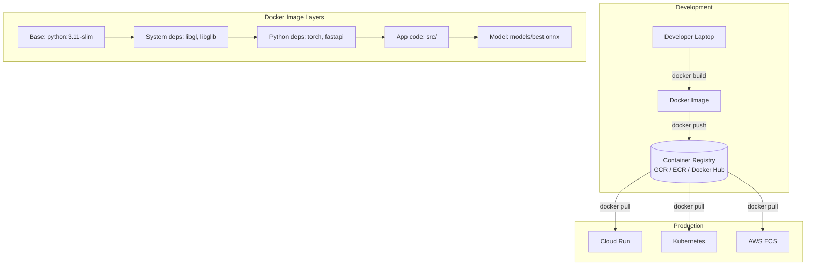
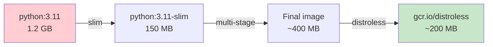
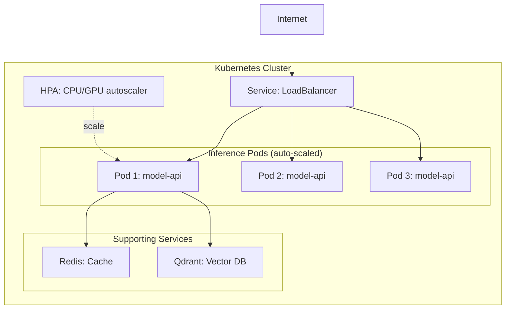

# 🐳 Containerization cho ML — Production Guide

> **Mục tiêu**: Docker, Compose, Kubernetes, GPU containers, multi-arch builds.
> "It works on my machine" → "It works everywhere" — Docker makes ML reproducible.

---

## 1. Container Architecture for ML



---

## 2. Production Dockerfile — Best Practices

### 2.1 Multi-stage Build (CPU)

```dockerfile
# ══════════════════════════════════════════
# Stage 1: Builder — install dependencies
# ══════════════════════════════════════════
FROM python:3.11-slim AS builder

WORKDIR /app

# Copy only requirements first (Docker cache optimization!)
COPY requirements.txt .
RUN pip install --no-cache-dir --prefix=/install -r requirements.txt

# ══════════════════════════════════════════
# Stage 2: Runtime — minimal production image
# ══════════════════════════════════════════
FROM python:3.11-slim AS runtime

# System deps for CV/ML (OpenCV needs these)
RUN apt-get update && apt-get install -y --no-install-recommends \
    libgl1-mesa-glx libglib2.0-0 curl && \
    rm -rf /var/lib/apt/lists/*

# Copy installed packages from builder
COPY --from=builder /install /usr/local

WORKDIR /app

# Copy app code and model
COPY src/ src/
COPY models/ models/
COPY config.yaml .

# Non-root user (security!)
RUN adduser --disabled-password --no-create-home appuser
USER appuser

# Health check
HEALTHCHECK --interval=30s --timeout=5s --start-period=60s \
    CMD curl -f http://localhost:8000/health || exit 1

EXPOSE 8000
CMD ["uvicorn", "src.app:app", "--host", "0.0.0.0", "--port", "8000", "--workers", "2"]
```

### 2.2 GPU Dockerfile

```dockerfile
# NVIDIA CUDA base image
FROM nvidia/cuda:12.1-cudnn8-runtime-ubuntu22.04

# Install Python
RUN apt-get update && apt-get install -y \
    python3.11 python3-pip python3.11-venv \
    libgl1-mesa-glx libglib2.0-0 curl && \
    rm -rf /var/lib/apt/lists/* && \
    ln -s /usr/bin/python3.11 /usr/bin/python

# Install PyTorch with CUDA
COPY requirements.txt .
RUN pip install --no-cache-dir torch torchvision --index-url https://download.pytorch.org/whl/cu121
RUN pip install --no-cache-dir -r requirements.txt

WORKDIR /app
COPY . .

# Non-root + healthcheck
RUN adduser --disabled-password appuser && chown -R appuser /app
USER appuser

HEALTHCHECK --interval=30s --timeout=10s \
    CMD python -c "import torch; assert torch.cuda.is_available()" || exit 1

CMD ["python", "serve.py"]

# Run: docker run --gpus all -p 8000:8000 ml-gpu:latest
```

### 2.3 .dockerignore (Critical!)

```
# .dockerignore — keep image small
.git/
.github/
__pycache__/
*.pyc
.env
.venv/
venv/
data/raw/          # Don't include training data in image!
notebooks/
tests/
*.md
.dvc/
mlruns/
wandb/
```

### 2.4 Image Size Optimization



```
Optimization tricks:
1. python:3.11-slim (not python:3.11)     → -1GB
2. Multi-stage build                       → -50% deps
3. --no-cache-dir in pip                   → -100MB
4. rm -rf /var/lib/apt/lists/*             → -50MB
5. .dockerignore (no .git, data, notebooks) → -several GB
6. ONNX model instead of PyTorch checkpoint → -60%
```

---

## 3. Docker Compose — ML Stack

```yaml
# docker-compose.yml — full ML development stack
services:
  # ── ML Model API ──
  model-api:
    build:
      context: .
      dockerfile: Dockerfile
    ports:
      - "8000:8000"
    environment:
      - MODEL_PATH=/models/best_model.onnx
      - LOG_LEVEL=info
      - REDIS_URL=redis://redis:6379
    volumes:
      - ./models:/models:ro
    depends_on:
      redis:
        condition: service_healthy
    deploy:
      resources:
        limits:
          memory: 4G
        reservations:
          devices:
            - capabilities: [gpu]
              count: 1
    healthcheck:
      test: ["CMD", "curl", "-f", "http://localhost:8000/health"]
      interval: 30s
      timeout: 5s
      retries: 3

  # ── MLflow Tracking ──
  mlflow:
    image: ghcr.io/mlflow/mlflow:latest
    ports:
      - "5000:5000"
    volumes:
      - mlflow_data:/mlflow
    command: >
      mlflow server
      --backend-store-uri sqlite:///mlflow/mlflow.db
      --default-artifact-root /mlflow/artifacts
      --host 0.0.0.0

  # ── Vector Database ──
  qdrant:
    image: qdrant/qdrant:latest
    ports:
      - "6333:6333"
    volumes:
      - qdrant_data:/qdrant/storage

  # ── Redis (caching) ──
  redis:
    image: redis:7-alpine
    ports:
      - "6379:6379"
    healthcheck:
      test: ["CMD", "redis-cli", "ping"]
      interval: 10s

  # ── Monitoring ──
  prometheus:
    image: prom/prometheus:latest
    ports:
      - "9090:9090"
    volumes:
      - ./monitoring/prometheus.yml:/etc/prometheus/prometheus.yml

  grafana:
    image: grafana/grafana:latest
    ports:
      - "3000:3000"
    depends_on:
      - prometheus

volumes:
  mlflow_data:
  qdrant_data:
```

```bash
# Run full stack
docker compose up -d

# Scale model API
docker compose up -d --scale model-api=3

# View logs
docker compose logs model-api -f

# Clean up
docker compose down -v
```

---

## 4. Kubernetes cho ML

### 4.1 K8s ML Architecture



### 4.2 Deployment + Service + HPA

```yaml
# k8s/deployment.yaml
apiVersion: apps/v1
kind: Deployment
metadata:
  name: ml-model-api
  labels:
    app: ml-model
spec:
  replicas: 3
  selector:
    matchLabels:
      app: ml-model
  strategy:
    type: RollingUpdate
    rollingUpdate:
      maxSurge: 1
      maxUnavailable: 0    # Zero-downtime deploy
  template:
    metadata:
      labels:
        app: ml-model
        version: v1.2
    spec:
      containers:
      - name: model-api
        image: registry.io/ml-model:v1.2
        ports:
        - containerPort: 8000
        env:
        - name: MODEL_PATH
          value: /models/best.onnx
        resources:
          requests:
            memory: "2Gi"
            cpu: "1"
            nvidia.com/gpu: "1"
          limits:
            memory: "4Gi"
            cpu: "2"
            nvidia.com/gpu: "1"
        readinessProbe:
          httpGet:
            path: /health
            port: 8000
          initialDelaySeconds: 30
          periodSeconds: 10
        livenessProbe:
          httpGet:
            path: /health
            port: 8000
          initialDelaySeconds: 60
          periodSeconds: 30
---
apiVersion: v1
kind: Service
metadata:
  name: ml-model-service
spec:
  type: LoadBalancer
  selector:
    app: ml-model
  ports:
  - port: 80
    targetPort: 8000
---
apiVersion: autoscaling/v2
kind: HorizontalPodAutoscaler
metadata:
  name: ml-model-hpa
spec:
  scaleTargetRef:
    apiVersion: apps/v1
    kind: Deployment
    name: ml-model-api
  minReplicas: 2
  maxReplicas: 10
  metrics:
  - type: Resource
    resource:
      name: cpu
      target:
        type: Utilization
        averageUtilization: 70
  behavior:
    scaleUp:
      stabilizationWindowSeconds: 60
    scaleDown:
      stabilizationWindowSeconds: 300   # Wait 5min before scale down
```

---

## 5. Container Security

```dockerfile
# ── Security checklist ──

# ✅ Non-root user
RUN adduser --disabled-password --no-create-home appuser
USER appuser

# ✅ Read-only filesystem
# docker run --read-only --tmpfs /tmp my-image

# ✅ No secrets in image
# Use env vars or secrets manager, NOT:
# COPY .env .  ← ❌ NEVER

# ✅ Scan for vulnerabilities
# docker scout cves my-image:latest
# trivy image my-image:latest

# ✅ Pin base image version
FROM python:3.11.9-slim  # NOT python:3.11-slim (floating tag)
```

---

## 🎯 Interview Tips — Chi Tiết

### Q1: "Multi-stage build?"
**A**: Stage 1: install dependencies (compiler, build tools). Stage 2: copy only installed packages + app code. Result: image 3-5x smaller (no build tools in production). Critical for ML (pytorch build deps are huge).

### Q2: "Docker vs VM cho ML?"
**A**: Docker: lightweight (~MB), fast startup (seconds), shares host GPU via nvidia-container-toolkit. VM: full OS (~GB), slow (minutes), complete isolation. Docker is standard for ML. VM only when regulatory requires full isolation.

### Q3: "GPU in Docker?"
**A**: Install NVIDIA Container Toolkit. Base image: `nvidia/cuda:12.1-runtime`. Run: `docker run --gpus all`. K8s: `nvidia.com/gpu: "1"` in resource requests. GPU scheduling via device plugin.

### Q4: "K8s cho ML?"
**A**: Benefits: auto-scaling (HPA), rolling updates (zero-downtime), GPU scheduling, health checks, load balancing. Overhead: complex setup. Use when: multiple models, high traffic, team >3. Skip when: 1 model, low traffic → Cloud Run.

### Q5: "Image size optimization?"
**A**: (1) slim base. (2) Multi-stage. (3) --no-cache-dir. (4) .dockerignore. (5) ONNX model instead of full checkpoint. Target: <500MB for CPU, <2GB for GPU.

### Q6: "Container security?"
**A**: (1) Non-root user. (2) Pin image versions. (3) No secrets in image. (4) Scan with Trivy/Docker Scout. (5) Read-only filesystem. (6) Minimal base image.
