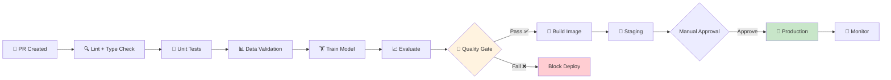
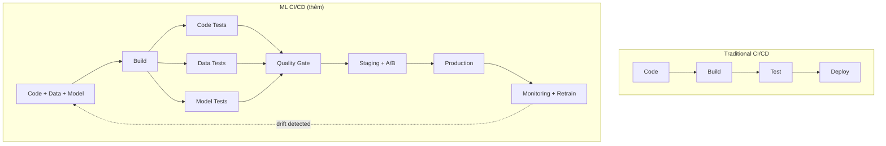
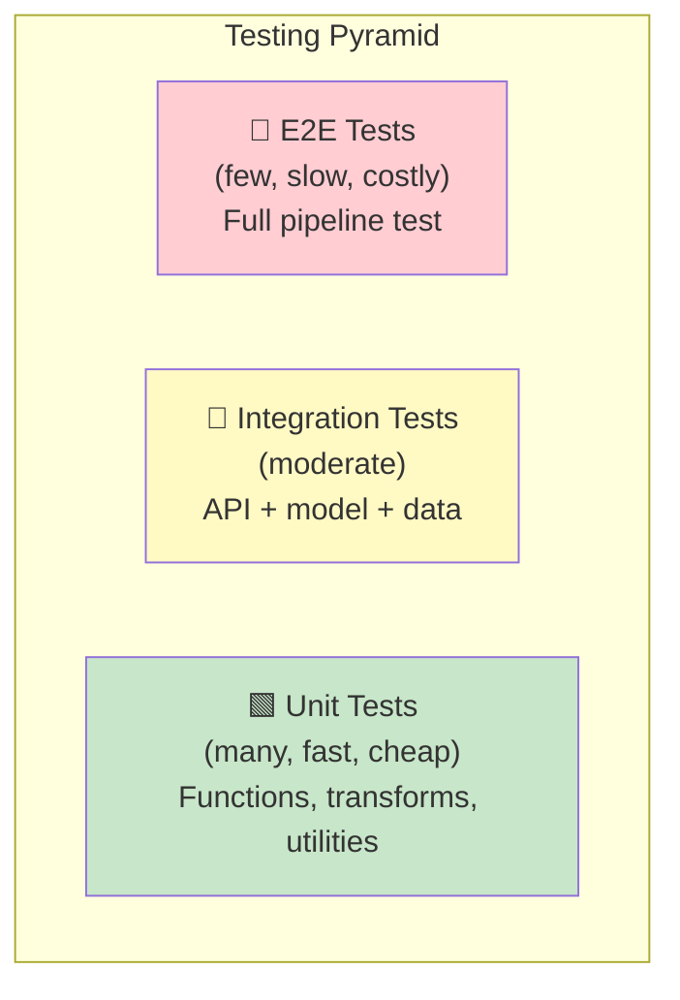
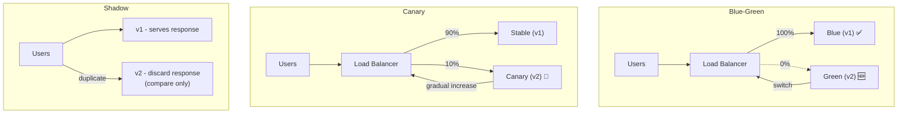

# 🔄 CI/CD cho ML — Production Guide

> **Mục tiêu**: GitHub Actions, automated testing, quality gates, deployment strategies.
> ML CI/CD = traditional CI/CD + data testing + model validation + drift monitoring.

---

## 1. ML CI/CD Pipeline



### ML CI/CD vs Traditional CI/CD



---

## 2. GitHub Actions — Full ML Pipeline

```yaml
# .github/workflows/ml-pipeline.yml
name: ML Pipeline

on:
  push:
    branches: [main, develop]
  pull_request:
    branches: [main]

env:
  PYTHON_VERSION: '3.11'
  PROJECT_ID: 'my-gcp-project'

jobs:
  # ══════════════════════════════════════
  # Stage 1: Code Quality
  # ══════════════════════════════════════
  lint-and-test:
    runs-on: ubuntu-latest
    steps:
      - uses: actions/checkout@v4
      - uses: actions/setup-python@v5
        with:
          python-version: ${{ env.PYTHON_VERSION }}
          cache: 'pip'
      
      - name: Install dependencies
        run: |
          pip install -r requirements.txt
          pip install pytest ruff mypy
      
      - name: Lint (Ruff)
        run: ruff check src/ --output-format=github
      
      - name: Type check (MyPy)
        run: mypy src/ --ignore-missing-imports
      
      - name: Unit tests
        run: pytest tests/unit/ -v --tb=short --junitxml=test-results.xml
      
      - name: Upload test results
        uses: actions/upload-artifact@v4
        if: always()
        with:
          name: test-results
          path: test-results.xml

  # ══════════════════════════════════════
  # Stage 2: Data Validation
  # ══════════════════════════════════════
  data-validation:
    needs: lint-and-test
    runs-on: ubuntu-latest
    steps:
      - uses: actions/checkout@v4
      - uses: actions/setup-python@v5
        with:
          python-version: ${{ env.PYTHON_VERSION }}
      
      - name: Install DVC
        run: pip install dvc dvc-s3
      
      - name: Pull data
        run: dvc pull
        env:
          AWS_ACCESS_KEY_ID: ${{ secrets.AWS_KEY }}
          AWS_SECRET_ACCESS_KEY: ${{ secrets.AWS_SECRET }}
      
      - name: Validate data schema
        run: python scripts/validate_data.py
      
      - name: Check data stats
        run: |
          python -c "
          import json
          stats = json.load(open('data/stats.json'))
          assert stats['n_samples'] > 1000, 'Too few samples'
          assert stats['null_ratio'] < 0.05, 'Too many nulls'
          print('✅ Data validation passed')
          "

  # ══════════════════════════════════════
  # Stage 3: Train & Evaluate
  # ══════════════════════════════════════
  train-and-evaluate:
    needs: data-validation
    runs-on: ubuntu-latest
    if: github.event_name == 'push'
    steps:
      - uses: actions/checkout@v4
        with:
          fetch-depth: 0  # Full history for dvc diff
      
      - name: Setup
        run: |
          pip install -r requirements.txt
          pip install dvc dvc-s3
      
      - name: Pull data
        run: dvc pull
        env:
          AWS_ACCESS_KEY_ID: ${{ secrets.AWS_KEY }}
          AWS_SECRET_ACCESS_KEY: ${{ secrets.AWS_SECRET }}
      
      - name: Run pipeline
        run: dvc repro
      
      - name: Compare metrics (PR comment)
        run: |
          echo "## 📊 Model Metrics" >> $GITHUB_STEP_SUMMARY
          dvc metrics diff --md >> $GITHUB_STEP_SUMMARY
      
      - name: Quality gate
        run: |
          python scripts/quality_gate.py \
            --metrics-file metrics/eval.json \
            --min-accuracy 0.90 \
            --min-f1 0.85 \
            --max-latency-ms 100 \
            --max-model-size-mb 500

  # ══════════════════════════════════════
  # Stage 4: Build & Deploy
  # ══════════════════════════════════════
  deploy-staging:
    needs: train-and-evaluate
    runs-on: ubuntu-latest
    if: github.ref == 'refs/heads/develop'
    environment: staging
    steps:
      - uses: actions/checkout@v4
      
      - name: Build Docker image
        run: |
          docker build -t gcr.io/$PROJECT_ID/ml-model:$GITHUB_SHA .
          docker push gcr.io/$PROJECT_ID/ml-model:$GITHUB_SHA
      
      - name: Deploy to staging
        run: |
          gcloud run deploy ml-model-staging \
            --image gcr.io/$PROJECT_ID/ml-model:$GITHUB_SHA \
            --region us-central1 \
            --memory 4Gi \
            --min-instances 1

  deploy-production:
    needs: train-and-evaluate
    runs-on: ubuntu-latest
    if: github.ref == 'refs/heads/main'
    environment: production  # Requires manual approval!
    steps:
      - uses: actions/checkout@v4
      
      - name: Deploy canary (10% traffic)
        run: |
          gcloud run deploy ml-model \
            --image gcr.io/$PROJECT_ID/ml-model:$GITHUB_SHA \
            --region us-central1 \
            --tag canary
          
          gcloud run services update-traffic ml-model \
            --to-tags canary=10 \
            --region us-central1
      
      - name: Wait & validate canary
        run: |
          sleep 300  # 5 minutes
          python scripts/validate_canary.py --error-rate-threshold 0.01
      
      - name: Promote to 100%
        run: |
          gcloud run services update-traffic ml-model \
            --to-latest \
            --region us-central1
```

---

## 3. Quality Gate — Model Validation

```python
# scripts/quality_gate.py
"""Block deployment if model doesn't meet quality standards."""
import json
import argparse
import sys

def check_quality(metrics_file: str, thresholds: dict) -> dict:
    with open(metrics_file) as f:
        metrics = json.load(f)
    
    checks = {}
    
    # ── Performance checks ──
    if "min_accuracy" in thresholds:
        checks["accuracy"] = {
            "value": metrics["accuracy"],
            "threshold": thresholds["min_accuracy"],
            "passed": metrics["accuracy"] >= thresholds["min_accuracy"],
        }
    
    if "min_f1" in thresholds:
        checks["f1_score"] = {
            "value": metrics["f1_score"],
            "threshold": thresholds["min_f1"],
            "passed": metrics["f1_score"] >= thresholds["min_f1"],
        }
    
    # ── Regression check (vs previous) ──
    if "prev_accuracy" in metrics:
        regression = metrics["accuracy"] - metrics["prev_accuracy"]
        checks["no_regression"] = {
            "value": regression,
            "threshold": -0.01,  # Max 1% regression allowed
            "passed": regression >= -0.01,
        }
    
    # ── Latency check ──
    if "max_latency_ms" in thresholds and "latency_p95_ms" in metrics:
        checks["latency"] = {
            "value": metrics["latency_p95_ms"],
            "threshold": thresholds["max_latency_ms"],
            "passed": metrics["latency_p95_ms"] <= thresholds["max_latency_ms"],
        }
    
    # ── Model size check ──
    if "max_model_size_mb" in thresholds and "model_size_mb" in metrics:
        checks["model_size"] = {
            "value": metrics["model_size_mb"],
            "threshold": thresholds["max_model_size_mb"],
            "passed": metrics["model_size_mb"] <= thresholds["max_model_size_mb"],
        }
    
    return checks

def main():
    parser = argparse.ArgumentParser()
    parser.add_argument("--metrics-file", required=True)
    parser.add_argument("--min-accuracy", type=float, default=0.0)
    parser.add_argument("--min-f1", type=float, default=0.0)
    parser.add_argument("--max-latency-ms", type=float, default=1000)
    parser.add_argument("--max-model-size-mb", type=float, default=1000)
    args = parser.parse_args()
    
    checks = check_quality(args.metrics_file, vars(args))
    
    all_passed = True
    for name, check in checks.items():
        icon = "✅" if check["passed"] else "❌"
        print(f"{icon} {name}: {check['value']:.4f} (threshold: {check['threshold']})")
        if not check["passed"]:
            all_passed = False
    
    if not all_passed:
        print("\n🚫 Quality gate FAILED — deployment blocked!")
        sys.exit(1)
    else:
        print("\n✅ Quality gate PASSED — ready to deploy!")

if __name__ == "__main__":
    main()
```

---

## 4. ML Testing Pyramid



```python
# tests/unit/test_preprocessing.py
def test_normalize_image():
    img = np.ones((224, 224, 3), dtype=np.uint8) * 128
    norm = normalize(img)
    assert norm.dtype == np.float32
    assert -3.0 < norm.mean() < 3.0

def test_augmentation_preserves_shape():
    img = np.random.randint(0, 255, (768, 768, 3), dtype=np.uint8)
    mask = np.zeros((768, 768), dtype=np.uint8)
    aug_img, aug_mask = augment(img, mask)
    assert aug_img.shape == img.shape
    assert aug_mask.shape == mask.shape

# tests/unit/test_model.py
def test_model_output_shape(model):
    batch = torch.randn(2, 3, 224, 224)
    output = model(batch)
    assert output.shape == (2, 10)

def test_model_deterministic(model):
    model.eval()
    x = torch.randn(1, 3, 224, 224)
    assert torch.allclose(model(x), model(x))

def test_inference_latency(model):
    model.eval()
    x = torch.randn(1, 3, 224, 224)
    start = time.time()
    with torch.no_grad():
        model(x)
    assert (time.time() - start) * 1000 < 100  # <100ms

# tests/integration/test_api.py
def test_predict_endpoint(client):
    response = client.post("/predict", json={"text": "hello"})
    assert response.status_code == 200
    assert "prediction" in response.json()

# tests/e2e/test_pipeline.py
def test_full_pipeline():
    """Run entire pipeline on sample data."""
    subprocess.run(["dvc", "repro"], check=True)
    metrics = json.load(open("metrics/eval.json"))
    assert metrics["accuracy"] > 0.5  # Sanity check
```

---

## 5. Deployment Strategies



| Strategy | Risk | Rollback | Cost | Best For |
|----------|:----:|:--------:|:----:|----------|
| **Blue-Green** | Low | Instant | 2x | Stateless APIs |
| **Canary** | Very Low | Fast | 1.1x | Production ML |
| **Shadow** | Zero | N/A | 2x | Model validation |
| **A/B Testing** | Low | Fast | 1.1x | Business metrics |

---

## 🎯 Interview Tips — Chi Tiết

### Q1: "CI/CD cho ML khác CI/CD thường?"
**A**: Traditional: code → build → test → deploy. ML thêm: (1) Data versioning + validation. (2) Model training + evaluation. (3) Quality gates (accuracy, latency). (4) Canary deployment. (5) Continuous monitoring + retraining trigger.

### Q2: "Quality gate?"
**A**: Automated checkpoint before deploy: accuracy ≥ threshold, latency ≤ budget, no regression vs previous, model size ≤ limit. If ANY fails → block deployment. Prevents deploying worse models.

### Q3: "ML testing strategies?"
**A**: Unit (shape, range, determinism), Integration (API + model), E2E (full pipeline), Data (schema, stats, drift). ML-specific: model output shape, inference latency, no NaN, deterministic in eval mode.

### Q4: "Canary deployment?"
**A**: Route 10% traffic to new model, 90% to stable. Monitor error rate, latency, business metrics. If OK → gradually increase to 100%. If bad → rollback instantly. Safest for production ML.

### Q5: "Shadow deployment?"
**A**: Run new model in parallel, discard its responses. Compare predictions offline. Zero risk to users. Best for validating new models before canary. Cost: 2x compute.

### Q6: "GitOps cho ML?"
**A**: Git = single source of truth for code, data (DVC), model config. PR triggers: train → evaluate → quality gate. Merge = deploy. Full audit trail. Rollback = git revert.
