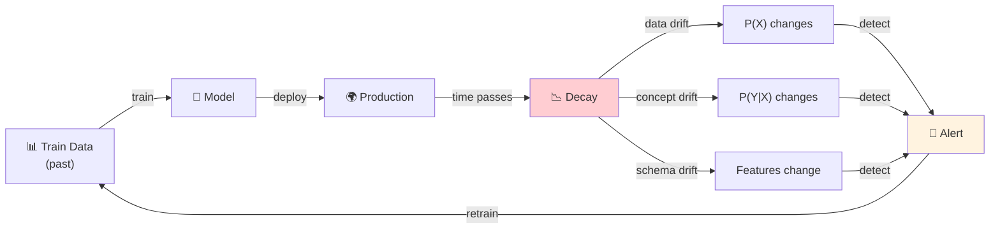
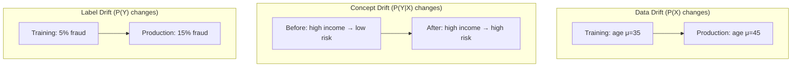
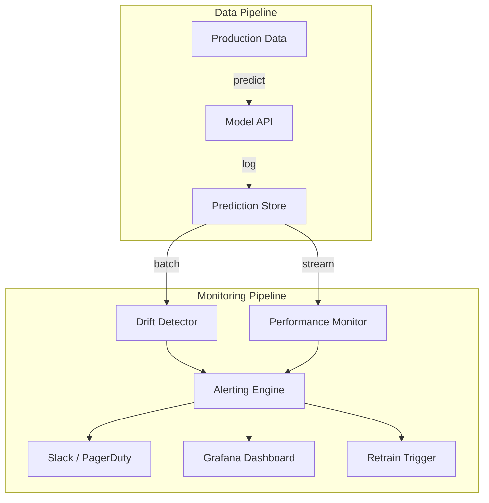
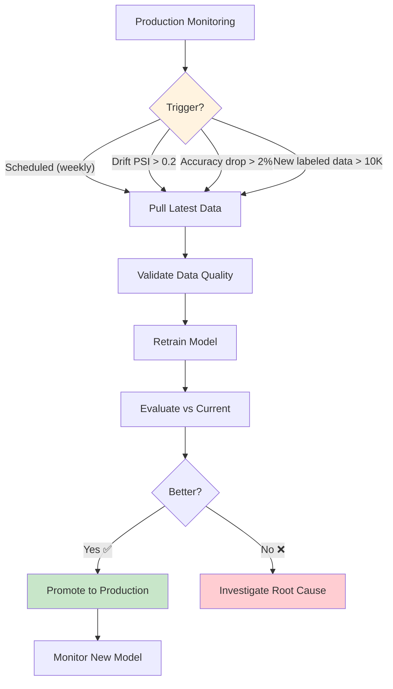

# 📈 Model Monitoring — Production Guide

> **Mục tiêu**: Data drift, model decay, alerting, retraining — giữ model hoạt động tốt trong production.
> "A model is only as good as its last prediction" — model decay is inevitable.

---

## 1. Tại sao Model Decay?



```
Real-world examples:
  🛒 E-commerce: COVID changed buying patterns → concept drift
  🏦 Fraud: Attackers evolve strategies → concept drift  
  📱 User app: New demographic joins → data drift
  🏥 Medical: New disease variant → data + concept drift
  📈 Finance: Market regime change → everything drifts
```

---

## 2. Types of Drift



| Type | What changes | Example | Detection | Urgency |
|------|-------------|---------|-----------|:-------:|
| **Data Drift** | P(X) | Age distribution shifts | KS test, PSI | 🟡 |
| **Concept Drift** | P(Y\|X) | Customer behavior evolves | Accuracy drop, ADWIN | 🔴 |
| **Schema Drift** | Feature format | New column, type change | Schema validation | 🔴 |
| **Label Drift** | P(Y) | Fraud rate increases | Label distribution | 🟡 |
| **Prediction Drift** | P(Ŷ) | Model predicts differently | Prediction histogram | 🟡 |

---

## 3. Drift Detection — Statistical Tests

```python
from scipy import stats
import numpy as np

class DriftDetector:
    """Production-grade drift detection with multiple tests."""
    
    def __init__(self, reference_data: np.ndarray):
        self.reference = reference_data
    
    def ks_test(self, production_data: np.ndarray, alpha: float = 0.05) -> dict:
        """Kolmogorov-Smirnov test — best for continuous features."""
        statistic, p_value = stats.ks_2samp(self.reference, production_data)
        return {
            "test": "KS",
            "statistic": round(statistic, 4),
            "p_value": round(p_value, 6),
            "drift_detected": p_value < alpha,
        }
    
    def psi(self, production_data: np.ndarray, bins: int = 10) -> dict:
        """Population Stability Index — industry standard."""
        breakpoints = np.percentile(self.reference, np.linspace(0, 100, bins + 1))
        breakpoints[0], breakpoints[-1] = -np.inf, np.inf
        
        ref_counts = np.histogram(self.reference, bins=breakpoints)[0]
        prod_counts = np.histogram(production_data, bins=breakpoints)[0]
        
        ref_pct = (ref_counts + 1) / (len(self.reference) + bins)
        prod_pct = (prod_counts + 1) / (len(production_data) + bins)
        
        psi_value = float(np.sum((prod_pct - ref_pct) * np.log(prod_pct / ref_pct)))
        
        # PSI interpretation:
        # < 0.1: No drift
        # 0.1 - 0.2: Moderate drift (investigate)
        # > 0.2: Significant drift (action required!)
        return {
            "test": "PSI",
            "psi": round(psi_value, 4),
            "drift_detected": psi_value > 0.2,
            "severity": (
                "none" if psi_value < 0.1
                else "moderate" if psi_value < 0.2
                else "significant"
            ),
        }
    
    def chi2_test(self, production_data: np.ndarray, alpha: float = 0.05) -> dict:
        """Chi-squared test — best for categorical features."""
        ref_counts = np.bincount(self.reference.astype(int), minlength=10)
        prod_counts = np.bincount(production_data.astype(int), minlength=10)
        
        # Normalize to same total
        prod_counts = prod_counts * (len(self.reference) / len(production_data))
        
        statistic, p_value = stats.chisquare(prod_counts, ref_counts)
        return {
            "test": "Chi2",
            "statistic": round(statistic, 4),
            "p_value": round(p_value, 6),
            "drift_detected": p_value < alpha,
        }
```

### Evidently (Production Framework)

```python
from evidently import ColumnMapping
from evidently.report import Report
from evidently.metric_preset import DataDriftPreset, TargetDriftPreset
from evidently.metrics import (
    DataDriftTable, DatasetDriftMetric,
    ColumnDriftMetric,
)

# Setup
column_mapping = ColumnMapping(
    target="label",
    prediction="prediction",
    numerical_features=["age", "income", "transaction_count"],
    categorical_features=["region", "device_type"],
)

# Create drift report
report = Report(metrics=[
    DatasetDriftMetric(),           # Overall drift
    DataDriftTable(),               # Per-feature drift
    ColumnDriftMetric("age"),       # Specific feature
    ColumnDriftMetric("income"),
])

report.run(
    reference_data=train_df,
    current_data=production_df,
    column_mapping=column_mapping,
)

# Export
report.save_html("drift_report.html")   # Interactive HTML
result = report.as_dict()                 # Programmatic access

drift_detected = result["metrics"][0]["result"]["dataset_drift"]
if drift_detected:
    send_alert("🚨 Data drift detected! Check drift_report.html")
```

---

## 4. Monitoring Dashboard



```python
from dataclasses import dataclass, field
from datetime import datetime, timedelta
import numpy as np

@dataclass
class ProductionMonitor:
    """Full production monitoring system."""
    
    model_name: str
    predictions: list[dict] = field(default_factory=list)
    reference_data: np.ndarray = None
    
    def log_prediction(self, input_features: dict, prediction: dict, 
                       latency_ms: float, ground_truth=None):
        self.predictions.append({
            "timestamp": datetime.now().isoformat(),
            "input": input_features,
            "prediction": prediction,
            "latency_ms": latency_ms,
            "ground_truth": ground_truth,
        })
    
    def get_metrics(self, window_hours: int = 24) -> dict:
        cutoff = datetime.now() - timedelta(hours=window_hours)
        recent = [p for p in self.predictions 
                  if datetime.fromisoformat(p["timestamp"]) > cutoff]
        
        if not recent:
            return {"status": "no_data"}
        
        latencies = [p["latency_ms"] for p in recent]
        errors = [p for p in recent if p.get("prediction", {}).get("error")]
        
        # Accuracy (if ground truth available)
        labeled = [p for p in recent if p.get("ground_truth") is not None]
        accuracy = None
        if labeled:
            correct = sum(1 for p in labeled 
                         if p["prediction"]["label"] == p["ground_truth"])
            accuracy = correct / len(labeled)
        
        return {
            "model": self.model_name,
            "window_hours": window_hours,
            "total_predictions": len(recent),
            "throughput_per_hour": len(recent) / window_hours,
            "latency_p50": round(np.percentile(latencies, 50), 1),
            "latency_p95": round(np.percentile(latencies, 95), 1),
            "latency_p99": round(np.percentile(latencies, 99), 1),
            "error_rate": round(len(errors) / len(recent), 4),
            "accuracy": round(accuracy, 4) if accuracy else None,
        }
    
    def check_alerts(self) -> list[dict]:
        metrics = self.get_metrics()
        alerts = []
        
        # Latency alert
        if metrics.get("latency_p95", 0) > 200:
            alerts.append({
                "severity": "warning",
                "message": f"High P95 latency: {metrics['latency_p95']}ms (>200ms)",
                "action": "Check model size, scale up, or optimize",
            })
        
        # Error rate alert
        if metrics.get("error_rate", 0) > 0.05:
            alerts.append({
                "severity": "critical",
                "message": f"High error rate: {metrics['error_rate']:.1%} (>5%)",
                "action": "Check input validation, model health",
            })
        
        # Accuracy degradation
        if metrics.get("accuracy") and metrics["accuracy"] < 0.85:
            alerts.append({
                "severity": "critical",
                "message": f"Accuracy dropped: {metrics['accuracy']:.1%} (<85%)",
                "action": "Investigate data drift, trigger retraining",
            })
        
        # Low traffic (potential upstream issue)
        if metrics.get("throughput_per_hour", 0) < 10:
            alerts.append({
                "severity": "info",
                "message": f"Low traffic: {metrics['throughput_per_hour']:.0f}/hr",
                "action": "Check upstream data pipeline",
            })
        
        return alerts
```

---

## 5. Retraining Strategy



| Trigger | Condition | Frequency | Risk |
|---------|-----------|:---------:|:----:|
| **Scheduled** | Every week/month | Regular | Low |
| **Performance** | Accuracy drops >2% | Event-based | Med |
| **Data drift** | PSI > 0.2 | Event-based | Med |
| **Data volume** | 10K+ new labeled | Accumulation | Low |
| **Manual** | Business requirement | Ad-hoc | Low |

---

## 🎯 Interview Tips — Chi Tiết

### Q1: "Model decay?"
**A**: Model performance degrades as production data diverges from training data. Causes: data drift (P(X) changes), concept drift (P(Y|X) changes), schema drift. Must monitor continuously.

### Q2: "Data drift vs concept drift?"
**A**: Data drift: input distribution changes (age shifts from μ=35 to μ=45) — model might still be OK. Concept drift: relationship changes (same inputs, different correct outputs) — model is WRONG. Concept drift is more dangerous.

### Q3: "PSI?"
**A**: Population Stability Index. Measures how much distribution shifted. <0.1: no drift. 0.1-0.2: moderate (investigate). >0.2: significant (retrain!). Industry standard for production monitoring.

### Q4: "Monitoring metrics?"
**A**: (1) Latency P50/P95/P99. (2) Error rate. (3) Prediction distribution. (4) Feature drift (PSI per feature). (5) Accuracy (if labels available). (6) Business metrics (conversion, revenue).

### Q5: "Retraining strategy?"
**A**: Scheduled (weekly, simple baseline) + triggered (by drift/accuracy drop). Always: validate data → retrain → evaluate vs current → promote only if better. Never auto-deploy without comparison.

### Q6: "Evidently vs custom?"
**A**: Evidently: pre-built drift reports, easy HTML dashboards, supports many tests. Custom: more control, fits specific needs. Start with Evidently, customize as needed. Integrate into CI/CD for automated drift checks.
