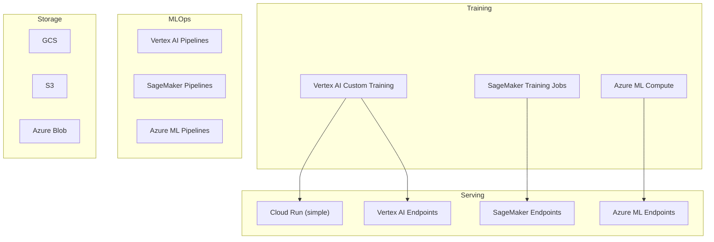
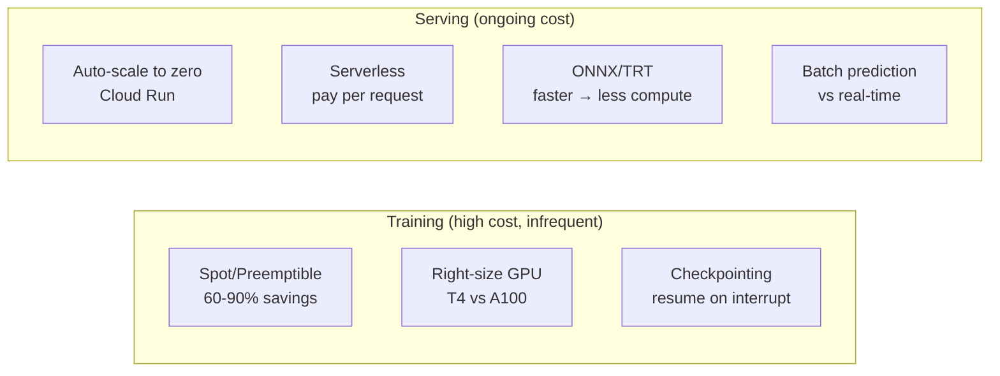

# ☁️ Cloud Platforms cho ML — Production Guide

> **Mục tiêu**: GCP Vertex AI, AWS SageMaker, Azure ML, Cloud Run — train, deploy, scale.
> Rule of thumb: Use managed services for training, containers for serving.

---

## 1. Cloud ML Landscape



### Platform Comparison

| Feature | GCP | AWS | Azure |
|---------|-----|-----|-------|
| **Training** | Vertex AI Custom | SageMaker Training | Compute Clusters |
| **Serving** | Cloud Run, Endpoints | Endpoints, Serverless | Managed Endpoints |
| **AutoML** | AutoML Tables/Vision | Autopilot | AutoML |
| **Notebooks** | Workbench, Colab | Studio Notebooks | Notebooks |
| **Pipelines** | Vertex AI Pipelines | SageMaker Pipelines | Designer + Pipelines |
| **GPU** | T4, L4, A100, H100, TPU | T4, V100, A100, Inferentia | T4, V100, A100 |
| **Strength** | AI/ML-first, TPU | Biggest ecosystem | Enterprise integration |
| **Best for** | AI startups, research | Enterprise AWS | Microsoft orgs |

---

## 2. GCP Vertex AI

### 2.1 Custom Training

```python
from google.cloud import aiplatform

aiplatform.init(project="my-project", location="us-central1")

# ── Custom Training Job ──
job = aiplatform.CustomTrainingJob(
    display_name="segformer-b5-training",
    script_path="src/train.py",
    container_uri="us-docker.pkg.dev/vertex-ai/training/pytorch-gpu.2-1:latest",
    requirements=["segmentation-models-pytorch", "albumentations", "wandb"],
    model_serving_container_image_uri=(
        "us-docker.pkg.dev/vertex-ai/prediction/pytorch-gpu.2-1:latest"
    ),
)

model = job.run(
    replica_count=1,
    machine_type="n1-standard-8",
    accelerator_type="NVIDIA_TESLA_A100",
    accelerator_count=1,
    args=[
        "--epochs", "50",
        "--lr", "0.0001",
        "--batch-size", "8",
        "--img-size", "768",
    ],
    base_output_dir="gs://my-bucket/training-output",
)
```

### 2.2 Deploy to Endpoint

```python
# Deploy model to endpoint (managed)
endpoint = model.deploy(
    machine_type="n1-standard-4",
    accelerator_type="NVIDIA_TESLA_T4",
    accelerator_count=1,
    min_replica_count=1,
    max_replica_count=5,              # Auto-scale
    traffic_split={"0": 100},         # 100% to this version
    service_account="ml-serving@project.iam.gserviceaccount.com",
)

# ── A/B Testing ──
endpoint.deploy(
    model=new_model,
    traffic_split={"0": 90, "1": 10},  # 90% old, 10% new
)

# Predict
prediction = endpoint.predict(instances=[{"image": base64_image}])
```

### 2.3 Cloud Run (Simpler & Cheaper)

```bash
# Build with Cloud Build
gcloud builds submit --tag gcr.io/PROJECT/ml-model:v1

# Deploy to Cloud Run
gcloud run deploy ml-model \
    --image gcr.io/PROJECT/ml-model:v1 \
    --memory 4Gi \
    --cpu 2 \
    --gpu 1 \
    --gpu-type nvidia-l4 \
    --min-instances 1 \
    --max-instances 10 \
    --timeout 300 \
    --allow-unauthenticated \
    --set-env-vars MODEL_PATH=/models/best.onnx

# Cloud Run advantages:
# - Simpler than Vertex AI Endpoints
# - Auto-scales to zero (cost savings)
# - GPU support (L4)
# - Pay per request
```

### 2.4 Vertex AI Pipelines

```python
from kfp import dsl
from kfp.dsl import pipeline, component
from google.cloud import aiplatform

@component(base_image="python:3.11-slim", packages_to_install=["pandas", "sklearn"])
def prepare_data(input_path: str, output_path: str):
    import pandas as pd
    from sklearn.model_selection import train_test_split
    df = pd.read_csv(input_path)
    train, test = train_test_split(df, test_size=0.2)
    train.to_csv(f"{output_path}/train.csv", index=False)
    test.to_csv(f"{output_path}/test.csv", index=False)

@component(base_image="pytorch/pytorch:2.1.0-cuda12.1-cudnn8-runtime")
def train_model(data_path: str, model_path: str, lr: float = 0.001):
    # Training code...
    pass

@component
def evaluate_model(model_path: str, test_path: str) -> float:
    # Evaluation code...
    return accuracy

@pipeline(name="ml-training-pipeline")
def ml_pipeline(data_path: str = "gs://bucket/data.csv"):
    prepare_task = prepare_data(input_path=data_path, output_path="gs://bucket/processed")
    train_task = train_model(data_path=prepare_task.output, model_path="gs://bucket/model")
    eval_task = evaluate_model(model_path=train_task.output, test_path=prepare_task.output)

# Submit
aiplatform.PipelineJob(
    display_name="weekly-retrain",
    template_path="pipeline.yaml",
    pipeline_root="gs://bucket/pipeline-runs",
    enable_caching=True,
).run()
```

---

## 3. AWS SageMaker

### 3.1 Training

```python
import sagemaker
from sagemaker.pytorch import PyTorch

session = sagemaker.Session()
role = "arn:aws:iam::role/SageMakerRole"

estimator = PyTorch(
    entry_point="train.py",
    source_dir="src",
    role=role,
    instance_count=1,
    instance_type="ml.p3.2xlarge",    # V100 GPU
    framework_version="2.1",
    py_version="py310",
    hyperparameters={
        "epochs": 50,
        "lr": 0.0001,
        "batch-size": 16,
    },
    # ── Spot instances (60-90% cheaper!) ──
    use_spot_instances=True,
    max_wait=7200,          # Max wait for spot
    max_run=3600,           # Max training time
    checkpoint_s3_uri="s3://bucket/checkpoints",  # Resume from checkpoint
    
    # ── Profiling ──
    profiler_config=sagemaker.debugger.ProfilerConfig(
        system_monitor_interval_millis=500,
    ),
)

estimator.fit({
    "train": "s3://bucket/data/train",
    "val": "s3://bucket/data/val",
})
```

### 3.2 Endpoint Deployment

```python
# ── Real-time endpoint ──
predictor = estimator.deploy(
    instance_type="ml.g4dn.xlarge",   # T4 GPU (cheap inference)
    initial_instance_count=1,
    endpoint_name="ml-model-prod",
)
result = predictor.predict(input_data)

# ── Serverless (no GPU, pay per request) ──
from sagemaker.serverless import ServerlessInferenceConfig
serverless_config = ServerlessInferenceConfig(
    memory_size_in_mb=6144,
    max_concurrency=10,
)
predictor = model.deploy(serverless_inference_config=serverless_config)

# ── Auto-scaling ──
client = boto3.client("application-autoscaling")
client.register_scalable_target(
    ServiceNamespace="sagemaker",
    ResourceId=f"endpoint/{endpoint_name}/variant/AllTraffic",
    ScalableDimension="sagemaker:variant:DesiredInstanceCount",
    MinCapacity=1,
    MaxCapacity=10,
)
```

---

## 4. Cost Optimization



| Strategy | Type | Savings | Trade-off |
|----------|------|:-------:|-----------|
| **Spot/Preemptible** | Training | 60-90% | May be interrupted (use checkpoints) |
| **Auto-scale to 0** | Serving | 80%+ idle | Cold start (5-30s) |
| **Serverless** | Serving | Per-request | No GPU, 6GB memory limit |
| **Right-size GPU** | Both | 30-70% | T4 vs A100 benchmark first |
| **ONNX export** | Serving | 30-50% | One-time conversion effort |
| **Batch prediction** | Serving | 60%+ | Not real-time |
| **Reserved/Committed** | Both | 30-60% | 1-3 year lock-in |
| **Scheduled scaling** | Serving | 30-50% | Needs traffic analysis |

```python
def cost_comparison():
    """Compare deployment costs across platforms."""
    monthly_cost = {
        "Cloud Run (L4 GPU, auto-scale)": {
            "low_traffic": "$50-100/mo",    # 1K req/day
            "med_traffic": "$200-500/mo",   # 10K req/day
            "key": "Scales to zero, pay per use",
        },
        "Vertex AI Endpoint (T4)": {
            "low_traffic": "$200-300/mo",   # Always-on minimum
            "med_traffic": "$300-600/mo",
            "key": "Managed, A/B testing built-in",
        },
        "SageMaker (g4dn.xlarge)": {
            "low_traffic": "$530/mo",       # 24/7
            "med_traffic": "$530-1500/mo",
            "key": "Spot = $160/mo for training",
        },
        "Self-hosted (K8s)": {
            "low_traffic": "$150-300/mo",
            "med_traffic": "$300-1000/mo",
            "key": "Most control, most maintenance",
        },
    }
    return monthly_cost
```

---

## 5. Decision Framework

```
Question 1: Already on a cloud provider?
  AWS → SageMaker
  GCP → Vertex AI / Cloud Run
  Azure → Azure ML
  None → GCP (best AI tooling)

Question 2: Training needs?
  Quick experiment → Colab/Kaggle (free GPU)
  Production training → Vertex AI / SageMaker (managed)
  Max control → K8s + GPU nodes

Question 3: Serving needs?
  Simple API, auto-scale → Cloud Run ← recommended for most
  Managed + A/B testing → Vertex AI / SageMaker Endpoints
  Max performance → K8s + Triton
  Low traffic → Serverless (Lambda / Cloud Functions)
```

---

## 🎯 Interview Tips — Chi Tiết

### Q1: "Cloud platform nào cho ML?"
**A**: GCP: best AI/ML (TPU, Vertex AI, Cloud Run GPU). AWS: biggest ecosystem (SageMaker). Azure: Microsoft integration (Azure OpenAI). Most startups use GCP for AI.

### Q2: "Spot instances?"
**A**: 60-90% cheaper than on-demand. Can be interrupted anytime. Must: save checkpoints, handle interruptions. Use for: training (with checkpoints). NOT for: serving (users get errors).

### Q3: "Cloud Run vs Vertex AI Endpoints?"
**A**: Cloud Run: simpler, cheaper (scale to zero), GPU support (L4), Docker-based. Vertex AI: managed, A/B testing built-in, model monitoring. Cloud Run cho 80% use cases.

### Q4: "Cost optimization?"
**A**: Training: spot instances + right-size GPU + checkpoint. Serving: auto-scale to zero + ONNX export + batch when possible. Monitor: cost per prediction to track ROI.

### Q5: "Vertex AI Pipelines?"
**A**: Kubeflow-based. Define pipeline as Python functions with `@component`. Supports caching, scheduling, lineage tracking. Best for: automated retraining, complex multi-step workflows.

### Q6: "When NOT to use managed services?"
**A**: (1) Strict data locality requirements. (2) Custom hardware (edge devices). (3) Very high throughput (cheaper to self-host). (4) Multi-cloud strategy. In these cases: K8s + Triton/vLLM.
