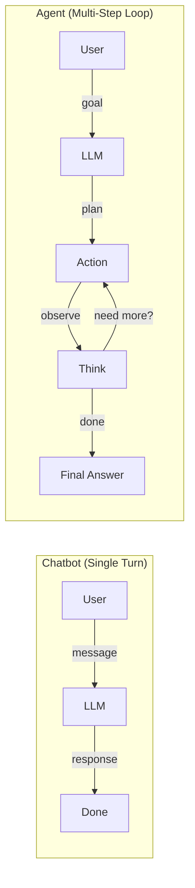
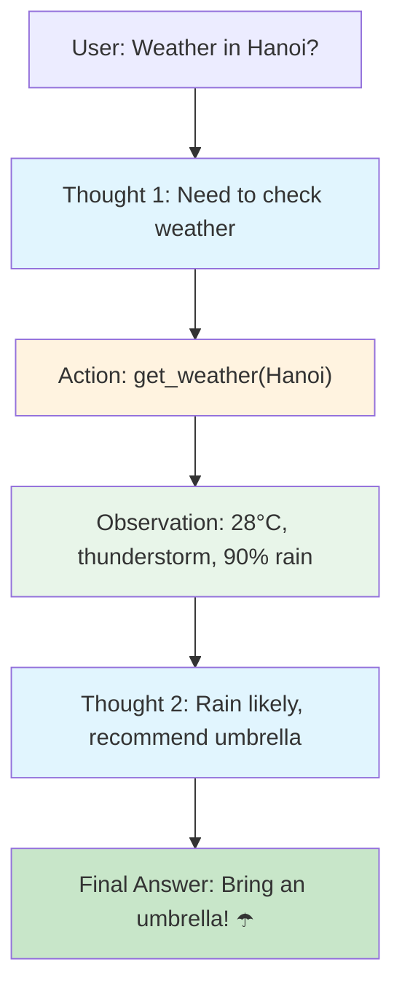
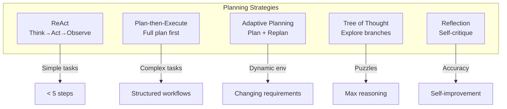

# 🤖 Agent Fundamentals

> **Mục tiêu**: Hiểu AI Agent từ cơ bản — Agent vs Chatbot, ReAct pattern, Tool Use, Planning, Agentic Architecture.

---

## 1. Agent vs Chatbot



| | Chatbot | Agent |
|-|---------|-------|
| **Behavior** | React to messages | Autonomous action |
| **Tools** | None | Search, Code, APIs, DB |
| **Memory** | Conversation history | Short + Long-term |
| **Planning** | None | Multi-step reasoning |
| **Loop** | Single turn | Iterative (think → act → observe) |
| **Failure recovery** | None | Retry, replan, fallback |

---

## 2. ReAct Pattern (Reasoning + Acting)

### Concept



### ReAct Prompt Template

```python
REACT_SYSTEM_PROMPT = """You are an AI agent that reasons step-by-step and uses tools to 
answer questions. Follow this format EXACTLY:

Thought: <your reasoning about what to do next>
Action: <tool_name>(arg1="value1", arg2="value2")

After receiving an observation:
Thought: <reasoning about the observation>
Action: <next tool call or finish>

When you have enough information:
Thought: I now have enough information to provide a complete answer.
Final Answer: <your complete, detailed answer>

RULES:
- Always think before acting
- Use tools when you need external information
- Never make up information — use tools to verify
- If a tool fails, try an alternative approach
- Maximum 5 reasoning steps

Available Tools:
{tools_description}
"""
```

### ReAct Agent Implementation

```python
import json
import re
from dataclasses import dataclass

@dataclass
class AgentStep:
    thought: str
    action: str | None = None
    action_input: dict | None = None
    observation: str | None = None

class ReActAgent:
    def __init__(self, llm_client, tools: dict, max_steps: int = 5):
        self.llm = llm_client
        self.tools = tools  # {"tool_name": callable}
        self.max_steps = max_steps
        self.steps: list[AgentStep] = []
    
    def run(self, question: str) -> str:
        tools_desc = "\n".join(
            f"- {name}({self._get_params(func)}): {func.__doc__}"
            for name, func in self.tools.items()
        )
        
        messages = [
            {"role": "system", "content": REACT_SYSTEM_PROMPT.format(tools_description=tools_desc)},
            {"role": "user", "content": question},
        ]
        
        for step in range(self.max_steps):
            response = self.llm.chat.completions.create(
                model="gpt-4o",
                messages=messages,
                temperature=0,
            )
            
            text = response.choices[0].message.content
            messages.append({"role": "assistant", "content": text})
            
            # Check for final answer
            if "Final Answer:" in text:
                return text.split("Final Answer:")[-1].strip()
            
            # Parse and execute action
            action_name, action_args = self._parse_action(text)
            if action_name and action_name in self.tools:
                try:
                    result = self.tools[action_name](**action_args)
                    observation = json.dumps(result, ensure_ascii=False, indent=2)
                except Exception as e:
                    observation = f"Error: {str(e)}"
                
                self.steps.append(AgentStep(
                    thought=text,
                    action=action_name,
                    action_input=action_args,
                    observation=observation
                ))
                
                messages.append({"role": "user", "content": f"Observation: {observation}"})
        
        return "Agent reached maximum steps without finding an answer."
    
    def _parse_action(self, text: str) -> tuple[str | None, dict]:
        """Parse 'Action: tool_name(args)' from LLM response."""
        match = re.search(r'Action:\s*(\w+)\((.*?)\)', text, re.DOTALL)
        if not match:
            return None, {}
        name = match.group(1)
        args_str = match.group(2)
        # Parse key="value" pairs
        args = dict(re.findall(r'(\w+)="([^"]*)"', args_str))
        return name, args
    
    def _get_params(self, func) -> str:
        import inspect
        sig = inspect.signature(func)
        return ", ".join(str(p) for p in sig.parameters.values())
```

---

## 3. Tool Use / Function Calling

### OpenAI Function Calling (Native)

```python
from openai import OpenAI

client = OpenAI()

tools = [
    {
        "type": "function",
        "function": {
            "name": "get_weather",
            "description": "Get current weather for a specific city. Returns temperature, humidity, wind, and conditions.",
            "parameters": {
                "type": "object",
                "properties": {
                    "city": {
                        "type": "string",
                        "description": "City name, e.g. 'Hanoi', 'Ho Chi Minh City'"
                    },
                    "unit": {
                        "type": "string",
                        "enum": ["celsius", "fahrenheit"],
                        "default": "celsius"
                    }
                },
                "required": ["city"]
            }
        }
    },
    {
        "type": "function",
        "function": {
            "name": "search_database",
            "description": "Search a product database by name, category, or price range.",
            "parameters": {
                "type": "object",
                "properties": {
                    "query": {"type": "string", "description": "Search query"},
                    "category": {"type": "string", "enum": ["electronics", "clothing", "books"]},
                    "max_price": {"type": "number", "description": "Maximum price in USD"}
                },
                "required": ["query"]
            }
        }
    }
]

# Agentic loop with function calling
def run_agent(user_message: str):
    messages = [{"role": "user", "content": user_message}]
    
    while True:
        response = client.chat.completions.create(
            model="gpt-4o",
            messages=messages,
            tools=tools,
            tool_choice="auto",
        )
        
        msg = response.choices[0].message
        messages.append(msg)
        
        # No tool call → final response
        if not msg.tool_calls:
            return msg.content
        
        # Execute tool calls
        for tool_call in msg.tool_calls:
            func_name = tool_call.function.name
            func_args = json.loads(tool_call.function.arguments)
            
            # Route to actual function
            result = execute_tool(func_name, func_args)
            
            messages.append({
                "role": "tool",
                "tool_call_id": tool_call.id,
                "content": json.dumps(result),
            })
```

### Parallel Tool Calls

```python
# GPT-4o can call MULTIPLE tools in one turn
# Example: "Compare weather in Hanoi and HCMC"
# → Calls get_weather("Hanoi") AND get_weather("HCMC") simultaneously
# → Receives both results → generates comparison

# Handle in loop:
for tool_call in msg.tool_calls:  # Iterates over ALL parallel calls
    result = execute_tool(tool_call.function.name, ...)
    messages.append({"role": "tool", "tool_call_id": tool_call.id, ...})
```

---

## 4. Planning Strategies

### Plan-and-Execute

```
Step 1: PLAN
  LLM generates a structured plan with steps:
  1. Search for data A
  2. Search for data B
  3. Compare A and B
  4. Generate report

Step 2: EXECUTE each step
  - Step 1 → search_tool("data A") → result_A
  - Step 2 → search_tool("data B") → result_B
  - Step 3 → compare(result_A, result_B) → comparison
  - Step 4 → report(comparison) → final_report

Step 3: REPLAN if needed
  - If step fails → adjust plan
  - If new info changes goal → replan
```



### Planning Comparison

| Strategy | How it works | Best for | Limitations |
|----------|-------------|----------|-------------|
| **ReAct** | Think → Act → Observe (loop) | Simple tasks, <5 steps | Gets lost in long chains |
| **Plan-then-Execute** | Full plan first, then execute | Complex multi-step | Plan may be wrong |
| **Adaptive Planning** | Plan, execute, replan | Dynamic environments | More LLM calls → cost |
| **Tree of Thought** | Explore multiple paths | Puzzles, reasoning | Very expensive |
| **Reflection** | Self-critique and retry | Tasks needing accuracy | Extra latency |

---

## 5. Structured Output for Agents

```python
from pydantic import BaseModel, Field
from openai import OpenAI

class AgentAction(BaseModel):
    thought: str = Field(description="Agent's reasoning")
    action: str = Field(description="Tool to call or 'finish'")
    action_input: dict = Field(description="Arguments for the tool")

class AgentResponse(BaseModel):
    answer: str = Field(description="Final answer to the user")
    sources: list[str] = Field(description="Sources used")
    confidence: float = Field(ge=0, le=1, description="Confidence score")

# Use structured output for reliable parsing
response = client.beta.chat.completions.parse(
    model="gpt-4o",
    messages=[...],
    response_format=AgentAction,
)
action = response.choices[0].message.parsed
print(f"Thought: {action.thought}")
print(f"Action: {action.action}({action.action_input})")
```

---

## 6. Agent Frameworks Comparison

| Framework | Approach | Best for | Complexity | Stars |
|-----------|----------|----------|-----------|-------|
| **LangChain** | Chains, sequential | Simple pipelines | Low | 100k+ |
| **LangGraph** | State machines, graph | Complex workflows | Medium | 10k+ |
| **CrewAI** | Role-based agents | Multi-agent teams | Medium | 25k+ |
| **AutoGen** | Conversational agents | Research, coding | Medium | 35k+ |
| **Agno** | Lightweight agents | Fast prototyping | Low | 20k+ |
| **Smolagents** | HuggingFace agents | Open-source models | Low | 15k+ |
| **OpenAI SDK** | Native function calling | Production OpenAI | Low | — |

---

## 7. Agent Evaluation Framework

```python
import time
from dataclasses import dataclass

@dataclass
class AgentTask:
    description: str
    expected_tools: list[str]      # Which tools should be called
    expected_result: str | None     # Expected final answer (if deterministic)
    max_steps: int = 10

@dataclass  
class EvalResult:
    task: str
    completed: bool
    steps: int
    tools_used: list[str]
    tool_accuracy: float     # % correct tool selections
    latency_s: float
    cost_usd: float
    error: str | None = None

def evaluate_agent(agent, tasks: list[AgentTask]) -> dict:
    """Run benchmark suite, measure key metrics."""
    results = []
    
    for task in tasks:
        start = time.perf_counter()
        try:
            response = agent.invoke({"input": task.description})
            completed = True
            error = None
        except Exception as e:
            completed = False
            error = str(e)
            response = {}
        
        latency = time.perf_counter() - start
        tools_used = [s.tool for s in response.get("intermediate_steps", [])]
        
        # Tool accuracy: did agent pick the right tools?
        expected_set = set(task.expected_tools)
        used_set = set(tools_used)
        tool_acc = len(expected_set & used_set) / len(expected_set) if expected_set else 1.0
        
        results.append(EvalResult(
            task=task.description, completed=completed, steps=len(tools_used),
            tools_used=tools_used, tool_accuracy=tool_acc,
            latency_s=latency, cost_usd=0.0, error=error,
        ))
    
    # Aggregate metrics
    return {
        "task_completion_rate": sum(r.completed for r in results) / len(results),
        "avg_tool_accuracy": sum(r.tool_accuracy for r in results) / len(results),
        "avg_steps": sum(r.steps for r in results) / len(results),
        "avg_latency_s": sum(r.latency_s for r in results) / len(results),
        "total_cost": sum(r.cost_usd for r in results),
        "failures": [r.task for r in results if not r.completed],
    }
```

---

## 🎯 Interview Tips — Chi Tiết

### Q1: "Agent vs RAG?"
**A**: RAG: retrieve knowledge → augment prompt → answer. Agent: plan → use tools (including RAG) → take actions → iterate. Agent CAN use RAG as one of many tools. RAG is passive; Agents are active.

### Q2: "ReAct pattern?"
**A**: Reasoning + Acting interleaved. Loop: Think (reason about state) → Act (call tool) → Observe (get result) → repeat until Final Answer. Paper: Yao et al. 2022. Most natural and widely-used agent pattern.

### Q3: "When NOT to use agents?"
**A**: Simple Q&A (just use RAG). Deterministic workflows (just use code). Latency-critical (<500ms). Cost-sensitive (agents = 3-10x more LLM calls). High-stakes without HITL (medical, financial).

### Q4: "Agent reliability?"
**A**: Biggest challenge. Solutions: (1) Structured output / Pydantic for parsing, (2) Input/output guardrails, (3) Fallback chains, (4) Max step limits, (5) Human-in-the-loop for critical actions, (6) Comprehensive evaluation suites.

### Q5: "Function calling vs ReAct?"
**A**: Function calling: native API (OpenAI/Anthropic), reliable JSON parsing, parallel tool calls, type-safe. ReAct: text-based, works with any LLM, more flexible but brittle parsing. Production: function calling. Research: ReAct.

### Q6: "Agent framework selection?"
**A**: Simple pipeline → LangChain. Complex state machine → LangGraph. Multi-agent team → CrewAI/AutoGen. Lightweight → Agno/Smolagents. Production OpenAI → native SDK. Start simple, add complexity only when needed.
