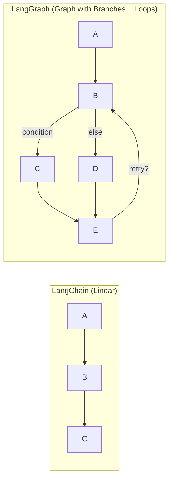
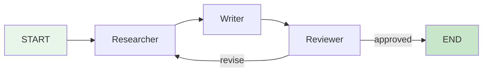
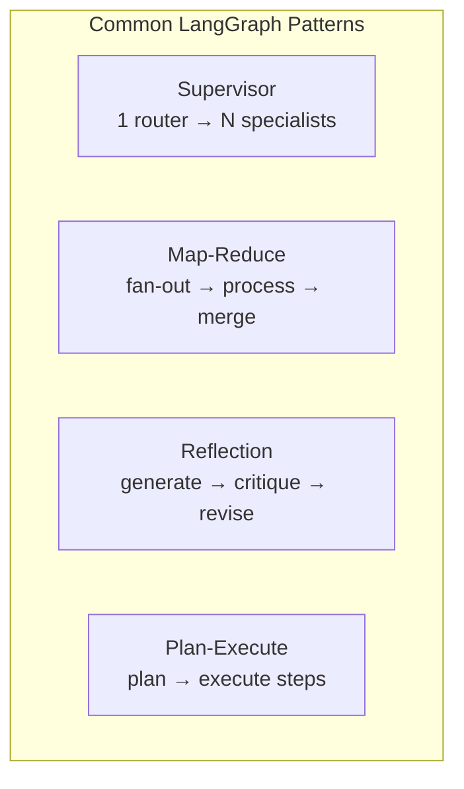

# 📊 LangGraph — State Machine Workflows

> **Mục tiêu**: Build complex agent workflows với LangGraph — state, nodes, edges, checkpointing, human-in-the-loop.

---

## 1. LangGraph vs LangChain



| Feature | LangChain | LangGraph |
|---------|-----------|-----------|
| **Flow** | Sequential chains | Directed graph (branches, loops) |
| **State** | Implicit (pass through chain) | Explicit typed state object |
| **Control** | Limited conditional | Full if/else, loops, cycles |
| **Persistence** | Add-on | Built-in checkpointing |
| **Human-in-loop** | Manual | First-class `interrupt_before` |
| **Streaming** | Token-level | Node-level + token-level |
| **Debugging** | Difficult | LangSmith integration |

---

## 2. Core Concepts

### State — Shared data between nodes

```python
from langgraph.graph import StateGraph, START, END
from typing import TypedDict, Annotated
from operator import add

class AgentState(TypedDict):
    messages: Annotated[list, add]   # Append-mode: new messages added to list
    plan: str                         # Current plan (replaced each time)
    step: int                         # Current step counter
    documents: list[str]              # Retrieved documents
    final_answer: str                 # Output
```

### Nodes — Functions that modify state

```python
from langchain_openai import ChatOpenAI

llm = ChatOpenAI(model="gpt-4o", temperature=0)

def researcher(state: AgentState) -> dict:
    """Search for relevant information."""
    query = state["messages"][-1].content
    # Simulate search
    docs = search_tool(query)
    return {
        "documents": docs,
        "messages": [AIMessage(content=f"Found {len(docs)} documents")]
    }

def writer(state: AgentState) -> dict:
    """Write answer based on retrieved documents."""
    context = "\n".join(state["documents"])
    query = state["messages"][0].content
    
    response = llm.invoke(
        f"Based on this context:\n{context}\n\nAnswer: {query}"
    )
    return {
        "final_answer": response.content,
        "messages": [response]
    }

def reviewer(state: AgentState) -> dict:
    """Review the answer quality."""
    review = llm.invoke(
        f"Review this answer for accuracy and completeness:\n{state['final_answer']}"
    )
    return {"messages": [review]}
```

### Edges — Routing logic

```python
def route_after_review(state: AgentState) -> str:
    """Decide if answer is good enough or needs revision."""
    last_message = state["messages"][-1].content.lower()
    
    if "approved" in last_message or "looks good" in last_message:
        return "finish"
    elif state["step"] >= 3:
        return "finish"  # Max retries
    else:
        return "revise"
```

### Build Graph

```python
# Create graph
graph = StateGraph(AgentState)

# Add nodes
graph.add_node("researcher", researcher)
graph.add_node("writer", writer)
graph.add_node("reviewer", reviewer)

# Add edges
graph.add_edge(START, "researcher")
graph.add_edge("researcher", "writer")
graph.add_edge("writer", "reviewer")

# Conditional routing after review
graph.add_conditional_edges(
    "reviewer",
    route_after_review,
    {
        "finish": END,
        "revise": "researcher",  # Loop back for more research
    },
)

# Compile
app = graph.compile()

# Visualize (optional)
print(app.get_graph().draw_ascii())
```



---

## 3. Checkpointing & Memory

```python
from langgraph.checkpoint.memory import MemorySaver
from langgraph.checkpoint.sqlite import SqliteSaver

# In-memory (development)
memory = MemorySaver()

# SQLite (production-light)
# db = SqliteSaver.from_conn_string("checkpoints.db")

app = graph.compile(checkpointer=memory)

# Run with thread_id → enables conversation memory
config = {"configurable": {"thread_id": "user-session-123"}}

# First turn
result1 = app.invoke(
    {"messages": [HumanMessage(content="Tell me about RAG systems")]},
    config=config,
)

# Second turn — same thread, continues context
result2 = app.invoke(
    {"messages": [HumanMessage(content="How do I evaluate them?")]},
    config=config,
)

# Get conversation history
snapshot = app.get_state(config)
print(f"Total messages: {len(snapshot.values['messages'])}")
```

---

## 4. Human-in-the-Loop

```python
# Interrupt before dangerous actions
app = graph.compile(
    checkpointer=memory,
    interrupt_before=["execute_action"],  # Pause here
)

# Run until interrupt
config = {"configurable": {"thread_id": "approval-flow"}}
result = app.invoke(
    {"messages": [HumanMessage(content="Delete all inactive users")]},
    config=config,
)
# → Agent plans the action, pauses BEFORE executing

# Check what agent wants to do
state = app.get_state(config)
print(f"Agent wants to: {state.values['plan']}")
# → "DELETE FROM users WHERE last_login < '2025-01-01'"

# Human approves → resume
app.invoke(None, config)  # Continue from checkpoint

# Human rejects → modify state and resume
app.update_state(config, {"plan": "SELECT COUNT(*) FROM users WHERE last_login < '2025-01-01'"})
app.invoke(None, config)  # Resume with modified plan
```

---

## 5. Streaming

```python
# Stream node outputs as they complete
async for event in app.astream_events(
    {"messages": [HumanMessage(content="Research AI trends")]},
    config=config,
    version="v2",
):
    kind = event["event"]
    
    if kind == "on_chain_start":
        print(f"🔄 Starting: {event['name']}")
    elif kind == "on_chain_end":
        print(f"✅ Completed: {event['name']}")
    elif kind == "on_chat_model_stream":
        # Token-level streaming from LLM
        token = event["data"]["chunk"].content
        print(token, end="", flush=True)
```

---

## 6. Common Patterns

### Supervisor Pattern

```python
# One agent supervises multiple specialist agents
class SupervisorState(TypedDict):
    messages: Annotated[list, add]
    next_agent: str

def supervisor(state: SupervisorState) -> dict:
    """Route to the appropriate specialist agent."""
    response = llm.invoke(
        f"Given this request, which agent should handle it?\n"
        f"Options: researcher, coder, writer\n"
        f"Request: {state['messages'][-1].content}"
    )
    return {"next_agent": response.content.strip().lower()}

# Route based on supervisor decision
graph.add_conditional_edges(
    "supervisor",
    lambda state: state["next_agent"],
    {"researcher": "researcher", "coder": "coder", "writer": "writer"},
)
```



### Map-Reduce Pattern

```python
# Process multiple items in parallel, then merge
from langgraph.graph import Send

def fan_out(state: AgentState):
    """Split work into parallel tasks."""
    items = state["documents"]
    return [Send("process_item", {"item": item}) for item in items]

def process_item(state: dict) -> dict:
    """Process single item."""
    summary = llm.invoke(f"Summarize: {state['item']}")
    return {"summaries": [summary.content]}

def merge_results(state: AgentState) -> dict:
    """Combine all summaries."""
    combined = "\n".join(state["summaries"])
    final = llm.invoke(f"Create a final summary from:\n{combined}")
    return {"final_answer": final.content}
```

---

## 🎯 Interview Tips — Chi Tiết

### Q1: "LangGraph vs LangChain?"
**A**: LangChain: linear chains, simple RAG/QA. LangGraph: directed graphs with branches, loops, cycles, explicit typed state, built-in persistence. Use LangChain for prototypes, LangGraph for production agents.

### Q2: "Why state machines for agents?"
**A**: (1) Explicit control flow — debuggable. (2) Persistent state — resume after crash. (3) Human-in-the-loop — pause at any node. (4) Testable — unit test each node. (5) Observable — LangSmith integration.

### Q3: "Checkpointing?"
**A**: Save complete graph state (all variables) to storage. Resume from exact point. Enables: conversation memory (thread_id), fault tolerance, time-travel debugging. Storage: MemorySaver (dev), SQLite/Postgres (prod).

### Q4: "Supervisor pattern?"
**A**: One LLM routes requests to specialist agents (researcher, coder, writer). Like a manager delegating. Advantages: clear separation of concerns, modular, each specialist has focused prompt.

### Q5: "Human-in-the-loop?"
**A**: `interrupt_before=["node_name"]` pauses graph execution. Human reviews `get_state()`, approves via `invoke(None, config)` or modifies via `update_state()`. Critical for dangerous actions (delete, payment).

### Q6: "Map-Reduce in LangGraph?"
**A**: `Send()` API fans out work to parallel nodes. Each processes independently. Results collected back into state. Use for: batch summarization, parallel search, multi-document analysis.
