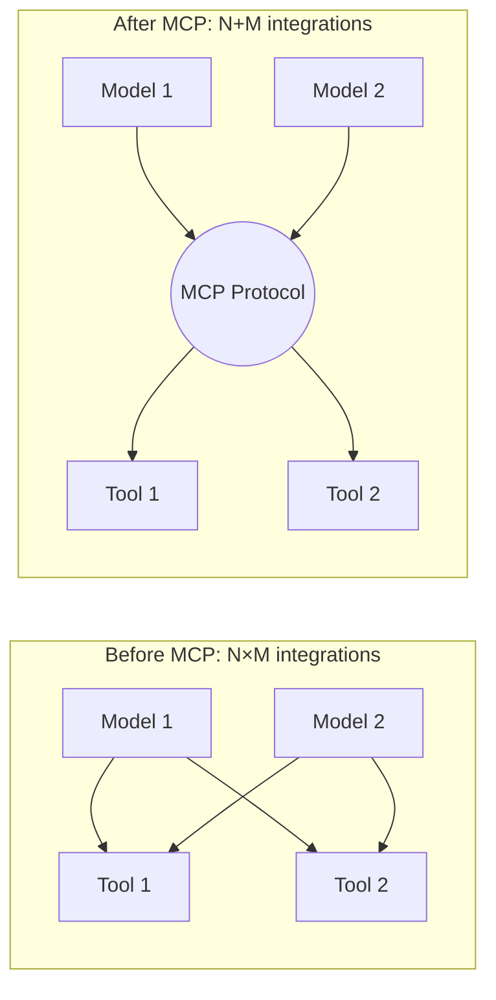
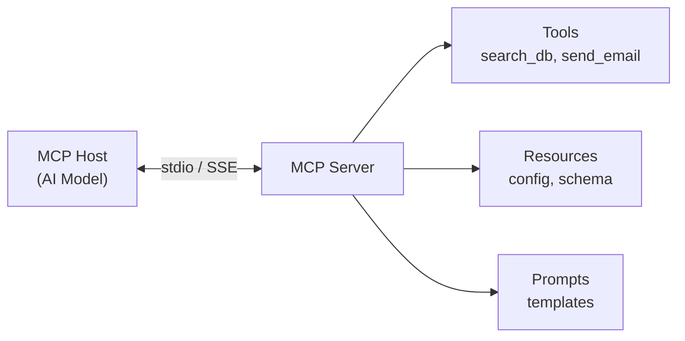

# 🔧 Tool Design & MCP Protocol

> **Mục tiêu**: Thiết kế tools tốt cho AI Agents — MCP standard, Function Calling, best practices.

---

## 1. Model Context Protocol (MCP)

### MCP là gì?



> MCP = "USB" cho AI tools. Host (Claude, GPT) ↔ MCP Server (tools, resources, prompts)

### MCP Architecture



### MCP Server Implementation

```python
# pip install mcp
from mcp.server import Server
from mcp.server.stdio import stdio_server
from mcp.types import Tool, TextContent
import json

app = Server("my-tools")

# Define Tools
@app.list_tools()
async def list_tools():
    return [
        Tool(
            name="search_database",
            description="Search products in the database by name or category",
            inputSchema={
                "type": "object",
                "properties": {
                    "query": {"type": "string", "description": "Search term"},
                    "category": {"type": "string", "enum": ["electronics", "books", "clothing"]},
                    "limit": {"type": "integer", "default": 10, "description": "Max results"}
                },
                "required": ["query"]
            }
        ),
        Tool(
            name="get_user_info",
            description="Get user profile information by user ID",
            inputSchema={
                "type": "object",
                "properties": {
                    "user_id": {"type": "string", "description": "User ID (UUID format)"}
                },
                "required": ["user_id"]
            }
        ),
    ]

@app.call_tool()
async def call_tool(name: str, arguments: dict):
    if name == "search_database":
        results = await db.search(
            query=arguments["query"],
            category=arguments.get("category"),
            limit=arguments.get("limit", 10),
        )
        return [TextContent(type="text", text=json.dumps(results))]
    
    elif name == "get_user_info":
        user = await db.get_user(arguments["user_id"])
        return [TextContent(type="text", text=json.dumps(user))]
    
    raise ValueError(f"Unknown tool: {name}")

# Run server
async def main():
    async with stdio_server() as (read, write):
        await app.run(read, write, app.create_initialization_options())

if __name__ == "__main__":
    import asyncio
    asyncio.run(main())
```

### MCP Resources & Prompts

```python
from mcp.types import Resource, Prompt, PromptArgument, PromptMessage

@app.list_resources()
async def list_resources():
    return [
        Resource(
            uri="config://database",
            name="Database Schema",
            description="Current database table definitions",
            mimeType="application/json",
        )
    ]

@app.read_resource()
async def read_resource(uri: str):
    if uri == "config://database":
        schema = await db.get_schema()
        return json.dumps(schema)

@app.list_prompts()
async def list_prompts():
    return [
        Prompt(
            name="analyze_data",
            description="Analyze a dataset and provide insights",
            arguments=[
                PromptArgument(name="dataset", description="Name of dataset", required=True),
                PromptArgument(name="focus", description="Area to focus on"),
            ]
        )
    ]
```

---

## 2. Tool Design Best Practices

### Good vs Bad Tool Design

```python
# ❌ BAD: Vague name, unclear parameters
def process(data):
    """Process data."""
    pass

# ✅ GOOD: Clear name, typed params, detailed description
def search_products(
    query: str,
    category: str | None = None,
    min_price: float = 0,
    max_price: float = float('inf'),
    limit: int = 10,
) -> list[dict]:
    """Search the product catalog by keyword, with optional filters.
    
    Returns a list of matching products with name, price, and rating.
    Results are sorted by relevance score.
    
    Args:
        query: Search keywords (e.g., "wireless headphones")
        category: Filter by category (electronics, clothing, books)
        min_price: Minimum price in USD (default: 0)
        max_price: Maximum price in USD (default: no limit)
        limit: Maximum number of results (1-50, default: 10)
    """
    pass
```

### Tool Design Checklist

| Aspect | Rule | Example |
|--------|------|---------|
| **Name** | Action verb + noun | `search_products`, `create_user` |
| **Description** | What, when, returns | "Search by keyword, returns list of products" |
| **Params** | Typed, validated | `query: str`, `limit: int = 10` |
| **Errors** | Clear error messages | "Product not found: id=abc123" |
| **Idempotent** | Safe to retry | GET operations, status checks |
| **Scoped** | Do one thing well | Don't combine search + create |

---

## 3. Function Calling Patterns

### Forced vs Auto Tool Selection

```python
# Auto: LLM decides whether to call tools
response = client.chat.completions.create(
    model="gpt-4o",
    messages=messages,
    tools=tools,
    tool_choice="auto",       # LLM decides
)

# Forced: MUST call a specific tool
response = client.chat.completions.create(
    model="gpt-4o",
    messages=messages,
    tools=tools,
    tool_choice={"type": "function", "function": {"name": "search_products"}},
)

# None: Never call tools (just chat)
response = client.chat.completions.create(
    model="gpt-4o",
    messages=messages,
    tools=tools,
    tool_choice="none",
)
```

### Tool Result Handling

```python
def handle_tool_response(tool_result):
    """Format tool results for the LLM."""
    if isinstance(tool_result, list) and len(tool_result) > 20:
        # Truncate large results
        return json.dumps(tool_result[:20]) + f"\n... ({len(tool_result)} total results)"
    
    if isinstance(tool_result, dict) and "error" in tool_result:
        # Format errors clearly
        return f"Tool Error: {tool_result['error']}. Suggestion: {tool_result.get('suggestion', 'Try again')}"
    
    return json.dumps(tool_result, ensure_ascii=False, indent=2)
```

---

## 4. Tool Error Recovery Patterns

```python
import asyncio
from typing import Callable, Any

class ToolExecutor:
    """Production tool executor with retry, fallback, timeout."""
    
    def __init__(self, max_retries: int = 3, timeout: float = 30.0):
        self.max_retries = max_retries
        self.timeout = timeout
        self.fallbacks: dict[str, Callable] = {}
    
    def register_fallback(self, tool_name: str, fallback_fn: Callable):
        self.fallbacks[tool_name] = fallback_fn
    
    async def execute(self, tool_name: str, fn: Callable, **kwargs) -> dict:
        """Execute tool with retry + fallback + timeout."""
        last_error = None
        
        for attempt in range(self.max_retries):
            try:
                result = await asyncio.wait_for(
                    fn(**kwargs), 
                    timeout=self.timeout,
                )
                return {"status": "success", "data": result}
            
            except asyncio.TimeoutError:
                last_error = f"Timeout after {self.timeout}s"
            except Exception as e:
                last_error = str(e)
                # Exponential backoff
                await asyncio.sleep(2 ** attempt)
        
        # All retries failed → try fallback
        if tool_name in self.fallbacks:
            try:
                result = await self.fallbacks[tool_name](**kwargs)
                return {"status": "fallback", "data": result}
            except Exception:
                pass
        
        return {"status": "error", "error": last_error, "suggestion": "Try alternative approach"}

# Usage
executor = ToolExecutor(max_retries=3, timeout=10.0)
executor.register_fallback("web_search", cached_search)  # Fallback to cache
result = await executor.execute("web_search", live_search, query="LangGraph tutorial")
```

---

## 5. Tool Composition & Chaining

```python
# Complex tasks often require multiple tools in sequence
class ToolChain:
    """Chain tools: output of one feeds input of next."""
    
    def __init__(self):
        self.steps: list[tuple[str, Callable, dict]] = []
    
    def add(self, name: str, fn: Callable, param_map: dict = None):
        """param_map: maps previous output keys → this tool's params."""
        self.steps.append((name, fn, param_map or {}))
        return self
    
    async def run(self, initial_input: dict) -> list[dict]:
        context = initial_input
        results = []
        
        for name, fn, param_map in self.steps:
            # Map previous results to current params
            params = {k: context[v] for k, v in param_map.items()}
            params.update({k: v for k, v in initial_input.items() if k not in params})
            
            result = await fn(**params)
            context.update(result)
            results.append({"tool": name, "result": result})
        
        return results

# Example: Search → Summarize → Translate
chain = ToolChain()
chain.add("search", web_search)
chain.add("summarize", summarize_text, param_map={"text": "search_results"})
chain.add("translate", translate, param_map={"text": "summary"})
```

---

## 🎯 Interview Tips — Chi Tiết

### Q1: "MCP là gì?"
**A**: Model Context Protocol: chuẩn mở cho AI tools. Server expose tools/resources/prompts, client (AI model) consume. Giống USB for AI — write once, connect to any model. Transport: stdio (local) hoặc SSE (remote).

### Q2: "Tool naming quan trọng thế nào?"
**A**: LLM chọn tool dựa trên tên + description. Bad name = wrong tool selection = wrong result. Format: `action_noun` (search_products, create_user). Description phải rõ khi nào dùng, trả về gì.

### Q3: "Function calling vs ReAct?"
**A**: Function calling: native API (OpenAI/Anthropic), reliable JSON, parallel calls, type-safe via schema. ReAct: text-based, any LLM, flexible but regex parsing fragile. Production: function calling. Research/any model: ReAct.

### Q4: "Tool error handling?"
**A**: (1) Clear error messages with context. (2) Retry logic with exponential backoff for transient failures. (3) Fallback tools for critical paths. (4) Timeout limits. (5) Never let tool errors crash the agent — return error as observation, let LLM adapt.

### Q5: "Idempotent tools?"
**A**: GET-type tools (search, read) safe to retry any number of times. POST/DELETE tools need confirmation (human-in-the-loop). Idempotency critical for agent reliability because agents may retry on parsing failure.

### Q6: "MCP vs direct API integration?"
**A**: Direct API: faster, tighter control, but N×M integrations. MCP: standardized, N+M, discoverable (list_tools), composable. Trade-off: small overhead vs massive reusability. MCP is the future for multi-model ecosystems.

### Q7: "Tool chaining vs parallel tools?"
**A**: Chaining: sequential dependency (search → summarize → translate). Parallel: independent tools (check weather + check calendar). Modern APIs support both. Key: minimize sequential depth for latency, maximize parallelism.

### Q8: "Dynamic tool selection?"
**A**: (1) Route by intent: classify query → select tool subset. (2) Semantic search on tool descriptions. (3) Two-stage: coarse filter → LLM fine select. Critical when >20 tools — LLM struggles with too many tool descriptions in context.
