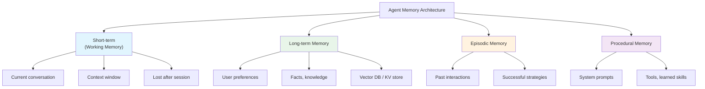
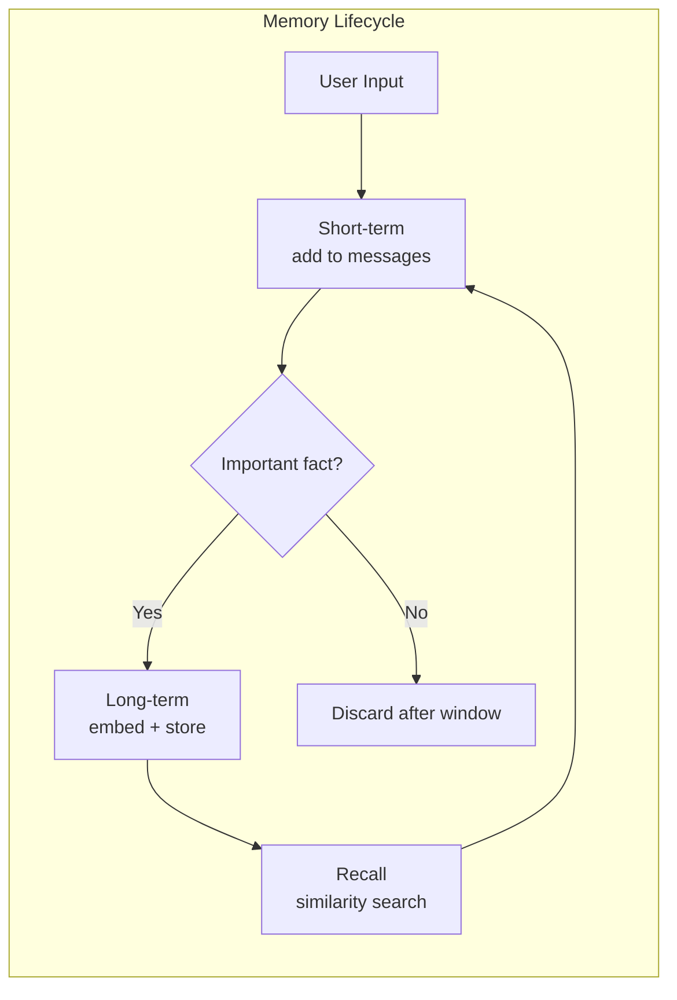

# 🧠 Memory Systems cho AI Agents

> **Mục tiêu**: Short-term, Long-term, Episodic Memory — agent nhớ gì, nhớ bao lâu, nhớ thế nào.

---

## 1. Memory Types





---

## 2. Short-term Memory (Conversation)

```python
class ConversationMemory:
    """Manage conversation history within token limits."""
    
    def __init__(self, max_tokens: int = 16000):
        self.messages: list[dict] = []
        self.max_tokens = max_tokens
    
    def add(self, role: str, content: str):
        self.messages.append({"role": role, "content": content})
        self._trim()
    
    def _trim(self):
        """Remove old messages when exceeding token limit."""
        while self._count_tokens() > self.max_tokens and len(self.messages) > 2:
            # Always keep system prompt (index 0) and latest message
            self.messages.pop(1)  # Remove oldest non-system message
    
    def _count_tokens(self) -> int:
        # Approximate: 1 token ≈ 4 chars
        return sum(len(m["content"]) // 4 for m in self.messages)
    
    def get_messages(self) -> list[dict]:
        return self.messages.copy()

# Sliding Window with Summary
class SlidingWindowMemory:
    """Keep recent messages + summary of older ones."""
    
    def __init__(self, window_size: int = 20, llm=None):
        self.messages = []
        self.window_size = window_size
        self.summary = ""
        self.llm = llm
    
    def add(self, role: str, content: str):
        self.messages.append({"role": role, "content": content})
        if len(self.messages) > self.window_size:
            self._summarize_old()
    
    def _summarize_old(self):
        old = self.messages[:self.window_size // 2]
        self.summary = self.llm.invoke(
            f"Summarize this conversation:\n{old}\n\nPrevious summary:\n{self.summary}"
        )
        self.messages = self.messages[self.window_size // 2:]
    
    def get_context(self) -> str:
        return f"Summary of earlier conversation:\n{self.summary}\n\nRecent messages:\n{self.messages}"
```

---

## 3. Long-term Memory (Vector Store)

```python
import chromadb
from datetime import datetime

class LongTermMemory:
    """Persist facts and knowledge across sessions."""
    
    def __init__(self, user_id: str):
        self.client = chromadb.PersistentClient(path="./memory_store")
        self.collection = self.client.get_or_create_collection(
            name=f"user_{user_id}",
            metadata={"hnsw:space": "cosine"},
        )
        self.user_id = user_id
    
    def remember(self, content: str, category: str = "general"):
        """Store a memory."""
        self.collection.add(
            documents=[content],
            metadatas=[{
                "category": category,
                "timestamp": datetime.now().isoformat(),
                "user_id": self.user_id,
            }],
            ids=[f"mem_{datetime.now().timestamp()}"],
        )
    
    def recall(self, query: str, top_k: int = 5) -> list[str]:
        """Retrieve relevant memories."""
        results = self.collection.query(
            query_texts=[query],
            n_results=top_k,
        )
        return results["documents"][0] if results["documents"] else []
    
    def forget(self, memory_id: str):
        """Delete a specific memory (GDPR compliance)."""
        self.collection.delete(ids=[memory_id])

# Usage
memory = LongTermMemory(user_id="user-123")

# Agent learns about user
memory.remember("User prefers Python over JavaScript", category="preference")
memory.remember("User is working on a UAV segmentation project", category="project")
memory.remember("User's timezone is UTC+7 (Vietnam)", category="context")

# Later session — recall relevant info
context = memory.recall("What programming language does the user prefer?")
# → ["User prefers Python over JavaScript"]
```

---

## 4. Episodic Memory (Past Interactions)

```python
class EpisodicMemory:
    """Remember successful past interactions for similar future tasks."""
    
    def __init__(self):
        self.episodes: list[dict] = []
    
    def record_episode(self, task: str, approach: str, outcome: str, success: bool):
        self.episodes.append({
            "task": task,
            "approach": approach,
            "outcome": outcome,
            "success": success,
            "timestamp": datetime.now().isoformat(),
        })
    
    def find_similar_episodes(self, current_task: str, top_k: int = 3) -> list[dict]:
        """Find past episodes similar to current task."""
        # In production: use embedding similarity
        successful = [e for e in self.episodes if e["success"]]
        # Return most recent successful episodes
        return sorted(successful, key=lambda e: e["timestamp"], reverse=True)[:top_k]

# Usage
episodic = EpisodicMemory()

# After successful task
episodic.record_episode(
    task="Deploy ML model",
    approach="ONNX export → FastAPI → Docker → Cloud Run",
    outcome="Model serving at 50ms latency",
    success=True,
)

# Next time similar task → recall what worked
similar = episodic.find_similar_episodes("Deploy a new model to production")
# → [{"approach": "ONNX export → FastAPI → Docker → Cloud Run", ...}]
```

---

## 5. Memory in Agent System Prompt

```python
def build_system_prompt(user_id: str, query: str) -> str:
    memory = LongTermMemory(user_id)
    relevant_memories = memory.recall(query, top_k=5)
    
    return f"""You are a helpful AI assistant.

## User Context (from past interactions)
{chr(10).join(f'- {m}' for m in relevant_memories)}

## Instructions
- Use the user context to personalize your responses
- If the user context contradicts the current request, ask for clarification
- Remember new facts about the user for future interactions

## Current conversation
"""
```

---

## 6. Hierarchical Memory Architecture

```python
class HierarchicalMemory:
    """3-tier memory: working → episodic → semantic (like human brain)."""
    
    def __init__(self, llm, embedder, vector_db):
        self.llm = llm
        self.embedder = embedder
        self.vector_db = vector_db
        self.working: list[dict] = []       # Current conversation (fast, limited)
        self.episodic: list[dict] = []       # Past experiences (medium-term)
        # Semantic memory lives in vector_db  # Facts & knowledge (permanent)
    
    def process_message(self, message: dict):
        """Add to working memory, promote important info to long-term."""
        self.working.append(message)
        
        # Promote to semantic memory if important fact detected
        facts = self._extract_facts(message["content"])
        for fact in facts:
            embedding = self.embedder.encode(fact)
            self.vector_db.upsert(id=hash(fact), vector=embedding, metadata={"fact": fact})
    
    def _extract_facts(self, text: str) -> list[str]:
        """LLM extracts memorable facts from conversation."""
        response = self.llm.invoke(
            f"Extract key facts worth remembering from: '{text}'\n"
            f"Return as JSON list of strings. Only include important persistent facts."
        )
        return json.loads(response) if response.strip().startswith("[") else []
    
    def get_context(self, query: str, max_tokens: int = 4000) -> str:
        """Build context from all memory tiers."""
        # Tier 1: Recent working memory (last 5 messages)
        recent = self.working[-5:]
        
        # Tier 2: Relevant episodic memories
        episodes = self._recall_episodes(query, top_k=3)
        
        # Tier 3: Semantic facts from vector DB
        facts = self.vector_db.search(self.embedder.encode(query), top_k=5)
        
        return f"""## Recent conversation
{self._format_messages(recent)}

## Relevant past experiences
{chr(10).join(f'- {e}' for e in episodes)}

## Known facts about user
{chr(10).join(f'- {f}' for f in facts)}"""
```

---

## 7. Memory Compression (Summarization)

```python
class ConversationCompressor:
    """Compress old messages to save context window space."""
    
    def __init__(self, llm, max_messages: int = 20, compress_to: int = 5):
        self.llm = llm
        self.max_messages = max_messages
        self.compress_to = compress_to
        self.summary: str = ""
        self.messages: list[dict] = []
    
    def add_message(self, message: dict):
        self.messages.append(message)
        
        if len(self.messages) > self.max_messages:
            self._compress()
    
    def _compress(self):
        """Summarize old messages, keep recent ones."""
        old = self.messages[:-self.compress_to]
        recent = self.messages[-self.compress_to:]
        
        old_text = "\n".join(f"{m['role']}: {m['content']}" for m in old)
        
        new_summary = self.llm.invoke(
            f"Previous summary: {self.summary}\n\n"
            f"New messages to summarize:\n{old_text}\n\n"
            f"Create a concise summary capturing all key decisions, facts, and context."
        )
        
        self.summary = new_summary
        self.messages = recent
    
    def get_messages_for_llm(self) -> list[dict]:
        """Return compressed context + recent messages."""
        result = []
        if self.summary:
            result.append({"role": "system", "content": f"Conversation summary: {self.summary}"})
        result.extend(self.messages)
        return result

# Token savings: 50 messages (~25K tokens) → summary (~500 tokens) + 5 recent (~2.5K)
# 25K → 3K = 88% reduction while preserving key context
```

---

## 🎯 Interview Tips — Chi Tiết

### Q1: "Agent memory types?"
**A**: 4 types: Short-term (conversation buffer, context window), Long-term (vector DB, user facts persisted across sessions), Episodic (past successful strategies), Procedural (system prompt, tools, skills). Short-term = RAM, Long-term = disk.

### Q2: "Context window hết?"
**A**: (1) Sliding window + summarize old messages via LLM. (2) RAG over conversation: embed messages, retrieve relevant ones. (3) Hierarchical: recent messages + summary + key facts. Token counting is approximate (1 token ≈ 4 chars).

### Q3: "Long-term memory implementation?"
**A**: Embed user facts → store in vector DB (ChromaDB/Qdrant/Pinecone). On each query, recall top-K similar memories. Inject into system prompt as context. Update memories after each session.

### Q4: "Memory vs RAG?"
**A**: RAG: static knowledge base (docs, PDFs). Memory: dynamic, user-specific, updated through interactions. Memory is “personalization”, RAG is “knowledge”. Agent can use both.

### Q5: "GDPR và memory?"
**A**: Must support deletion ("right to be forgotten"). Clear data retention policies. Anonymize when possible. Separate PII from non-PII memories. Provide user dashboard to view/delete their data.

### Q6: "Episodic memory vì sao quan trọng?"
**A**: Agent học từ past successes/failures. VD: "last time deploying ML model, ONNX+FastAPI worked best". Giảm trial-and-error, improve over time. Similar to human experience. Implementation: embedding + similarity search on past episodes.

### Q7: "Memory compression strategy?"
**A**: Summarize old conversation via LLM, keep last N messages verbatim. 50 messages → 1 summary + 5 recent = 88% token savings. Key: iterative summarization (update existing summary, don't re-summarize everything).

### Q8: "Hierarchical memory architecture?"
**A**: Working memory (current context, fast), Episodic memory (past experiences, medium), Semantic memory (permanent facts, vector DB). Mirrors human cognitive architecture. Each tier has different retention and retrieval strategy.
