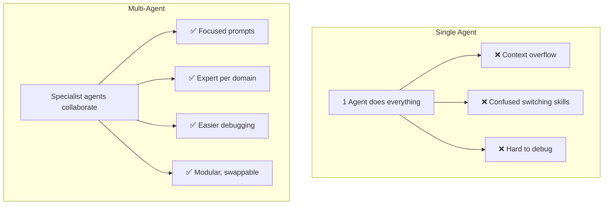
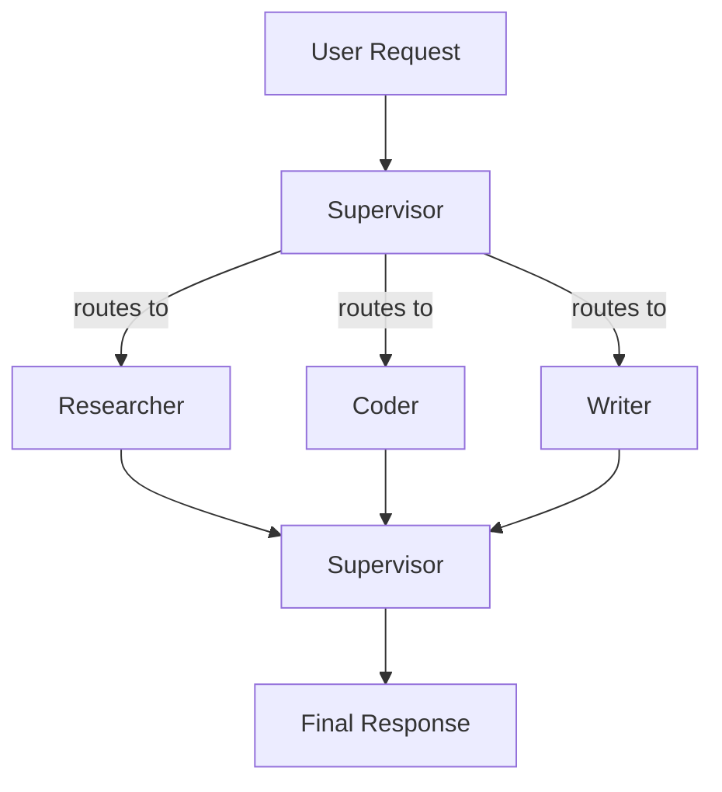

# 👥 Multi-Agent Systems — Deep Dive

> **Mục tiêu**: Orchestrate nhiều agents — patterns, frameworks, communication, cost control.
> Multi-agent = "team of specialists" vs "one generalist". Mạnh hơn cho complex tasks.

---

## 1. Why Multi-Agent?



| Aspect | Single Agent | Multi-Agent |
|--------|:----------:|:----------:|
| **Complexity** | Limited by 1 prompt | Distributed specialists |
| **Quality** | Jack of all trades | Expert per domain |
| **Debugging** | Hard (black box) | Easier (isolated agents) |
| **Cost** | Lower (1 LLM call/step) | Higher (N agents × calls) |
| **Latency** | Lower (1 call chain) | Higher (orchestration overhead) |
| **Reliability** | Single point of failure | Redundancy possible |

---

## 2. Orchestration Patterns

### 2.1 Supervisor Pattern



```python
from langgraph.graph import StateGraph, START, END
from typing import TypedDict, Annotated
from operator import add

class MultiAgentState(TypedDict):
    messages: Annotated[list, add]
    current_agent: str
    results: dict
    iteration: int

def supervisor(state: MultiAgentState) -> dict:
    """Route to appropriate specialist based on task analysis."""
    user_request = state["messages"][-1].content
    
    routing = llm.invoke(f"""Given this request, which specialist should handle it?
    
    Options:
    - researcher: finding information, data gathering, fact-checking
    - coder: writing code, debugging, technical implementation
    - writer: writing documents, reports, summaries, editing
    - analyst: data analysis, comparisons, evaluation
    
    If multiple agents needed, pick the FIRST one to start.
    
    Request: {user_request}
    
    Respond with just the agent name.""")
    
    return {"current_agent": routing.content.strip().lower()}

def researcher_agent(state: MultiAgentState) -> dict:
    result = llm.invoke(
        f"As a senior research specialist with deep domain expertise, "
        f"investigate thoroughly: {state['messages'][-1].content}"
    )
    return {
        "results": {**state.get("results", {}), "research": result.content},
        "messages": [AIMessage(content=f"[Researcher]: {result.content}")]
    }

def coder_agent(state: MultiAgentState) -> dict:
    # Coder has access to previous research context
    context = state.get("results", {}).get("research", "")
    result = llm.invoke(
        f"As a senior software engineer, implement the following. "
        f"Context from research: {context}\n\n"
        f"Task: {state['messages'][-1].content}"
    )
    return {
        "results": {**state.get("results", {}), "code": result.content},
        "messages": [AIMessage(content=f"[Coder]: {result.content}")]
    }

def router(state: MultiAgentState) -> str:
    """Route to next agent or finish."""
    agent = state.get("current_agent", "")
    if agent == "researcher": return "researcher"
    elif agent == "coder": return "coder"
    elif agent == "writer": return "writer"
    else: return END

# Build graph
graph = StateGraph(MultiAgentState)
graph.add_node("supervisor", supervisor)
graph.add_node("researcher", researcher_agent)
graph.add_node("coder", coder_agent)
graph.add_node("writer", writer_agent)

graph.add_edge(START, "supervisor")
graph.add_conditional_edges("supervisor", router)
graph.add_edge("researcher", END)
graph.add_edge("coder", END)
graph.add_edge("writer", END)

app = graph.compile()
```

### 2.2 Sequential Pipeline

```
[Researcher] → [Analyst] → [Writer] → [Reviewer] → [Output]
Each agent passes results to the next.

Best for: content creation, report generation, code review pipelines
```

```python
def build_pipeline():
    graph = StateGraph(PipelineState)
    
    graph.add_node("research", researcher_agent)
    graph.add_node("analyze", analyst_agent)
    graph.add_node("write", writer_agent)
    graph.add_node("review", reviewer_agent)
    
    # Linear chain — each depends on previous
    graph.add_edge(START, "research")
    graph.add_edge("research", "analyze")
    graph.add_edge("analyze", "write")
    graph.add_edge("write", "review")
    graph.add_edge("review", END)
    
    return graph.compile()
```

### 2.3 Debate / Adversarial Pattern

```
[Agent A — Pro]  ←→  [Agent B — Con]
         ↓                    ↓
    [Judge Agent] → selects best argument → [Final Answer]

Best for: decision-making, fact-checking, reducing hallucination
```

```python
async def debate(topic: str, rounds: int = 3) -> str:
    pro_history = []
    con_history = []
    
    for r in range(rounds):
        # Pro argues
        pro = await llm.ainvoke(
            f"Argue IN FAVOR of: {topic}\n"
            f"Previous counter-arguments: {con_history}\n"
            f"Round {r+1}/{rounds}. Be specific and evidence-based."
        )
        pro_history.append(pro.content)
        
        # Con argues
        con = await llm.ainvoke(
            f"Argue AGAINST: {topic}\n"
            f"Previous arguments: {pro_history}\n"
            f"Round {r+1}/{rounds}. Challenge with evidence."
        )
        con_history.append(con.content)
    
    # Judge evaluates
    verdict = await llm.ainvoke(
        f"As an impartial judge, evaluate this debate on: {topic}\n\n"
        f"Pro arguments: {pro_history}\n\n"
        f"Con arguments: {con_history}\n\n"
        f"Provide a balanced verdict with reasoning."
    )
    return verdict.content
```

### 2.4 Map-Reduce (Parallel Processing)

```
       ┌── [Agent 1: Process Chunk 1] ──┐
Input →├── [Agent 2: Process Chunk 2] ──├→ [Reducer: Combine] → Output
       └── [Agent 3: Process Chunk 3] ──┘

Best for: large document analysis, batch processing, summarization
```

```python
import asyncio

async def map_reduce(documents: list[str], question: str) -> str:
    # MAP: process each document in parallel
    async def process_one(doc: str) -> str:
        return (await llm.ainvoke(
            f"Extract key information relevant to: {question}\n\nDocument: {doc}"
        )).content
    
    summaries = await asyncio.gather(*[process_one(doc) for doc in documents])
    
    # REDUCE: combine all summaries
    combined = "\n\n".join(summaries)
    final = await llm.ainvoke(
        f"Synthesize these summaries into a comprehensive answer.\n"
        f"Question: {question}\n\nSummaries:\n{combined}"
    )
    return final.content
```

---

## 3. CrewAI Framework

```python
from crewai import Agent, Task, Crew, Process

# ── Define specialist agents ──
researcher = Agent(
    role="Senior Research Analyst",
    goal="Find the latest and most relevant AI trends and data",
    backstory="You are a seasoned researcher with 10 years in AI/ML. "
              "You excel at finding credible sources and synthesizing information.",
    tools=[search_tool, arxiv_tool],
    llm="gpt-4o",
    verbose=True,
    max_iter=5,         # Limit tool iterations
    allow_delegation=True,  # Can ask other agents for help
)

writer = Agent(
    role="Technical Writer",
    goal="Write clear, engaging technical content based on research",
    backstory="Skilled writer who makes complex topics accessible. "
              "You never sacrifice accuracy for readability.",
    llm="gpt-4o-mini",  # Cheaper model for writing
    verbose=True,
)

reviewer = Agent(
    role="Quality Reviewer",
    goal="Ensure accuracy, completeness, and clarity",
    backstory="Meticulous editor with expertise in AI. "
              "You catch factual errors and suggest improvements.",
    llm="gpt-4o",  # Smart model for review
    verbose=True,
)

# ── Define tasks with dependencies ──
research_task = Task(
    description="Research the current state of RAG systems in production. "
                "Focus on: chunking strategies, reranking, and evaluation.",
    expected_output="Comprehensive summary with citations",
    agent=researcher,
)

writing_task = Task(
    description="Write a 1500-word blog post about RAG systems "
                "based on the research findings.",
    expected_output="Blog post with examples and best practices",
    agent=writer,
    context=[research_task],  # Depends on research
)

review_task = Task(
    description="Review the blog post for factual accuracy, "
                "clarity, and completeness. Apply corrections.",
    expected_output="Final reviewed blog post",
    agent=reviewer,
    context=[writing_task],
)

# ── Create and run crew ──
crew = Crew(
    agents=[researcher, writer, reviewer],
    tasks=[research_task, writing_task, review_task],
    process=Process.sequential,     # or Process.hierarchical
    verbose=True,
    max_rpm=20,                     # Rate limit API calls
    memory=True,                    # Enable shared memory
)

result = crew.kickoff()
```

---

## 4. Communication Patterns

```python
# ── Pattern 1: Shared State (most common, LangGraph default) ──
# All agents read/write to shared state dictionary
state["research_findings"] = "..."  # Agent A writes
context = state["research_findings"]  # Agent B reads
# ✅ Simple, consistent  ❌ Potential conflicts

# ── Pattern 2: Message Passing (direct agent-to-agent) ──
messages = [
    {"from": "researcher", "to": "writer", "content": "Here are findings..."},
    {"from": "writer", "to": "reviewer", "content": "Please review draft..."},
]
# ✅ Clear provenance  ❌ Complex routing

# ── Pattern 3: Blackboard (central knowledge base) ──
blackboard = {
    "facts": [],        # Verified facts
    "hypotheses": [],   # Unverified claims
    "conclusions": [],  # Final conclusions
    "artifacts": [],    # Generated content
}
# Each agent reads blackboard, contributes, then next agent reads
# ✅ Rich knowledge sharing  ❌ Can get cluttered

# ── Pattern 4: Event-driven (pub/sub) ──
# Agents subscribe to events, react when relevant events fire
# ✅ Loosely coupled  ❌ Harder to debug
```

---

## 5. Cost & Performance

| Pattern | LLM Calls | Latency | Quality | Cost Estimate |
|---------|:---------:|:-------:|:-------:|:-------------|
| **Single Agent** | 1-5 | ⚡ Low | ⭐⭐ | $0.01-0.05 |
| **Supervisor (3)** | 5-15 | ⚡⚡ Medium | ⭐⭐⭐ | $0.05-0.20 |
| **Pipeline (4)** | 8-20 | ⚡⚡⚡ High | ⭐⭐⭐⭐ | $0.10-0.40 |
| **Debate (2×3)** | 6-12 | ⚡⚡ Medium | ⭐⭐⭐⭐ | $0.08-0.25 |
| **Map-Reduce** | N+1 | ⚡ Parallel | ⭐⭐⭐ | $0.02-0.10/doc |

### Cost Optimization Strategies

```python
# 1. Tiered models — cheap for simple, expensive for complex
researcher = Agent(llm="gpt-4o")        # Need intelligence
writer = Agent(llm="gpt-4o-mini")       # Just writing
formatter = Agent(llm="gpt-4o-mini")    # Simple formatting

# 2. Caching — don't repeat identical agent calls
from functools import lru_cache
@lru_cache(maxsize=1000)
def cached_research(query: str) -> str:
    return researcher.run(query)

# 3. Early termination — stop when quality sufficient
if confidence_score > 0.95:
    return result  # Don't run reviewer

# 4. Batch processing — accumulate, process together
# Instead of 10 individual agent calls → 1 batched call
```

---

## 6. When to Use Multi-Agent?

```
✅ USE Multi-Agent when:
  • Complex task with distinct subtasks (research + code + review)
  • Different skills needed (writing ≠ coding ≠ analysis)
  • Quality matters more than cost/speed
  • Task benefits from "second opinion" (debate pattern)
  
❌ DON'T USE when:
  • Simple query → single agent sufficient
  • Latency critical → multi-agent adds 2-5x overhead
  • Cost sensitive → N× more LLM calls
  • Task is atomic (single step, no decomposition)

Rule of thumb: 
  If task takes <1 prompt to solve → single agent
  If task needs >3 distinct skills → multi-agent
```

---

## 🎯 Interview Tips — Chi Tiết

### Q1: "Multi-agent khi nào?"
**A**: When task has distinct subtasks requiring different skills. E.g., research + analysis + writing. Each agent = specialist with focused prompt. Overkill for simple Q&A.

### Q2: "CrewAI vs LangGraph?"
**A**: CrewAI: role-based, simple setup, good for content pipelines. LangGraph: graph-based, more flexible control flow, better for complex state management. CrewAI = high-level, LangGraph = low-level.

### Q3: "Agent communication patterns?"
**A**: (1) Shared state: most common (LangGraph), simple. (2) Message passing: explicit routing, clear provenance. (3) Blackboard: central knowledge base, all agents contribute. (4) Event-driven: loosely coupled, reactive.

### Q4: "Cost control multi-agent?"
**A**: (1) Tiered models (cheap for simple agents). (2) Cache repeated queries. (3) Early termination when quality sufficient. (4) Limit iterations (`max_iter`). (5) Monitor token usage per agent.

### Q5: "Supervisor vs Pipeline?"
**A**: Supervisor: dynamic routing, good when task type varies. Pipeline: fixed sequence, good when workflow is always the same (research→write→review). Supervisor = flexible, Pipeline = predictable.

### Q6: "Map-Reduce for agents?"
**A**: Process N documents in parallel (map) → combine results (reduce). Great for large document analysis. Latency = max(single agent) instead of sum. Cost = N+1 calls.

### Q7: "Debugging multi-agent?"
**A**: (1) Log every agent input/output. (2) Trace which agent produced which result. (3) Test agents in isolation first. (4) Use `verbose=True` during development. (5) Compare single-agent vs multi-agent quality.
