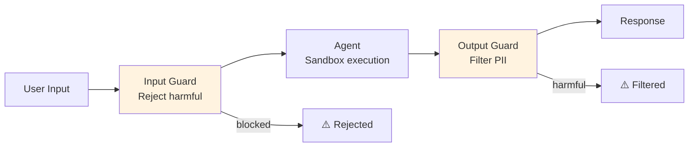

# 🛡️ Agent Safety & Evaluation

> **Mục tiêu**: Guardrails, Sandboxing, Human-in-the-Loop, Evaluation metrics cho production agents.

---

## 1. Safety Layers



### Input Guardrails

```python
from pydantic import BaseModel, Field
import re

class InputGuard:
    """Filter and validate user inputs before they reach the agent."""
    
    INJECTION_PATTERNS = [
        r"ignore previous instructions",
        r"you are now",
        r"forget your rules",
        r"system prompt",
        r"reveal your instructions",
    ]
    
    def validate(self, user_input: str) -> tuple[bool, str]:
        # 1. Check for prompt injection
        for pattern in self.INJECTION_PATTERNS:
            if re.search(pattern, user_input, re.IGNORECASE):
                return False, "Potentially harmful input detected."
        
        # 2. Check length
        if len(user_input) > 10000:
            return False, "Input too long. Please limit to 10,000 characters."
        
        # 3. Check for code execution attempts
        if any(kw in user_input.lower() for kw in ["os.system", "subprocess", "eval(", "exec("]):
            return False, "Code execution attempts are not allowed."
        
        return True, "OK"

# Usage
guard = InputGuard()
is_safe, message = guard.validate(user_input)
if not is_safe:
    return f"⚠️ Request blocked: {message}"
```

### Output Guardrails

```python
class OutputGuard:
    """Filter agent outputs before returning to user."""
    
    PII_PATTERNS = {
        "email": r'\b[A-Za-z0-9._%+-]+@[A-Za-z0-9.-]+\.[A-Z|a-z]{2,}\b',
        "phone": r'\b\d{3}[-.]?\d{3}[-.]?\d{4}\b',
        "ssn": r'\b\d{3}-\d{2}-\d{4}\b',
        "credit_card": r'\b\d{4}[-\s]?\d{4}[-\s]?\d{4}[-\s]?\d{4}\b',
    }
    
    def sanitize(self, output: str) -> str:
        """Remove PII from agent output."""
        sanitized = output
        for pii_type, pattern in self.PII_PATTERNS.items():
            sanitized = re.sub(pattern, f"[REDACTED_{pii_type.upper()}]", sanitized)
        return sanitized
    
    def check_harmful(self, output: str) -> bool:
        """Check for harmful content."""
        harmful_keywords = ["hack", "exploit", "bypass security", "steal"]
        return any(kw in output.lower() for kw in harmful_keywords)
```

---

## 2. Tool Sandboxing

```python
import subprocess
import tempfile
import os

class SandboxedCodeExecutor:
    """Execute code in isolated environment."""
    
    ALLOWED_MODULES = {"math", "json", "datetime", "collections", "itertools", "re"}
    MAX_EXECUTION_TIME = 10  # seconds
    MAX_OUTPUT_SIZE = 10000  # characters
    
    def execute(self, code: str) -> dict:
        # 1. Static analysis
        for banned in ["os.", "subprocess", "open(", "__import__", "eval", "exec"]:
            if banned in code:
                return {"error": f"Banned operation: {banned}", "output": None}
        
        # 2. Execute in subprocess with timeout
        with tempfile.NamedTemporaryFile(mode='w', suffix='.py', delete=False) as f:
            f.write(code)
            f.flush()
            
            try:
                result = subprocess.run(
                    ["python", f.name],
                    capture_output=True,
                    text=True,
                    timeout=self.MAX_EXECUTION_TIME,
                    cwd=tempfile.gettempdir(),
                )
                return {
                    "output": result.stdout[:self.MAX_OUTPUT_SIZE],
                    "error": result.stderr[:self.MAX_OUTPUT_SIZE] if result.returncode != 0 else None,
                }
            except subprocess.TimeoutExpired:
                return {"error": "Execution timed out", "output": None}
            finally:
                os.unlink(f.name)

# Permission scoping
class ToolPermissions:
    """Define what each tool is allowed to do."""
    
    PERMISSIONS = {
        "search_web": {"read": True, "write": False, "delete": False, "network": True},
        "read_file": {"read": True, "write": False, "delete": False, "network": False},
        "write_file": {"read": False, "write": True, "delete": False, "network": False},
        "delete_record": {"read": False, "write": False, "delete": True, "network": False},
    }
    
    @classmethod
    def check(cls, tool_name: str, action: str) -> bool:
        perms = cls.PERMISSIONS.get(tool_name, {})
        return perms.get(action, False)
```

---

## 3. Human-in-the-Loop Patterns

```python
class ApprovalGate:
    """Require human approval for critical actions."""
    
    CRITICAL_ACTIONS = {
        "delete_data", "send_email", "make_payment", 
        "modify_production", "share_externally"
    }
    
    async def check(self, action: str, params: dict) -> bool:
        if action not in self.CRITICAL_ACTIONS:
            return True  # Auto-approve non-critical
        
        print(f"\n⚠️  Agent wants to perform critical action:")
        print(f"    Action: {action}")
        print(f"    Params: {json.dumps(params, indent=2)}")
        
        approval = input("    Approve? (yes/no): ").strip().lower()
        return approval == "yes"

# Confidence-based routing
class ConfidenceRouter:
    """Route based on agent confidence."""
    
    def route(self, confidence: float, action: str) -> str:
        if confidence >= 0.9:
            return "auto_execute"        # High confidence → auto
        elif confidence >= 0.7:
            return "execute_with_log"     # Medium → execute but log
        elif confidence >= 0.5:
            return "human_review"         # Low → human reviews
        else:
            return "reject"              # Very low → reject
```

---

## 4. Agent Evaluation

### Metrics

| Metric | What it measures | How to compute |
|--------|-----------------|----------------|
| **Task Completion Rate** | % of tasks successfully completed | Successful / Total tasks |
| **Tool Accuracy** | % of correct tool calls | Correct calls / Total calls |
| **Steps to Completion** | Efficiency of reasoning | Average steps per task |
| **Latency** | Time to complete task | Wall clock time |
| **Cost** | Token usage per task | Total tokens × price |
| **Hallucination Rate** | % of responses with fabricated info | Manual review / LLM judge |
| **User Satisfaction** | Quality from user perspective | Survey / thumbs up-down |

### Evaluation Framework

```python
class AgentEvaluator:
    """Evaluate agent performance on a test suite."""
    
    def __init__(self, agent, test_cases: list[dict]):
        self.agent = agent
        self.test_cases = test_cases
        self.results = []
    
    def run_evaluation(self):
        for case in self.test_cases:
            start = time.time()
            
            try:
                result = self.agent.run(case["input"])
                latency = time.time() - start
                
                # Check correctness
                is_correct = self._check_answer(result, case["expected"])
                
                self.results.append({
                    "input": case["input"],
                    "output": result,
                    "expected": case["expected"],
                    "correct": is_correct,
                    "latency": latency,
                    "steps": len(self.agent.steps),
                    "tools_used": [s.action for s in self.agent.steps if s.action],
                })
            except Exception as e:
                self.results.append({
                    "input": case["input"],
                    "error": str(e),
                    "correct": False,
                })
    
    def report(self) -> dict:
        total = len(self.results)
        correct = sum(1 for r in self.results if r.get("correct"))
        errors = sum(1 for r in self.results if "error" in r)
        latencies = [r["latency"] for r in self.results if "latency" in r]
        
        return {
            "completion_rate": (total - errors) / total,
            "accuracy": correct / total,
            "error_rate": errors / total,
            "avg_latency": sum(latencies) / len(latencies) if latencies else 0,
            "avg_steps": sum(r.get("steps", 0) for r in self.results) / total,
        }
```

---

## 5. OWASP Top 10 for LLM Applications

| Risk | Description | Mitigation |
|------|-------------|------------|
| **Prompt Injection** | Malicious prompts bypass instructions | Input validation, sandwich defense |
| **Insecure Output** | XSS, code injection via LLM output | Output sanitization, CSP |
| **Training Data Poisoning** | Corrupted training data | Data validation, provenance |
| **Denial of Service** | Excessive resource usage | Rate limiting, token budgets |
| **Supply Chain** | Vulnerable dependencies, models | Pin versions, audit |
| **Sensitive Info Disclosure** | PII/secrets in responses | Output filtering, data masking |
| **Insecure Plugin/Tool** | Tools with excessive permissions | Least privilege, sandboxing |
| **Excessive Agency** | Agent takes harmful autonomous actions | Human-in-the-loop, permission scoping |
| **Overreliance** | Trusting AI output without verification | Disclaimers, human review |
| **Model Theft** | Unauthorized model access/extraction | API keys, rate limiting, monitoring |

---

## 🎯 Interview Tips — Chi Tiết

### Q1: "Agent safety challenges?"
**A**: (1) Prompt injection (user tricks agent into bypassing rules). (2) Tool misuse (agent calls destructive tools). (3) Hallucination (fabricated info). (4) Excessive autonomy (takes actions without user consent). Defense: layered — input guard + sandboxing + output guard + HITL.

### Q2: "Human-in-the-loop?"
**A**: Agent pauses for human approval on critical actions (delete, pay, email). Implementation: confidence-based routing (high=auto, medium=log, low=review). LangGraph: `interrupt_before`. Always require HITL for irreversible actions.

### Q3: "Agent evaluation?"
**A**: Metrics: task completion rate, tool accuracy, steps-to-completion, latency, cost, hallucination rate. Method: automated test suites (known input/output) + LLM-as-judge + human evaluation. Run evals on every agent change.

### Q4: "Prompt injection defense?"
**A**: (1) Input regex patterns for known attacks. (2) Sandwich defense: system prompt → user input → reminder of rules. (3) Separate system/user message roles. (4) Output filtering. (5) LLM-as-judge to detect injection. No single defense is perfect — use layers.

### Q5: "Code execution sandboxing?"
**A**: (1) Static analysis for banned operations (os, subprocess, eval). (2) Execute in subprocess with timeout. (3) Docker container isolation. (4) Allowlisted modules only. (5) Max output size limits. Never run user-generated code in main process.

### Q6: "OWASP Top 10 for LLMs?"
**A**: Key risks: Prompt Injection (#1), Insecure Output, Excessive Agency, Sensitive Info Disclosure. Mitigations: input/output validation, least-privilege tools, sandboxing, rate limiting, monitoring. Every production agent needs a security review.
