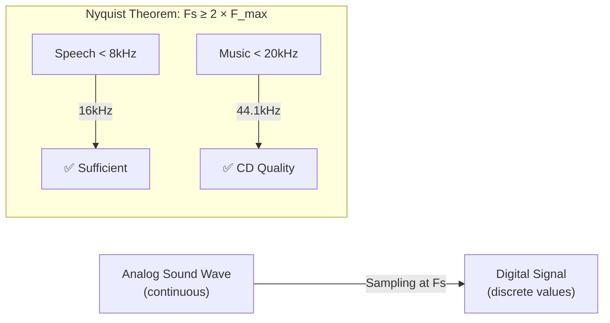
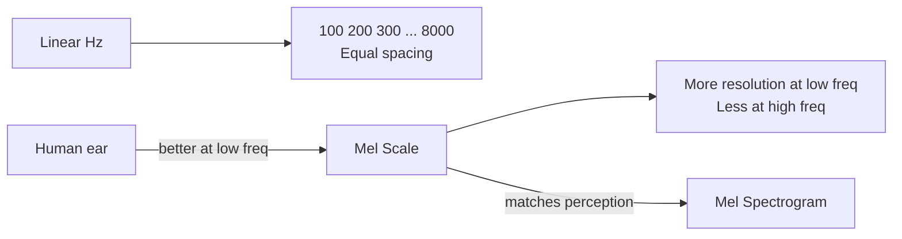
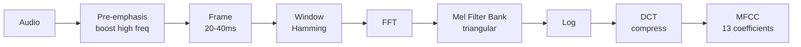

# 🎵 Audio Fundamentals

> **Mục tiêu**: Hiểu digital audio — sampling, spectrogram, MFCC, preprocessing cho speech AI.

---

## 1. Digital Audio Basics

### Sampling



| Sample Rate | Use Case | Quality |
|-------------|----------|---------|
| 8 kHz | Telephone | Minimal |
| 16 kHz | **Speech AI (standard)** | Good |
| 22 kHz | Podcasts | Better |
| 44.1 kHz | Music (CD) | High |
| 48 kHz | Video/Film | Professional |

### Bit Depth & Encoding

```python
import numpy as np

# 16-bit PCM: values from -32768 to 32767
# 32-bit float: values from -1.0 to 1.0 (preferred for processing)

# Load audio
import librosa
audio, sr = librosa.load("speech.wav", sr=16000)  # Mono, 16kHz, float32
print(f"Duration: {len(audio)/sr:.2f}s")
print(f"Shape: {audio.shape}")    # (num_samples,)
print(f"Range: [{audio.min():.3f}, {audio.max():.3f}]")
```

---

## 2. Time-Domain Features

```python
import librosa
import numpy as np

# Load audio
audio, sr = librosa.load("speech.wav", sr=16000)

# Zero Crossing Rate — voice activity detection
zcr = librosa.feature.zero_crossing_rate(audio)
print(f"ZCR shape: {zcr.shape}")
# Speech: ~50-100 crossings/frame. Silence: ~0-10

# RMS Energy — loudness
rms = librosa.feature.rms(y=audio)
print(f"RMS shape: {rms.shape}")
# High RMS = loud, Low RMS = quiet/silence

# Simple VAD (Voice Activity Detection)
def simple_vad(audio, sr, threshold=0.02, frame_length=2048, hop_length=512):
    """Detect speech frames based on RMS energy."""
    rms = librosa.feature.rms(y=audio, frame_length=frame_length, hop_length=hop_length)[0]
    speech_frames = rms > threshold
    return speech_frames
```

---

## 3. Frequency-Domain: Spectrogram

```python
# Short-Time Fourier Transform (STFT)
stft = librosa.stft(audio, n_fft=2048, hop_length=512, win_length=2048)
spectrogram = np.abs(stft)  # Magnitude spectrogram
print(f"STFT shape: {spectrogram.shape}")  # (n_freq_bins, n_time_frames)

# Mel Spectrogram — human perception scale
mel_spec = librosa.feature.melspectrogram(
    y=audio, sr=sr,
    n_mels=80,           # Number of Mel bands (80 standard for speech)
    n_fft=2048,
    hop_length=512,
    fmin=80,              # Min frequency
    fmax=8000,            # Max frequency for speech
)

# Log Mel Spectrogram (what most models use)
log_mel = librosa.power_to_db(mel_spec, ref=np.max)
print(f"Log Mel shape: {log_mel.shape}")  # (80, n_frames)
```

### Why Mel Scale?



> **Mel = logarithmic frequency scale** — more resolution where speech information is concentrated (low frequencies), less for high frequencies that humans can’t distinguish well.

---

## 4. MFCC (Mel-Frequency Cepstral Coefficients)

```python
# MFCC — compact representation of spectral envelope
mfcc = librosa.feature.mfcc(
    y=audio, sr=sr,
    n_mfcc=13,            # 13 coefficients (standard)
    n_mels=80,
    n_fft=2048,
    hop_length=512,
)
print(f"MFCC shape: {mfcc.shape}")  # (13, n_frames)

# Delta MFCC (first derivative — captures transitions)
mfcc_delta = librosa.feature.delta(mfcc)

# Delta-Delta (second derivative — acceleration)
mfcc_delta2 = librosa.feature.delta(mfcc, order=2)

# Stack all features
features = np.concatenate([mfcc, mfcc_delta, mfcc_delta2], axis=0)
print(f"Full features: {features.shape}")  # (39, n_frames)
```

### MFCC Pipeline



---

## 5. Audio Preprocessing

```python
# Pre-emphasis — boost high frequencies
def pre_emphasis(signal, coeff=0.97):
    return np.append(signal[0], signal[1:] - coeff * signal[:-1])

# Noise reduction (simple spectral subtraction)
import noisereduce as nr
reduced = nr.reduce_noise(y=audio, sr=sr, stationary=True)

# Normalize volume
def normalize_audio(audio):
    return audio / np.max(np.abs(audio))

# Trim silence
audio_trimmed, _ = librosa.effects.trim(audio, top_db=20)
print(f"Before trim: {len(audio)/sr:.2f}s → After: {len(audio_trimmed)/sr:.2f}s")

# Resample to target rate
audio_16k = librosa.resample(audio, orig_sr=44100, target_sr=16000)

# Convert stereo to mono
audio_mono = librosa.to_mono(audio_stereo)
```

---

## 6. Feature Comparison

| Feature | Dims | Use Case | Pros | Cons |
|---------|------|----------|------|------|
| **Raw Waveform** | 1 × T | End-to-end models | No info loss | Large, hard to train |
| **Spectrogram** | F × T | Visualization | Full frequency info | Large |
| **Mel Spectrogram** | 80 × T | **Modern ASR (Whisper)** | Human-perception aligned | Lossy |
| **MFCC** | 13-39 × T | Classic ASR, speaker ID | Compact, robust | Info loss |
| **Log Mel + ΔΔ** | 240 × T | Hybrid ASR | Rich features | Compute-heavy |

---

## 7. Audio Augmentation (Data Augmentation cho ASR)

```python
import torchaudio
import torch

# ── SpecAugment (Google, 2019) — Most important augmentation for ASR ──
# Apply AFTER converting to spectrogram
spec_augment = torch.nn.Sequential(
    torchaudio.transforms.FrequencyMasking(freq_mask_param=27),   # Mask frequency bands
    torchaudio.transforms.TimeMasking(time_mask_param=100),       # Mask time steps
)
# Randomly zeros out contiguous blocks → forces model to not rely on specific features

# ── Time Stretch (speed perturbation) ──
waveform, sr = torchaudio.load("speech.wav")
# Speed up 10%
fast = torchaudio.functional.speed(waveform, sr, factor=1.1)[0]
# Slow down 10%  
slow = torchaudio.functional.speed(waveform, sr, factor=0.9)[0]

# ── Additive Noise Injection ──
def add_noise(waveform: torch.Tensor, snr_db: float = 10.0) -> torch.Tensor:
    """Add white noise at specified SNR level."""
    noise = torch.randn_like(waveform)
    signal_power = waveform.norm(p=2)
    noise_power = noise.norm(p=2)
    snr = 10 ** (snr_db / 20)
    scale = signal_power / (snr * noise_power)
    return waveform + scale * noise

noisy = add_noise(waveform, snr_db=15)  # 15dB SNR (moderate noise)

# ── Pitch Shift (change voice pitch without speed change) ──
shifted = torchaudio.functional.pitch_shift(waveform, sr, n_steps=2)  # +2 semitones
```

```
When to use which augmentation:
├── SpecAugment      → ALWAYS (free, no quality loss, huge impact)
├── Speed perturbation → ALWAYS (0.9x-1.1x, simulates speaking pace)
├── Noise injection   → When training data is clean but prod is noisy
├── Pitch shift       → When model needs to handle diverse speakers
└── Room impulse      → When deployment includes reverberant environments
```

---

## 8. Mel Spectrogram — Visualization

```python
import librosa
import librosa.display
import matplotlib.pyplot as plt
import numpy as np

audio, sr = librosa.load("speech.wav", sr=16000)

fig, axes = plt.subplots(3, 1, figsize=(12, 10))

# 1. Waveform
axes[0].set_title("Waveform")
librosa.display.waveshow(audio, sr=sr, ax=axes[0])

# 2. Spectrogram (linear frequency)
D = librosa.stft(audio, n_fft=1024, hop_length=256)
S_db = librosa.amplitude_to_db(np.abs(D), ref=np.max)
librosa.display.specshow(S_db, sr=sr, hop_length=256, x_axis="time", y_axis="hz", ax=axes[1])
axes[1].set_title("Spectrogram (Linear)")

# 3. Mel Spectrogram (human perception scale)
mel = librosa.feature.melspectrogram(y=audio, sr=sr, n_mels=80, n_fft=1024, hop_length=256)
mel_db = librosa.power_to_db(mel, ref=np.max)
librosa.display.specshow(mel_db, sr=sr, hop_length=256, x_axis="time", y_axis="mel", ax=axes[2])
axes[2].set_title("Mel Spectrogram (80 bands) — Whisper Input")

plt.tight_layout()
plt.savefig("spectrogram_comparison.png", dpi=150)
```

```
Why Mel scale?
  Human hearing is LOGARITHMIC:
  - We easily distinguish 100Hz vs 200Hz (1 octave)
  - We barely distinguish 8000Hz vs 8100Hz (same 100Hz gap)
  
  Mel scale compresses high frequencies → matches human perception
  → ASR models learn more efficiently with Mel features
```

---

## 🎯 Interview Tips — Chi Tiết

### Q1: "Tại sao 16kHz cho speech?"
**A**: Speech content < 8kHz. Nyquist: 16kHz captures up to 8kHz. Higher sample rate = unnecessary data, larger files, slower processing. 16kHz is the universal standard for ASR (Whisper, wav2vec2, etc.).

### Q2: "Mel Spectrogram vs MFCC?"
**A**: Mel spec: raw frequency info, keeps temporal detail, used by modern DL models (Whisper, wav2vec2). MFCC: compressed (13 dims vs 80), removes fine detail, better for traditional ML (GMM-HMM). Modern trend: Mel spec + neural network.

### Q3: "Pre-emphasis tại sao?"
**A**: High frequencies carry consonant info (s, t, k) nhưng lower energy than vowels. Pre-emphasis filter `y[n] = x[n] - 0.97·x[n-1]` boosts high freq → flatten spectrum → better recognition. Most modern models handle this internally.

### Q4: "VAD dùng làm gì?"
**A**: Voice Activity Detection — detect speech vs silence segments. Use: (1) Skip silence → reduce processing → save cost. (2) Smart chunking for streaming ASR. (3) Trigger recording. Simple: RMS energy threshold. Production: Silero VAD (neural).

### Q5: "Spectrogram và STFTlà gì?"
**A**: STFT = Short-Time Fourier Transform. Slide a window (20-40ms) over audio, compute FFT for each frame → frequency content over time. Spectrogram = |STFT|² visualized as heatmap. Parameters: n_fft (frequency resolution), hop_length (time resolution).

### Q6: "Audio preprocessing pipeline cho production?"
**A**: (1) Resample to 16kHz. (2) Convert stereo → mono. (3) Normalize volume. (4) Noise reduction. (5) Trim silence (librosa.effects.trim). (6) Validate: check duration, SNR, clipping. Order matters — normalize before noise reduction.
