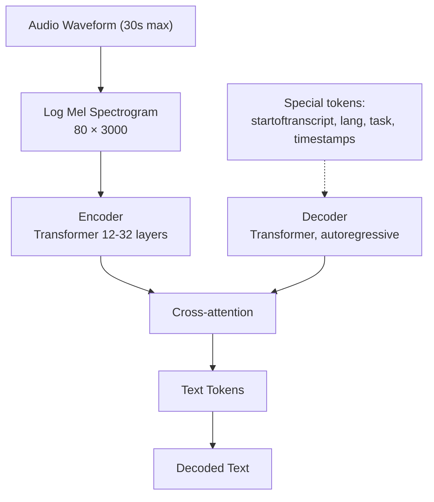

# 🎤 ASR — Speech-to-Text

> **Mục tiêu**: Whisper, faster-whisper, Streaming ASR, Word-level timestamps, WER evaluation.

---

## 1. Whisper Architecture



### Whisper Models

| Model | Params | VRAM | Speed | WER (en) | Best for |
|-------|--------|------|-------|----------|----------|
| tiny | 39M | 1 GB | ~32x RT | 10% | Edge, mobile |
| base | 74M | 1 GB | ~16x RT | 7% | Quick demos |
| small | 244M | 2 GB | ~6x RT | 5% | Balanced |
| medium | 769M | 5 GB | ~2x RT | 4% | Quality |
| large-v3 | 1.55B | 10 GB | ~1x RT | 3% | **Best accuracy** |
| turbo | 809M | 6 GB | ~8x RT | 3.5% | **Best speed/quality** |

---

## 2. OpenAI Whisper

```python
import whisper

# Load model
model = whisper.load_model("turbo")  # or "large-v3" for best quality

# Transcribe
result = model.transcribe(
    "audio.wav",
    language="vi",            # Force Vietnamese (faster, more accurate)
    task="transcribe",        # or "translate" (to English)
    fp16=True,                # Use FP16 on GPU
    temperature=0,            # Greedy decoding (most accurate)
    word_timestamps=True,     # Word-level timing
    initial_prompt="Cuộc họp về AI Engineering.",  # Context hint
)

print(result["text"])

# Word-level timestamps
for segment in result["segments"]:
    print(f"[{segment['start']:.1f}s - {segment['end']:.1f}s] {segment['text']}")
    if "words" in segment:
        for word in segment["words"]:
            print(f"  [{word['start']:.2f}s] {word['word']}")
```

---

## 3. Faster-Whisper (CTranslate2)

```python
from faster_whisper import WhisperModel

# 4x faster, less memory with CTranslate2
model = WhisperModel(
    "large-v3",
    device="cuda",
    compute_type="float16",    # or "int8" for even faster
)

segments, info = model.transcribe(
    "audio.wav",
    language="vi",
    beam_size=5,              # Beam search for better accuracy
    word_timestamps=True,
    vad_filter=True,          # Skip silence (faster + cleaner)
    vad_parameters=dict(
        threshold=0.5,
        min_speech_duration_ms=250,
        min_silence_duration_ms=500,
    ),
)

print(f"Language: {info.language} (prob: {info.language_probability:.2f})")
print(f"Duration: {info.duration:.1f}s")

for segment in segments:
    print(f"[{segment.start:.1f}s → {segment.end:.1f}s] {segment.text}")
```

### Performance Comparison

| Implementation | Speed (vs real-time) | VRAM (large-v3) | Notes |
|---------------|---------------------|-----------------|-------|
| OpenAI Whisper | ~1x RT | 10 GB | Original |
| **faster-whisper** | **~4x RT** | **~5 GB** | **CTranslate2, recommended** |
| whisper.cpp | ~4x RT | CPU-only | C++ port |
| whisperX | ~4x RT | ~5 GB | + word alignment |
| Distil-Whisper | ~6x RT | ~3 GB | Distilled, slight quality drop |

---

## 4. Streaming ASR

```python
# Real-time streaming with faster-whisper
import numpy as np
import queue
import sounddevice as sd

class StreamingASR:
    """Process audio in real-time chunks."""
    
    def __init__(self, model_size="base", chunk_duration=2.0):
        self.model = WhisperModel(model_size, device="cuda", compute_type="float16")
        self.chunk_duration = chunk_duration
        self.sr = 16000
        self.buffer = np.array([], dtype=np.float32)
    
    def process_chunk(self, audio_chunk: np.ndarray) -> str:
        """Process a single audio chunk."""
        self.buffer = np.concatenate([self.buffer, audio_chunk])
        
        # Process when buffer has enough data
        if len(self.buffer) >= self.sr * self.chunk_duration:
            segments, _ = self.model.transcribe(
                self.buffer,
                language="vi",
                vad_filter=True,
            )
            text = " ".join(s.text for s in segments)
            self.buffer = np.array([], dtype=np.float32)
            return text.strip()
        return ""
    
    def stream_from_microphone(self):
        """Stream from microphone (requires sounddevice)."""
        audio_queue = queue.Queue()
        
        def callback(indata, frames, time, status):
            audio_queue.put(indata.copy().flatten())
        
        with sd.InputStream(
            samplerate=self.sr,
            channels=1,
            dtype="float32",
            blocksize=int(self.sr * 0.5),  # 500ms chunks
            callback=callback,
        ):
            print("🎤 Listening... (Ctrl+C to stop)")
            while True:
                chunk = audio_queue.get()
                text = self.process_chunk(chunk)
                if text:
                    print(f"📝 {text}")
```

---

## 5. Evaluation: WER (Word Error Rate)

```python
from jiwer import wer, cer

reference = "xin chào tôi là AI engineer"
hypothesis = "xin chào tôi là AI engine"

# Word Error Rate
word_error = wer(reference, hypothesis)
print(f"WER: {word_error:.2%}")  # ~14% (1 error / 7 words)

# Character Error Rate (better for Vietnamese/CJK)
char_error = cer(reference, hypothesis)
print(f"CER: {char_error:.2%}")

# WER breakdown
# WER = (Substitutions + Insertions + Deletions) / Total Reference Words
# S=1 (engine→engineer), I=0, D=0 → WER = 1/6 = 16.7%
```

---

## 6. VAD + Streaming Pipeline

```python
# ── Silero VAD (Voice Activity Detection) ──
# Detect when someone is speaking → only transcribe speech segments
import torch

model_vad, utils = torch.hub.load("snakers4/silero-vad", "silero_vad")
(get_speech_timestamps, _, read_audio, *_) = utils

audio = read_audio("meeting.wav", sampling_rate=16000)
timestamps = get_speech_timestamps(audio, model_vad, sampling_rate=16000)
# [{"start": 0, "end": 48000}, {"start": 64000, "end": 128000}, ...]
# Only these segments contain speech → skip silence

# ── Streaming Transcription Pipeline ──
from faster_whisper import WhisperModel
import numpy as np

class StreamingTranscriber:
    """Real-time transcription with VAD + faster-whisper."""
    
    def __init__(self, model_size="base"):
        self.model = WhisperModel(model_size, device="cuda", compute_type="float16")
        self.vad_model, self.vad_utils = torch.hub.load("snakers4/silero-vad", "silero_vad")
        self.buffer = np.array([], dtype=np.float32)
        self.CHUNK_DURATION = 3.0   # Process every 3 seconds
        self.SR = 16000
    
    def process_chunk(self, audio_chunk: np.ndarray) -> str | None:
        """Feed audio chunks, get text when speech detected."""
        self.buffer = np.concatenate([self.buffer, audio_chunk])
        
        if len(self.buffer) < self.CHUNK_DURATION * self.SR:
            return None  # Not enough audio yet
        
        # Check VAD
        tensor = torch.from_numpy(self.buffer)
        timestamps = self.vad_utils[0](tensor, self.vad_model, sampling_rate=self.SR)
        
        if not timestamps:
            self.buffer = np.array([], dtype=np.float32)
            return None  # No speech detected
        
        # Transcribe speech segments
        segments, _ = self.model.transcribe(self.buffer, language="vi", beam_size=3)
        text = " ".join(seg.text for seg in segments)
        
        self.buffer = np.array([], dtype=np.float32)
        return text.strip() if text.strip() else None
```

---

## 7. WER Breakdown Analysis

```python
from jiwer import process_words

reference = "the quick brown fox jumps over the lazy dog"
hypothesis = "the quick brown box jumped over a lazy dog"

output = process_words(reference, hypothesis)

print(f"WER: {output.wer:.2%}")
print(f"Substitutions: {output.substitutions}")  # fox→box, jumps→jumped, the→a
print(f"Insertions:    {output.insertions}")      # Extra words in hypothesis
print(f"Deletions:     {output.deletions}")        # Missing words in hypothesis

# Detailed alignment
for chunk in output.alignments[0]:
    print(f"  {chunk.type}: ref='{chunk.ref_start_idx}' hyp='{chunk.hyp_start_idx}'")

# ── Common ASR Error Patterns ──
# 1. Homophones: "their/there/they're" → context-dependent
# 2. Named entities: proper nouns not in vocabulary
# 3. Numbers: "2024" vs "twenty twenty-four"
# 4. Code-switching: mixing languages mid-sentence
# 5. Background noise: substitutions increase with SNR decrease
```

```
WER Benchmarks (English, clean speech):
  Whisper large-v3:  ~3%
  Whisper turbo:     ~3.5%
  Human professional: ~4% (yes, Whisper beats humans!)
  
WER Benchmarks (Vietnamese):
  Whisper large-v3:  ~8-12% (depends on accent/domain)
  With initial_prompt: ~6-9% (context helps!)
```

---

## 🎯 Interview Tips — Chi Tiết

### Q1: "Whisper architecture?"
**A**: Encoder-decoder Transformer. Input: 30s log Mel spectrogram (80×3000). Encoder: 12-32 layers (depends on size). Decoder: autoregressive, generates text tokens. Multitask: transcribe (ASR), translate (to English), timestamp. Trained on 680K hours web audio.

### Q2: "faster-whisper tại sao nhanh hơn?"
**A**: CTranslate2 backend: INT8/FP16 quantization, efficient batching, optimized C++ kernels. ~4x faster, 50% less VRAM vs original Whisper. Same accuracy. Production standard.

### Q3: "Streaming ASR challenges?"
**A**: (1) Boundary words split across chunks. (2) Latency vs accuracy tradeoff (larger chunk = better accuracy, more delay). (3) Need VAD for smart chunking (don’t cut mid-word). (4) Endpointing: detect when user finishes speaking.

### Q4: "WER vs CER?"
**A**: WER: word-level errors (S+I+D)/N. CER: character-level. CER better for agglutinative/tonal languages (Vietnamese, Chinese, Japanese) where word boundaries are ambiguous. English: WER standard. Vietnamese: report both.

### Q5: "Whisper limitations?"
**A**: (1) Max 30s chunks (must split longer audio). (2) Hallucination on silence/noise (generates text for empty audio). (3) No native streaming. (4) ~100 languages but quality varies. Fix: VAD filter, prompt conditioning, faster-whisper.

### Q6: "Whisper initial_prompt dùng bao giờ?"
**A**: Provide context to guide transcription. Use for: (1) Domain-specific vocabulary ("AI Engineering", "PyTorch"). (2) Expected language/style. (3) Proper nouns. DO NOT include hallucinated text. Limit to 1-2 sentences.
