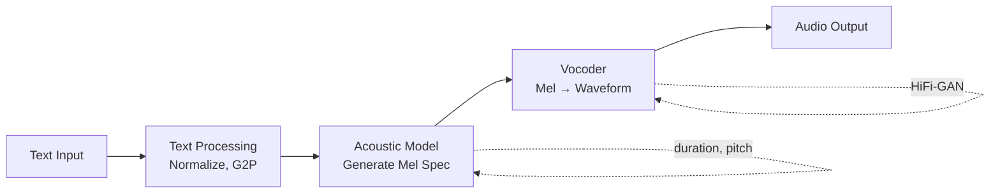

# 🔊 TTS — Text-to-Speech

> **Mục tiêu**: Tổng hợp giọng nói — F5-TTS, Bark, XTTS, Voice Cloning, Prosody Control.

---

## 1. TTS Pipeline



### Modern TTS Evolution

| Generation | Models | Approach | Quality |
|-----------|--------|----------|---------|
| **1st** | Festival, eSpeak | Concatenative, rule-based | Robotic |
| **2nd** | Tacotron 2, FastSpeech | Seq2seq + vocoder | Natural |
| **3rd** | VITS, YourTTS | End-to-end, zero-shot | Very natural |
| **4th** | **F5-TTS, XTTS, Bark** | LLM-based, diffusion | Human-like |

---

## 2. F5-TTS (State-of-the-Art 2025)

```python
# pip install f5-tts
from f5_tts.api import F5TTS

model = F5TTS()

# Basic synthesis
audio, sr = model.infer(
    ref_file="reference_voice.wav",    # 5-15s reference audio
    ref_text="Xin chào, tôi là AI.",   # Text matching reference audio
    gen_text="Đây là giọng nói tổng hợp bằng F5-TTS.",  # Text to speak
    seed=-1,                            # Random seed
)

# F5-TTS advantages:
# - Zero-shot voice cloning (5s reference enough)
# - 24kHz output, natural prosody
# - Supports Vietnamese
# - Streaming capable
# - Open source
```

### Voice Cloning Workflow

```python
# 1. Choose reference audio
#    - 5-15 seconds of clear speech
#    - Low background noise
#    - Natural speaking pace

# 2. Provide matching text
ref_audio = "reference_speaker.wav"
ref_text = "Content of the reference audio"

# 3. Generate new speech in that voice
gen_text = "Any new text you want this voice to say"

audio, sr = model.infer(
    ref_file=ref_audio,
    ref_text=ref_text,
    gen_text=gen_text,
)

# Save output
import soundfile as sf
sf.write("output.wav", audio, sr)
```

---

## 3. Bark (Suno)

```python
from bark import SAMPLE_RATE, generate_audio, preload_models
from scipy.io.wavfile import write as write_wav

# Preload models
preload_models()

# Generate speech
text = """
Hello, my name is AI assistant. [laughs] 
I can also express emotions! 
Let me think about that... [sighs]
"""

audio_array = generate_audio(text)
write_wav("bark_output.wav", SAMPLE_RATE, audio_array)

# Bark special features:
# - Non-speech sounds: [laughs], [sighs], [music], [clears throat]
# - Multilingual (13+ languages)
# - Music generation
# - No reference audio needed (uses speaker presets)
```

---

## 4. Coqui XTTS v2

```python
from TTS.api import TTS

# XTTS v2 — cross-lingual voice cloning
tts = TTS("tts_models/multilingual/multi-dataset/xtts_v2", gpu=True)

# Clone voice cross-lingually
tts.tts_to_file(
    text="This is my cloned voice speaking English",
    speaker_wav="vietnamese_speaker.wav",  # Vietnamese reference
    language="en",                          # Output in English!
    file_path="output.wav",
)

# Supported: 17 languages including Vietnamese
# Features: cross-lingual cloning, streaming, fine-tuning
```

---

## 5. TTS Evaluation Metrics

| Metric | What it measures | Method |
|--------|-----------------|--------|
| **MOS** (Mean Opinion Score) | Naturalness (1-5) | Human evaluation |
| **PESQ** | Perceptual quality | Automated, needs reference |
| **Speaker Similarity** | Voice match | Cosine similarity of speaker embeddings |
| **Intelligibility** | Can you understand? | ASR on output → compare with input text |
| **Prosody** | Rhythm, intonation | Pitch variance, duration analysis |

```python
# Automated intelligibility check
def check_intelligibility(tts_audio_path: str, expected_text: str) -> float:
    """Transcribe TTS output and compare with input text."""
    from jiwer import wer
    
    # Transcribe TTS output
    result = whisper_model.transcribe(tts_audio_path)
    
    # Compare with expected
    error_rate = wer(expected_text, result["text"])
    intelligibility = 1 - error_rate
    return intelligibility

# Speaker similarity check
def speaker_similarity(ref_audio: str, gen_audio: str) -> float:
    """Compare speaker identity between reference and generated audio."""
    from resemblyzer import VoiceEncoder, preprocess_wav
    
    encoder = VoiceEncoder()
    ref_embed = encoder.embed_utterance(preprocess_wav(ref_audio))
    gen_embed = encoder.embed_utterance(preprocess_wav(gen_audio))
    
    similarity = np.dot(ref_embed, gen_embed)
    return similarity  # 0-1, higher = more similar
```

---

## 6. Prosody Control

```python
# SSML (Speech Synthesis Markup Language)
ssml_text = """
<speak>
    <prosody rate="slow" pitch="+2st">
        Welcome to the meeting.
    </prosody>
    <break time="500ms"/>
    <emphasis level="strong">
        This is very important.
    </emphasis>
    <prosody rate="fast">
        Let me quickly summarize the key points.
    </prosody>
</speak>
"""

# Emotion control (Bark)
emotional_text = """
I'm so excited about this project! [laughs]
But we also need to be careful... [sighs]
Let's do this! [cheers]
"""
```

---

## 7. SSML — Speech Synthesis Markup Language

```xml
<!-- SSML cho fine-grained control over TTS output -->
<speak>
  <!-- Pauses -->
  Welcome to our platform. <break time="500ms"/>
  Let me help you with that.
  
  <!-- Speed and pitch -->
  <prosody rate="slow" pitch="+10%">
    This is important information.
  </prosody>
  
  <!-- Emphasis -->
  You need to pay <emphasis level="strong">exactly</emphasis> $100.
  
  <!-- Say-as (force pronunciation) -->
  Your order number is <say-as interpret-as="characters">ABC123</say-as>.
  The date is <say-as interpret-as="date" format="mdy">12/25/2025</say-as>.
  
  <!-- Phone numbers -->
  Call us at <say-as interpret-as="telephone">+84-123-456-789</say-as>.
</speak>
```

```python
# ── Google Cloud TTS with SSML ──
from google.cloud import texttospeech

client = texttospeech.TextToSpeechClient()

ssml = """<speak>
  <prosody rate="medium" pitch="-2st">
    Xin chào, <break time="300ms"/> tôi là trợ lý AI.
  </prosody>
</speak>"""

response = client.synthesize_speech(
    input=texttospeech.SynthesisInput(ssml=ssml),
    voice=texttospeech.VoiceSelectionParams(
        language_code="vi-VN",
        name="vi-VN-Neural2-A",
    ),
    audio_config=texttospeech.AudioConfig(
        audio_encoding=texttospeech.AudioEncoding.MP3,
        speaking_rate=1.0,
    ),
)
```

```
When to use SSML vs plain text:
├── Plain text    → 90% of use cases (TTS models handle prosody well)
├── SSML pauses   → Call center IVR, precise timing needed
├── SSML prosody  → Emphasize key info (prices, dates, names)
└── SSML say-as   → Numbers, codes, phone numbers, acronyms
```

---

## 8. Voice Cloning — Ethics & Limitations

```
Technical Capabilities (2025):
├── Few-shot cloning: 10-30s of reference audio → decent clone
├── Zero-shot: some models clone from text description (experimental)
├── Quality: 3-5 minutes → near-indistinguishable from original
└── Limitations: emotions, whispering, singing still difficult

Ethical Considerations:
├── ⚖️ Legal: Many jurisdictions require CONSENT of voice owner
├── 🛡️ Deepfake laws: EU AI Act classifies voice cloning as "high risk"
├── 📋 Best practices:
│   ├── Always obtain explicit written consent
│   ├── Watermark generated audio (encode metadata in waveform)
│   ├── Disclose to listeners that voice is AI-generated
│   └── Don't clone public figures without authorization
├── 🔍 Detection methods:
│   ├── Neural audio forensics (trained classifiers)
│   ├── Spectral analysis (artifacts in high frequencies)
│   └── Watermark verification (if embedded)
└── 🚫 Red lines:
    ├── Voice phishing (vishing) attacks
    ├── Non-consensual impersonation
    └── Misleading news/propaganda
```

---

## 🎯 Interview Tips — Chi Tiết

### Q1: "TTS pipeline?"
**A**: Text → Normalize (numbers, abbreviations) → G2P (grapheme to phoneme) → Acoustic Model (generate Mel spectrogram with duration/pitch) → Vocoder (Mel → waveform, e.g., HiFi-GAN). Modern end-to-end models (VITS, F5-TTS) combine all steps.

### Q2: "Voice cloning ethical concerns?"
**A**: Risks: deepfakes, impersonation, fraud. Mitigations: (1) Audio watermarking (embed invisible marker). (2) Consent requirements before cloning. (3) Detection models (AI-generated speech classifier). (4) Legal frameworks (EU AI Act).

### Q3: "F5-TTS vs XTTS?"
**A**: F5-TTS: diffusion-based, best quality 2025, needs reference text+audio, zero-shot cloning with 5s. XTTS: cross-lingual cloning (Vietnamese voice → English speech), 17 languages, fine-tunable. F5 = quality, XTTS = multilingual flexibility.

### Q4: "MOS score?"
**A**: Mean Opinion Score (1-5): 1=bad, 5=excellent. Gold standard for TTS evaluation. Requires 20+ human judges rating naturalness. 4.0+ = good, 4.5+ = near-human. Automated proxy: PESQ, NISQA. But human eval remains essential.

### Q5: "Streaming TTS?"
**A**: Generate audio chunk-by-chunk → send first chunk ASAP → reduces perceived latency. Buffer LLM tokens until sentence boundary → TTS that sentence → stream. First chunk within 200-400ms. Critical for voice agents.

### Q6: "Voice cloning chỉ cần 5s?"
**A**: F5-TTS/XTTS: extract speaker embedding from 5-15s reference audio. Captures timbre, pitch range, speaking style. More reference = better quality. Best: 10-15s clean speech, single speaker, low noise. Quality degrades with noisy/short references.
