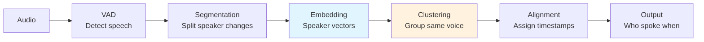

# 🎙️ Speaker Diarization

> **Mục tiêu**: "Who spoke when?" — Pyannote, Speaker Embeddings, Overlap Detection.

---

## 1. Diarization Pipeline



---

## 2. Pyannote Audio (State-of-the-Art)

```python
from pyannote.audio import Pipeline
import torch

# Load pre-trained pipeline (requires HuggingFace token)
pipeline = Pipeline.from_pretrained(
    "pyannote/speaker-diarization-3.1",
    use_auth_token="hf_YOUR_TOKEN",
)

# Run on GPU
pipeline.to(torch.device("cuda"))

# Diarize
diarization = pipeline("meeting_audio.wav")

# Print results
for turn, _, speaker in diarization.itertracks(yield_label=True):
    print(f"[{turn.start:.1f}s → {turn.end:.1f}s] {speaker}")
    # [0.5s → 3.2s] SPEAKER_00
    # [3.5s → 7.8s] SPEAKER_01
    # [8.0s → 12.1s] SPEAKER_00

# Specify number of speakers (helps accuracy)
diarization = pipeline("audio.wav", num_speakers=3)

# Or give range
diarization = pipeline("audio.wav", min_speakers=2, max_speakers=5)
```

---

## 3. Combining ASR + Diarization

```python
from faster_whisper import WhisperModel

def transcribe_with_speakers(audio_path: str):
    """Combine Whisper ASR with Pyannote diarization."""
    
    # 1. Diarize → get speaker segments
    diarization = diarization_pipeline(audio_path)
    
    # 2. Transcribe → get text with timestamps
    whisper = WhisperModel("large-v3", device="cuda", compute_type="float16")
    segments, _ = whisper.transcribe(audio_path, word_timestamps=True)
    
    # 3. Align: assign each word to a speaker
    transcript = []
    for segment in segments:
        for word in segment.words:
            word_mid = (word.start + word.end) / 2
            
            # Find speaker at this timestamp
            speaker = "UNKNOWN"
            for turn, _, spk in diarization.itertracks(yield_label=True):
                if turn.start <= word_mid <= turn.end:
                    speaker = spk
                    break
            
            transcript.append({
                "word": word.word,
                "start": word.start,
                "end": word.end,
                "speaker": speaker,
            })
    
    # 4. Format output
    current_speaker = None
    for item in transcript:
        if item["speaker"] != current_speaker:
            current_speaker = item["speaker"]
            print(f"\n{current_speaker}:")
        print(f"  {item['word']}", end="")
    
    return transcript

# Output:
# SPEAKER_00:
#   Xin chào, hôm nay chúng ta họp về AI.
# SPEAKER_01:
#   Vâng, tôi đã chuẩn bị slide rồi.
```

---

## 4. Speaker Embedding

```python
from pyannote.audio import Model, Inference
import torch
import numpy as np

# Extract speaker embeddings
model = Model.from_pretrained("pyannote/embedding", use_auth_token="hf_...")
inference = Inference(model, window="whole")

# Get embedding for an audio file
embedding1 = inference("speaker_a.wav")  # Shape: (192,) or (256,)
embedding2 = inference("speaker_b.wav")

# Compare speakers
similarity = np.dot(embedding1, embedding2) / (
    np.linalg.norm(embedding1) * np.linalg.norm(embedding2)
)
print(f"Speaker similarity: {similarity:.4f}")
# > 0.7 → likely same speaker
# < 0.3 → likely different speakers
```

---

## 5. Handling Edge Cases

### Speaker Overlap

```python
# Pyannote 3.1 handles overlapping speech
# Segments can overlap when 2+ people talk simultaneously
for turn, _, speaker in diarization.itertracks(yield_label=True):
    # turn.start and turn.end may overlap with other speakers
    pass

# Overlap detection
from pyannote.audio.pipelines import OverlappedSpeechDetection
osd = OverlappedSpeechDetection.from_pretrained("pyannote/overlapped-speech-detection")
overlap_regions = osd("audio.wav")
```

### Short Utterances

```python
# Filter very short segments (likely noise)
MIN_DURATION = 0.5  # seconds
filtered = diarization.support(collar=MIN_DURATION)
```

---

## 6. Evaluation: DER (Diarization Error Rate)

```python
from pyannote.metrics.diarization import DiarizationErrorRate

metric = DiarizationErrorRate()
der = metric(reference, hypothesis)
print(f"DER: {der:.2%}")

# DER = (False Alarm + Missed Detection + Speaker Confusion) / Total Reference Duration
# Good: DER < 10%
# Acceptable: DER < 20%
```

---

## 7. Overlap Speech Handling

```python
# ── Pyannote 3.x: Built-in Overlap Detection ──
from pyannote.audio import Pipeline

pipeline = Pipeline.from_pretrained("pyannote/speaker-diarization-3.1")
diarization = pipeline("meeting.wav")

# Detect overlapping speech regions
from pyannote.core import Timeline

overlap = Timeline()
for seg1, _, spk1 in diarization.itertracks(yield_label=True):
    for seg2, _, spk2 in diarization.itertracks(yield_label=True):
        if spk1 != spk2:
            intersection = seg1 & seg2  # Overlapping region
            if intersection:
                overlap.add(intersection)

overlap = overlap.support()  # Merge overlapping segments
print(f"Total overlap: {overlap.duration():.1f}s")
print(f"Overlap ratio: {overlap.duration() / diarization.get_timeline().duration():.1%}")

# ── Post-processing strategies ──
# 1. Keep both speakers → show as simultaneous (meeting transcripts)
# 2. Keep louder speaker → energy-based selection (call center)
# 3. Separate sources → speech separation model (more complex)
```

```
Real-world overlap statistics:
  Meetings:     15-30% of speech has overlap
  Call center:  5-10% (mostly interruptions)
  Podcasts:     10-20% (depends on format)
  Interviews:   5-15%

Impact on ASR:
  Clean speech WER:    3-5%
  Overlapped speech:   15-30% WER (much harder!)
  With separation:     8-12% WER (significant improvement)
```

---

## 🎯 Interview Tips — Chi Tiết

### Q1: "Diarization pipeline?"
**A**: VAD (detect speech) → Segmentation (find speaker changes) → Speaker Embedding (extract d-vector/x-vector per segment) → Clustering (group same speakers, e.g., agglomerative/spectral) → Alignment (assign labels to timestamps). Pyannote 3.1 is current SOTA.

### Q2: "DER components?"
**A**: DER = (FA + Miss + Confusion) / Total. False Alarm: detected speech where none exists. Miss: missed real speech. Confusion: correct speech detected but wrong speaker label. Good DER < 10%, acceptable < 20%.

### Q3: "Speaker overlap handling?"
**A**: Hard problem. Pyannote 3.1 detects overlap regions using dedicated overlap detection model. Can output multiple speaker labels for same timeframe. Improves DER significantly. Alternative: separation models (SepFormer).

### Q4: "Known vs unknown speakers?"
**A**: Enrollment: register speaker embeddings (d-vector/x-vector) from reference audio. Runtime: compare new embeddings with enrolled ones. Cosine similarity > 0.7 = same speaker. < 0.3 = different. This is Speaker Verification/Identification.

### Q5: "ASR + Diarization kết hợp thế nào?"
**A**: Run both independently → align by timestamps. For each ASR word, find which speaker was active at that time (word midpoint). WhisperX does this automatically. Challenges: overlap regions, short utterances, timestamp misalign.

### Q6: "Speaker embedding là gì?"
**A**: Fixed-size vector (192-256 dims) representing a speaker’s voice identity. Extracted by neural network (ECAPA-TDNN, ResNet). Same speaker → similar embeddings (high cosine similarity). Different speakers → dissimilar. Used for clustering + verification.
