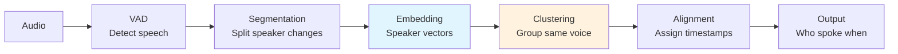
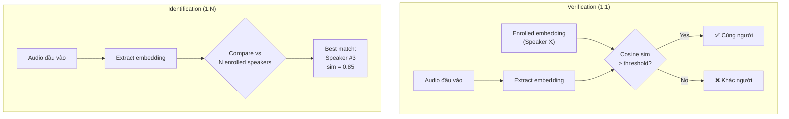

# 🎙️ Speaker Diarization

> **Mục tiêu**: "Who spoke when?" — Pyannote, Speaker Embeddings, Overlap Detection.

---

## 1. Diarization Pipeline



---

## 2. Pyannote Audio (State-of-the-Art)

```python
from pyannote.audio import Pipeline
import torch

# Load pre-trained pipeline (requires HuggingFace token)
pipeline = Pipeline.from_pretrained(
    "pyannote/speaker-diarization-3.1",
    use_auth_token="hf_YOUR_TOKEN",
)

# Run on GPU
pipeline.to(torch.device("cuda"))

# Diarize
diarization = pipeline("meeting_audio.wav")

# Print results
for turn, _, speaker in diarization.itertracks(yield_label=True):
    print(f"[{turn.start:.1f}s → {turn.end:.1f}s] {speaker}")
    # [0.5s → 3.2s] SPEAKER_00
    # [3.5s → 7.8s] SPEAKER_01
    # [8.0s → 12.1s] SPEAKER_00

# Specify number of speakers (helps accuracy)
diarization = pipeline("audio.wav", num_speakers=3)

# Or give range
diarization = pipeline("audio.wav", min_speakers=2, max_speakers=5)
```

---

## 3. Combining ASR + Diarization

```python
from faster_whisper import WhisperModel

def transcribe_with_speakers(audio_path: str):
    """Combine Whisper ASR with Pyannote diarization."""
    
    # 1. Diarize → get speaker segments
    diarization = diarization_pipeline(audio_path)
    
    # 2. Transcribe → get text with timestamps
    whisper = WhisperModel("large-v3", device="cuda", compute_type="float16")
    segments, _ = whisper.transcribe(audio_path, word_timestamps=True)
    
    # 3. Align: assign each word to a speaker
    transcript = []
    for segment in segments:
        for word in segment.words:
            word_mid = (word.start + word.end) / 2
            
            # Find speaker at this timestamp
            speaker = "UNKNOWN"
            for turn, _, spk in diarization.itertracks(yield_label=True):
                if turn.start <= word_mid <= turn.end:
                    speaker = spk
                    break
            
            transcript.append({
                "word": word.word,
                "start": word.start,
                "end": word.end,
                "speaker": speaker,
            })
    
    # 4. Format output
    current_speaker = None
    for item in transcript:
        if item["speaker"] != current_speaker:
            current_speaker = item["speaker"]
            print(f"\n{current_speaker}:")
        print(f"  {item['word']}", end="")
    
    return transcript

# Output:
# SPEAKER_00:
#   Xin chào, hôm nay chúng ta họp về AI.
# SPEAKER_01:
#   Vâng, tôi đã chuẩn bị slide rồi.
```

---

## 4. Speaker Embedding

```python
from pyannote.audio import Model, Inference
import torch
import numpy as np

# Extract speaker embeddings
model = Model.from_pretrained("pyannote/embedding", use_auth_token="hf_...")
inference = Inference(model, window="whole")

# Get embedding for an audio file
embedding1 = inference("speaker_a.wav")  # Shape: (192,) or (256,)
embedding2 = inference("speaker_b.wav")

# Compare speakers
similarity = np.dot(embedding1, embedding2) / (
    np.linalg.norm(embedding1) * np.linalg.norm(embedding2)
)
print(f"Speaker similarity: {similarity:.4f}")
# > 0.7 → likely same speaker
# < 0.3 → likely different speakers
```

---

## 5. Handling Edge Cases

### Speaker Overlap

```python
# Pyannote 3.1 handles overlapping speech
# Segments can overlap when 2+ people talk simultaneously
for turn, _, speaker in diarization.itertracks(yield_label=True):
    # turn.start and turn.end may overlap with other speakers
    pass

# Overlap detection
from pyannote.audio.pipelines import OverlappedSpeechDetection
osd = OverlappedSpeechDetection.from_pretrained("pyannote/overlapped-speech-detection")
overlap_regions = osd("audio.wav")
```

### Short Utterances

```python
# Filter very short segments (likely noise)
MIN_DURATION = 0.5  # seconds
filtered = diarization.support(collar=MIN_DURATION)
```

---

## 6. Evaluation: DER (Diarization Error Rate)

```python
from pyannote.metrics.diarization import DiarizationErrorRate

metric = DiarizationErrorRate()
der = metric(reference, hypothesis)
print(f"DER: {der:.2%}")

# DER = (False Alarm + Missed Detection + Speaker Confusion) / Total Reference Duration
# Good: DER < 10%
# Acceptable: DER < 20%
```

---

## 7. Overlap Speech Handling

```python
# ── Pyannote 3.x: Built-in Overlap Detection ──
from pyannote.audio import Pipeline

pipeline = Pipeline.from_pretrained("pyannote/speaker-diarization-3.1")
diarization = pipeline("meeting.wav")

# Detect overlapping speech regions
from pyannote.core import Timeline

overlap = Timeline()
for seg1, _, spk1 in diarization.itertracks(yield_label=True):
    for seg2, _, spk2 in diarization.itertracks(yield_label=True):
        if spk1 != spk2:
            intersection = seg1 & seg2  # Overlapping region
            if intersection:
                overlap.add(intersection)

overlap = overlap.support()  # Merge overlapping segments
print(f"Total overlap: {overlap.duration():.1f}s")
print(f"Overlap ratio: {overlap.duration() / diarization.get_timeline().duration():.1%}")

# ── Post-processing strategies ──
# 1. Keep both speakers → show as simultaneous (meeting transcripts)
# 2. Keep louder speaker → energy-based selection (call center)
# 3. Separate sources → speech separation model (more complex)
```

```
Real-world overlap statistics:
  Meetings:     15-30% of speech has overlap
  Call center:  5-10% (mostly interruptions)
  Podcasts:     10-20% (depends on format)
  Interviews:   5-15%

Impact on ASR:
  Clean speech WER:    3-5%
  Overlapped speech:   15-30% WER (much harder!)
  With separation:     8-12% WER (significant improvement)
```

---

## 8. Speaker Verification vs Identification



```python
from pyannote.audio import Model, Inference
import numpy as np

# ── Speaker Verification (1:1) ──
# "Is this audio from Speaker X?"
model = Model.from_pretrained("pyannote/embedding", use_auth_token="hf_...")
inference = Inference(model, window="whole")

# Enrolled reference
ref_embedding = inference("enrolled_speaker.wav")  # (192,)

# Test audio
test_embedding = inference("unknown_audio.wav")

# Compare
cosine_sim = np.dot(ref_embedding, test_embedding) / (
    np.linalg.norm(ref_embedding) * np.linalg.norm(test_embedding)
)

THRESHOLD = 0.7  # Tune per use case
if cosine_sim > THRESHOLD:
    print(f"✅ Same speaker (sim={cosine_sim:.3f})")
else:
    print(f"❌ Different speaker (sim={cosine_sim:.3f})")


# ── Speaker Identification (1:N) ──
# "WHO is this?" — search against enrolled speakers
enrolled = {
    "Alice": inference("alice_ref.wav"),
    "Bob": inference("bob_ref.wav"),
    "Charlie": inference("charlie_ref.wav"),
}

def identify_speaker(audio_path: str, enrolled: dict, threshold: float = 0.6):
    test_emb = inference(audio_path)
    best_match, best_sim = None, -1
    
    for name, ref_emb in enrolled.items():
        sim = np.dot(test_emb, ref_emb) / (
            np.linalg.norm(test_emb) * np.linalg.norm(ref_emb)
        )
        if sim > best_sim:
            best_sim, best_match = sim, name
    
    if best_sim > threshold:
        return best_match, best_sim
    return "UNKNOWN", best_sim
```

**Metrics cho Verification**:
- **EER** (Equal Error Rate): điểm mà FAR = FRR. SOTA ≈ 1% trên VoxCeleb.
- **minDCF** (minimum Detection Cost Function): weighted cost metric, phổ biến hơn EER trong production.
- **Threshold tuning**: Security (banking) → low FAR (strict). UX (unlock phone) → low FRR (lenient).

---

## 9. Online / Incremental Diarization

> Cho voice agents và real-time applications — cần diarize WHILE audio streams in.

```python
# ── Pattern: Windowed Incremental Diarization ──
class IncrementalDiarizer:
    """Process audio in chunks, maintain speaker memory."""
    
    def __init__(self, pipeline, window_size: float = 10.0, step: float = 2.0):
        self.pipeline = pipeline
        self.window_size = window_size  # Process 10s windows
        self.step = step                # Move forward 2s each time
        self.speaker_memory = {}        # name → average embedding
        self.label_map = {}             # SPEAKER_xx → consistent name
    
    def process_chunk(self, audio_buffer, current_time: float):
        """Process latest window of audio."""
        # 1. Run diarization on window
        window = audio_buffer[-int(self.window_size * 16000):]
        diarization = self.pipeline({"waveform": window, "sample_rate": 16000})
        
        # 2. Match speakers to memory (link new labels to existing)
        for turn, _, speaker in diarization.itertracks(yield_label=True):
            segment_audio = extract_audio(window, turn.start, turn.end)
            embedding = self.get_embedding(segment_audio)
            
            matched = self.match_to_memory(embedding)
            if matched is None:
                # New speaker
                name = f"SPEAKER_{len(self.speaker_memory):02d}"
                self.speaker_memory[name] = embedding
                matched = name
            
            yield {
                "speaker": matched,
                "start": current_time + turn.start,
                "end": current_time + turn.end,
            }
    
    def match_to_memory(self, embedding, threshold=0.7):
        best_match, best_sim = None, -1
        for name, ref_emb in self.speaker_memory.items():
            sim = cosine_similarity(embedding, ref_emb)
            if sim > best_sim:
                best_sim, best_match = sim, name
        return best_match if best_sim > threshold else None
```

**Challenges so với offline diarization:**
1. **Chưa có future context** → speaker change detection kém chính xác hơn  
2. **Label consistency** → SPEAKER_00 trong window 1 phải match SPEAKER_00 trong window 2 (dùng embedding memory)
3. **Recluster impossible** → không thể recluster toàn bộ audio (chỉ có past + current)
4. **Latency** → mỗi window phải process < window step time (< 2s)

**Production approach**: buffer 5-10s → diarize → match to speaker memory → emit labeled segments. Typical DER degradation: offline 12% → online ~18%.

---

## 10. Fine-tuning Pyannote cho Custom Domain

```python
from pyannote.audio import Model
from pyannote.audio.tasks import SpeakerDiarization
from pyannote.database import registry, FileFinder

# ── Khi nào cần fine-tune? ──
# 1. Call center (different acoustic conditions than training data)
# 2. Meeting rooms with specific echo/noise patterns
# 3. Domain-specific: courtroom, medical consultation
# 4. Specific microphone/hardware setup
# 5. Language-specific (Pyannote trained mostly on English)

# ── Dataset format ──
# RTTM format (reference diarization):
# SPEAKER meeting1 1 0.500 3.200 <NA> <NA> speaker_A <NA> <NA>
# SPEAKER meeting1 1 3.500 7.800 <NA> <NA> speaker_B <NA> <NA>

# ── Fine-tuning steps ──
# 1. Prepare data: audio + RTTM reference annotations
# 2. Create pyannote Database protocol
# 3. Fine-tune segmentation model (most impactful)
# 4. Optionally fine-tune embedding model

# Minimal data requirements:
#   - Segmentation: 5-10 hours of annotated audio
#   - Embedding: 50+ speakers with 5+ utterances each
#   - Start with pre-trained → fine-tune (transfer learning)

# ⚠️ Important considerations:
# - Augmentation: add noise, reverb to match target environment
# - Hyperparameter search: collar, min_duration significantly affect DER
# - Evaluate on IN-DOMAIN test set (not AMI benchmark!)
```

### Pyannote 3.x Configuration Tuning

```python
# ── Before fine-tuning: try hyperparameter tuning first ──
# Often gets you 80% of the improvement with much less effort

pipeline = Pipeline.from_pretrained("pyannote/speaker-diarization-3.1")

# Key hyperparameters:
params = {
    "segmentation": {
        "min_duration_off": 0.0,     # Min silence between segments (default 0.0)
        "threshold": 0.5,            # Speaker change detection sensitivity
    },
    "clustering": {
        "method": "centroid",        # "centroid" or "average"
        "min_cluster_size": 15,      # Min number of segments per speaker
        "threshold": 0.7,            # Clustering distance threshold
    },
}

# ── Tuning with Optuna ──
# pyannote provides built-in optimization:
from pyannote.audio.pipelines import SpeakerDiarization
from pyannote.pipeline import Optimizer

optimizer = Optimizer(pipeline)
best_params = optimizer.tune(
    training_set,        # Your annotated data
    n_iterations=100,    # Optuna trials
    show_progress=True,
)
# Typical improvement: 5-10% DER reduction just from tuning
```

---

## 11. WhisperX — All-in-one Pipeline

```python
import whisperx

# ── WhisperX: ASR + Alignment + Diarization in 1 package ──
device = "cuda"
audio = whisperx.load_audio("meeting.wav")

# 1. Transcribe (faster-whisper backend)
model = whisperx.load_model("large-v3", device, compute_type="float16")
result = model.transcribe(audio, batch_size=16)

# 2. Align (word-level timestamps - phoneme model)
model_a, metadata = whisperx.load_align_model(language_code="en", device=device)
result = whisperx.align(result["segments"], model_a, metadata, audio, device)

# 3. Diarize (pyannote backend)
diarize_model = whisperx.DiarizationPipeline(
    use_auth_token="hf_...", device=device
)
diarize_result = diarize_model(audio, min_speakers=2, max_speakers=5)

# 4. Assign speakers to words
result = whisperx.assign_word_speakers(diarize_result, result)

# Output: segments with speaker labels + word-level timestamps
for seg in result["segments"]:
    print(f"[{seg['start']:.1f}s-{seg['end']:.1f}s] {seg['speaker']}: {seg['text']}")
```

**WhisperX vs Manual Pipeline**:

| | WhisperX | Manual (Whisper + Pyannote) |
|-|----------|---------------------------|
| **Setup** | 1 package, minimal code | Separate configs |
| **Alignment** | Built-in phoneme alignment | Word timestamp from Whisper (less precise) |
| **Customization** | Limited | Full control |
| **Best for** | Batch processing, prototyping | Production with custom needs |

---

## 🎯 Interview Tips — Chi Tiết

### Q1: "Diarization pipeline?"
**A**: VAD (detect speech) → Segmentation (find speaker changes) → Speaker Embedding (extract d-vector/x-vector per segment) → Clustering (group same speakers, e.g., agglomerative/spectral) → Alignment (assign labels to timestamps). Pyannote 3.1 is current SOTA — end-to-end neural pipeline handling overlap natively. **Follow-up**: "Segmentation vs clustering separately?" → Pyannote 3.1 combines both; older systems separate them. Joint = better because segmentation errors propagate to clustering.

### Q2: "DER components?"
**A**: DER = (FA + Miss + Confusion) / Total. False Alarm: detected speech where none exists. Miss: missed real speech. Confusion: correct speech detected but wrong speaker label. Good DER < 10%, acceptable < 20%. **Key**: confusion is usually the largest component — improving speaker embeddings helps most.

### Q3: "Speaker overlap handling?"
**A**: Hard problem. Pyannote 3.1 detects overlap regions using dedicated overlap detection model. Can output multiple speaker labels for same timeframe. Impact: overlap speech WER 15-30% vs clean 3-5%. Advanced: SepFormer source separation → split into individual streams → ASR each. **Follow-up**: "Overlap rate by context?" → meetings 15-30%, call center 5-10%, interviews 5-15%.

### Q4: "Speaker verification vs identification?"
**A**: Verification (1:1): "Is this Speaker X?" — compare embedding vs enrolled. Yes/no. Identification (1:N): "Who is this?" — compare vs N speakers, find match. Clustering (unsupervised): no enrollment, just group by voice. All based on speaker embeddings (ECAPA-TDNN, 192-256 dims). Cosine sim > 0.7 = same speaker. Metric: EER ≈ 1% SOTA on VoxCeleb.

### Q5: "Online diarization challenges?"
**A**: No future context → less accurate. Label consistency across windows (use speaker embedding memory). Can't recluster past segments. Must process faster than real-time. Typical DER degradation: offline 12% → online 18%. Pattern: buffer 5-10s windows, match to speaker memory. Critical for voice agents.

### Q6: "ASR + Diarization kết hợp thế nào?"
**A**: Two approaches: (1) Pipeline: run both independently → align by timestamps (word midpoint → find active speaker). WhisperX does this automatically. (2) End-to-end: models like Joint ASR+Diarization (future direction). Challenges: overlap regions, short utterances, timestamp misalign. WhisperX uses phoneme-based alignment for better precision.

### Q7: "Speaker embedding là gì?"
**A**: Fixed-size vector (192-256 dims) representing a speaker's voice identity. Extracted by neural network (ECAPA-TDNN is SOTA — emphasis channel attention, squeeze-excitation, Res2Net). Same speaker → similar embeddings (high cosine similarity). Text-independent: works regardless of what speaker says. Used for clustering, verification, identification.

### Q8: "Fine-tuning diarization khi nào?"
**A**: Khi target domain khác training data: call center (phone audio), meeting rooms (echo), specific languages (Vietnamese), custom hardware. Often: try hyperparameter tuning first (Optuna → 5-10% DER improvement). Fine-tune segmentation model (most impactful) if still not good enough. Need 5-10 hours annotated audio minimum.
