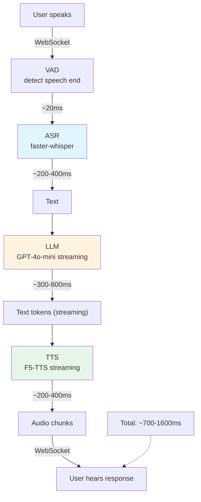
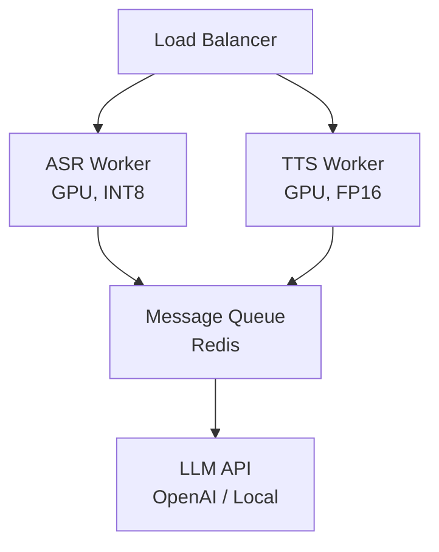
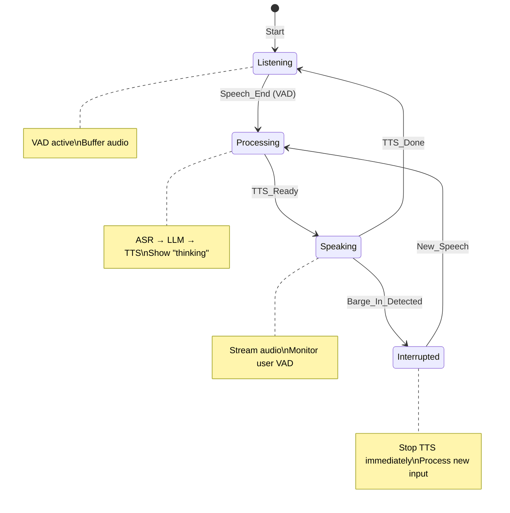

# 🤖 Voice Agents — Real-time Speech Pipeline

> **Mục tiêu**: Build voice agent end-to-end — ASR→LLM→TTS, Latency budget, WebSocket, Barge-in.

---

## 1. Voice Agent Architecture



---

## 2. Latency Budget

| Component | Target | Optimization |
|-----------|--------|-------------|
| **Network** | <50ms | WebSocket, edge deployment, CDN |
| **VAD** | <20ms | Silero VAD (lightweight) |
| **ASR** | <300ms | faster-whisper INT8, short chunks |
| **LLM** | <500ms | GPT-4o-mini streaming, short prompts |
| **TTS** | <300ms | F5-TTS streaming, first-chunk priority |
| **Total** | **<1.2s** | End-to-end optimization |

### Latency Optimization Techniques

```python
# 1. Streaming everything — don't wait for complete output
# ASR: process audio chunks as they arrive
# LLM: stream tokens → TTS as soon as first sentence is ready
# TTS: stream audio chunks → play first chunk ASAP

# 2. First-chunk latency (Time to First Audio)
# The user hears response starting within 500-800ms
# Even if full response takes 3-5 seconds

# 3. Sentence-level TTS buffering
class StreamingTTSBuffer:
    """Buffer LLM tokens until a sentence is complete, then TTS."""
    
    SENTENCE_ENDINGS = {".", "!", "?", "。", "！", "？"}
    
    def __init__(self):
        self.buffer = ""
        self.sentences = []
    
    def add_token(self, token: str) -> str | None:
        self.buffer += token
        
        # Check for sentence boundary
        if any(self.buffer.rstrip().endswith(end) for end in self.SENTENCE_ENDINGS):
            sentence = self.buffer.strip()
            self.buffer = ""
            self.sentences.append(sentence)
            return sentence  # Ready for TTS
        
        return None  # Keep buffering
```

---

## 3. Barge-in (Interruption)

```python
class VoiceAgentController:
    """Handle user interruptions (barge-in)."""
    
    def __init__(self):
        self.is_speaking = False
        self.current_response_task = None
    
    async def handle_user_speech_detected(self):
        """Called when VAD detects user starts speaking."""
        if self.is_speaking:
            # User is interrupting!
            print("🔇 Barge-in detected — stopping current response")
            self.is_speaking = False
            
            # Cancel current TTS playback
            if self.current_response_task:
                self.current_response_task.cancel()
            
            # Reset pipeline for new input
            return "interrupted"
        
        return "new_input"
    
    async def speak_response(self, audio_chunks):
        """Play TTS audio with interruption support."""
        self.is_speaking = True
        
        for chunk in audio_chunks:
            if not self.is_speaking:
                break  # Interrupted
            await self.play_audio(chunk)
        
        self.is_speaking = False
```

---

## 4. WebSocket Server

```python
import asyncio
import websockets
import json
import numpy as np

class VoiceAgentServer:
    """WebSocket server for real-time voice interaction."""
    
    def __init__(self):
        self.asr = None  # faster-whisper model
        self.llm = None  # OpenAI client
        self.tts = None  # TTS model
    
    async def handle_connection(self, websocket):
        """Handle a single client connection."""
        print(f"🔗 Client connected")
        audio_buffer = []
        
        async for message in websocket:
            if isinstance(message, bytes):
                # Audio data from client
                audio = np.frombuffer(message, dtype=np.float32)
                audio_buffer.append(audio)
                
                # Process when enough audio accumulated
                if len(audio_buffer) * len(audio) > 16000 * 2:  # 2 seconds
                    full_audio = np.concatenate(audio_buffer)
                    audio_buffer = []
                    
                    # ASR
                    text = await self.transcribe(full_audio)
                    await websocket.send(json.dumps({
                        "type": "transcript", "text": text
                    }))
                    
                    # LLM → TTS (streaming)
                    async for audio_chunk in self.generate_response(text):
                        await websocket.send(audio_chunk)
            
            elif isinstance(message, str):
                data = json.loads(message)
                if data.get("type") == "end_of_speech":
                    # Process final audio
                    pass
    
    async def start(self, host="0.0.0.0", port=8765):
        async with websockets.serve(self.handle_connection, host, port):
            print(f"🎙️ Voice Agent running on ws://{host}:{port}")
            await asyncio.Future()  # Run forever

# Client-side JavaScript
CLIENT_JS = """
const ws = new WebSocket('ws://localhost:8765');

// Get microphone access
navigator.mediaDevices.getUserMedia({ audio: true })
    .then(stream => {
        const recorder = new MediaRecorder(stream);
        const audioContext = new AudioContext({ sampleRate: 16000 });
        
        // Stream audio to server
        recorder.ondataavailable = (event) => {
            ws.send(event.data);
        };
        recorder.start(500);  // Send every 500ms
    });

// Receive and play response audio
ws.onmessage = (event) => {
    if (event.data instanceof Blob) {
        // Play audio response
        const audio = new Audio(URL.createObjectURL(event.data));
        audio.play();
    } else {
        const data = JSON.parse(event.data);
        console.log('Transcript:', data.text);
    }
};
"""
```

---

## 5. Production Architecture



---

## 6. Latency Optimization Strategies

```
Target: End-to-end < 500ms (user speaks → agent starts replying)

Optimization techniques:
├── 1. Streaming TTS: Start speaking BEFORE full LLM response
│     └── Stream first sentence → user hears response while rest generates
├── 2. Speculative execution: Pre-generate likely responses
│     └── "Yes/No questions" → pre-generate both answers, play correct one
├── 3. Acknowledgment model: Lightweight model for "uh-huh", "I see"
│     └── While main LLM thinks, play filler → feels responsive
├── 4. Edge ASR: Run tiny Whisper on-device for initial transcription
│     └── Ship to cloud only for LLM processing
└── 5. Warm connections: Keep WebSocket/gRPC connections alive
      └── Connection setup = 50-100ms saved per turn
```

```python
# ── Streaming TTS Pipeline ──
import asyncio

async def stream_response(llm_stream, tts_engine):
    """Start TTS as soon as first sentence is ready."""
    buffer = ""
    
    async for token in llm_stream:
        buffer += token
        
        # Check if we have a complete sentence
        if any(buffer.endswith(p) for p in [". ", "! ", "? ", ".\n"]):
            # Start TTS immediately for this sentence
            audio = await tts_engine.synthesize(buffer.strip())
            yield audio  # Stream audio to user
            buffer = ""
    
    # Flush remaining buffer
    if buffer.strip():
        audio = await tts_engine.synthesize(buffer.strip())
        yield audio
```

### Turn-taking State Machine



---

## 🎯 Interview Tips — Chi Tiết

### Q1: "Voice agent latency target?"
**A**: < 1.2s total (human conversation threshold ~1.5s). ASR <300ms + LLM <500ms + TTS <300ms. Key: streaming everything — don’t wait for complete output. Time-to-first-audio (TTFA) < 500-800ms.

### Q2: "Barge-in handling?"
**A**: VAD detects user speech during playback → immediately cancel current TTS → restart ASR pipeline. Critical for natural conversation. Implementation: continuous VAD monitoring + async cancellation of TTS task.

### Q3: "Streaming TTS?"
**A**: Buffer LLM tokens → detect sentence boundary (".", "!", "?") → TTS that sentence → stream audio chunks → play first chunk ASAP. Don’t wait for full response. First audio within 200-400ms of first sentence.

### Q4: "WebSocket vs REST?"
**A**: WebSocket: persistent connection, bidirectional, low latency (~50ms overhead). REST: stateless, higher latency (~200ms per request). Voice agents = always WebSocket for real-time streaming. REST only for batch/offline processing.

### Q5: "Voice agent production architecture?"
**A**: Load Balancer → ASR Workers (GPU, INT8) + TTS Workers (GPU, FP16) → Message Queue (Redis) → LLM API. Separate ASR/TTS workers for independent scaling. Horizontal scale based on concurrent sessions.

### Q6: "Endpointing là gì?"
**A**: Detect when user finishes speaking (not just pause). Methods: (1) Silence duration threshold (e.g., 800ms). (2) Neural endpointer (classify speech-complete vs pause). Critical: too short = cut user off. Too long = add latency. Tunable per language/culture.
