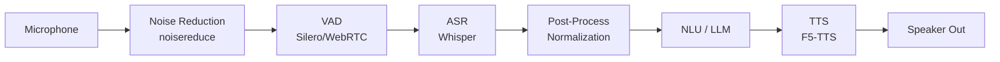

# 🏭 Production Speech Systems

> **Mục tiêu**: Deploy speech AI — noise handling, multilingual, edge cases, monitoring.

---

## Production Speech Pipeline



---

## 1. Noise Handling

```python
import noisereduce as nr
import numpy as np

def preprocess_audio(audio: np.ndarray, sr: int = 16000) -> np.ndarray:
    """Production-grade audio preprocessing pipeline."""
    
    # 1. Noise reduction
    audio = nr.reduce_noise(
        y=audio, sr=sr,
        stationary=True,         # Assume stationary noise
        prop_decrease=0.75,       # Don't over-suppress
    )
    
    # 2. Normalize volume
    peak = np.max(np.abs(audio))
    if peak > 0:
        audio = audio / peak * 0.95
    
    # 3. Remove DC offset
    audio = audio - np.mean(audio)
    
    # 4. High-pass filter (remove rumble < 80Hz)
    from scipy.signal import butter, filtfilt
    b, a = butter(4, 80 / (sr / 2), btype='high')
    audio = filtfilt(b, a, audio)
    
    return audio

# SNR estimation
def estimate_snr(audio: np.ndarray, sr: int) -> float:
    """Estimate Signal-to-Noise Ratio."""
    import librosa
    rms = librosa.feature.rms(y=audio)[0]
    
    # Simple: assume bottom 10% frames are noise
    noise_rms = np.percentile(rms, 10)
    signal_rms = np.percentile(rms, 90)
    
    if noise_rms > 0:
        snr_db = 20 * np.log10(signal_rms / noise_rms)
    else:
        snr_db = float('inf')
    
    return snr_db
# SNR > 20 dB: clean, SNR 10-20: moderate, SNR < 10: noisy
```

---

## 2. Multilingual Speech

### Language Detection

```python
# Whisper auto-detects language
from faster_whisper import WhisperModel

model = WhisperModel("large-v3")

# Detect language (first 30s)
segments, info = model.transcribe("audio.wav")
print(f"Detected: {info.language} (confidence: {info.language_probability:.2f})")

# Force language for better accuracy
segments, _ = model.transcribe("audio.wav", language="vi")
```

### Code-switching (Mixing Languages)

```python
# Vietnamese people often mix English terms:
# "Tôi đang train model transformer trên GPU"
# → Whisper handles this well with large-v3

# Strategy:
# 1. Primary language = "vi"
# 2. Let Whisper handle English terms naturally
# 3. Post-process: normalize terms (e.g., "model" → consistent spelling)
```

---

## 3. Edge Cases & Error Handling

```python
class SpeechPipelineGuard:
    """Handle edge cases in production speech pipeline."""
    
    def check_audio_quality(self, audio: np.ndarray, sr: int) -> dict:
        """Check if audio is suitable for processing."""
        issues = []
        
        # Too short
        duration = len(audio) / sr
        if duration < 0.5:
            issues.append({"type": "too_short", "duration": duration})
        
        # Too long (for Whisper: max 30s per chunk)
        if duration > 300:
            issues.append({"type": "too_long", "duration": duration})
        
        # Silent audio
        rms = np.sqrt(np.mean(audio ** 2))
        if rms < 0.001:
            issues.append({"type": "silence", "rms": rms})
        
        # Clipping
        clipping_ratio = np.mean(np.abs(audio) > 0.99)
        if clipping_ratio > 0.01:
            issues.append({"type": "clipping", "ratio": clipping_ratio})
        
        # Low SNR
        snr = estimate_snr(audio, sr)
        if snr < 10:
            issues.append({"type": "noisy", "snr_db": snr})
        
        return {
            "is_valid": len(issues) == 0,
            "issues": issues,
            "duration": duration,
            "snr_db": snr,
        }
    
    def chunk_long_audio(self, audio: np.ndarray, sr: int,
                          chunk_duration: float = 30.0,
                          overlap: float = 1.0) -> list[np.ndarray]:
        """Split long audio into processable chunks."""
        chunk_size = int(chunk_duration * sr)
        overlap_size = int(overlap * sr)
        
        chunks = []
        start = 0
        while start < len(audio):
            end = min(start + chunk_size, len(audio))
            chunks.append(audio[start:end])
            start = end - overlap_size
        
        return chunks
```

---

## 4. Monitoring & Observability

```python
import time
from dataclasses import dataclass, field

@dataclass
class SpeechMetrics:
    """Track speech pipeline performance."""
    
    asr_latency_ms: list[float] = field(default_factory=list)
    tts_latency_ms: list[float] = field(default_factory=list)
    total_latency_ms: list[float] = field(default_factory=list)
    wer_scores: list[float] = field(default_factory=list)
    audio_durations: list[float] = field(default_factory=list)
    error_count: int = 0
    request_count: int = 0
    
    def report(self) -> dict:
        import numpy as np
        return {
            "requests": self.request_count,
            "errors": self.error_count,
            "error_rate": self.error_count / max(self.request_count, 1),
            "asr_latency_p50": np.percentile(self.asr_latency_ms, 50) if self.asr_latency_ms else 0,
            "asr_latency_p95": np.percentile(self.asr_latency_ms, 95) if self.asr_latency_ms else 0,
            "tts_latency_p50": np.percentile(self.tts_latency_ms, 50) if self.tts_latency_ms else 0,
            "total_latency_p50": np.percentile(self.total_latency_ms, 50) if self.total_latency_ms else 0,
            "total_latency_p95": np.percentile(self.total_latency_ms, 95) if self.total_latency_ms else 0,
            "avg_audio_duration": np.mean(self.audio_durations) if self.audio_durations else 0,
            "realtime_factor": (
                np.mean(self.asr_latency_ms) / (np.mean(self.audio_durations) * 1000)
                if self.audio_durations and self.asr_latency_ms else 0
            ),
        }
```

---

## 5. Cost Optimization

| Service | Cost | Optimization |
|---------|------|-------------|
| **OpenAI Whisper API** | $0.006/min | Batch processing, local model for high volume |
| **Local faster-whisper** | GPU time only | INT8 quantization, batch inference |
| **OpenAI TTS** | $15/1M chars | Cache frequent phrases, local TTS |
| **Local F5-TTS** | GPU time only | Batch synthesis, warm cache |

```python
# Caching for repeated phrases
from functools import lru_cache
import hashlib

class TTSCache:
    """Cache TTS outputs for repeated text."""
    
    def __init__(self, cache_dir: str = "./tts_cache"):
        self.cache_dir = cache_dir
        os.makedirs(cache_dir, exist_ok=True)
    
    def get_or_generate(self, text: str, voice: str):
        cache_key = hashlib.md5(f"{text}:{voice}".encode()).hexdigest()
        cache_path = f"{self.cache_dir}/{cache_key}.wav"
        
        if os.path.exists(cache_path):
            return load_audio(cache_path)  # Cache hit
        
        audio = tts_model.synthesize(text, voice)
        save_audio(audio, cache_path)  # Cache for future
        return audio
```

---

## 🎯 Interview Tips — Chi Tiết

### Q1: "Noisy audio handling?"
**A**: Pipeline: (1) SNR estimation — if < 10dB, warn. (2) Spectral subtraction noise reduction (noisereduce library). (3) High-pass filter to remove rumble < 80Hz. (4) Normalize volume. (5) Adapt Whisper: increase beam_size, add initial_prompt. Never over-suppress — kills speech quality.

### Q2: "Long audio processing?"
**A**: Chunk into 30s segments with 1s overlap (Whisper limit). VAD-based smart chunking preferred (split at silence). Process sequentially. Merge transcripts. Handle boundary words by comparing overlap regions. Chunking quality = transcript quality.

### Q3: "Speech pipeline monitoring?"
**A**: Track: ASR latency (P50/P95), WER on test set, TTS latency, error rate, real-time factor (RTF = processing time / audio duration). RTF < 1 = real-time capable. Alert on: latency spike, WER degradation, error rate > 5%.

### Q4: "Cost optimization?"
**A**: (1) Cache repeated TTS phrases (greeting, goodbye — hash text+voice as key). (2) Local models for high volume (faster-whisper vs OpenAI API). (3) Batch processing for offline jobs. (4) INT8 quantization for ASR. (5) Tiered: cheap model for filtering, expensive for final.

### Q5: "Code-switching handling?"
**A**: Vietnamese users mix English terms ("train model transformer trên GPU"). Whisper large-v3 handles well with language="vi". Post-processing: normalize mixed terms, maintain consistency. Don’t force single-language mode for mixed-language audio.

### Q6: "Audio quality validation?"
**A**: Pre-processing checks: (1) Duration > 0.5s (too short = noise). (2) Not silent (RMS > 0.001). (3) No clipping (|amplitude| > 0.99 < 1%). (4) SNR > 10dB. (5) Correct sample rate (resample if needed). Reject bad audio with clear error messages.
