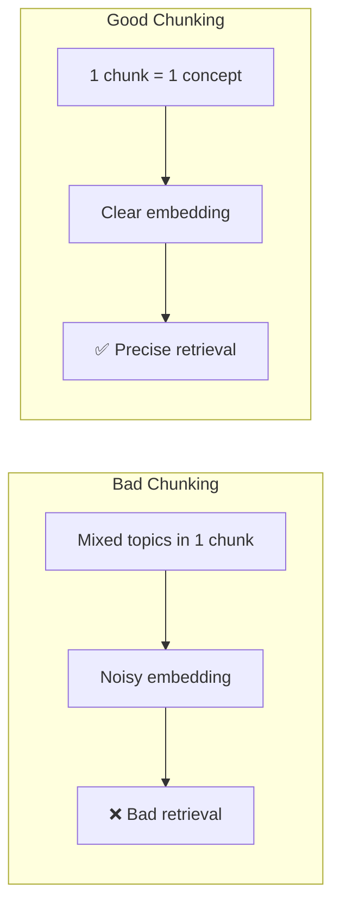

# ✂️ Chunking Strategies — Production Guide

> **Mục tiêu**: Tối ưu cách chia document — semantic, recursive, agentic, late chunking.
> Chunking là bước **QUAN TRỌNG NHẤT** trong RAG pipeline. Bad chunks = bad retrieval = bad answers.

---

## 1. Tại sao Chunking quan trọng?



> **RAG quality ≈ 60% retrieval quality ≈ 40% chunking quality**

---

## 2. Chunking Methods

### 2.1 Fixed-size (Naive)

```python
def fixed_size_chunk(text: str, chunk_size: int = 500, overlap: int = 50) -> list[str]:
    chunks = []
    for i in range(0, len(text), chunk_size - overlap):
        chunks.append(text[i:i + chunk_size])
    return chunks
# ✅ Simple, predictable size
# ❌ Cuts mid-sentence, loses context, mixes topics
# Use: only as baseline
```

### 2.2 Recursive Character Splitting

```python
from langchain.text_splitter import RecursiveCharacterTextSplitter

splitter = RecursiveCharacterTextSplitter(
    chunk_size=1000,
    chunk_overlap=200,
    separators=["\n\n", "\n", ". ", " ", ""],  # Try each in order
    length_function=len,  # Or tiktoken: len(enc.encode(text))
)
chunks = splitter.split_text(document)
# Tries: paragraph → sentence → word boundaries
# ✅ Good default, respects structure
# ❌ Still splits by character count, not meaning
```

### 2.3 Semantic Chunking

```python
from langchain_experimental.text_splitter import SemanticChunker
from langchain_openai import OpenAIEmbeddings

# Split based on embedding SIMILARITY between sentences
chunker = SemanticChunker(
    OpenAIEmbeddings(),
    breakpoint_threshold_type="percentile",
    breakpoint_threshold_amount=95,  # Break when similarity drops below 5th percentile
)
chunks = chunker.split_text(document)
# ✅ Each chunk has coherent semantic content
# ❌ Slower (needs embeddings), variable chunk sizes
```

**How Semantic Chunking Works:**
```
1. Split text into sentences: [S1, S2, S3, S4, S5, ...]
2. Embed each sentence: [E1, E2, E3, E4, E5, ...]
3. Compute similarity between adjacent: [sim(E1,E2), sim(E2,E3), ...]
4. Where similarity drops significantly → INSERT BREAK
5. Group sentences between breaks → chunks

S1 ── S2 ── S3 ── | ── S4 ── S5 ── | ── S6
  high sim   high    DROP    high sim    DROP
  ← chunk 1 →        ← chunk 2 →       ← 3 →
```

### 2.4 Document-aware Chunking

```python
def structured_chunk(markdown_text: str, max_chunk_size: int = 1500) -> list[dict]:
    """Respect document structure — split by headers."""
    chunks = []
    current_header = ""
    current_content = []
    header_hierarchy = []  # Track nested headers
    
    for line in markdown_text.split("\n"):
        if line.startswith("#"):
            if current_content:
                content = "\n".join(current_content).strip()
                if content:
                    chunks.append({
                        "content": f"{current_header}\n\n{content}",
                        "metadata": {
                            "section": current_header.strip("# "),
                            "hierarchy": " > ".join(header_hierarchy),
                        },
                    })
            level = len(line) - len(line.lstrip("#"))
            header_hierarchy = header_hierarchy[:level-1] + [line.strip("# ")]
            current_header = line
            current_content = []
        else:
            current_content.append(line)
    
    # Handle last section
    if current_content:
        content = "\n".join(current_content).strip()
        if content:
            chunks.append({
                "content": f"{current_header}\n\n{content}",
                "metadata": {"section": current_header.strip("# ")},
            })
    
    return chunks

# For code files:
def code_chunk(code: str, language: str = "python") -> list[dict]:
    """Split code by functions/classes."""
    import ast
    tree = ast.parse(code)
    chunks = []
    for node in ast.walk(tree):
        if isinstance(node, (ast.FunctionDef, ast.ClassDef)):
            start = node.lineno - 1
            end = node.end_lineno
            source = "\n".join(code.split("\n")[start:end])
            chunks.append({
                "content": source,
                "metadata": {"type": type(node).__name__, "name": node.name},
            })
    return chunks
```

### 2.5 Late Chunking (2024 — State of Art)

```
Traditional: text → chunk → embed each chunk (context lost!)
Late:        text → embed full document → THEN chunk embeddings

"Berlin is the capital of Germany. It has a population of 3.7 million."

Traditional chunking:
  Chunk 1: "Berlin is the capital of Germany."
  Chunk 2: "It has a population of 3.7 million."  ← "It" = ??? lost context!

Late chunking:
  1. Embed FULL text through model → get per-token embeddings
  2. Mean-pool embeddings within chunk boundaries
  → Chunk 2 embedding RETAINS context that "It" = Berlin
```

```python
# Late chunking with sentence-transformers (jina-embeddings-v3)
def late_chunk(text: str, model, chunk_boundaries: list[tuple[int, int]]):
    """
    1. Encode full text → per-token embeddings
    2. Pool within chunk boundaries → chunk embeddings
    """
    # Full document embedding (keep token-level)
    token_embeddings = model.encode(text, output_value="token_embeddings")
    
    chunk_embeddings = []
    for start, end in chunk_boundaries:
        # Mean pool tokens within this chunk
        chunk_emb = token_embeddings[start:end].mean(axis=0)
        chunk_embeddings.append(chunk_emb)
    
    return chunk_embeddings
```

---

## 3. Chunk Size Guidelines

| Use Case | Chunk Size | Overlap | Reasoning |
|----------|:---------:|:-------:|-----------|
| **Q&A** | 500-1000 tokens | 100-200 | Precise answers, less noise |
| **Summarization** | 1500-3000 tokens | 200-500 | Broader context needed |
| **Code** | Function/class level | None | Natural boundaries |
| **Legal/Medical** | 300-500 tokens | 100 | Precision critical, exact citations |
| **Chat memory** | 2000-4000 tokens | 500 | Conversation segments |
| **Technical docs** | 800-1500 tokens | 200 | Section-level coherence |

> **⚠️ Token vs characters**: 1 token ≈ 4 characters (English). Use `tiktoken` for exact count.

---

## 4. Parent-Child Chunks (Multi-granularity)

```python
class ParentChildChunker:
    """
    Small chunks for PRECISE retrieval.
    Large chunks for FULL context to LLM.
    
    Retrieve child (specific) → Return parent (full context)
    """
    def __init__(self, parent_size=2000, child_size=400, overlap=100):
        self.parent_size = parent_size
        self.child_size = child_size
        self.overlap = overlap

    def chunk(self, text: str) -> list[dict]:
        parents = self._split(text, self.parent_size, 200)
        
        result = []
        for i, parent in enumerate(parents):
            children = self._split(parent, self.child_size, self.overlap)
            for j, child in enumerate(children):
                result.append({
                    "child_text": child,          # Embed this (precise)
                    "parent_text": parent,         # Return this to LLM (context)
                    "parent_id": i,
                    "child_id": f"{i}_{j}",
                })
        return result
    
    def _split(self, text, size, overlap):
        chunks = []
        for i in range(0, len(text), size - overlap):
            chunks.append(text[i:i + size])
        return chunks

# Pipeline:
# 1. Chunk → parent-child pairs
# 2. Embed CHILD texts only
# 3. Store both in vector DB (child embedding, parent text)
# 4. Search by child → return PARENT to LLM
```

---

## 5. Contextual Chunking (Anthropic Pattern)

```python
async def add_context_to_chunk(chunk: str, full_document: str, llm) -> str:
    """
    Anthropic's contextual retrieval: prepend context to each chunk
    before embedding. +15-20% retrieval improvement.
    """
    prompt = f"""Here is the full document:
<document>
{full_document}
</document>

Here is a chunk from that document:
<chunk>
{chunk}
</chunk>

Provide a short context (2-3 sentences) explaining what this chunk is about 
and how it relates to the overall document. This context will be prepended 
to the chunk for search purposes."""
    
    context = await llm.ainvoke(prompt)
    return f"{context.content}\n\n{chunk}"

# Before: "It increased by 15% last quarter"
# After: "This section discusses Q3 2024 revenue for the Cloud division 
#         of Acme Corp. It increased by 15% last quarter"
# → Embedding now has full context!
```

---

## 6. Chunking Evaluation

```python
def evaluate_chunking(chunks: list[str], queries: list[str], 
                      ground_truth: list[str], embedder) -> dict:
    """Measure chunking quality by retrieval performance."""
    from sklearn.metrics.pairwise import cosine_similarity
    
    chunk_embeddings = embedder.encode(chunks)
    
    hits = 0
    mrr_sum = 0
    
    for query, truth in zip(queries, ground_truth):
        q_emb = embedder.encode([query])
        sims = cosine_similarity(q_emb, chunk_embeddings)[0]
        ranked = sims.argsort()[::-1]
        
        for rank, idx in enumerate(ranked[:10]):
            if truth in chunks[idx]:  # Relevant chunk found
                hits += 1
                mrr_sum += 1 / (rank + 1)
                break
    
    n = len(queries)
    return {
        "recall@10": hits / n,
        "mrr@10": mrr_sum / n,
    }

# Compare strategies:
# strategy_a = recursive_chunks → eval → recall@10 = 0.72
# strategy_b = semantic_chunks  → eval → recall@10 = 0.85 ← better!
```

---

## 🎯 Interview Tips — Chi Tiết

### Q1: "Optimal chunk size?"
**A**: Depends on use case. Q&A: 500-1000 tokens. Summarization: 1500-3000. Precision tasks (legal): 300-500. **Always benchmark on YOUR data** — no universal best size.

### Q2: "Overlap tại sao?"
**A**: Prevent information loss at chunk boundaries. Typically 10-20% of chunk size. Too much → duplicate retrievals → wasted context window. Zero overlap → risk splitting mid-concept.

### Q3: "Semantic vs recursive?"
**A**: Recursive: fast, deterministic, good default. Semantic: slower (needs embedding each sentence), but better quality — chunks follow topic boundaries. Production: start recursive → upgrade to semantic if retrieval quality low.

### Q4: "Parent-child pattern?"
**A**: Small child chunks (400 tokens) for precise embedding + retrieval. Return larger parent chunk (2000 tokens) as context to LLM. Best of both: precise match + sufficient context.

### Q5: "Late chunking?"
**A**: Embed full document first → pool per-token embeddings into chunk boundaries. Preserves cross-chunk context (pronouns like "it", "they" resolved). New technique (Jina 2024), significant quality improvement.

### Q6: "Contextual chunking (Anthropic)?"
**A**: Use LLM to prepend 2-3 sentences of context to each chunk before embedding. "What is this chunk about in context of full doc?" +15-20% retrieval improvement. Trade-off: cost of LLM calls during indexing (one-time).

### Q7: "How to evaluate chunking?"
**A**: Recall@K: does correct chunk appear in top-K results? MRR: reciprocal rank of correct chunk. Compare strategies on held-out Q&A pairs. Also check: chunk coherence, size distribution, boundary quality.
