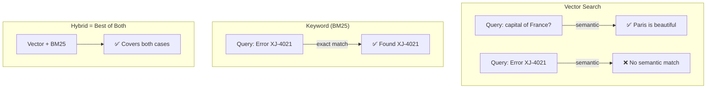

# 🔎 Hybrid Search

> **Mục tiêu**: BM25 + Vector search, RRF fusion, Query expansion, HyDE.

---

## 1. Vector Search Limitations



---

## 2. BM25 (Best Match 25)

```python
# BM25 — term frequency inverse document frequency scoring
from rank_bm25 import BM25Okapi
import re

def tokenize(text: str) -> list[str]:
    return re.findall(r'\w+', text.lower())

documents = [
    "Machine learning is a subset of artificial intelligence",
    "Deep learning uses neural networks with many layers",
    "Python is popular for ML and data science",
]

tokenized = [tokenize(doc) for doc in documents]
bm25 = BM25Okapi(tokenized)

query = "neural networks deep learning"
scores = bm25.get_scores(tokenize(query))
# [0.0, 1.82, 0.0] → Document 2 matches keyword "neural networks"
```

---

## 3. Hybrid Search Implementation

```python
import numpy as np

class HybridSearch:
    """Combine BM25 keyword + vector semantic search."""
    
    def __init__(self, documents: list[str], embeddings: np.ndarray):
        self.documents = documents
        self.embeddings = embeddings  # (N, dim)
        
        # BM25 index
        tokenized = [self._tokenize(doc) for doc in documents]
        self.bm25 = BM25Okapi(tokenized)
    
    def search(self, query: str, query_embedding: np.ndarray,
               top_k: int = 5, alpha: float = 0.5) -> list[dict]:
        """
        Hybrid search with weighted combination.
        alpha=1.0 → pure vector, alpha=0.0 → pure BM25
        """
        # BM25 scores
        bm25_scores = self.bm25.get_scores(self._tokenize(query))
        bm25_norm = self._normalize(bm25_scores)
        
        # Vector scores (cosine similarity)
        vector_scores = self.embeddings @ query_embedding
        vector_norm = self._normalize(vector_scores)
        
        # Weighted combination
        hybrid_scores = alpha * vector_norm + (1 - alpha) * bm25_norm
        
        # Rank
        top_indices = np.argsort(hybrid_scores)[::-1][:top_k]
        
        return [
            {
                "document": self.documents[i],
                "score": hybrid_scores[i],
                "bm25_score": bm25_scores[i],
                "vector_score": vector_scores[i],
            }
            for i in top_indices
        ]
    
    @staticmethod
    def _normalize(scores):
        min_s, max_s = scores.min(), scores.max()
        if max_s == min_s:
            return np.zeros_like(scores)
        return (scores - min_s) / (max_s - min_s)
    
    @staticmethod
    def _tokenize(text):
        return re.findall(r'\w+', text.lower())
```

---

## 4. Reciprocal Rank Fusion (RRF)

```python
def reciprocal_rank_fusion(ranked_lists: list[list[int]], k: int = 60) -> list[tuple]:
    """
    Combine multiple ranked lists using RRF.
    RRF(d) = Σ 1 / (k + rank_i(d))
    """
    scores = {}
    
    for ranked_list in ranked_lists:
        for rank, doc_id in enumerate(ranked_list):
            if doc_id not in scores:
                scores[doc_id] = 0
            scores[doc_id] += 1.0 / (k + rank + 1)
    
    # Sort by RRF score
    return sorted(scores.items(), key=lambda x: x[1], reverse=True)

# Example: BM25 ranking and Vector ranking
bm25_ranking = [3, 1, 5, 2, 4]   # doc IDs sorted by BM25
vector_ranking = [1, 3, 2, 5, 4]  # doc IDs sorted by vector sim

fused = reciprocal_rank_fusion([bm25_ranking, vector_ranking])
# Doc 3 and 1 get highest scores (ranked highly in both)
```

---

## 5. Query Expansion / Transformation

```python
# 1. Multi-query: generate multiple search queries
def expand_query(query: str, llm) -> list[str]:
    prompt = f"""Generate 3 different search queries that would help answer 
    the original question. Each query should approach from a different angle.
    
    Original: {query}
    
    Queries:"""
    result = llm.invoke(prompt)
    return [query] + result.split("\n")

# 2. HyDE: Hypothetical Document Embeddings
def hyde_search(query: str, llm, embedder, vector_db):
    # Generate hypothetical answer
    hypothetical = llm.invoke(f"Write a short passage that answers: {query}")
    
    # Embed the hypothetical answer (not the query!)
    hyde_embedding = embedder.encode(hypothetical)
    
    # Search with hypothetical answer embedding
    results = vector_db.search(hyde_embedding, top_k=5)
    return results
# Why? Hypothetical answer is more similar to actual documents than the question
```

---

## 6. BM25 Parameter Tuning

```python
# BM25Okapi parameters control scoring behavior
# BM25(q, d) = Σ IDF(qi) * (tf * (k1 + 1)) / (tf + k1 * (1 - b + b * |d|/avgDL))

from rank_bm25 import BM25Okapi

# k1: Term frequency saturation (default: 1.5)
#   - Higher k1 → more weight on term frequency
#   - k1=0 → binary presence only ("does term appear?")
#   - k1=2.0 → good for long technical docs
#   - k1=1.2 → good for short texts (tweets, titles)

# b: Length normalization (default: 0.75)  
#   - b=0 → no length normalization
#   - b=1.0 → full normalization (short docs boosted)
#   - b=0.75 → balanced (default, works well for most cases)

# Tuning for different content types:
configs = {
    "general":    {"k1": 1.5, "b": 0.75},   # Default — good baseline
    "code":       {"k1": 1.2, "b": 0.3},     # Code: less length norm, exact terms matter
    "legal":      {"k1": 2.0, "b": 0.75},    # Legal: term frequency important
    "short_text": {"k1": 1.2, "b": 0.0},     # Tweets/titles: no length norm
}

# Apply custom params
bm25 = BM25Okapi(tokenized_corpus, k1=1.2, b=0.3)
```

---

## 7. Qdrant Native Hybrid Search

```python
# Production hybrid search using Qdrant's built-in sparse+dense
from qdrant_client import QdrantClient, models

client = QdrantClient("localhost", port=6333)

# Create collection with both dense and sparse vectors
client.create_collection(
    collection_name="hybrid_docs",
    vectors_config={
        "dense": models.VectorParams(size=1536, distance=models.Distance.COSINE),
    },
    sparse_vectors_config={
        "sparse": models.SparseVectorParams(),  # BM25-like sparse vectors
    },
)

# Search with fusion
results = client.query_points(
    collection_name="hybrid_docs",
    prefetch=[
        # Dense (semantic) search
        models.Prefetch(
            query=dense_embedding,
            using="dense",
            limit=20,
        ),
        # Sparse (keyword) search
        models.Prefetch(
            query=models.SparseVector(indices=sparse_indices, values=sparse_values),
            using="sparse",
            limit=20,
        ),
    ],
    query=models.FusionQuery(fusion=models.Fusion.RRF),  # Built-in RRF fusion
    limit=10,
)
```

---

## 8. Benchmark: Retrieval Methods Compared

| Method | Precision@5 | Recall@10 | Latency | Notes |
|--------|:-----------:|:---------:|:-------:|-------|
| **BM25 only** | 0.62 | 0.71 | ~5ms | Fast, exact match |
| **Vector only** | 0.71 | 0.78 | ~15ms | Semantic, misses keywords |
| **Hybrid (α=0.5)** | 0.78 | 0.85 | ~20ms | Balanced |
| **Hybrid (α=0.7)** | **0.80** | **0.87** | ~20ms | Best for general Q&A |
| **Hybrid + Rerank** | **0.85** | 0.87 | ~120ms | +Cross-encoder reranker |
| **Hybrid + HyDE** | 0.83 | **0.89** | ~800ms | Best recall, expensive |

> *Benchmark trên dataset BEIR (MS MARCO passage). Numbers will vary by domain.*

---

## 🎯 Interview Tips — Chi Tiết

### Q1: "Hybrid search tại sao?"
**A**: Vector: semantic similarity ("car" ≈ "automobile"). BM25: keyword/exact match (error codes, names, IDs). Neither alone is sufficient. Hybrid combines both → robust retrieval. Industry standard: Cohere, Pinecone, Weaviate all support hybrid.

### Q2: "RRF vs weighted?"
**A**: RRF: rank-based fusion, no score normalization needed, parameter-free except k (usually 60). Weighted: score-based, requires normalization (min-max), needs alpha tuning. RRF simpler and often better because it's scale-invariant.

### Q3: "HyDE?"
**A**: Hypothetical Document Embeddings. Generate a hypothetical answer with LLM → embed that answer → search. Works because answer-document similarity > question-document similarity. Cost: 1 extra LLM call per query. +10-15% retrieval improvement.

### Q4: "Alpha tuning?"
**A**: alpha=0.7 (more vector) for semantic/conceptual queries. alpha=0.3 (more BM25) for exact match/code/names. Tune on evaluation set with labeled relevance. Common default: 0.5-0.7. Some systems auto-tune per query.

### Q5: "Multi-query expansion?"
**A**: Generate 3-5 different search queries from original question (different angles). Search with each → union results → rerank. Increases recall significantly. Cost: N extra LLM calls + N searches. Worth it for complex questions.

### Q6: "BM25 vẫn còn quan trọng?"
**A**: Very much! (1) Exact match for codes, IDs, names. (2) No embedding computation needed. (3) Interpretable scores. (4) Works without GPU. (5) Combined with vectors = state-of-the-art retrieval. BM25 is not obsolete — it's complementary.

### Q7: "BM25 parameters (k1, b) ý nghĩa?"
**A**: k1 controls term frequency saturation (higher = more weight on repeated terms). b controls length normalization (0 = no normalization, 1 = full). Default k1=1.5, b=0.75 works for most cases. Tune on eval set.

### Q8: "Production hybrid search stack?"
**A**: Qdrant/Weaviate (native hybrid) > custom (BM25 + FAISS) > Elasticsearch (vector plugin). Qdrant: built-in RRF fusion, sparse+dense vectors, single query. Simplest production path.
