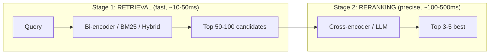
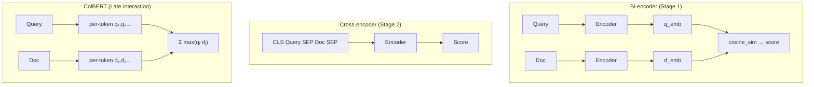

# 🏆 Reranking — Deep Dive

> **Mục tiêu**: Cross-encoder, ColBERT, LLM reranking, two-stage retrieval pipeline.
> Reranking = "tầng 2" chọn lọc — biến 50 candidates → 5 best. Thường tăng 10-30% accuracy.

---

## 1. Two-Stage Retrieval Architecture



> **Why two stages?** Cross-encoder on 1M docs = impossible (too slow). Bi-encoder only = fast but misses nuances. Combined = speed + accuracy.

---

## 2. Bi-encoder vs Cross-encoder vs ColBERT



### Comparison Table

| | Bi-encoder | ColBERT | Cross-encoder | LLM Reranker |
|-|-----------|---------|--------------|-------------|
| **Speed** | ⚡⚡⚡ ~1ms | ⚡⚡ ~10ms | ⚡ ~50ms | 🐢 ~500ms |
| **Quality** | Good | Better | Best | Best++ |
| **Pre-compute?** | ✅ Docs pre-embedded | ✅ Tokens pre-embedded | ❌ Compute each pair | ❌ Full LLM call |
| **Storage** | 768D per doc | 128D × N tokens | None | None |
| **Best for** | Stage 1 retrieval | Moderate collections | Stage 2 reranking | High-value queries |

---

## 3. Cross-encoder Reranking

```python
from sentence_transformers import CrossEncoder

# ── Model options (quality vs speed) ──
# cross-encoder/ms-marco-MiniLM-L-6-v2  → fast, good
# cross-encoder/ms-marco-MiniLM-L-12-v2 → balanced
# BAAI/bge-reranker-v2-m3               → multilingual, SOTA
# mixedbread-ai/mxbai-rerank-large-v1   → excellent quality

reranker = CrossEncoder("BAAI/bge-reranker-v2-m3", max_length=512)

def rerank(query: str, documents: list[str], top_k: int = 5) -> list[dict]:
    """Rerank documents using cross-encoder."""
    pairs = [(query, doc) for doc in documents]
    scores = reranker.predict(pairs)
    
    ranked = sorted(
        zip(documents, scores),
        key=lambda x: x[1],
        reverse=True,
    )
    
    return [
        {"document": doc, "score": float(score), "rank": i+1}
        for i, (doc, score) in enumerate(ranked[:top_k])
    ]

# Example
query = "How to fine-tune a transformer model?"
candidates = [
    "Fine-tuning involves training a pre-trained model on task-specific data...",
    "Transformers are neural network architectures based on attention...",
    "LoRA adapts transformer weights efficiently using low-rank matrices...",
    "Python is a popular programming language for machine learning...",
]

results = rerank(query, candidates, top_k=3)
for r in results:
    print(f"  #{r['rank']}: ({r['score']:.3f}) {r['document'][:60]}...")
```

---

## 4. ColBERT Late Interaction

```python
# pip install ragatouille
from ragatouille import RAGPretrainedModel

# ColBERT reranking (late interaction — per-token matching)
model = RAGPretrainedModel.from_pretrained("colbert-ir/colbertv2.0")

# Index documents (pre-compute per-token embeddings)
model.index(
    collection=documents,
    index_name="my_index",
)

# Search with late interaction
results = model.search(query="How to fine-tune transformers?", k=5)
for r in results:
    print(f"  Score: {r['score']:.3f} — {r['content'][:80]}...")

# Why ColBERT is powerful:
# "fine-tune transformer" → each token matches independently:
#   "fine" matches "fine-tuning" in doc (high sim)
#   "tune" matches "tuning" in doc (high sim)  
#   "transformer" matches "transformer" in doc (high sim)
# → Total MaxSim score = very high (precise matching)
```

---

## 5. LLM-based Reranking

```python
async def llm_rerank(query: str, documents: list[str], 
                     llm, top_k: int = 5) -> list[dict]:
    """Use LLM as reranker — most accurate but slowest and most expensive."""
    
    # Format documents for LLM
    doc_list = "\n".join(
        f"[{i+1}] {doc[:500]}" for i, doc in enumerate(documents)
    )
    
    prompt = f"""Given the query and documents below, rank the documents 
by relevance to the query. Return ONLY the document numbers in order 
of relevance (most relevant first).

Query: {query}

Documents:
{doc_list}

Ranking (most relevant first, comma-separated numbers):"""
    
    response = await llm.ainvoke(prompt)
    
    # Parse ranking
    try:
        order = [int(x.strip()) - 1 for x in response.content.split(",")]
        return [
            {"document": documents[i], "rank": rank+1}
            for rank, i in enumerate(order[:top_k])
            if 0 <= i < len(documents)
        ]
    except (ValueError, IndexError):
        return [{"document": doc, "rank": i+1} for i, doc in enumerate(documents[:top_k])]

# Listwise vs Pointwise vs Pairwise LLM reranking:
# Pointwise: score each doc independently (simple, inconsistent)
# Pairwise:  compare doc A vs doc B (accurate, O(n²) calls)
# Listwise:  rank all at once (efficient, may lose detail)
# → Listwise is most practical for production
```

---

## 6. Cohere Rerank API

```python
import cohere

co = cohere.Client("YOUR_API_KEY")

results = co.rerank(
    model="rerank-english-v3.0",  # or "rerank-multilingual-v3.0"
    query="How to deploy ML models to production?",
    documents=[
        "ONNX export enables framework-agnostic model deployment...",
        "Docker containers package applications for consistent deployment...",
        "Neural networks consist of layers of interconnected neurons...",
    ],
    top_n=3,
    return_documents=True,
)

for result in results.results:
    print(f"  Score: {result.relevance_score:.4f} — {result.document.text[:80]}...")
# Cohere advantages: no GPU needed, battle-tested, API-based
```

---

## 7. Full Production RAG Pipeline

```python
class ProductionRAGPipeline:
    """
    Query → Retrieve (hybrid) → Rerank → Generate → Evaluate
    """
    def __init__(self, vector_db, bm25_index, reranker, llm):
        self.vector_db = vector_db
        self.bm25 = bm25_index
        self.reranker = reranker
        self.llm = llm
    
    async def query(self, question: str, top_k: int = 5) -> dict:
        # ── Stage 1: Retrieve candidates (fast, high recall) ──
        vector_results = self.vector_db.search(question, top_k=30)
        bm25_results = self.bm25.search(question, top_k=30)
        
        # Deduplicate by content hash
        seen = set()
        all_docs = []
        for doc in vector_results + bm25_results:
            h = hash(doc)
            if h not in seen:
                seen.add(h)
                all_docs.append(doc)
        
        # ── Stage 2: Rerank (slow, high precision) ──
        pairs = [(question, doc) for doc in all_docs]
        scores = self.reranker.predict(pairs)
        
        ranked = sorted(zip(all_docs, scores), key=lambda x: x[1], reverse=True)
        top_docs = [doc for doc, score in ranked[:top_k]]
        top_scores = [score for _, score in ranked[:top_k]]
        
        # ── Relevance filter: drop low-confidence results ──
        min_score = 0.1  # Threshold
        filtered = [(doc, s) for doc, s in zip(top_docs, top_scores) if s > min_score]
        
        if not filtered:
            return {"answer": "I don't have enough information to answer.", "sources": []}
        
        # ── Stage 3: Generate answer ──
        context = "\n\n---\n\n".join(doc for doc, _ in filtered)
        answer = await self.llm.ainvoke(
            f"""Answer based ONLY on the context below. If the context doesn't 
contain the answer, say "I don't know."

Context:
{context}

Question: {question}

Answer:"""
        )
        
        return {
            "answer": answer.content,
            "sources": [{"text": doc[:200], "score": float(s)} for doc, s in filtered],
            "candidates_retrieved": len(all_docs),
            "candidates_after_rerank": len(filtered),
        }
```

---

## 🎯 Interview Tips — Chi Tiết

### Q1: "Reranking tại sao cần?"
**A**: Bi-encoder (stage 1): fast but approximate — encodes query and doc separately, no interaction. Cross-encoder (stage 2): sees query+doc together → understands nuance, much more accurate. Two-stage combines speed + accuracy.

### Q2: "Cross-encoder vs bi-encoder?"
**A**: Bi: O(1) per comparison (pre-compute embeddings). Cross: O(N) per query (must compute each pair). Bi for retrieval (millions of docs). Cross for reranking (50-100 candidates only).

### Q3: "ColBERT explained?"
**A**: Late interaction: per-token embeddings for both query and doc. MaxSim per query token across doc tokens → sum. Better than bi-encoder (token-level matching), faster than cross-encoder (pre-compute doc tokens). Trade-off: more storage.

### Q4: "Cohere Rerank vs self-hosted?"
**A**: Cohere: zero infra, API-based, great quality. Self-hosted (CrossEncoder/ColBERT): control, no API cost at scale, latency. Start Cohere → switch to self-hosted at scale.

### Q5: "LLM as reranker?"
**A**: Most accurate but slowest/most expensive. Listwise (rank all at once) most practical. Good for high-value queries (e-commerce, legal). Not for high-throughput.

### Q6: "How many candidates to retrieve for reranking?"
**A**: Retrieve 30-100 candidates (high recall). Rerank to top 3-5 (high precision). Too few candidates → miss relevant docs. Too many → slow reranking + noise. 50 is sweet spot.

### Q7: "Relevance score threshold?"
**A**: Don't always return top-K! If top result score < threshold → "I don't know" is better than hallucination. Threshold depends on model — calibrate on dev set. Typical: 0.1-0.3 for cross-encoders.
