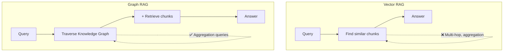

# 🕸️ Graph RAG

> **Mục tiêu**: Knowledge Graphs + RAG — entity extraction, Neo4j, community detection.

---

## 1. Graph RAG vs Vector RAG



---

## 2. Knowledge Graph Construction

```python
# Extract entities and relationships from text
def extract_entities(text: str, llm) -> list[dict]:
    prompt = f"""Extract all entities and relationships from this text.
    
    Format as JSON:
    {{
        "entities": [
            {{"name": "...", "type": "PERSON|ORG|TECH|CONCEPT", "description": "..."}}
        ],
        "relationships": [
            {{"source": "...", "target": "...", "type": "WORKS_AT|USES|INVENTED|..."}}
        ]
    }}
    
    Text: {text}"""
    
    result = llm.invoke(prompt)
    return json.loads(result)

# Build graph
class KnowledgeGraph:
    def __init__(self):
        self.entities = {}   # name → {type, description, chunks}
        self.edges = []      # (source, target, type)
    
    def add_entity(self, name: str, entity_type: str, description: str, chunk_id: str):
        if name not in self.entities:
            self.entities[name] = {
                "type": entity_type,
                "description": description,
                "chunks": [],
            }
        self.entities[name]["chunks"].append(chunk_id)
    
    def add_relationship(self, source: str, target: str, rel_type: str):
        self.edges.append((source, target, rel_type))
    
    def query(self, entity: str, hops: int = 2) -> list[str]:
        """Find all connected entities within N hops."""
        visited = {entity}
        frontier = {entity}
        
        for _ in range(hops):
            next_frontier = set()
            for node in frontier:
                for src, tgt, _ in self.edges:
                    if src == node and tgt not in visited:
                        next_frontier.add(tgt)
                        visited.add(tgt)
                    elif tgt == node and src not in visited:
                        next_frontier.add(src)
                        visited.add(src)
            frontier = next_frontier
        
        return list(visited)
```

---

## 3. Neo4j Integration

```python
from neo4j import GraphDatabase

driver = GraphDatabase.driver("bolt://localhost:7687", auth=("neo4j", "password"))

# Create entities and relationships
with driver.session() as session:
    # Add entity
    session.run("""
        MERGE (e:Entity {name: $name})
        SET e.type = $type, e.description = $desc
    """, name="Transformer", type="TECH", desc="Neural network architecture")
    
    # Add relationship
    session.run("""
        MATCH (a:Entity {name: $src}), (b:Entity {name: $tgt})
        MERGE (a)-[:INVENTED_BY]->(b)
    """, src="Transformer", tgt="Google Brain")
    
    # Query: multi-hop
    result = session.run("""
        MATCH (t:Entity {name: 'Transformer'})-[*1..3]-(related)
        RETURN related.name, related.type, related.description
    """)
    for record in result:
        print(record)
```

---

## 4. Microsoft GraphRAG

```python
# Microsoft's GraphRAG approach
# 1. Build knowledge graph from all documents
# 2. Detect communities (clusters of related entities)
# 3. Generate community summaries
# 4. At query time: retrieve relevant communities + chunks

# Community detection for global queries
# "What are the main themes in this document collection?"
# → Retrieve community summaries → synthesize answer

# This handles:
# - Global questions (themes, trends, patterns)
# - Multi-hop reasoning
# - Entity-centric queries
```

---

## 5. LangChain + Neo4j Integration

```python
# Full Graph RAG pipeline using LangChain + Neo4j
from langchain_community.graphs import Neo4jGraph
from langchain_openai import ChatOpenAI
from langchain.chains import GraphCypherQAChain

# Connect to Neo4j
graph = Neo4jGraph(
    url="bolt://localhost:7687",
    username="neo4j",
    password="password",
)

# LLM generates Cypher queries from natural language
chain = GraphCypherQAChain.from_llm(
    llm=ChatOpenAI(model="gpt-4o-mini", temperature=0),
    graph=graph,
    verbose=True,
    validate_cypher=True,  # Syntax check before execution
)

# Natural language → Cypher → Answer
result = chain.invoke({"query": "Who invented the Transformer architecture?"})
# Generated Cypher: MATCH (t:Entity {name: 'Transformer'})-[:INVENTED_BY]->(p) RETURN p.name
# Answer: "The Transformer was invented by researchers at Google Brain"
```

---

## 6. Entity Resolution Pipeline

```python
# Crucial step: normalize entities to avoid duplicates
from sklearn.metrics.pairwise import cosine_similarity
import numpy as np

class EntityResolver:
    """Merge duplicate entities with different surface forms."""
    
    def __init__(self, embedder, threshold: float = 0.85):
        self.embedder = embedder
        self.threshold = threshold
        self.canonical: dict[str, str] = {}  # alias → canonical name
    
    def resolve(self, entities: list[dict]) -> list[dict]:
        """Group similar entities and pick canonical names."""
        names = [e["name"] for e in entities]
        embeddings = self.embedder.encode(names)
        
        # Build similarity matrix
        sim_matrix = cosine_similarity(embeddings)
        
        # Group similar entities
        merged = []
        used = set()
        for i in range(len(names)):
            if i in used:
                continue
            group = [i]
            for j in range(i + 1, len(names)):
                if j not in used and sim_matrix[i][j] > self.threshold:
                    group.append(j)
                    used.add(j)
            
            # Pick longest name as canonical
            canonical = max([names[k] for k in group], key=len)
            for k in group:
                self.canonical[names[k]] = canonical
            
            merged.append({
                "name": canonical,
                "type": entities[group[0]]["type"],
                "aliases": [names[k] for k in group if names[k] != canonical],
            })
            used.add(i)
        
        return merged

# Example:
# "ML", "Machine Learning", "machine learning" → canonical: "Machine Learning"
# "GPT-4", "GPT4", "gpt-4o" → canonical: "GPT-4" (if similarity > threshold)
```

---

## 7. Graph RAG vs Vector RAG — Comparison

| Aspect | Vector RAG | Graph RAG | Hybrid |
|--------|:----------:|:---------:|:------:|
| **Simple Q&A** | ⭐ Fast, accurate | ❌ Overkill | ✅ |
| **Multi-hop** | ❌ Can't connect dots | ⭐ Native | ⭐ |
| **Global queries** | ❌ No aggregation | ⭐ Community summaries | ⭐ |
| **Exact match** | ❌ Semantic only | ⚠️ If entity exists | ✅ +BM25 |
| **Setup cost** | 🟢 Low | 🔴 High (KG construction) | 🟡 |
| **Query latency** | 🟢 ~50ms | 🟡 ~200ms | 🟡 ~250ms |
| **Index cost** | 🟢 Embed only | 🔴 LLM per chunk | 🔴 |
| **Best for** | FAQ, support docs | Research, legal, medical | Production systems |

### When to use Graph RAG

```
✅ USE when:
  - Documents have rich entity relationships (people, orgs, concepts)
  - Users ask "who/what/how is X related to Y?"
  - Need global summaries ("main themes across 1000 docs")
  - Domain has clear ontology (medical, legal, academic)

❌ SKIP when:
  - Simple Q&A about single documents
  - Documents are unstructured with few entities
  - Budget is limited (KG construction is expensive)
  - Real-time indexing needed (KG build is slow)
```

---

## 🎯 Interview Tips — Chi Tiết

### Q1: "Graph RAG khi nào?"
**A**: Multi-hop reasoning ("Who founded the company that made X?"), entity relationships, global questions ("main themes across all docs"), aggregation queries. Complements vector RAG — use both. Vector for local Q&A, Graph for relational queries.

### Q2: "KG construction?"
**A**: LLM extracts entities (PERSON, ORG, TECH) + relationships (WORKS_AT, USES) from chunks → build graph. Challenges: entity resolution ("ML" = "Machine Learning"), consistency across chunks, hallucinated relationships. Need validation step.

### Q3: "Neo4j vs in-memory?"
**A**: Neo4j: persistent, scalable, Cypher query language, ACID transactions, community detection algorithms. In-memory (networkx, custom): simple, fast for small graphs (<10K nodes). <1000 entities → in-memory. >1000 → Neo4j.

### Q4: "Microsoft GraphRAG?"
**A**: (1) Build KG from all documents. (2) Community detection (Leiden algorithm) to find clusters. (3) Generate community summaries. (4) Query: retrieve relevant communities + chunks. Handles global queries that vector RAG cannot. Paper: arxiv 2404.16130.

### Q5: "Graph RAG với entity resolution?"
**A**: Same entity different names ("ML", "Machine Learning", "machine learning"). Solutions: (1) LLM-based normalization. (2) Embedding similarity for entity matching. (3) Canonical form dictionary. Critical for graph quality — without it, graph is fragmented.

### Q6: "Cost of Graph RAG?"
**A**: Indexing: expensive (LLM call per chunk for entity extraction). Query: fast (graph traversal + vector search). Worth it when: (1) Documents have rich entity relationships. (2) Users ask relational questions. (3) Need global summaries. Not worth for simple Q&A.
