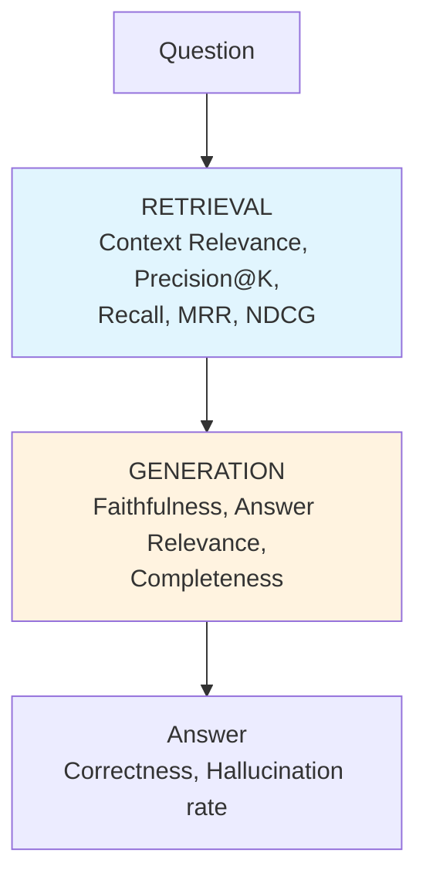

# 📏 RAG Evaluation — Production Guide

> **Mục tiêu**: RAGAS, LLM-as-Judge, retrieval metrics, regression testing, eval pipelines.
> "Cannot improve what you cannot measure." — RAG evaluation = foundation of production RAG.

---

## 1. RAG Evaluation Dimensions



> **Two independent axes**: (1) RETRIEVAL: did we find right chunks? (2) GENERATION: did LLM use them correctly?
> Bad retrieval + good generation = wrong answer (garbage in). Good retrieval + bad generation = hallucination (garbage out).

---

## 2. RAGAS Framework

```python
# pip install ragas

from ragas import evaluate
from ragas.metrics import (
    faithfulness,           # Is answer grounded in context?
    answer_relevancy,       # Does answer address the question?
    context_precision,      # Are retrieved chunks relevant?
    context_recall,         # Were all relevant chunks found?
    answer_correctness,     # Does answer match ground truth?
)
from datasets import Dataset

# ── Prepare evaluation dataset ──
eval_dataset = Dataset.from_dict({
    "question": [
        "What is RLHF?",
        "How does Whisper handle multilingual audio?",
        "What is the difference between LoRA and full fine-tuning?",
    ],
    "answer": [  # RAG system's actual answers
        "RLHF is Reinforcement Learning from Human Feedback, used to align LLMs.",
        "Whisper auto-detects language and transcribes 100+ languages.",
        "LoRA trains low-rank adapters (0.1% params) while full fine-tune updates all weights.",
    ],
    "contexts": [  # Retrieved chunks
        ["RLHF uses human feedback to fine-tune language models via PPO...", 
         "PPO is the main algorithm used in RLHF training..."],
        ["Whisper is a multi-task model supporting 100+ languages...",
         "The model auto-detects spoken language from the first 30 seconds..."],
        ["LoRA adds low-rank matrices to attention layers...",
         "Full fine-tuning updates all model parameters..."],
    ],
    "ground_truth": [  # Human-annotated correct answers
        "RLHF (Reinforcement Learning from Human Feedback) trains LLMs using human preference data.",
        "Whisper supports 100+ languages with automatic language detection.",
        "LoRA trains small adapter matrices (~0.1% of params), full fine-tuning updates everything.",
    ],
})

# ── Run evaluation ──
result = evaluate(
    eval_dataset,
    metrics=[faithfulness, answer_relevancy, context_precision, context_recall],
)
print(result)
# {'faithfulness': 0.92, 'answer_relevancy': 0.88, 'context_precision': 0.85, 'context_recall': 0.78}
```

### RAGAS Metrics Explained

| Metric | What it measures | How | Target |
|--------|-----------------|-----|:------:|
| **Faithfulness** | Answer grounded in context? | Claims in answer → check against context | >0.9 |
| **Answer Relevancy** | Answer addresses question? | Generate questions from answer → compare | >0.85 |
| **Context Precision** | Retrieved chunks relevant? | Relevant chunks ranked higher? | >0.8 |
| **Context Recall** | All relevant info retrieved? | Ground truth claims → found in context? | >0.75 |
| **Answer Correctness** | Answer matches ground truth? | Semantic + factual similarity | >0.8 |

---

## 3. LLM-as-Judge

### 3.1 Relevance Judging

```python
import json

async def llm_judge_relevance(question: str, context: str, llm) -> dict:
    """Use LLM to judge retrieval relevance (1-5 scale)."""
    prompt = f"""Rate the relevance of this context to the question on a scale of 1-5.

Question: {question}
Context: {context}

Rating criteria:
1 = Completely irrelevant (wrong topic)
2 = Slightly relevant (related topic, wrong specifics)
3 = Moderately relevant (right topic, partial answer)
4 = Highly relevant (answers most of the question)
5 = Perfectly relevant (directly and completely answers)

Return JSON: {{"score": <int>, "reasoning": "<1-2 sentences>"}}"""
    
    response = await llm.ainvoke(prompt)
    return json.loads(response.content)
```

### 3.2 Faithfulness Judging (Hallucination Detection)

```python
async def llm_judge_faithfulness(answer: str, context: str, llm) -> dict:
    """Check if answer is grounded in context (no hallucination)."""
    prompt = f"""Analyze if the answer is fully supported by the context.
    
For each claim in the answer, determine if it's supported by the context.

Context: {context}

Answer: {answer}

Return JSON:
{{
    "claims": [
        {{"claim": "...", "supported": true/false, "evidence": "quote from context or 'not found'"}}
    ],
    "faithfulness_score": <float 0-1>,  // fraction of supported claims
    "has_hallucination": true/false,
    "hallucinated_claims": ["..."]
}}"""
    
    response = await llm.ainvoke(prompt)
    return json.loads(response.content)
```

### 3.3 Pairwise Comparison (A vs B)

```python
async def pairwise_compare(question: str, answer_a: str, answer_b: str, llm) -> dict:
    """Compare two RAG answers — which is better?"""
    prompt = f"""Compare these two answers to the question. 
Which is better? Consider: accuracy, completeness, clarity, conciseness.

Question: {question}

Answer A: {answer_a}

Answer B: {answer_b}

Return JSON:
{{
    "winner": "A" or "B" or "tie",
    "reasoning": "...",
    "scores": {{"A": <1-5>, "B": <1-5>}}
}}"""
    
    response = await llm.ainvoke(prompt)
    return json.loads(response.content)
```

---

## 4. Retrieval Metrics (Information Retrieval)

```python
import numpy as np

def retrieval_metrics(retrieved: list[str], relevant: list[str], k: int = 5) -> dict:
    """Standard IR metrics for retrieval evaluation."""
    retrieved_k = retrieved[:k]
    relevant_set = set(relevant)
    
    # ── Precision@K ──
    hits = sum(1 for doc in retrieved_k if doc in relevant_set)
    precision_at_k = hits / k
    
    # ── Recall ──
    recall = hits / len(relevant_set) if relevant_set else 0
    
    # ── F1@K ──
    f1 = 2 * precision_at_k * recall / (precision_at_k + recall) if (precision_at_k + recall) > 0 else 0
    
    # ── MRR (Mean Reciprocal Rank) ──
    # Position of FIRST relevant result
    mrr = 0
    for i, doc in enumerate(retrieved):
        if doc in relevant_set:
            mrr = 1.0 / (i + 1)
            break
    
    # ── NDCG (Normalized Discounted Cumulative Gain) ──
    # Rewards relevant results ranked higher
    dcg = sum(1.0 / np.log2(i + 2) for i, doc in enumerate(retrieved_k) if doc in relevant_set)
    ideal_dcg = sum(1.0 / np.log2(i + 2) for i in range(min(len(relevant_set), k)))
    ndcg = dcg / ideal_dcg if ideal_dcg > 0 else 0
    
    # ── Hit Rate ──
    # Did we find AT LEAST ONE relevant doc?
    hit_rate = 1.0 if hits > 0 else 0.0
    
    return {
        f"precision@{k}": round(precision_at_k, 3),
        "recall": round(recall, 3),
        f"f1@{k}": round(f1, 3),
        "mrr": round(mrr, 3),
        f"ndcg@{k}": round(ndcg, 3),
        "hit_rate": round(hit_rate, 3),
    }
```

### Metrics Intuition

```
MRR = 1/rank_of_first_relevant_result
  → If first relevant at position 1: MRR = 1.0
  → If first relevant at position 3: MRR = 0.33
  → Good when you need ONE good result

NDCG = rewards relevant results ranked HIGHER
  → Relevant at #1 → high NDCG
  → Relevant at #5 → lower NDCG  
  → Good when ranking ORDER matters

Hit Rate = did we find ANYTHING relevant?
  → Binary: yes/no
  → Good for baseline evaluation

Precision@K = what % of retrieved are relevant?
  → 3 relevant out of 5 retrieved → P@5 = 0.6

Recall = what % of all relevant docs did we find?
  → Found 3 out of 10 relevant total → Recall = 0.3
```

---

## 5. End-to-End Evaluation Pipeline

```python
import pandas as pd
from datetime import datetime

class RAGEvaluationPipeline:
    """Complete evaluation pipeline for production RAG."""
    
    def __init__(self, rag_pipeline, eval_dataset: list[dict], judge_llm):
        self.rag = rag_pipeline
        self.dataset = eval_dataset  # [{question, ground_truth, relevant_chunks}]
        self.judge = judge_llm
    
    async def run_full_evaluation(self) -> pd.DataFrame:
        results = []
        
        for case in self.dataset:
            # 1. Get RAG response
            response = await self.rag.query(case["question"])
            
            # 2. Retrieval metrics
            retrieval = retrieval_metrics(
                retrieved=response["sources"],
                relevant=case["relevant_chunks"],
                k=5,
            )
            
            # 3. Generation metrics (LLM judge)
            faithfulness = await llm_judge_faithfulness(
                response["answer"], 
                "\n".join(response["sources"]),
                self.judge,
            )
            
            relevance = await llm_judge_relevance(
                case["question"],
                response["answer"], 
                self.judge,
            )
            
            results.append({
                "question": case["question"],
                "answer": response["answer"],
                "ground_truth": case["ground_truth"],
                # Retrieval
                "precision@5": retrieval["precision@5"],
                "recall": retrieval["recall"],
                "mrr": retrieval["mrr"],
                # Generation
                "faithfulness": faithfulness["faithfulness_score"],
                "relevance": relevance["score"],
                "has_hallucination": faithfulness["has_hallucination"],
            })
        
        df = pd.DataFrame(results)
        
        # Summary
        print(f"\n📊 RAG Evaluation Summary ({len(df)} questions)")
        print(f"  Retrieval:   P@5={df['precision@5'].mean():.3f}  "
              f"Recall={df['recall'].mean():.3f}  MRR={df['mrr'].mean():.3f}")
        print(f"  Generation:  Faithfulness={df['faithfulness'].mean():.3f}  "
              f"Relevance={df['relevance'].mean():.3f}")
        print(f"  Hallucination rate: {df['has_hallucination'].mean():.1%}")
        
        return df
```

---

## 6. Regression Testing

```python
class RAGRegressionTest:
    """Track RAG quality over time — catch regressions before production."""
    
    def __init__(self, golden_set: list[dict], threshold: float = 0.05):
        """
        golden_set: [{question, expected_answer, expected_sources}]
        threshold: max allowed regression (5% default)
        """
        self.golden_set = golden_set
        self.threshold = threshold
        self.history: list[dict] = []
    
    def run(self, rag_pipeline, version: str = "latest") -> dict:
        results = []
        for case in self.golden_set:
            answer = rag_pipeline.query(case["question"])
            results.append({
                "question": case["question"],
                "expected": case["expected_answer"],
                "actual": answer["answer"],
                "pass": self._semantic_match(answer["answer"], case["expected_answer"]),
            })
        
        summary = {
            "version": version,
            "timestamp": datetime.now().isoformat(),
            "total": len(results),
            "passed": sum(r["pass"] for r in results),
            "pass_rate": sum(r["pass"] for r in results) / len(results),
            "failures": [r for r in results if not r["pass"]],
        }
        
        # Check for regression
        if self.history:
            prev = self.history[-1]["pass_rate"]
            if summary["pass_rate"] < prev - self.threshold:
                summary["regression"] = True
                summary["regression_delta"] = prev - summary["pass_rate"]
                print(f"⚠️ REGRESSION DETECTED: {prev:.1%} → {summary['pass_rate']:.1%}")
        
        self.history.append(summary)
        return summary
    
    def _semantic_match(self, actual: str, expected: str) -> bool:
        """Check semantic similarity between actual and expected answers."""
        # Use embedding similarity or LLM judge
        from sentence_transformers import SentenceTransformer
        model = SentenceTransformer('all-MiniLM-L6-v2')
        embs = model.encode([actual, expected])
        sim = float(np.dot(embs[0], embs[1]) / (np.linalg.norm(embs[0]) * np.linalg.norm(embs[1])))
        return sim > 0.75  # Threshold for "match"

# Usage in CI/CD:
# test = RAGRegressionTest(golden_set)
# result = test.run(rag_pipeline, version="v2.1")
# if result.get("regression"):
#     sys.exit(1)  # Fail CI
```

---

## 🎯 Interview Tips — Chi Tiết

### Q1: "RAG evaluation metrics?"
**A**: Two axes: (1) Retrieval: Precision@K, Recall, MRR, NDCG, Hit Rate. (2) Generation: Faithfulness (grounded in context?), Relevance (answers question?). RAGAS framework combines both. Always evaluate BOTH axes.

### Q2: "Faithfulness vs hallucination?"
**A**: Faithfulness = answer grounded in retrieved context. Low faithfulness = model hallucinating beyond context. Detect: extract claims from answer → check each against context. Target: >0.9.

### Q3: "LLM-as-Judge reliable?"
**A**: Surprisingly good for relevance/faithfulness (correlates well with humans). Caveats: position bias (prefers first option), verbosity bias (prefers longer), self-bias (prefers own model). Mitigate: swap order, use different judge model, calibrate on human labels.

### Q4: "MRR vs NDCG?"
**A**: MRR: position of FIRST relevant result (good when need one answer). NDCG: rewards ALL relevant results ranked higher (good when need comprehensive retrieval). RAG Q&A → MRR. RAG summarization → NDCG.

### Q5: "Regression testing for RAG?"
**A**: Golden test set (50-100 Q&A pairs). Run after EVERY change (new model, new chunking, new prompt). Compare pass rate vs previous. Fail CI if regression >5%. Critical for production RAG.

### Q6: "How to build eval dataset?"
**A**: (1) Collect real user questions (production logs). (2) Have domain experts write ground truth answers. (3) Annotate which chunks are relevant. (4) Start small (50 questions), grow over time. (5) Include edge cases (unanswerable, ambiguous).

### Q7: "End-to-end vs component evaluation?"
**A**: Component: evaluate retrieval and generation separately → pinpoint issues. End-to-end: evaluate final answer quality → matches user experience. Both needed: component for debugging, end-to-end for reporting.
